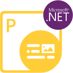

## Willkommen bei Aspose.PDF for Python via .NET

{}

Aspose.PDF for Python via .NET ermöglicht es Entwicklern, PDF-Dokumente, ob einfach oder komplex, programmgesteuert unterwegs zu erstellen. Aspose.PDF for Python via .NET ermöglicht es Entwicklern, Tabellen, Diagramme, Bilder, Hyperlinks, benutzerdefinierte Schriften – und mehr – in PDF-Dokumente einzufügen. Außerdem ist es ebenfalls möglich, PDF-Dokumente zu komprimieren. Aspose.PDF for Python via .NET bietet ausgezeichnete Sicherheitsfunktionen zur Entwicklung sicherer PDF-Dokumente. Und das herausragendste Merkmal von Aspose.PDF for Python via .NET ist, dass es die Erstellung von PDF-Dokumenten sowohl über eine API als auch aus XML-Vorlagen unterstützt.

{}

## Kapitel

- [Neuigkeiten](/pdf/de/python-net/whatsnew/)
- [Übersicht](/pdf/de/python-net/overview/)
- [Erste Schritte](/pdf/de/python-net/get-started/)
- [Grundlegende Vorgänge](/pdf/de/python-net/basic-operations/)
- [Dokumente konvertieren](/pdf/de/python-net/converting/)
- [PDF-Dokumente analysieren](/pdf/de/python-net/parsing/)
- [Erweiterte Vorgänge](/pdf/de/python-net/advanced-operations/)
- [Versionshinweise](https://releases.aspose.com/pdf/pythonnet/release-notes/)

<h2>Aspose.PDF for Python via .NET Ressourcen</h2>

Im Folgenden finden Sie die Links zu einigen nützlichen Ressourcen, die Sie benötigen, um Ihre Aufgaben zu erledigen.

- [Aspose.PDF for Python via .NET Funktionen](/pdf/de/python-net/key-features/)
- [Aspose.PDF for Python via .NET Versionshinweise](https://releases.aspose.com/pdf/pythonnet/release-notes/)
- [Aspose.PDF for Python via .NET Produktseite](https://products.aspose.com/pdf/python-net/)
- [Herunterladen Aspose.PDF for Python via .NET](https://releases.aspose.com/pdf/pythonnet/)
- [Installieren Aspose.PDF for Python via .NET NuGet-Paket](https://www.nuget.org/packages/Aspose.PDF/)
- [Aspose.PDF for Python via .NET API-Referenzhandbuch](https://reference.aspose.com/pdf/net)!
- [Aspose.PDF for Python via .NET Kostenloses Support-Forum](https://forum.aspose.com/c/pdf/10)
- [Aspose.PDF for Python via .NET Kostenpflichtiger Support-Helpdesk](https://helpdesk.aspose.com/)
