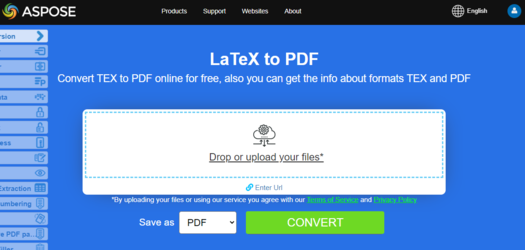

Dieser Artikel erklärt, wie man **verschiedene andere Dateiformate mithilfe von Python in PDF konvertiert**. Er behandelt die folgenden Themen.

## OFD in PDF konvertieren

OFD steht für Open Fixed‑layout Document (auch als Open Fixed Document Format bezeichnet). Es ist ein chinesischer nationaler Standard (GB/T 33190-2016) für elektronische Dokumente, der als Alternative zu PDF eingeführt wurde.

Schritte zum Konvertieren von OFD zu PDF in Python:

1. Richten Sie OFD-Ladeoptionen mit OfdLoadOptions() ein.
1. Laden Sie das OFD-Dokument.
1. Als PDF speichern.

```python
from os import path, remove
import aspose.pdf as ap
import sys

def convert_OFD_to_PDF(infile, outfile):
    load_options = ap.OfdLoadOptions()
    document = ap.Document(infile, load_options)
    document.save(outfile)

    print(infile + " converted into " + outfile)
```

## LaTeX/TeX in PDF konvertieren

Das LaTeX-Dateiformat ist ein Textdateiformat mit Markup in der LaTeX‑Ableitung der TeX‑Familie von Sprachen und LaTeX ist ein abgeleitetes Format des TeX‑Systems. LaTeX (\u02C8le\u026At\u025Bk/lay-tek oder lah-tek) ist ein Dokumentenerstellungssystem und eine Dokumenten‑Markup‑Sprache. Es wird häufig für die Kommunikation und Veröffentlichung wissenschaftlicher Dokumente in vielen Bereichen verwendet, darunter Mathematik, Physik und Informatik. Es spielt auch eine Schlüsselrolle bei der Vorbereitung und Veröffentlichung von Büchern und Artikeln, die komplexes mehrsprachiges Material enthalten, wie Koreanisch, Japanisch, chinesische Schriftzeichen und Arabisch, einschließlich Sonderausgaben.

LaTeX verwendet das TeX-Setzprogramm zur Formatierung seiner Ausgabe und ist selbst in der TeX-Makrosprache geschrieben.

{}
**Versuchen Sie, LaTeX/TeX online in PDF zu konvertieren**

Aspose.PDF for Python via .NET präsentiert Ihnen eine Online-Anwendung ["LaTex zu PDF"](https://products.aspose.app/pdf/conversion/tex-to-pdf), wo Sie versuchen können, die Funktionalität und die Qualität, mit der es funktioniert, zu untersuchen.

[](https://products.aspose.app/pdf/conversion/tex-to-pdf)
{}

Schritte zum Konvertieren von TEX zu PDF in Python:

1. Richten Sie LaTeX‑Ladeoptionen mit LatexLoadOptions() ein.
1. Laden Sie das LaTeX-Dokument.
1. Als PDF speichern.

```python
from os import path, remove
import aspose.pdf as ap
import sys

def convert_TEX_to_PDF(infile, outfile):
    load_options = ap.LatexLoadOptions()
    document = ap.Document(infile, load_options)
    document.save(outfile)

    print(infile + " converted into " + outfile)
```

## EPUB in PDF konvertieren

**Aspose.PDF for Python via .NET** ermöglicht es Ihnen, EPUB-Dateien einfach in das PDF-Format zu konvertieren.

EPUB (Kurzform für electronic publication) ist ein freier und offener E‑Book‑Standard des International Digital Publishing Forum (IDPF). Dateien haben die Erweiterung .epub. EPUB ist für fließenden Inhalt konzipiert, das bedeutet, dass ein EPUB‑Reader den Text für ein bestimmtes Anzeigegerät optimieren kann.

<abbr title="electronic publication">EPUB</abbr> unterstützt auch Fixed-Layout-Inhalte. Das Format ist als ein einheitliches Format gedacht, das Verlage und Konvertierungsunternehmen intern nutzen können, sowie für Vertrieb und Verkauf. Es ersetzt den Open eBook-Standard. Die Version EPUB 3 wird zudem von der Book Industry Study Group (BISG) unterstützt, einer führenden Fachvereinigung der Buchbranche für standardisierte Best Practices, Forschung, Informationen und Veranstaltungen im Bereich der Content-Paketierung.

{}
**Versuchen Sie, EPUB online in PDF zu konvertieren**

Aspose.PDF for Python via .NET präsentiert Ihnen eine Online-Anwendung ["EPUB zu PDF"](https://products.aspose.app/pdf/conversion/epub-to-pdf), wo Sie versuchen können, die Funktionalität und die Qualität, mit der es funktioniert, zu untersuchen.

[](https://products.aspose.app/pdf/conversion/epub-to-pdf)
{}

Schritte zum Konvertieren von EPUB zu PDF in Python:

1. Laden Sie das EPUB-Dokument mit EpubLoadOptions().
1. EPUB in PDF konvertieren.
1. Druckbestätigung.

Der nächste folgende Codeabschnitt zeigt Ihnen, wie Sie EPUB-Dateien mit Python in das PDF-Format konvertieren.

```python
from os import path, remove
import aspose.pdf as ap
import sys

def convert_EPUB_to_PDF(infile, outfile):
    load_options = ap.EpubLoadOptions()
    document = ap.Document(infile, load_options)

    document.save(outfile)
    print(infile + " converted into " + outfile)
```

## Markdown in PDF konvertieren

**Diese Funktion wird ab Version 19.6 oder höher unterstützt.**

{}
**Versuchen Sie, Markdown online in PDF zu konvertieren**

Aspose.PDF for Python via .NET präsentiert Ihnen eine Online-Anwendung ["Markdown zu PDF"](https://products.aspose.app/pdf/conversion/md-to-pdf), wo Sie versuchen können, die Funktionalität und die Qualität, mit der es funktioniert, zu untersuchen.

[](https://products.aspose.app/pdf/conversion/md-to-pdf)
{}

Dieses Code‑Snippet von Aspose.PDF for Python via .NET hilft dabei, Markdown‑Dateien in PDFs zu konvertieren, was ein besseres Dokumenten‑Sharing, die Formatierungserhaltung und Druckkompatibilität ermöglicht.o

Das folgende Code‑Snippet zeigt, wie man diese Funktionalität mit der Aspose.PDF‑Bibliothek verwendet:

```python
from os import path, remove
import aspose.pdf as ap
import sys

def convert_MD_to_PDF(infile, outfile):
    load_options = ap.MdLoadOptions()
    document = ap.Document(infile, load_options)
    document.save(outfile)
    print(infile + " converted into " + outfile)
```

## PCL nach PDF konvertieren

<abbr title="Printer Command Language">PCL</abbr> (Printer Command Language) ist eine von Hewlett‑Packard entwickelte Druckersprache, die entwickelt wurde, um auf Standarddruckerfunktionen zuzugreifen. PCL‑Versionen 1 bis 5e/5c sind befehlsbasierte Sprachen, die Steuersequenzen verwenden, die in der Reihenfolge ihres Eingangs verarbeitet und interpretiert werden. Auf Verbraucherebene werden PCL‑Datenströme von einem Druckertreiber erzeugt. PCL‑Ausgaben können auch leicht von benutzerdefinierten Anwendungen erzeugt werden.

{}
**Versuchen Sie, PCL online in PDF zu konvertieren**

Aspose.PDF für für .NET präsentiert Ihnen eine Online-Anwendung ["PCL zu PDF"](https://products.aspose.app/pdf/conversion/pcl-to-pdf), wo Sie versuchen können, die Funktionalität und die Qualität, mit der es funktioniert, zu untersuchen.

[](https://products.aspose.app/pdf/conversion/pcl-to-pdf)
{}

Um die Konvertierung von PCL zu PDF zu ermöglichen, hat Aspose.PDF die Klasse [`PclLoadOptions`](https://reference.aspose.com/pdf/net/aspose.pdf/pclloadoptions) die verwendet wird, um das LoadOptions-Objekt zu initialisieren. Später wird dieses Objekt als Argument bei der Initialisierung des Document-Objekts übergeben und hilft der PDF‑Rendering‑Engine, das Eingabeformat des Quelldokuments zu bestimmen.

Das folgende Code‑Snippet zeigt den Prozess der Konvertierung einer PCL‑Datei in das PDF‑Format.

Schritte zur Umwandlung von PCL in PDF in Python:

1. Ladeoptionen für PCL mit PclLoadOptions().
1. Laden Sie das Dokument.
1. Als PDF speichern.

```python
from os import path, remove
import aspose.pdf as ap
import sys

def convert_PCL_to_PDF(infile, outfile):
    load_options = ap.PclLoadOptions()
    load_options.supress_errors = True

    document = ap.Document(infile, load_options)
    document.save(outfile)

    print(infile + " converted into " + outfile)
```

## Vorformatierten Text in PDF konvertieren

**Aspose.PDF for Python via .NET** unterstützt die Funktion, Klartext- und vorformatierte Textdateien in das PDF-Format zu konvertieren.

Die Konvertierung von Text in PDF bedeutet, Textfragmente zur PDF‑Seite hinzuzufügen. Bei Textdateien haben wir es mit 2 Arten von Text zu tun: vorformatierter Text (zum Beispiel 25 Zeilen mit 80 Zeichen pro Zeile) und nicht formatierter Text (reiner Text). Je nach Bedarf können wir diese Hinzufügung selbst steuern oder der Bibliothek überlassen.

{}
**Versuchen Sie, TEXT online in PDF zu konvertieren**

Aspose.PDF for Python via .NET präsentiert Ihnen eine Online-Anwendung ["Text zu PDF"](https://products.aspose.app/pdf/conversion/txt-to-pdf), wo Sie versuchen können, die Funktionalität und die Qualität, mit der es funktioniert, zu untersuchen.

[](https://products.aspose.app/pdf/conversion/txt-to-pdf)
{}

Schritte zum Konvertieren von TEXT in PDF in Python:

1. Lese die Eingabetextdatei Zeile für Zeile ein.
1. Richten Sie eine Monospace-Schriftart (Courier New) für eine konsistente Textausrichtung ein.
1. Erstellen Sie ein neues PDF Document und fügen Sie die erste Seite mit benutzerdefinierten Rändern und Schriftarteinstellungen hinzu.
1. Iterieren Sie durch die Zeilen der Textdatei Um den Schreibmaschinen‑Effekt zu simulieren, verwenden wir die Schriftart 'monospace_font' und Größe 12.
1. Beschränke die Seitenerstellung auf 4 Seiten.
1. Speichern Sie das endgültige PDF im angegebenen Pfad.

```python
from os import path, remove
import aspose.pdf as ap
import sys

def convert_TXT_to_PDF(infile, outfile):
    with open(infile, "r") as file:
        lines = file.readlines()

    monospace_font = ap.text.FontRepository.find_font("Courier New")

    document = ap.Document()
    page = document.pages.add()

    page.page_info.margin.left = 20
    page.page_info.margin.right = 10
    page.page_info.default_text_state.font = monospace_font
    page.page_info.default_text_state.font_size = 12
    count = 1
    for line in lines:
        if line != "" and line[0] == "\x0c":
            page = document.pages.add()
            page.page_info.margin.left = 20
            page.page_info.margin.right = 10
            page.page_info.default_text_state.font = monospace_font
            page.page_info.default_text_state.font_size = 12
            count = count + 1
        else:
            text = ap.text.TextFragment(line)
            page.paragraphs.add(text)

        if count == 4:
            break

    document.save(outfile)

    print(infile + " converted into " + outfile)
```

## PostScript in PDF konvertieren

Dieses Beispiel zeigt, wie man eine PostScript‑Datei mit Aspose.PDF for Python via .NET in ein PDF‑Dokument konvertiert.

1. Erstellen Sie eine Instanz von 'PsLoadOptions', um die PS-Datei korrekt zu interpretieren.
1. Laden Sie die 'PostScript'-Datei in ein Document-Objekt mit den Ladeoptionen.
1. Speichern Sie das Dokument im PDF-Format im gewünschten Ausgabepfad.

```python
from os import path, remove
import aspose.pdf as ap
import sys

def convert_PS_to_PDF(infile, outfile):
    load_options = ap.PsLoadOptions()

    document = ap.Document(infile, load_options)
    document.save(outfile)

    print(infile + " converted into " + outfile)
```

## XPS in PDF konvertieren

**Aspose.PDF for Python via .NET** unterstützt die Konvertierungsfunktion <abbr title="XML Paper Specification">XPS</abbr> Dateien in das PDF-Format. Lesen Sie diesen Artikel, um Ihre Aufgaben zu lösen.

Der XPS-Dateityp ist hauptsächlich mit der XML Paper Specification von Microsoft Corporation verknüpft. Die XML Paper Specification (XPS), früher unter dem Codenamen Metro und das Next Generation Print Path (NGPP) Marketingkonzept umfassend, ist Microsofts Initiative, die Dokumentenerstellung und -anzeige in sein Windows-Betriebssystem zu integrieren.

Das folgende Code‑Snippet zeigt den Prozess der Konvertierung einer XPS‑Datei in das PDF‑Format mit Python.

```python
from os import path, remove
import aspose.pdf as ap
import sys

def convert_XPS_to_PDF(infile, outfile):
    load_options = ap.XpsLoadOptions()
    document = ap.Document(infile, load_options)
    document.save(outfile)

    print(infile + " converted into " + outfile)
```

{}
**Versuchen Sie, das XPS-Format online in PDF zu konvertieren**

Aspose.PDF for Python via .NET präsentiert Ihnen eine Online-Anwendung ["XPS in PDF"](https://products.aspose.app/pdf/conversion/xps-to-pdf/), wo Sie versuchen können, die Funktionalität und die Qualität, mit der es funktioniert, zu untersuchen.

[](https://products.aspose.app/pdf/conversion/xps-to-pdf/)
{}

## XSL-FO in PDF konvertieren

Der folgende Codeabschnitt kann verwendet werden, um ein XSLFO in das PDF-Format mit Aspose.PDF for Python via .NET zu konvertieren:

```python
from os import path, remove
import aspose.pdf as ap
import sys

def convert_XSLFO_to_PDF(xsltfile, xmlfile, outfile):
    load_options = ap.XslFoLoadOptions(xsltfile)
    load_options.parsing_errors_handling_type = (
        ap.XslFoLoadOptions.ParsingErrorsHandlingTypes.THROW_EXCEPTION_IMMEDIATELY
    )
    document = ap.Document(xmlfile, load_options)
    document.save(outfile)

    print(xmlfile + " converted into " + outfile)
```

## XML mit XSLT in PDF konvertieren

Dieses Beispiel zeigt, wie man eine XML-Datei in ein PDF konvertiert, indem man sie zuerst mit einer XSLT-Vorlage in HTML umwandelt und anschließend das HTML in Aspose.PDF lädt.

1. Erstellen Sie eine Instanz von 'HtmlLoadOptions', um die HTML-zu-PDF-Konvertierung zu konfigurieren.
1. Laden Sie die transformierte HTML-Datei in ein Aspose.PDF Document-Objekt.
1. Speichern Sie das Dokument als PDF am angegebenen Ausgabepfad.
1. Entfernen Sie die temporäre HTML-Datei nach erfolgreicher Konvertierung.

```python
from os import path, remove
import aspose.pdf as ap
import sys

def convert_XSLFO_to_PDF(xsltfile, xmlfile, outfile):
    load_options = ap.XslFoLoadOptions(xsltfile)
    load_options.parsing_errors_handling_type = (
        ap.XslFoLoadOptions.ParsingErrorsHandlingTypes.THROW_EXCEPTION_IMMEDIATELY
    )
    document = ap.Document(xmlfile, load_options)
    document.save(outfile)

    print(xmlfile + " converted into " + outfile)
```

## Verwandte Konvertierungen

- [HTML in PDF konvertieren](/pdf/de/python-net/convert-html-to-pdf/) für HTML- und MHTML-Konvertierungsszenarien.
- [Bildformate in PDF konvertieren](/pdf/de/python-net/convert-images-format-to-pdf/) wenn Ihre Eingaben PNG, JPEG, TIFF, SVG oder andere Bilder sind.
- [PDF in andere Formate konvertieren](/pdf/de/python-net/convert-pdf-to-other-files/) wenn Sie auch Rückkonvertierungen wie PDF zu EPUB, Markdown oder Text benötigen.
