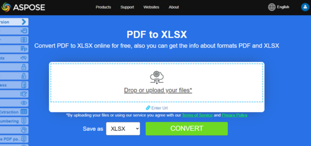

## PDF nach Excel (Spreadsheet 2003 XML) konvertieren

**Aspose.PDF for Python via .NET** unterstützt die Funktion, PDF-Dateien in Excel- und CSV-Formate zu konvertieren.

Aspose.PDF for Python via .NET ist eine PDF-Manipulationskomponente, wir haben eine Funktion eingeführt, die PDF-Datei in Excel-Arbeitsmappen (XLSX-Dateien) rendert. Während dieser Konvertierung werden die einzelnen Seiten der PDF-Datei in Excel-Arbeitsblätter konvertiert.

Verwenden Sie diese Seite, wenn Sie tabellenorientierte oder berichtsähnliche PDF-Inhalte in Tabellenkalkulationsformate extrahieren müssen, um sie zu sortieren, zu filtern oder für nachgelagerte Analysen zu nutzen.

{}
**Versuchen Sie, PDF online in Excel zu konvertieren**

Aspose.PDF präsentiert Ihnen eine Online-Anwendung ["PDF zu XLSX"](https://products.aspose.app/pdf/conversion/pdf-to-xlsx), wo Sie versuchen können, die Funktionalität und die Qualität, mit der es funktioniert, zu untersuchen.

[](https://products.aspose.app/pdf/conversion/pdf-to-xlsx)
{}

Der folgende Codeabschnitt zeigt den Vorgang zum Konvertieren einer PDF-Datei in das XLS- oder XLSX-Format mit Aspose.PDF for Python via .NET.

Schritte: Konvertieren Sie eine PDF-Datei in das Excel-Format (XML Spreadsheet 2003)

1. Laden Sie das PDF-Dokument.
1. Excel‑Speicheroptionen einrichten mit [ExcelSaveOptions](https://reference.aspose.com/pdf/python-net/aspose.pdf/excelsaveoptions/).
1. Speichern Sie die konvertierte Datei.

```python
from os import path
import aspose.pdf as ap
import sys

def convert_pdf_to_excel_spread_sheet2003(infile, outfile):
    document = ap.Document(infile)
    save_options = ap.ExcelSaveOptions()
    save_options.format = ap.ExcelSaveOptions.ExcelFormat.XML_SPREAD_SHEET2003
    document.save(outfile, save_options)

    print(infile + " converted into " + outfile)
```

## PDF zu Excel 2007+ (XLSX) konvertieren

Schritte: Konvertieren Sie eine PDF-Datei in das XLSX‑Format (Excel 2007+)

1. Laden Sie das PDF-Dokument.
1. Excel‑Speicheroptionen einrichten mit [ExcelSaveOptions](https://reference.aspose.com/pdf/python-net/aspose.pdf/excelsaveoptions/).
1. Speichern Sie die konvertierte Datei.

```python
from os import path
import aspose.pdf as ap
import sys

def convert_pdf_to_excel_2007(infile, outfile):
    document = ap.Document(infile)
    save_options = ap.ExcelSaveOptions()
    save_options.format = ap.ExcelSaveOptions.ExcelFormat.XLSX
    document.save(outfile, save_options)

    print(infile + " converted into " + outfile)
```

## PDF in XLS mit Kontrollspalte konvertieren

Beim Konvertieren einer PDF in das XLS-Format wird dem Ausgabedokument als erste Spalte eine leere Spalte hinzugefügt. In der „ExcelSaveOptions“-Klasse wird die Option „insert_blank_column_at_first“ verwendet, um diese Spalte zu steuern. Der Standardwert ist true.

```python
from os import path
import aspose.pdf as ap
import sys

def convert_pdf_to_excel_2007_control_column(infile, outfile):
    document = ap.Document(infile)
    save_options = ap.ExcelSaveOptions()
    save_options.format = ap.ExcelSaveOptions.ExcelFormat.XLSX
    save_options.insert_blank_column_at_first = True
    document.save(outfile, save_options)

    print(infile + " converted into " + outfile)
```

## PDF in ein einzelnes Excel-Arbeitsblatt konvertieren

Aspose.PDF for Python via .NET zeigt, wie man ein PDF in eine Excel (.xlsx)-Datei konvertiert, wobei die Option ‘minimize_the_number_of_worksheets’ aktiviert ist.

Schritte: PDF in ein einzelnes XLS- oder XLSX-Arbeitsblatt in Python konvertieren

1. Laden Sie das PDF-Dokument.
1. Excel‑Speicheroptionen einrichten mit [ExcelSaveOptions](https://reference.aspose.com/pdf/python-net/aspose.pdf/excelsaveoptions/).
1. Die 'minimize_the_number_of_worksheets'-Option reduziert die Anzahl der Excel‑Blätter, indem PDF‑Seiten zu weniger Arbeitsblättern kombiniert werden (z. B. ein Arbeitsblatt für das gesamte Dokument, falls möglich).
1. Speichern Sie die konvertierte Datei.

```python
from os import path
import aspose.pdf as ap
import sys

def convert_pdf_to_excel_2007_single_excel_worksheet(infile, outfile):
    document = ap.Document(infile)
    save_options = ap.ExcelSaveOptions()
    save_options.format = ap.ExcelSaveOptions.ExcelFormat.XLSX
    save_options.minimize_the_number_of_worksheets = True
    document.save(outfile, save_options)

    print(infile + " converted into " + outfile)
```

## PDF in Excel 2007 Makro‑aktiviert (XLSM) konvertieren

Dieses Python-Beispiel zeigt, wie man eine PDF‑Datei in eine Excel‑Datei im XLSM‑Format (Excel‑Makro‑aktivierte Arbeitsmappe) konvertiert.

```python
from os import path
import aspose.pdf as ap
import sys

def convert_pdf_to_excel_2007_macro(infile, outfile):
    document = ap.Document(infile)
    save_options = ap.ExcelSaveOptions()
    save_options.format = ap.ExcelSaveOptions.ExcelFormat.XLSM
    document.save(outfile, save_options)

    print(infile + " converted into " + outfile)
```

## In andere Tabellenkalkulationsformate konvertieren

### PDF in CSV konvertieren

Die Funktion 'convert_pdf_to_excel_2007_csv' führt dieselbe Operation wie zuvor aus, jedoch ist das Zielformat diesmal CSV (Comma-Separated Values) anstelle von XLSM.

Schritte: PDF zu CSV in Python konvertieren

1. Erstelle eine Instanz von [Document](https://reference.aspose.com/pdf/python-net/aspose.pdf/document/) Objekt mit dem Quell-PDF-Dokument.
1. Erstelle eine Instanz von [ExcelSaveOptions](https://reference.aspose.com/pdf/python-net/aspose.pdf/excelsaveoptions/) mit **ExcelSaveOptions.ExcelFormat.CSV**
1. Speichern Sie es im **CSV**-Format, indem Sie aufrufen [save()](https://reference.aspose.com/pdf/python-net/aspose.pdf/document/#methods)* Methode und übergibt es [ExcelSaveOptions](https://reference.aspose.com/pdf/python-net/aspose.pdf/excelsaveoptions/).

```python
from os import path
import aspose.pdf as ap
import sys

def convert_pdf_to_excel_2007_csv(infile, outfile):
    document = ap.Document(infile)
    save_options = ap.ExcelSaveOptions()
    save_options.format = ap.ExcelSaveOptions.ExcelFormat.CSV
    document.save(outfile, save_options)

    print(infile + " converted into " + outfile)
```

### PDF in ODS konvertieren

Schritte: PDF zu ODS in Python konvertieren

1. Erstelle eine Instanz von [Document](https://reference.aspose.com/pdf/python-net/aspose.pdf/document/) Objekt mit dem Quell-PDF-Dokument.
1. Erstelle eine Instanz von [ExcelSaveOptions](https://reference.aspose.com/pdf/python-net/aspose.pdf/excelsaveoptions/) mit **ExcelSaveOptions.ExcelFormat.ODS**
1. Speichern Sie es im **ODS**-Format, indem Sie aufrufen [save()](https://reference.aspose.com/pdf/python-net/aspose.pdf/document/#methods) Methode und übergib sie [ExcelSaveOptions](https://reference.aspose.com/pdf/python-net/aspose.pdf/excelsaveoptions/).

Die Konvertierung in das ODS-Format erfolgt auf dieselbe Weise wie bei allen anderen Formaten.

```python
from os import path
import aspose.pdf as ap
import sys

def convert_pdf_to_ods(infile, outfile):
    document = ap.Document(infile)
    save_options = ap.ExcelSaveOptions()
    save_options.format = ap.ExcelSaveOptions.ExcelFormat.ODS
    document.save(outfile, save_options)

    print(infile + " converted into " + outfile)
```

## Verwandte Konvertierungen

- [PDF in Word konvertieren](/pdf/de/python-net/convert-pdf-to-word/) wenn Ihre Priorität auf bearbeitbarem Textfluss statt auf Tabellenstruktur liegt.
- [PDF in HTML konvertieren](/pdf/de/python-net/convert-pdf-to-html/) wenn Sie eine browserfreundliche Ausgabe benötigen.
- [PDF in andere Formate konvertieren](/pdf/de/python-net/convert-pdf-to-other-files/) für EPUB, Markdown, Text, XPS und zugehörige Export-Workflows.