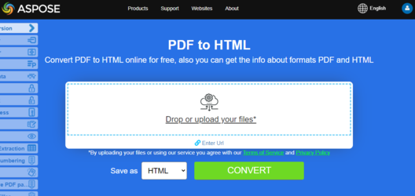

## PDF in HTML konvertieren

**Aspose.PDF for Python via .NET** bietet viele Funktionen zum Konvertieren verschiedener Dateiformate in PDF-Dokumente und zum Konvertieren von PDF-Dateien in verschiedene Ausgabformate. Dieser Artikel beschreibt, wie man eine PDF-Datei in <abbr title="HyperText Markup Language">HTML</abbr>. Sie können nur ein paar Zeilen Python-Code verwenden, um PDF in HTML zu konvertieren. Sie müssen möglicherweise PDF in HTML konvertieren, wenn Sie eine Website erstellen oder Inhalte zu einem Online-Forum hinzufügen wollen. Eine Möglichkeit, PDF in HTML zu konvertieren, besteht darin, Python programmgesteuert zu verwenden.

{}
**Versuchen Sie, PDF online in HTML zu konvertieren**

Aspose.PDF for Python präsentiert Ihnen die Online-Anwendung [PDF zu HTML](https://products.aspose.app/pdf/conversion/pdf-to-html), wo Sie versuchen können, die Funktionalität und die Qualität, mit der es funktioniert, zu untersuchen.

[](https://products.aspose.app/pdf/conversion/pdf-to-html)
{}

Schritte: PDF in HTML mit Python konvertieren

1. Erstelle eine Instanz von [Document](https://reference.aspose.com/pdf/python-net/aspose.pdf/document/) Objekt mit dem Quell-PDF-Dokument.
1. Speichern Sie es in [HtmlSpeicheroptionen](https://reference.aspose.com/pdf/python-net/aspose.pdf/htmlsaveoptions/) durch Aufrufen [save()](https://reference.aspose.com/pdf/python-net/aspose.pdf/document/#methods) Methode.

```python
import aspose.pdf as ap
from os import path
import sys

def convert_PDF_to_HTML(infile, outfile):
    document = ap.Document(infile)
    save_options = ap.HtmlSaveOptions()
    document.save(outfile, save_options)

    print(infile + " converted into " + outfile)
```

## Verwandte Konvertierungen

- [HTML in PDF konvertieren](/pdf/de/python-net/convert-html-to-pdf/) wenn Sie den umgekehrten Web-zu-Dokument-Workflow benötigen.
- [PDF in Word konvertieren](/pdf/de/python-net/convert-pdf-to-word/) wenn editierbare Dokumentausgabe nützlicher ist als HTML.
- [PDF in Bildformate konvertieren](/pdf/de/python-net/convert-pdf-to-images-format/) für Raster-Export-Szenarien.

### PDF in HTML konvertieren und Bilder im angegebenen Ordner speichern

Diese Funktion konvertiert eine PDF-Datei in das HTML-Format mit Aspose.PDF for Python via .NET. Alle extrahierten Bilder werden in einem angegebenen Ordner gespeichert, anstatt in der HTML-Datei eingebettet zu werden.

1. HTML-Speicheroptionen konfigurieren.
1. Als HTML mit externen Bildern speichern.

```python
import aspose.pdf as ap
from os import path
import sys

def convert_PDF_to_HTML_storing_images(infile, outfile):
    document = ap.Document(infile)
    save_options = ap.HtmlSaveOptions()
    images_path = path.join(path.dirname(infile), "images")
    save_options.special_folder_for_all_images = images_path
    document.save(outfile, save_options)

    print(infile + " converted into " + outfile)
```

### PDF in mehrseitiges HTML konvertieren

Diese Funktion konvertiert eine PDF-Datei in mehrseitiges HTML, wobei jede PDF-Seite als separate HTML-Datei exportiert wird. Dadurch wird die Ausgabe leichter navigierbar und die Ladezeit für große PDFs reduziert.

1. Laden Sie das Quell-PDF mit 'ap.Document'.
1. Erstelle 'HtmlSaveOptions' und setze `split_into_pages`.
1. Speichern Sie das Dokument als HTML, wobei die Seiten in separate Dateien aufgeteilt werden.
1. Geben Sie eine Bestätigungsnachricht aus.

```python
import aspose.pdf as ap
from os import path
import sys

def convert_PDF_to_HTML_multi_page(infile, outfile):
    document = ap.Document(infile)
    save_options = ap.HtmlSaveOptions()
    save_options.split_into_pages = True
    document.save(outfile, save_options)

    print(infile + " converted into " + outfile)
```

### PDF in HTML konvertieren und SVG-Bilder im angegebenen Ordner speichern

Diese Funktion konvertiert ein PDF in das HTML-Format, wobei alle Bilder als SVG-Dateien in einem angegebenen Ordner gespeichert werden, anstatt sie direkt in das HTML einzubetten.

1. Laden Sie das Quell-PDF mit 'ap.Document'.
1. Erstelle 'HtmlSaveOptions' und setze `special_folder_for_svg_images` auf den Zielordner.
1. Speichern Sie das Dokument als HTML mit externen SVG-Bildern.
1. Geben Sie eine Bestätigungsnachricht aus.

```python
import aspose.pdf as ap
from os import path
import sys

def convert_PDF_to_HTML_storing_svg(infile, outfile):
    document = ap.Document(infile)
    save_options = ap.HtmlSaveOptions()
    images_path = path.join(path.dirname(infile), "svg_images")
    save_options.special_folder_for_svg_images = images_path
    document.save(outfile, save_options)

    print(infile + " converted into " + outfile)
```

### PDF zu HTML konvertieren und komprimierte SVG-Bilder speichern

Dieses Snippet konvertiert ein PDF in das HTML-Format, speichert alle Bilder als SVG-Dateien in einem angegebenen Ordner und komprimiert sie, um die Dateigröße zu reduzieren.

1. Laden Sie das PDF-Dokument mit 'ap.Document'.
1. Erstelle 'HtmlSaveOptions' und:
   - Setzen Sie 'special_folder_for_svg_images', um SVG‑Bilder extern zu speichern.
   - Aktivieren Sie ‘compress_svg_graphics_if_any’, um SVG-Bilder zu komprimieren.
1. Speichern Sie das Dokument als HTML mit komprimierten externen SVG-Bildern.
1. Geben Sie eine Bestätigungsnachricht aus.

```python
import aspose.pdf as ap
from os import path
import sys

def convert_PDF_to_HTML_compress_svg(infile, outfile):
    document = ap.Document(infile)
    save_options = ap.HtmlSaveOptions()
    images_path = path.join(path.dirname(infile), "svg_images")
    save_options.special_folder_for_svg_images = images_path
    save_options.compress_svg_graphics_if_any = True
    document.save(outfile, save_options)

    print(infile + " converted into " + outfile)
```

### PDF in HTML konvertieren mit Kontrolle von eingebetteten Rasterbildern

Dieses Snippet konvertiert ein PDF in das HTML-Format und bettet Rasterbilder als PNG-Seitenhintergründe ein. Dieser Ansatz bewahrt die Bildqualität und das Seitenlayout im HTML.

1. Laden Sie das PDF-Dokument mit 'ap.Document'.
1. Erstellen Sie 'HtmlSaveOptions' und 'set raster_images_saving_mode' auf 'AS_EMBEDDED_PARTS_OF_PNG_PAGE_BACKGROUND'.
1. Speichern Sie das Dokument als HTML mit eingebetteten Rasterbildern.
1. Geben Sie eine Bestätigungsnachricht aus.

```python
import aspose.pdf as ap
from os import path
import sys

def convert_PDF_to_HTML_PNG_background(infile, outfile):
    document = ap.Document(infile)
    save_options = ap.HtmlSaveOptions()
    save_options.raster_images_saving_mode = ap.HtmlSaveOptions.RasterImagesSavingModes.AS_EMBEDDED_PARTS_OF_PNG_PAGE_BACKGROUND
    document.save(outfile, save_options)

    print(infile + " converted into " + outfile)
```

### PDF in eine Body-Only-Inhalt-HTML-Seite konvertieren

Diese Funktion konvertiert ein PDF in das HTML-Format, erzeugt 'body-only'-Inhalt ohne zusätzliche 'html'- oder 'head'-Tags und teilt die Ausgabe in separate Seiten auf.

1. Laden Sie das PDF-Dokument mit 'ap.Document'.
1. Erstelle 'HtmlSaveOptions' und konfiguriere:
   - 'html_markup_generation_mode = WRITE_ONLY_BODY_CONTENT' um nur den 'body'-Inhalt zu erzeugen.
   - 'split_into_pages' zum Erstellen separater HTML-Dateien für jede PDF-Seite.
1. Speichern Sie das Dokument als HTML mit den angegebenen Optionen.
1. Geben Sie eine Bestätigungsnachricht aus.

```python
import aspose.pdf as ap
from os import path
import sys

def convert_PDF_to_HTML_body_content(infile, outfile):
    document = ap.Document(infile)
    save_options = ap.HtmlSaveOptions()
    save_options.html_markup_generation_mode = (
        ap.HtmlSaveOptions.HtmlMarkupGenerationModes.WRITE_ONLY_BODY_CONTENT
    )
    save_options.split_into_pages = True
    document.save(outfile, save_options)

    print(infile + " converted into " + outfile)
```

### PDF in HTML konvertieren mit transparenter Textdarstellung

Diese Funktion konvertiert ein PDF in das HTML-Format, wobei der gesamte Text transparent gerendert wird, einschließlich schattierter Texte, was die visuelle Treue bewahrt und gleichzeitig flexible Gestaltung im ausgegebenen HTML ermöglicht.

1. Laden Sie das PDF-Dokument mit 'ap.Document'.
1. Erstelle 'HtmlSaveOptions' und konfiguriere:
    - 'save_transparent_texts' zum Rendern von normalem Text als transparent.
    - 'save_shadowed_texts_as_transparent_texts' um schattierten Text als transparent darzustellen.
1. Speichern Sie das Dokument als HTML mit transparenter Textdarstellung.
1. Geben Sie eine Bestätigungsnachricht aus.

```python
import aspose.pdf as ap
from os import path
import sys

def convert_PDF_to_HTML_transparent_text_rendering(infile, outfile):
    document = ap.Document(infile)
    save_options = ap.HtmlSaveOptions()
    save_options.save_transparent_texts = True
    save_options.save_shadowed_texts_as_transparent_texts = True
    document.save(outfile, save_options)

    print(infile + " converted into " + outfile)
```

### PDF in HTML konvertieren mit Rendering von Dokumentebenen

Diese Funktion konvertiert ein PDF in das HTML-Format und bewahrt dabei die Dokumentebenen, indem markierter Inhalt in separate Ebenen im Ausgabe-HTML umgewandelt wird. Dadurch können geschichtete Elemente (wie Anmerkungen, Hintergründe und Overlays) genau dargestellt werden.

1. Laden Sie das PDF-Dokument mit 'ap.Document'.
1. Erstellen Sie 'HtmlSaveOptions' und aktivieren Sie 'convert_marked_content_to_layers', um Ebenen zu erhalten.
1. Speichern Sie das Dokument als HTML mit geschichteten Inhalten.
1. Geben Sie eine Bestätigungsnachricht aus.

```python
import aspose.pdf as ap
from os import path
import sys

def convert_PDF_to_HTML_document_layers_rendering(infile, outfile):
    document = ap.Document(infile)
    save_options = ap.HtmlSaveOptions()
    save_options.convert_marked_content_to_layers = True
    document.save(outfile, save_options)

    print(infile + " converted into " + outfile)
```

