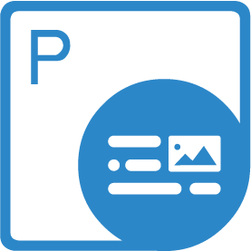
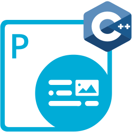
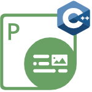
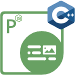

{}

<h2> Welcome to the Aspose.PDF for .NET</h2>

Aspose.PDF is a .NET component built to allow developers to create PDF documents, whether simple or complex, on the fly programmatically. Aspose.PDF for .NET allows developers to insert tables, graphs, images, hyperlinks, custom fonts - and more - into PDF documents. Moreover, it is also possible to compress PDF documents. Aspose.PDF for .NET provides excellent security features to develop secure PDF documents. And the most distinct feature of Aspose.PDF for .NET is that it supports the creation of PDF documents through both an API and from XML templates.

{}

<h3>Aspose.PDF for .NET Resources</h3>

The following are the links to some useful resources you may need to accomplish your tasks.

- [Aspose.PDF for .NET Online Documentation](/pdf/net/)
- [Aspose.PDF for .NET Features](/pdf/net/key-features/)
- [Aspose.PDF for .NET Release Notes](https://releases.aspose.com/pdf/net/release-notes/)
- [Aspose.PDF for .NET Product Page](https://products.aspose.com/pdf/net/)
- [Install Aspose.PDF for .NET NuGet Package](https://www.nuget.org/packages/Aspose.PDF/)
- [Download Aspose.PDF for .NET](https://releases.aspose.com/pdf/net/)
- [Aspose.PDF for .NET API Reference Guide](https://reference.aspose.com/pdf/net)
- [Aspose.PDF for .NET Free Support Forum](https://forum.aspose.com/c/pdf/10)
- [Aspose.PDF for .NET Paid Support Helpdesk](https://helpdesk.aspose.com/)

{}

<h2>Welcome to Aspose.PDF for Java</h2>

Aspose.PDF is a Java component built to allow developers to create PDF documents, whether simple or complex, on the fly programmatically. Aspose.PDF for Java allows developers to insert tables, graphs, images, hyperlinks, custom fonts - and more - into PDF documents. Moreover, it is also possible to compress PDF documents. Aspose.PDF for Java provides excellent security features to develop secure PDF documents. And the most distinct feature of Aspose.PDF for Java is that it supports the creation of PDF documents through both an API and from XML templates

{}

<h3>Aspose.PDF for Java Resources</h3>

Following are the links to some useful resources you may need to accomplish your tasks.

- [Aspose.PDF for Java Online Documentation](/pdf/java/)
- [Aspose.PDF for Java Features](/pdf/java/key-features/)
- [Aspose.PDF for Java Release Notes](https://releases.aspose.com/pdf/java/release-notes/)
- [Aspose.PDF for Java Product Page](https://products.aspose.com/pdf/java/)
- [Aspose.PDF for Java from Aspose Repository](https://releases.aspose.com/java/repo/com/aspose/aspose-pdf/)
- [Install Aspose.PDF for Java from Aspose Repository](/pdf/java/installation/)
- [Download Aspose.PDF for Java](https://releases.aspose.com/pdf/java/)
- [Aspose.PDF for Java API Reference Guide](https://reference.aspose.com/pdf/java)
- [Download Examples at GitHub Repository](https://github.com/aspose-pdf/Aspose.PDF-for-Java)
- [Aspose.PDF for Java Free Support Forum](https://forum.aspose.com/c/pdf/10)
- [Aspose.PDF for Java Paid Support Helpdesk](https://helpdesk.aspose.com/)

{}

<h2>Welcome to the Aspose.PDF for C++ Documentation Section</h2>

Aspose.PDF for C++ is a native C++ library that enables developers to create, read and manipulate PDF documents without using Adobe Acrobat. Aspose.PDF for C++ allows developers to create forms, add/edit text, manipulate PDF pages, add annotations, handle custom fonts and much more. Here in the documentation section of Aspose.PDF for C++, you can explore all the features of the API along with the basic examples to demonstrate the implementation of those features in your C++ application.

{}

<h3>Aspose.PDF for C++ Resources</h3>

The following links offer some useful resources you may need to accomplish your tasks.

- [Aspose.PDF for C++ Online Documentation](/pdf/cpp/)
- [Aspose.PDF for C++ Features](/pdf/cpp/product-overview/)
- [Aspose.PDF for C++ Release Notes](https://releases.aspose.com/pdf/cpp/release-notes/)
- [Aspose.PDF for C++ Product Page](https://products.aspose.com/pdf/cpp/)
- [Download Aspose.PDF for C++](https://releases.aspose.com/pdf/cpp/)
- [Install Aspose.PDF for C++ NuGet Package](https://www.nuget.org/packages/Aspose.PDF.CPP/)
- [Aspose.PDF for C++ API Reference Guide](https://reference.aspose.com/cpp/pdf)
- [Download Examples at GitHub Repository](https://github.com/aspose-pdf/Aspose.PDF-for-C)
- [Aspose.PDF for C++ Free Support Forum](https://forum.aspose.com/c/pdf/10)
- [Aspose.PDF for C++ Paid Support Helpdesk](https://helpdesk.aspose.com/)

{}

<h2>Welcome to Aspose.PDF for Android via Java</h2>

Aspose.PDF for Android via Java is a component that allows developers to create and manipulate PDF documents programmatically, whether simple or complex. Aspose.PDF for Android via Java allows developers to insert tables, graphs, images, hyperlinks, custom fonts - and more - into PDF documents. It can also be used to compress PDF documents. Aspose.PDF for Android via Java provides excellent security features for developing secure PDFs. Aspose.PDF for Android via Java's most distinctive feature is that it supports PDF creation through both an API and from XML templates.

{}

<h3>Aspose.PDF for Android via Java Resources</h3>

Following are the links to some useful resources you may need to accomplish your tasks.

- [Aspose.PDF for Java Online Documentation](/pdf/java/) (Aspose.PDF for Android via Java is very similar to Aspose.PDF for Java. So, you can use the same documentation)
- [Aspose.PDF for Android via Java Features](/pdf/androidjava/key-features/)
- [Aspose.PDF for Android via Java Release Notes](https://releases.aspose.com/pdf/androidjava/release-notes/)
- [Aspose.PDF for Android via Java Product Page](https://products.aspose.com/pdf/android-java/)
- [Download Aspose.PDF for Android via Java](https://releases.aspose.com/pdf/androidjava/)
- [Download Aspose.PDF for Android via Java from Aspose Repository](https://releases.aspose.com/java/repo/com/aspose/aspose-pdf-android-via-java/)
- [Install Aspose.PDF for Android via Java](/pdf/androidjava/installation/)
- [Aspose.PDF for Android via Java API Reference Guide](https://reference.aspose.com/pdf/java) (Aspose.PDF for Android via Java is very similar to Aspose.PDF for Java. So, you can use the same API Reference Guide)
- [Aspose.PDF for Android via Java Free Support Forum](https://forum.aspose.com/c/pdf/10)
- [Aspose.PDF for Android via Java Paid Support Helpdesk](https://helpdesk.aspose.com/)

{}

<h2>Welcome to Aspose.PDF for Reporting Services</h2>

Microsoft SQL Server Reporting Services fulfills a need that many organizations have: the need to build business intelligence and reporting solutions. Until now, developers were required to embed reports into their applications, or organizations were required to buy expensive and sometimes problematic third-party reporting solutions. Now, Microsoft SQL Server Reporting Services offers a complete solution for distributing reports across the enterprise; enabling businesses to make decisions better and faster.

{}

<h3>Aspose.PDF for Reporting Services Resources</h3>

- [Aspose.PDF for Reporting Services Product Overview](/pdf/reportingservices/product-overview/)
- [Aspose.PDF for Reporting Services Supported File Formats](/pdf/reportingservices/supported-file-formats/)
- [Aspose.PDF for Reporting Services Features](/pdf/reportingservices/features/)
- [Aspose.PDF for Reporting Services Release Notes](https://releases.aspose.com/pdf/reportingservices/release-notes/)
- [Dowload Aspose.PDF for Reporting Services](https://releases.aspose.com/pdf/reportingservices/)
- [Sample Reports Gallery Aspose.PDF for Reporting Services](/pdf/reportingservices/sample-reports-gallery/)
- [Install Aspose.Pdf for Reporting Services](/pdf/reportingservices/install-aspose-pdf-for-reporting-services/)
- [License Aspose.Pdf for Reporting Services](/pdf/reportingservices/license-aspose-pdf-for-reporting-services/)
- [Configure Aspose.Pdf for Reporting Services](/pdf/reportingservices/configure-aspose-pdf-for-reporting-services/)
- [Expand Report Items Properties](/pdf/reportingservices/expand-report-items-properties/)
- [Evaluate Aspose.Pdf for Reporting Services](/pdf/reportingservices/evaluate-aspose-pdf-for-reporting-services/)

{}

<h2>Welcome to Aspose.PDF for SharePoint</h2>

Aspose.PDF for SharePoint is a solution that allows the users to export lists, list items and SharePoint Wiki pages to the PDF file format.

{}

<h3>Aspose.PDF for SharePoint Resources</h3>

Following are the links to some useful resources you may need to accomplish your tasks.

- [Aspose.PDF for SharePoint Product Overview](/pdf/sharepoint/product-overview/)
- [Aspose.PDF for SharePoint Supported File Formats](/pdf/sharepoint/supported-file-formats/)
- [Aspose.PDF for SharePoint Features](/pdf/sharepoint/features/)
- [Aspose.PDF for SharePoint Release Notes](https://releases.aspose.com/pdf/sharepoint/release-notes/)
- [Download Aspose.PDF for SharePoint](https://releases.aspose.com/pdf/sharepoint/)
- [Install Aspose.Pdf for SharePoint](/pdf/sharepoint/install-aspose-pdf-for-sharepoint/)
- [Evaluate Aspose.Pdf](/pdf/sharepoint/evaluate-aspose-pdf/)
- [License Aspose.Pdf for SharePoint](/pdf/sharepoint/license-aspose-pdf-for-sharepoint/)
- [API Limitations](/pdf/sharepoint/api-limitations/)

{}

<h2>Welcome to Aspose.PDF for JasperReports</h2>

Aspose.PDF for JasperReports is a flexible component designed to export reports from JasperReports and JasperServer to Portable Document Format (PDF). Important report features such as tables, charts and images are converted to PDF with the highest degree of precision.

{}

<h3>Aspose.PDF for JasperReports Resources</h3>

Following are the links to some useful resources you may need to accomplish your tasks.

- [Aspose.PDF for JasperReports Product Overview](/pdf/jasperreports/product-overview/)
- [Aspose.PDF for JasperReports Supported File Formats](/pdf/jasperreports/supported-file-formats/)
- [Feature Tour Aspose.PDF for JasperReports](/pdf/jasperreports/feature-tour/)
- [Aspose.PDF for JasperReports Release Notes](https://releases.aspose.com/pdf/sharepoint/release-notes/)
- [Download Aspose.PDF for JasperReports](https://releases.aspose.com/pdf/sharepoint/)
- [Aspose.PDF for JasperReports Sample Reports Gallery](/pdf/jasperreports/sample-reports-gallery/)
- [Installation Aspose.PDF for JasperReports](/pdf/jasperreports/installation/)
- [Licensing Aspose.PDF for JasperReports](/pdf/jasperreports/licensing/)
- [Evaluate Aspose.Pdf](/pdf/jasperreports/evaluate-aspose-pdf/)
- [Aspose.PDF for JasperReports  API Limitations](/pdf/jasperreports/api-limitations/)

{}

<h2>Welcome to the Aspose.PDF for Go via C++ Documentation Section</h2>

Aspose.PDF for Go via C++ is generation library that makes creating complex, multi-page, printable documents easy. The API is designed with simplicity, often making the generation of complex documents as straightforward as a few function calls. True to its name, the library is built using C++ code, enabling exceptional speed. By compiling it into WebAssembly, we have ensured its portability across various operating systems.

{}

<h3>Aspose.PDF for Go via C++ Resources</h3>

The following links offer some useful resources you may need to accomplish your tasks.

- [Aspose.PDF for Go via C++ Online Documentation](/pdf/go-cpp/)
- [Aspose.PDF for Go via C++ Features](/pdf/go-cpp/key-features/)
- [Aspose.PDF for Go via C++ Release Notes](https://releases.aspose.com/pdf/gocpp/)
- [Aspose.PDF for Go via C++ Product Page](https://products-qa.aspose.com/pdf/go-cpp/)
- [Download Aspose.PDF for Go via C++](https://releases.aspose.com/pdf/gocpp/)
- [Aspose.PDF for Go via C++ API Reference Guide](https://reference.aspose.com/pdf/go-cpp/)
- [Download Examples at GitHub Repository](https://github.com/aspose-pdf/aspose-pdf-go-cpp)
- [Aspose.PDF for Go via C++ Free Support Forum](https://forum.aspose.com/c/pdf/10)
- [Aspose.PDF for Go via C++ Paid Support Helpdesk](https://helpdesk.aspose.com/)

{}

<h2>Welcome to the Aspose.PDF for JavaScript via C++ Documentation Section</h2>

Aspose.PDF for JavaScript via C++ is a scalable and feature-rich toolkit to process PDF using JavaScript. Developers can create their own JavaScript product and distribute them all over the web. Aspose.PDF for JavaScript via C++ is built on the use of WebAssembly technology and is based on Aspose.PDF for .NET.

{}

<h3>Aspose.PDF for JavaScript via C++ Resources</h3>

The following links offer some useful resources you may need to accomplish your tasks.

- [Aspose.PDF for JavaScript via C++ Online Documentation](/pdf/javascript-cpp/)
- [Aspose.PDF for JavaScript via C++ Features](/pdf/javascript-cpp/overview/)
- [Aspose.PDF for JavaScript via C++ Release Notes](https://releases.aspose.com/pdf/javascriptcpp/release-notes/)
- [Aspose.PDF for JavaScript via C++ Product Page](https://products.aspose.com/pdf/javascript-cpp/)
- [Download Aspose.PDF for JavaScript via C++](https://releases.aspose.com/pdf/javascriptcpp/)
- [Aspose.PDF for JavaScript via C++ API Reference Guide](https://reference.aspose.com/pdf/javascript-cpp/)
- [Aspose.PDF for JavaScript via C++ Free Support Forum](https://forum.aspose.com/c/pdf/10)
- [Aspose.PDF for JavaScript via C++ Paid Support Helpdesk](https://helpdesk.aspose.com/)

{}

<h2>Welcome to the Aspose.PDF for Node.js via C++ Documentation Section</h2>

Node.js is a cross-platform runtime environment for server-side and networking applications written in JavaScript. Essentially it allows you to run JavaScript applications outside of a browser context.

{}

<h3>Aspose.PDF for Node.js via C++ Resources</h3>

The following links offer some useful resources you may need to accomplish your tasks.

- [Aspose.PDF for Node.js via C++ Online Documentation](/pdf/nodejs-cpp/)
- [Aspose.PDF for Node.js via C++ Features](/pdf/nodejs-cpp/overview/)
- [Aspose.PDF for Node.js via  C++ Release Notes](https://releases.aspose.com/pdf/nodejscpp/release-notes/)
- [Aspose.PDF for Node.js via C++ Product Page](https://products.aspose.com/pdf/nodejs-cpp/)
- [Download Aspose.PDF for Node.js via C++](https://releases.aspose.com/pdf/nodejscpp/release-notes/)
- [Aspose.PDF for Node.js via C++ API Reference Guide](https://reference.aspose.com/pdf/nodejs-cpp/)
- [Aspose.PDF for Node.js via C++ Free Support Forum](https://forum.aspose.com/c/pdf/10)
- [Aspose.PDF for Node.js via C++ Paid Support Helpdesk](https://helpdesk.aspose.com/)
