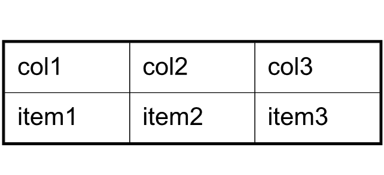

## Creating Table using C++

Tables are important when working with PDF documents. They provide great features for displaying information in a systematic manner.

Tables in a PDF document organize data in rows and columns in a systematic manner. Aspose.PDF for C++ API lets you add tables to a PDF document, and add rows and columns to it in your C++ applications. The [Table](https://reference.aspose.com/pdf/cpp/class/aspose.pdf.table/) class is used to add a table to the document. The following steps can be followed to add a table to a PDF document using C++.

### Adding Table in Existing PDF Document

To add a table to an existing PDF file with Aspose.PDF for C++, take the following steps:

1. Load the source file.
1. Initialize a table and set its columns and rows.
1. Set table setting (we've set the borders).
1. Populate table.
1. Add the table to a page.
1. Save the file.

The following code snippets show how to add text in an existing PDF file.

>Headers

```cpp
#include <system/date_time.h>
#include <system/io/file.h>
#include <system/console.h>
#include <data/data_table.h>
#include <data/data_column_collection.h>
#include <system/type_info.h>

#include <Aspose.PDF.Cpp/Document.h>
#include <Aspose.PDF.Cpp/Page.h>
#include <Aspose.PDF.Cpp/PageCollection.h>
#include <Aspose.PDF.Cpp/Generator/Paragraphs.h>
#include <Aspose.PDF.Cpp/Generator/BorderSide.h>
#include <Aspose.PDF.Cpp/Generator/BorderInfo.h>
#include <Aspose.PDF.Cpp/Generator/PageInfo.h>
#include <Aspose.PDF.Cpp/Generator/MarginInfo.h>
#include <Aspose.PDF.Cpp/Generator/GraphInfo.h>
#include <Aspose.PDF.Cpp/Generator/BorderCornerStyle.h>
#include <Aspose.PDF.Cpp/Generator/ColumnAdjustment.h>
#include <Aspose.PDF.Cpp/Generator/ImageFileType.h>
#include <Aspose.PDF.Cpp/Generator/Image.h>
#include <Aspose.PDF.Cpp/Generator/HtmlFragment.h>

#include <Aspose.PDF.Cpp/Text/TextFragment.h>

#include <Aspose.PDF.Cpp/Color.h>

#include <Aspose.PDF.Cpp/Table/Table.h>
#include <Aspose.PDF.Cpp/Table/Row.h>
#include <Aspose.PDF.Cpp/Table/Rows.h>
#include <Aspose.PDF.Cpp/Table/Cell.h>
#include <Aspose.PDF.Cpp/Table/Cells.h>
```

>Sample

```cpp
using namespace System;
using namespace Aspose::Pdf;

void AddingTableInExistingPDFDocument() {
    
    String _dataDir("C:\\Samples\\");
    
    // Load source PDF document
    auto document = MakeObject<Document>(_dataDir + u"AddTable.pdf");
    
    // Initializes a new instance of the Table
    auto table = MakeObject<Table>();
    
    // Set the table border color as LightGray
    table->set_Border(MakeObject<Aspose::Pdf::BorderInfo>(
        Aspose::Pdf::BorderSide::All, .5f, 
        Aspose::Pdf::Color::get_LightGray()));
    // Set the border for table cells
    table->set_DefaultCellBorder (MakeObject<Aspose::Pdf::BorderInfo>(
        Aspose::Pdf::BorderSide::All, .5f, 
        Aspose::Pdf::Color::get_LightGray()));

    // Create a loop to add 10 rows
    for (int row_count = 1; row_count < 10; row_count++)
    {
        // Add row to table
        auto row = table->get_Rows()->Add();
        // Add table cells
        row->get_Cells()->Add(String::Format(u"Column ({0}, 1)", row_count));
        row->get_Cells()->Add(String::Format(u"Column ({0}, 2)", row_count));
        row->get_Cells()->Add(String::Format(u"Column ({0}, 3)", row_count));
    }

    // Add table object to first page of input document
    document->get_Pages()->idx_get(1)->get_Paragraphs()->Add(table);
    
    // Save updated document containing table object
    document->Save(_dataDir + u"document_with_table_out.pdf");
}
```

### ColSpan and RowSpan in Tables

Aspose.PDF for C++ presents a [ColSpan](https://reference.aspose.com/pdf/cpp/class/aspose.pdf.cell#ae79c581d2245258699c98617e78c01d1) property to merge the columns in a table and [RowSpan](https://reference.aspose.com/pdf/cpp/class/aspose.pdf.cell#a4eb7337d118314e6c2180670fb32721a) property to merge the rows.

We use [ColSpan](https://reference.aspose.com/pdf/cpp/class/aspose.pdf.cell#ae79c581d2245258699c98617e78c01d1) or [RowSpan](https://reference.aspose.com/pdf/cpp/class/aspose.pdf.cell#a4eb7337d118314e6c2180670fb32721a) property on the [Cell](https://reference.aspose.com/pdf/cpp/class/aspose.pdf.cell) object which creates the table cell. After applying the required properties the created cell can be added to the table.

```cpp
void AddTable_RowColSpan()
{
    String _dataDir("C:\\Samples\\");

    // Load source PDF document
    auto document = MakeObject<Document>();
    document->get_Pages()->Add();

    // Initializes a new instance of the Table
    auto table = MakeObject<Table>();
    // Set the table border color as LightGray
    table->set_Border(MakeObject<Aspose::Pdf::BorderInfo>(
        Aspose::Pdf::BorderSide::All, .5f, 
        Color::get_Black()));
        // Set the border for table cells
    table->set_DefaultCellBorder(
        MakeObject<Aspose::Pdf::BorderInfo>(
            Aspose::Pdf::BorderSide::All, .5f, 
            Color::get_Black()));
    

    // Add 1st row to table
    auto row1 = table->get_Rows()->Add();
    for (int cellCount = 1; cellCount < 5; cellCount++)
    {
        // Add table cells
        row1->get_Cells()->Add(String::Format(u"Test 1 {0}", cellCount));
    }

    // Add 2nd row to table
    auto row2 = table->get_Rows()->Add();
    row2->get_Cells()->Add(u"Test 2 1");
    auto cell = row2->get_Cells()->Add(u"Test 2 2");
    cell->set_ColSpan(2);
    row2->get_Cells()->Add(u"Test 2 4");

    // Add 3rd row to table
    auto row3 = table->get_Rows()->Add();
    row3->get_Cells()->Add(u"Test 3 1");
    row3->get_Cells()->Add(u"Test 3 2");
    row3->get_Cells()->Add(u"Test 3 3");
    row3->get_Cells()->Add(u"Test 3 4");

    // Add 4th row to table
    auto row4 = table->get_Rows()->Add();
    row4->get_Cells()->Add(u"Test 4 1");
    cell = row4->get_Cells()->Add(u"Test 4 2");
    cell->set_RowSpan (2);
    row4->get_Cells()->Add(u"Test 4 3");
    row4->get_Cells()->Add(u"Test 4 4");


    // Add 5th row to table
    auto row5 = table->get_Rows()->Add();
    row5->get_Cells()->Add(u"Test 5 1");
    row5->get_Cells()->Add(u"Test 5 3");
    row5->get_Cells()->Add(u"Test 5 4");

    // Add table object to first page of input document
    document->get_Pages()->idx_get(1)->get_Paragraphs()->Add(table);

    // Save updated document containing table object
    document->Save(_dataDir + u"document_with_table_out.pdf");
}
```

The result of the execution code below is the table depicted on the following image:


## Working with Borders, Margins and Padding

Note that it also supports the function of setting the border, margins and cell padding for tables, let's first understand the concept of borders, margins and padding, which are presented in the diagram below:


Check the drawing in detail. It shows that the borders of the table, rows, and cells overlap. Using Aspose.PDF for C++  the table can have margins and cells can be indented. To set the cell margins, we must set the cell padding.

## Borders

To set the borders of Table, [Row](https://reference.aspose.com/pdf/cpp/class/aspose.pdf.row) and [Cell](https://reference.aspose.com/pdf/cpp/class/aspose.pdf.cell) objects, use the Table.Border, Row.Border and Cell.Border properties. Cell borders can also be set using the [Table](https://reference.aspose.com/pdf/cpp/class/aspose.pdf.table) or Row class’ DefaultCellBorder property. All border related properties discussed above are assigned an instance of the Row class, which is created by calling its constructor. The Row class has many overloads that take almost all the parameters required to customize the border.

## Margins or Padding

Cell padding can be managed using the Table class [DefaultCellPadding](https://reference.aspose.com/pdf/cpp/class/aspose.pdf.table#ac64196de6dfed7550c3278892ed9dbe0) property. All padding related properties are assigned an instance of the [MarginInfo](https://reference.aspose.com/pdf/cpp/class/aspose.pdf.margin_info/) class that takes information about the `Left`, `Right`, `Top` and `Bottom` parameters to create custom margins.



```cpp
void AddTable_MergingPadding() {

    String _dataDir("C:\\Samples\\");

    // Instntiate the Document object by calling its empty constructor
    auto document = MakeObject<Document>();
    auto page = document->get_Pages()->Add();

    // Instantiate a table object
    auto tab1 = MakeObject<Table>();
    // Add the table in paragraphs collection of the desired section
    page->get_Paragraphs()->Add(tab1);
    // Set with column widths of the table
    tab1->set_ColumnWidths (u"50 50 50");
    // Set default cell border using BorderInfo object
    tab1->set_DefaultCellBorder (
        MakeObject<Aspose::Pdf::BorderInfo>(
            Aspose::Pdf::BorderSide::All, 0.1F));
    // Set table border using another customized BorderInfo object
    tab1->set_Border (
        MakeObject<Aspose::Pdf::BorderInfo>(
            Aspose::Pdf::BorderSide::All, 1.0F));

    // Create MarginInfo object and set its left, bottom, right and top margins
    auto margin = MakeObject<MarginInfo>();
    margin->set_Top (5.0f);
    margin->set_Left (5.0f);
    margin->set_Right (5.0f);
    margin->set_Bottom (5.0f);

    // Set the default cell padding to the MarginInfo object
    tab1->set_DefaultCellPadding (margin);
    // Create rows in the table and then cells in the rows
    auto row1 = tab1->get_Rows()->Add();
    row1->get_Cells()->Add(u"col1");
    row1->get_Cells()->Add(u"col2");
    row1->get_Cells()->Add();

    auto mytext = MakeObject<Aspose::Pdf::Text::TextFragment>(u"col3 with large text string");
        
    row1->get_Cells()->idx_get(2)->get_Paragraphs()->Add(mytext);
    row1->get_Cells()->idx_get(2)->set_IsWordWrapped(false);
    

    auto row2 = tab1->get_Rows()->Add();
    row2->get_Cells()->Add(u"item1");
    row2->get_Cells()->Add(u"item2");
    row2->get_Cells()->Add(u"item3");
    
    // Save the Pdf
    document->Save(_dataDir + u"MarginsOrPadding_out.pdf");
}
```

To create table with rounded corner, use the [BorderInfo](https://reference.aspose.com/pdf/cpp/class/aspose.pdf.border_info) class [RoundedBorderRadius](https://reference.aspose.com/pdf/cpp/class/aspose.pdf.border_info#a6a2bed69dd034fba9ce439dcbe1fd3de) value and set the table corner style to round.

```cpp
void AddTable_RoundedBorderRadius()
{
    // The path to the documents directory.
    String _dataDir("C:\\Samples\\");

    auto tab1 = MakeObject<Aspose::Pdf::Table>();

    auto graph = MakeObject<GraphInfo>();
    graph->set_Color(Color::get_Red());
    // Create a blank BorderInfo object
    auto bInfo = MakeObject<BorderInfo>(BorderSide::All, graph);

    // Set the border a rounder border where radius of round is 15
    bInfo->set_RoundedBorderRadius(15);
    // Set the table Corner style as Round.
    tab1->set_CornerStyle (Aspose::Pdf::BorderCornerStyle::Round);
    // Set the table border information
    tab1->set_Border(bInfo);
}
```

### AutoFitToWindow property in ColumnAdjustmentType enumeration

```cpp
void AddTable_AutoFitToWindow() {
    
    // The path to the documents directory.
    String _dataDir("C:\\Samples\\");

    // Instntiate the Pdf object by calling its empty constructor
    auto document = MakeObject<Document>();

    // Create the section in the Pdf object
    auto sec1 = document->get_Pages()->Add();

    // Instantiate a table object
    auto tab1 = MakeObject<Aspose::Pdf::Table>();
    // Add the table in paragraphs collection of the desired section
    sec1->get_Paragraphs()->Add(tab1);

    // Set with column widths of the table
    tab1->set_ColumnWidths (u"50 50 50");
    tab1->set_ColumnAdjustment (ColumnAdjustment::AutoFitToWindow);

    // Set default cell border using BorderInfo object
    tab1->set_DefaultCellBorder(MakeObject<BorderInfo>(Aspose::Pdf::BorderSide::All, 0.1F));

    // Set table border using another customized BorderInfo object
    tab1->set_Border (MakeObject<BorderInfo>(Aspose::Pdf::BorderSide::All, 1.0F));

    // Create MarginInfo object and set its left, bottom, right and top margins
    auto margin = MakeObject<MarginInfo>();
    margin->set_Top(5.0f);
    margin->set_Left(5.0f);
    margin->set_Right(5.0f);
    margin->set_Bottom(5.0f);

    // Set the default cell padding to the MarginInfo object
    tab1->set_DefaultCellPadding(margin);

    // Create rows in the table and then cells in the rows
    auto row1 = tab1->get_Rows()->Add();
    row1->get_Cells()->Add(u"col1");
    row1->get_Cells()->Add(u"col2");
    row1->get_Cells()->Add(u"col3");

    auto row2 = tab1->get_Rows()->Add();
    row2->get_Cells()->Add(u"item1");
    row2->get_Cells()->Add(u"item2");
    row2->get_Cells()->Add(u"item3");
    
    // Save updated document containing table object
    document->Save(_dataDir + u"AutoFitToWindow_out.pdf");
}
```

### Get Table Width

There are tasks in which you need to dynamically get the width of the table.
The [Aspose.PDF.Table](https://reference.aspose.com/pdf/cpp/class/aspose.pdf.table) class has a [GetWidth] method for this purpose (https://reference.aspose.com/pdf/cpp/class/aspose.pdf.table#a3361cc8d4af87eec2e3da616c474ac1c). For example, you haven't explicitly set the width of the table columns, and you haven't set [ColumnAdjustment] (https://reference.aspose.com/pdf/cpp/namespace/aspose.pdf#afc01382935026dd569c96d77d09dc3a4) to AutoFitToContent. In this case, you can get the next table width.

```cpp
void GetTableWidth() {
    // Create a new document
    auto document = MakeObject<Document>();
    
    // Add page in document
    auto page = document->get_Pages()->Add();

    // Initialize new table
    auto table = MakeObject<Table>();
    table->set_ColumnAdjustment(ColumnAdjustment::AutoFitToContent);
    
    // Add row in table
    auto row = table->get_Rows()->Add();

    // Add cell in table
    auto cell = row->get_Cells()->Add(u"Cell 1 text");
    cell = row->get_Cells()->Add(u"Cell 2 text");
    // Get table width
    Console::WriteLine(table->GetWidth());
}
```

## Add SVG Image to Table Cell

Aspose.PDF for C++ allows you to add table cells to a PDF file. When you create a table, you can add text or images to cells. In addition, the API also offers a feature to convert SVG files to PDF. Using a combination of these functions, it is possible to load an SVG image and add it to a table cell.

The following code snippet shows the steps to instantiate a table and add an SVG image to a table cell.

```cpp
void InsertSVGObject() 
{
    String _dataDir("C:\\Samples\\");

    // Instantiate Document object
    auto document = MakeObject<Document>();
    // Create an image instance
    auto img = MakeObject<Aspose::Pdf::Image>();

    // Set image type as SVG
    img->set_FileType(Aspose::Pdf::ImageFileType::Svg);
    // Path for source file
    img->set_File (_dataDir + u"SVGToPDF.svg");
    // Set width for image instance
    img->set_FixWidth (50);
    // Set height for image instance
    img->set_FixHeight(50);
    // Create table instance
    auto table = MakeObject<Aspose::Pdf::Table>();
    // Set width for table cells
    table->set_ColumnWidths (u"100 100");
    // Create row object and add it to table instance
    auto row = table->get_Rows()->Add();
    // Create cell object and add it to row instance
    auto cell = row->get_Cells()->Add();
    // Add textfragment to paragraphs collection of cell object
    cell->get_Paragraphs()->Add(MakeObject<Aspose::Pdf::Text::TextFragment>(u"First cell"));
    // Add another cell to row object
    cell = row->get_Cells()->Add();
    // Add SVG image to paragraphs collection of recently added cell instance
    cell->get_Paragraphs()->Add(img);
    // Create page object and add it to pages collection of document instance
    auto page = document->get_Pages()->Add();
    // Add table to paragraphs collection of page object
    page->get_Paragraphs()->Add(table);    
    // Save PDF file
    document->Save(_dataDir + u"AddSVGObject_out.pdf");
}
```

## Using HTML Tags inside Table

For some tasks, you will need to import the database content with some HTML tags and then import the content into a Table object. When importing content, HTML tags must be displayed inside the PDF document.

In the following code snippet, you may set the table border color, set the border for table cells. After you will create a loop to add 10 rows. Add table object to the first page of the input document and save the updated document.

```cpp
void AddHTMLFragmentToTableCell() {
    String _dataDir("C:\\Samples\\");

    auto document = MakeObject<Document>(_dataDir + u"input.pdf");    
    // Initializes a new instance of the Table
    auto table = MakeObject<Table>();
    // Set the table border color as LightGray
    table->set_Border(new BorderInfo(BorderSide::All, .5f, Color::get_LightGray()));
    // set the border for table cells
    table->set_DefaultCellBorder(new BorderInfo(BorderSide::All, .5f, Color::get_LightGray()));
    // create a loop to add 10 rows       
    for (int row_count = 1; row_count < 10; row_count++) {
        SmartPtr<Cell> cell;
        // add row to table
        auto row = table->get_Rows()->Add();
        // add table cells
        cell = row->get_Cells()->Add();
        cell->get_Paragraphs()->Add(new HtmlFragment(String::Format(u"Column <strong>({0}, 1)</strong>", row_count)));

        cell = row->get_Cells()->Add();
        cell->get_Paragraphs()->Add(new HtmlFragment(String::Format(u"Column <span style='color:red'>({0}, 2)</span>",row_count)));

        cell = row->get_Cells()->Add();
        cell->get_Paragraphs()->Add(new HtmlFragment(String::Format(u"Column <span style='text-decoration: underline'>([0}, 3)</span>", row_count)));
    }
    // Add table object to first page of input document
    document->get_Pages()->idx_get(1)->get_Paragraphs()->Add(table);
    // Save updated document containing table object
    document->Save(_dataDir + u"AddHTMLObject_out.pdf");
}
```

## Insert a Page Break between rows of table

Typically, when creating a table within a PDF, the table flows to subsequent pages when it reaches the bottom margin of the table. But we may have a requirement to force a page break to be inserted when a certain number of rows are added to the table. The following code snippet shows the steps to insert a page break while adding 10 rows to a table.

The following code snippet shows the steps to insert page break when 10 rows are added for the table.

```cpp
void InsertPageBreak() {
    String _dataDir("C:\\Samples\\");

    // Instantiate Document instance
    auto document = MakeObject<Document>();
    
    // Add page to pages collection of PDF file
    auto page = document->get_Pages()->Add();

    // Create table instance
    auto tab = MakeObject<Table>();

    // Set border style for table
    tab->set_Border(MakeObject<BorderInfo>(BorderSide::All, Color::get_Red()));
    // Set default border style for table with border color as Red
    tab->set_DefaultCellBorder(MakeObject<BorderInfo>(BorderSide::All, Color::get_Red()));
    // Specify table columsn widht
    tab->set_ColumnWidths(u"100 100");

    // Create a loop to add 200 rows for table
    for (int counter = 0; counter <= 200; counter++) {
        auto row = MakeObject<Row>();
        tab->get_Rows()->Add(row);
        auto cell1 = MakeObject<Cell>();
        cell1->get_Paragraphs()->Add(MakeObject<Aspose::Pdf::Text::TextFragment>(String::Format(u"Cell {0}, 0", counter)));
        row->get_Cells()->Add(cell1);

        auto cell2 = new Cell();
        cell2->get_Paragraphs()->Add(MakeObject<Aspose::Pdf::Text::TextFragment>(String::Format(u"Cell {0}, 1", counter)));
        row->get_Cells()->Add(cell2);
        // When 10 rows are added, render new row in new page
        if (counter % 10 == 0 && counter != 0)
            row->set_IsInNewPage(true);
    }
    // Add table to paragraphs collection of PDF file
    page->get_Paragraphs()->Add(tab);

    // Save the PDF document
    document->Save(_dataDir + u"InsertPageBreak_out.pdf");
}
```

## Render a Table on New Page

By default, paragraphs are added to a Page object's Paragraphs collection. However, it is possible to render a table on a new page instead of directly after the previously added paragraph level object on the page.

### Sample: How to Render a Table on New Page using C++

To render table on a new page, use the [IsInNewPage](https://reference.aspose.com/pdf/cpp/class/aspose.pdf.base_paragraph#a614946048d22afb9dce4cd42346c7561) property in the [BaseParagraph](https://reference.aspose.com/pdf/cpp/class/aspose.pdf.base_paragraph) class.
The following code snippet shows how.

```cpp
void RenderTableOnNewPage()
{
    auto document = MakeObject<Document>();
    auto pageInfo = document->get_PageInfo();
    auto marginInfo = pageInfo->get_Margin();

    marginInfo->set_Left (37);
    marginInfo->set_Right (37);
    marginInfo->set_Top (37);
    marginInfo->set_Bottom (37);

    pageInfo->set_IsLandscape(true);

    auto table = MakeObject<Aspose::Pdf::Table>();
    table->set_ColumnWidths(u"50 100");
    // Added page.
    auto curPage = document->get_Pages()->Add();
    for (int i = 1; i <= 120; i++)
    {
        auto row = table->get_Rows()->Add();
        row->set_FixedRowHeight(15);
        auto cell1 = row->get_Cells()->Add();
        cell1->get_Paragraphs()->Add(MakeObject<Aspose::Pdf::Text::TextFragment>(u"Content 1"));
        auto cell2 = row->get_Cells()->Add();
        cell2->get_Paragraphs()->Add(MakeObject<Aspose::Pdf::Text::TextFragment>(u"HHHHH"));
    }
    auto paragraphs = curPage->get_Paragraphs();
    paragraphs->Add(table);

    //-------------------------------------

    auto document = MakeObject<Document>();
    auto table1 = MakeObject<Aspose::Pdf::Table>();
    table1->set_ColumnWidths(u"100 100");

    String _dataDir("C:\\Samples\\");

    for (int i = 1; i <= 10; i++)
    {
        auto row = table1->get_Rows()->Add();
        auto cell1 = row->get_Cells()->Add();
        cell1->get_Paragraphs()->Add(MakeObject<Aspose::Pdf::Text::TextFragment>(u"LAAAAAAA"));
        auto cell2 = row->get_Cells()->Add();
        cell2->get_Paragraphs()->Add(MakeObject<Aspose::Pdf::Text::TextFragment>(u"LAAGGGGGG"));
    }
    
    table1->set_IsInNewPage (true);
    // I want to keep table 1 to next page please...
    paragraphs->Add(table1);
    
    document->Save(_dataDir + u"IsNewPageProperty_Test_out.pdf");
}
```
