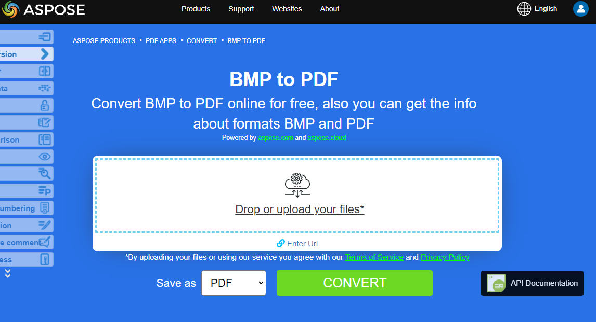
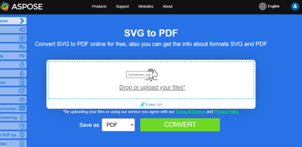

**Aspose.PDF for C++**  allows you to convert different formats of images to PDF files. Our library demonstrates code snippets for converting the most popular image formats, such as - BMP, DICOM, EMF, JPG, PNG, SVG and TIFF formats.

## Convert BMP to PDF

Convert BMP files to PDF document using **Aspose.PDF for C++** library.

<abbr title="Bitmap Image File">BMP</abbr> images are Files having extension. BMP represent Bitmap Image files that are used to store bitmap digital images. These images are independent of graphics adapter and are also called device independent bitmap (DIB) file format.
You can convert BMP to PDF files with Aspose.PDF for C++ API. Therefore, you can follow the following steps to convert BMP images:

1. Create a [String Class](https://reference.aspose.com/pdf/cpp/class/system.string) for path name and file name.
1. An instance of a new Document object is created.
1. Add a new [Page](https://reference.aspose.com/pdf/cpp/class/aspose.pdf.page) to this [Document](https://reference.aspose.com/pdf/cpp/class/aspose.pdf.document).
1. A new Aspose.Pdf BMP is created.
1. The Aspose.PDF BMP object is initialized using the input file.
1. Aspose.PDF BMP is added to the Page as a Paragraph.
1. Finally, save the output PDF file

So the following code snippet follows these steps and shows how to convert BMP to PDF using C++:

```cpp
void ConvertBMPtoPDF() 
{
    std::clog << "BMP to PDF convert: Start" << std::endl;

    // String for path name
    String _dataDir("C:\\Samples\\Conversion\\");

    // String for input file name
    String infilename("sample.bmp");

    // String for input file name
    String outfilename("ImageToPDF-BMP.pdf");

    // Open document
    auto document = MakeObject<Document>();

    // Add empty page in empty document
    auto page = document->get_Pages()->Add();
    auto image = MakeObject<Aspose::Pdf::Image>();
    image->set_File(_dataDir + infilename);

    // Add image on a page
    page->get_Paragraphs()->Add(image);

    // Save output document
    document->Save(_dataDir + outfilename);

    std::clog << "BMP to PDF convert: Finish" << std::endl;
}
```

{}
**Try to convert BMP to PDF online**

Aspose presents you online free application ["BMP to PDF"](https://products.aspose.app/pdf/conversion/bmp-to-pdf/), where you may try to investigate the functionality and quality it works.

[](https://products.aspose.app/pdf/conversion/bmp-to-pdf/)
{}

## Convert DICOM to PDF

<abbr title="Digital Imaging and Communications in Medicine">DICOM</abbr> format is the medical industry standard for the creation, storage, transmission, and visualization of digital medical images and documents of examined patients.

**Aspsoe.PDF for C++** allows you to convert DICOM and SVG images, but for technical reasons to add images you need to specify the type of file to be added to PDF:

1. Create a [String Class](https://reference.aspose.com/pdf/cpp/class/system.string) for path name and file name.
1. Instantiate [Document](https://reference.aspose.com/pdf/cpp/class/aspose.pdf.document) Object.
1. Add a [Page](https://reference.aspose.com/pdf/cpp/class/aspose.pdf.page) to pages collection of document.
1. Aspose.PDF TDicom is added to the Page as a Paragraph.
1. Load and [Save](https://reference.aspose.com/pdf/cpp/class/aspose.pdf.document#ac082fe8e67b25685fc51d33e804269fa) the input image file.

The following code snippet shows how to convert DICOM files to PDF  format with Aspose.PDF. You should load DICOM image, place the image on a page in a PDF file and save the output as PDF.

```cpp
void ConvertDICOMtoPDF()
{
    std::clog << "DICOM to PDF convert: Start" << std::endl;

    String _dataDir("C:\\Samples\\Conversion\\");
    String infilename("CR_Anno.dcm");
    String outfilename("PDFWithDicomImage_out.pdf");

    // Instantiate Document Object
    auto document = MakeObject<Document>();

    // Add a page to pages collection of document
    auto page = document->get_Pages()->Add();

    auto image = MakeObject<Aspose::Pdf::Image>();
    image->set_File(_dataDir + infilename);
    image->set_FileType(Aspose::Pdf::ImageFileType::Dicom);

    page->get_Paragraphs()->Add(image);

    // Save output as PDF format
    document->Save(_dataDir + outfilename);
    std::clog << "DICOM to PDF convert: Finish" << std::endl;
}
```

{}
**Try to convert DICOM to PDF online**

Aspose presents you online free application ["DICOM to PDF"](https://products.aspose.app/pdf/conversion/dicom-to-pdf/), where you may try to investigate the functionality and quality it works.

[](https://products.aspose.app/pdf/conversion/dicom-to-pdf/)
{}

## Convert EMF to PDF

<abbr title="Enhanced metafile format">EMF</abbr>EMF stores graphical images device-independently. Metafiles of EMF comprises of variable-length records in chronological order that can render the stored image after parsing on any output device. Furthermore, you can convert EMF to PDF image using the below steps:

1. Create a [String Class](https://reference.aspose.com/pdf/cpp/class/system.string) for path name and file name.
1. An instance of a new Document object is created.
1. Add a new Page to this [Document](https://reference.aspose.com/pdf/cpp/class/aspose.pdf.document).
1. A new Aspose.Pdf TIFF is created.
1. The Aspose.PDF TIFF object is initialized using the input file.
1. Aspose.PDF TIFF is added to the Page as a Paragraph.
1. Load and [Save](https://reference.aspose.com/pdf/cpp/class/aspose.pdf.document#ac082fe8e67b25685fc51d33e804269fa) the input image file.

Moreover, the following code snippet shows how to convert an EMF to PDF with C++ in your code snippet:

```cpp
void ConvertEMFtoPDF() 
{
    std::clog << "EMF to PDF convert: Start" << std::endl;

    String _dataDir("C:\\Samples\\Conversion\\");
    String infilename("sample.emf");
    String outfilename("ImageToPDF_emf.pdf");

    auto fileStream = System::IO::File::OpenRead(_dataDir + infilename);
    auto myimage = MakeObject<System::Drawing::Bitmap>(fileStream);

    auto document = MakeObject<Document>();
    auto page = document->get_Pages()->Add();

    auto currentImage = MakeObject<System::IO::MemoryStream>();
    myimage->Save(currentImage, System::Drawing::Imaging::ImageFormat::get_Tiff());

    auto imageht = MakeObject<Aspose::Pdf::Image>();
    imageht->set_ImageStream(currentImage);
    page->get_Paragraphs()->Add(imageht);

    document->Save(_dataDir + outfilename);

    std::clog << "EMF to PDF convert: Finish" << std::endl;
}
```

{}
**Try to convert EMF to PDF online**

Aspose presents you online free application ["EMF to PDF"](https://products.aspose.app/pdf/conversion/emf-to-pdf/), where you may try to investigate the functionality and quality it works.

[](https://products.aspose.app/pdf/conversion/emf-to-pdf/)
{}

## Convert JPG to PDF

No need to wonder how to convert JPG to PDF, because **Aspose.PDF for C++** library has best decision.

You can very easy convert a JPG images to PDF with Aspose.PDF for C++ by following steps:

1. Create a [String Class](https://reference.aspose.com/pdf/cpp/class/system.string) for path name and file name.
1. An instance of a new Document object is created.
1. Add a new Page to this [Document](https://reference.aspose.com/pdf/cpp/class/aspose.pdf.document).
1. A new Aspose::Pdf::Image is created.
1. The Aspose.PDF Image object is initialized using the input file.
1. Aspose.PDF Image is added to the Page as a Paragraph.
1. Load and save the input image file.

The code snippet below shows how to convert JPG Image to PDF using C++:

```cpp
void ConvertJPEGtoPDF() 
{
    std::clog << "JPEG to PDF convert: Start" << std::endl;
    // String for path name
    String _dataDir("C:\\Samples\\Conversion\\");

    // String for input file name
    String infilename("sample.jpg");

    // String for input file name
    String outfilename("ImageToPDF-JPEG.pdf");

    // Open document
    auto document = MakeObject<Document>();

    // Add empty page in empty document
    auto page = document->get_Pages()->Add();
    auto image = MakeObject<Aspose::Pdf::Image>();
    image->set_File(_dataDir + infilename);

    // Add image on a page
    page->get_Paragraphs()->Add(image);

    // Save output document
    document->Save(_dataDir + outfilename);
    std::clog << "JPEG to PDF convert: Finish" << std::endl;
}
```

Then you can see how to convert an image to PDF with the **same height and width of the page**. We will be getting the image dimensions and accordingly set the page dimensions of PDF document with the below steps:

1. Load input image file
1. Get the height and width of the image
1. Set height, width, and margins of a page
1. Save the output PDF file

Following code snippet shows how to convert an Image to PDF with same page height and width using C++:

```cpp
void ConvertJPGtoPDF_fitsize() 
{
    std::clog << "JPEG to PDF convert: Start" << std::endl;
    // String for path name
    String _dataDir("C:\\Samples\\Conversion\\");

    // String for input file name
    String infilename("sample.jpg");

    // String for input file name
    String outfilename("ImageToPDF-JPG.pdf");

    // Open document
    auto document = MakeObject<Document>();

    // Add empty page in empty document
    auto page = document->get_Pages()->Add();
    auto fileStream = System::IO::File::OpenRead(_dataDir + infilename);
    auto bitMap = MakeObject<System::Drawing::Bitmap>(fileStream);


    auto image = MakeObject<Aspose::Pdf::Image>();
    image->set_File(_dataDir + infilename);

    // Add image on a page
    page->get_Paragraphs()->Add(image);

    // Set page dimensions and margins
    page->get_PageInfo()->set_Height(bitMap->get_Height());
    page->get_PageInfo()->set_Width(bitMap->get_Width());
    page->get_PageInfo()->get_Margin()->set_Bottom(0);
    page->get_PageInfo()->get_Margin()->set_Top(0);
    page->get_PageInfo()->get_Margin()->set_Right(0);
    page->get_PageInfo()->get_Margin()->set_Left(0);
    page->get_Paragraphs()->Add(image);

    // Save output document
    document->Save(_dataDir + outfilename);
    std::clog << "JPEG to PDF convert: Finish" << std::endl;
}
```

{}
**Try to convert JPG to PDF online**

Aspose presents you online free application ["JPG to PDF"](https://products.aspose.app/pdf/conversion/jpg-to-pdf/), where you may try to investigate the functionality and quality it works.

[](https://products.aspose.app/pdf/conversion/jpg-to-pdf/)
{}

## Convert PNG to PDF

**Aspose.PDF for C++** support feature to convert PNG images to PDF format. Check the next code snippet for realizing you task.

<abbr title="Portable Network Graphics">PNG</abbr> refers to a type of raster image file format that use loseless compression, that makes it popular among its users.

You can convert PNG to PDF image using the below steps:

1. Create a [String Class](https://reference.aspose.com/pdf/cpp/class/system.string) for path name and file name.
1. An instance of a new Document object is created.
1. Add a new Page to this [Document](https://reference.aspose.com/pdf/cpp/class/aspose.pdf.document).
1. A new Aspose.Pdf PNG is created.
1. The Aspose.PDF PNG object is initialized using the input file.
1. Aspose.PDF PNG is added to the Page as a Paragraph.
1. Load and save the input image file.

Moreover, the code snippet below shows how to convert PNG to PDF in your C++ applications:

```cpp
void ConvertPNGtoPDF() 
{
    std::clog << "PNG to PDF convert: Start" << std::endl;
    // String for path name
    String _dataDir("C:\\Samples\\Conversion\\");

    // String for input file name
    String infilename("sample.png");

    // String for input file name
    String outfilename("ImageToPDF-PNG.pdf");

    // Open document
    auto document = MakeObject<Document>();

    // Add empty page in empty document
    auto page = document->get_Pages()->Add();
    auto image = MakeObject<Aspose::Pdf::Image>();
    image->set_File(_dataDir + infilename);

    // Add image on a page
    page->get_Paragraphs()->Add(image);

    // Save output document
    document->Save(_dataDir + outfilename);
    std::clog << "PNG to PDF convert: Finish" << std::endl;
}
```

{}
**Try to convert PNG to PDF online**

Aspose presents you online free application ["PNG to PDF"](https://products.aspose.app/pdf/conversion/png-to-pdf/), where you may try to investigate the functionality and quality it works.

[](https://products.aspose.app/pdf/conversion/png-to-pdf/)
{}

## Convert SVG to PDF

**Aspose.PDF for C++** explains how to convert SVG images to PDF format and how to get dimensions of the source <abbr title="Scalable Vector Graphics">SVG</abbr> file.

Scalable Vector Graphics (SVG) is a family of specifications of an XML-based file format for two-dimensional vector graphics, both static and dynamic (interactive or animated). The SVG specification is an open standard that has been under development by the World Wide Web Consortium (W3C) since 1999.

SVG images and their behaviors are defined in XML text files. This means that they can be searched, indexed, scripted, and if required, compressed. As XML files, SVG images can be created and edited with any text editor, but it is often more convenient to create them with drawing programs such as Inkscape.

1. Create a [String Class](https://reference.aspose.com/pdf/cpp/class/system.string) for path name and file name.
1. Create an instance of [`SvgLoadOptions`](https://reference.aspose.com/pdf/cpp/class/aspose.pdf.svg_load_options) class.
1. Create an instance of [Document](https://reference.aspose.com/pdf/cpp/class/aspose.pdf.document)class with mention source filename and options.
1. Save the document with the desired file name.

The following code snippet shows the process of converting SVG file into PDF format with Aspose.PDF for C++.

```cpp
void ConvertSVGtoPDF() 
{
    std::clog << "SVG to PDF convert: Start" << std::endl;

    String _dataDir("C:\\Samples\\Conversion\\");
    String infilename("sample.svg");
    String outfilename("ImageToPDF-SVG.pdf");

    auto options = MakeObject<SvgLoadOptions>();
    try {
    auto document = MakeObject<Document>(_dataDir + infilename, options);
    document->Save(_dataDir + outfilename);
    }
    catch (System::Exception ex) {
    std::cerr << ex->get_Message() << std::endl;
    }
    std::clog << "SVG to PDF convert: Finish" << std::endl;
}
```

Сonsider an example with advanced features:

```cpp
void ConvertSVGtoPDF_Advanced()
{
    std::clog << "SVG to PDF convert: Start" << std::endl;

    String _dataDir("C:\\Samples\\Conversion\\");
    String infilename("Sweden-Royal-flag-grand-coa.svg");
    String outfilename("ImageToPDF-SVG.pdf");

    auto options = MakeObject<SvgLoadOptions>();
    options->set_AdjustPageSize(true);
    options->ConversionEngine = SvgLoadOptions::ConversionEngines::NewEngine;

    try {
    auto document = MakeObject<Document>(_dataDir + infilename, options);
    document->Save(_dataDir + outfilename);
    }
    catch (System::Exception ex) {
    std::cerr << ex->get_Message() << std::endl;
    }

    std::clog << "SVG to PDF convert: Finish" << std::endl;
}
```

{}
**Try to convert SVG format to PDF online**

Aspose.PDF for C++ presents you online free application ["SVG to PDF"](https://products.aspose.app/pdf/conversion/svg-to-pdf), where you may try to investigate the functionality and quality it works.

[](https://products.aspose.app/pdf/conversion/svg-to-pdf)
{}

## Convert TIFF to PDF

**Aspose.PDF** file format supported, be it a single frame or multi-frame <abbr title="Tag Image File Format">TIFF</abbr> image. It means that you can convert the TIFF image to PDF in your C++ applications.

TIFF or TIF, Tagged Image File Format, represents raster images that are meant for usage on a variety of devices that comply with this file format standard. TIFF image can contain several frames with different images. Aspose.PDF file format is also supported, be it a single frame or multi-frame TIFF image. So you can convert the TIFF image to PDF in your C++ applications. Therefore, we will consider an example of converting multi-page TIFF image to multi-page PDF document with below steps:

1. Create a [String Class](https://reference.aspose.com/pdf/cpp/class/system.string) for path name and file name.
1. An instance of a new Document object is created.
1. Add a new Page to this [Document](https://reference.aspose.com/pdf/cpp/class/aspose.pdf.document).
1. A new Aspose.Pdf TIFF is created.
1. The Aspose.PDF TIFF object is initialized using the input file.
1. Aspose.PDF TIFF is added to the Page as a Paragraph.
1. Load and save the input image file.

Moreover, the following code snippet shows how to convert multi-page or multi-frame TIFF image to PDF with C++:

```cpp
void ConvertTIFFtoPDF() 
{
    std::clog << "TIFF to PDF convert: Start" << std::endl;

    String _dataDir("C:\\Samples\\Conversion\\");
    String infilename("sample.tiff");
    String outfilename("ImageToPDF-TIFF.pdf");

    auto fileStream = System::IO::File::OpenRead(_dataDir + infilename);
    auto myimage = MakeObject<System::Drawing::Bitmap>(fileStream);

    auto document = MakeObject<Document>();
    auto page = document->get_Pages()->Add();

    auto currentImage = MakeObject<System::IO::MemoryStream>();
    myimage->Save(currentImage, System::Drawing::Imaging::ImageFormat::get_Tiff());

    auto imageht = MakeObject<Aspose::Pdf::Image>();
    imageht->set_ImageStream(currentImage);
    page->get_Paragraphs()->Add(imageht);

    document->Save(_dataDir + outfilename);

    std::clog << "TIFF to PDF convert: Finish" << std::endl;
}
```
