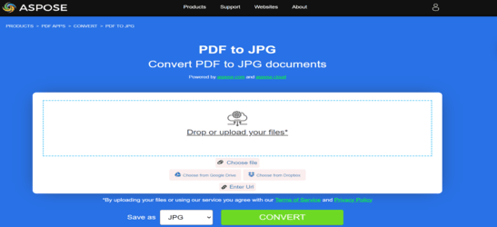

## Go Convert PDF to Image

This article explains how to render PDF pages to several raster and vector image formats with Aspose.PDF for Go via C++.

Previously scanned documents are often stored as PDF files, but many workflows require those pages as standalone images for previews, archives, medical systems, reporting pipelines, or graphic editing. **Aspose.PDF for Go via C++** lets you open a PDF document, render a specific page, and save that page in the output format required by your application.

The most common scenario is exporting one page or several pages from a PDF as a set of images. Depending on the target format, you can choose a method such as `PageToJpg`, `PageToPng`, `PageToTiff`, `PageToBmp`, `PageToSvg`, or `PageToDICOM` to generate the output file directly from the opened PDF document.

**Aspose.PDF for Go via C++** supports several PDF-to-image conversion workflows. For the broader list of supported formats, see [Aspose.PDF Supported File Formats](https://docs.aspose.com/pdf/go-cpp/supported-file-formats/).

## Convert PDF to JPEG

The following example shows how to convert the first page of a PDF document to a JPEG image. Use this method when you need a widely supported raster format for web previews, image processing, or lightweight sharing.

1. Use the [Open](https://reference.aspose.com/pdf/go-cpp/core/open/) method to load the source PDF file and return a `Document` instance for further processing.
1. Call the [PageToJpg](https://reference.aspose.com/pdf/go-cpp/convert/pagetojpg/) method to render page `1` at the requested DPI value and save the result as a JPEG image file.
1. Use the [Close](https://reference.aspose.com/pdf/go-cpp/core/close/) method after conversion to release the resources associated with the opened PDF document.

```go

    package main

    import "github.com/aspose-pdf/aspose-pdf-go-cpp"
    import "log"

    func main() {
      // Open(filename string) opens a PDF-document with filename
      pdf, err := asposepdf.Open("sample.pdf")
      if err != nil {
        log.Fatal(err)
      }
      // Close() releases allocated resources for PDF-document
      defer pdf.Close()
      // PageToJpg(num int32, resolution_dpi int32, filename string) saves the specified page as Jpg-image file
      err = pdf.PageToJpg(1, 100, "sample_page1.jpg")
      if err != nil {
        log.Fatal(err)
      }
    }
```

{}
**Try to convert PDF to JPEG online**

Aspose.PDF for Go presents you online free application ["PDF to JPEG"](https://products.aspose.app/pdf/conversion/pdf-to-jpg), where you may try to investigate the functionality and quality it works.

[](https://products.aspose.app/pdf/conversion/pdf-to-jpg)
{}

## Convert PDF to TIFF

The following example shows how to convert the first page of a PDF document to a TIFF image. Use this method for high-fidelity page rendering, archival image workflows, or downstream systems that prefer TIFF output.

1. Use the [Open](https://reference.aspose.com/pdf/go-cpp/core/open/) method to load the source PDF document from disk.
1. Call the [PageToTiff](https://reference.aspose.com/pdf/go-cpp/convert/pagetotiff/) method to render the selected page at the specified DPI and save it as a TIFF image.
1. Use the [Close](https://reference.aspose.com/pdf/go-cpp/core/close/) method to free the native PDF resources when processing is finished.

```go

    package main

    import "github.com/aspose-pdf/aspose-pdf-go-cpp"
    import "log"

    func main() {
      // Open(filename string) opens a PDF-document with filename
      pdf, err := asposepdf.Open("sample.pdf")
      if err != nil {
        log.Fatal(err)
      }
      // Close() releases allocated resources for PDF-document
      defer pdf.Close()
      // PageToTiff(num int32, resolution_dpi int32, filename string) saves the specified page as Tiff-image file
      err = pdf.PageToTiff(1, 100, "sample_page1.tiff")
      if err != nil {
        log.Fatal(err)
      }
    }
```

{}
**Try to convert PDF to TIFF online**

Aspose.PDF for Go presents you online free application ["PDF to TIFF"](https://products.aspose.app/pdf/conversion/pdf-to-tiff), where you may try to investigate the functionality and quality it works.

[](https://products.aspose.app/pdf/conversion/pdf-to-tiff)
{}

## Convert PDF to PNG

The following example shows how to convert the first page of a PDF document to a PNG image. Use this method when you need lossless output for screenshots, UI assets, or document previews with crisp text and graphics.

1. Use the [Open](https://reference.aspose.com/pdf/go-cpp/core/open/) method to open the input PDF file.
1. Call the [PageToPng](https://reference.aspose.com/pdf/go-cpp/convert/pagetopng/) method to render the chosen page to a PNG file at the requested resolution.
1. Use the [Close](https://reference.aspose.com/pdf/go-cpp/core/close/) method after conversion to release the `Document` resources.

```go

    package main

    import "github.com/aspose-pdf/aspose-pdf-go-cpp"
    import "log"

    func main() {
      // Open(filename string) opens a PDF-document with filename
      pdf, err := asposepdf.Open("sample.pdf")
      if err != nil {
        log.Fatal(err)
      }
      // Close() releases allocated resources for PDF-document
      defer pdf.Close()
      // PageToPng(num int32, resolution_dpi int32, filename string) saves the specified page as Png-image file
      err = pdf.PageToPng(1, 100, "sample_page1.png")
      if err != nil {
        log.Fatal(err)
      }
    }
```

{}
**Try to convert PDF to PNG online**

As an example of how our free applications work please check the next feature.

Aspose.PDF for Go presents you online free application ["PDF to PNG"](https://products.aspose.app/pdf/conversion/pdf-to-png), where you may try to investigate the functionality and quality it works.

[](https://products.aspose.app/pdf/conversion/pdf-to-png)
{}

**Scalable Vector Graphics (SVG)** is a family of specifications of an XML-based file format for two-dimensional vector graphics, both static and dynamic (interactive or animated). The SVG specification is an open standard that has been under development by the World Wide Web Consortium (W3C) since 1999.

## Convert PDF to SVG

The following example shows how to convert the first page of a PDF document to an SVG image. Use this method when you need a scalable vector result that preserves geometry and remains sharp at different zoom levels.

1. Use the [Open](https://reference.aspose.com/pdf/go-cpp/core/open/) method to load the input PDF document.
1. Call the [PageToSvg](https://reference.aspose.com/pdf/go-cpp/convert/pagetosvg/) method to export the specified page as an SVG file.
1. Use the [Close](https://reference.aspose.com/pdf/go-cpp/core/close/) method when the conversion is complete to release the document resources.

```go

    package main

    import "github.com/aspose-pdf/aspose-pdf-go-cpp"
    import "log"

    func main() {
      // Open(filename string) opens a PDF-document with filename
      pdf, err := asposepdf.Open("sample.pdf")
      if err != nil {
        log.Fatal(err)
      }
      // Close() releases allocated resources for PDF-document
      defer pdf.Close()
      // PageToSvg(num int32, filename string) saves the specified page as Svg-image file
      err = pdf.PageToSvg(1, "sample_page1.svg")
      if err != nil {
        log.Fatal(err)
      }
    }
```

{}
**Try to convert PDF to SVG online**

Aspose.PDF for Go presents you online free application ["PDF to SVG"](https://products.aspose.app/pdf/conversion/pdf-to-svg), where you may try to investigate the functionality and quality it works.

[](https://products.aspose.app/pdf/conversion/pdf-to-svg)
{}

## Convert PDF to DICOM

The following example shows how to convert the first page of a PDF document to a DICOM image. Use this method for workflows that exchange image data with medical or imaging systems that require DICOM-compatible output.

1. Use the [Open](https://reference.aspose.com/pdf/go-cpp/core/open/) method to load the source PDF document into a `Document` object.
1. Call the [PageToDICOM](https://reference.aspose.com/pdf/go-cpp/convert/pagetodicom/) method to render the selected page at the requested DPI and save it as a DICOM image file.
1. Use the [Close](https://reference.aspose.com/pdf/go-cpp/core/close/) method after conversion to release the allocated PDF resources.

```go

    package main

    import "github.com/aspose-pdf/aspose-pdf-go-cpp"
    import "log"

    func main() {
      // Open(filename string) opens a PDF-document with filename
      pdf, err := asposepdf.Open("sample.pdf")
      if err != nil {
        log.Fatal(err)
      }
      // Close() releases allocated resources for PDF-document
      defer pdf.Close()
      // PageToDICOM(num int32, resolution_dpi int32, filename string) saves the specified page as DICOM-image file
      err = pdf.PageToDICOM(1, 100, "sample_page1.dcm")
      if err != nil {
        log.Fatal(err)
      }
    }
```

## Convert PDF to BMP

The following example shows how to convert the first page of a PDF document to a BMP image. Use this method when you need an uncompressed raster output for basic desktop processing or compatibility with legacy image workflows.

1. Use the [Open](https://reference.aspose.com/pdf/go-cpp/core/open/) method to load the source PDF file.
1. Call the [PageToBmp](https://reference.aspose.com/pdf/go-cpp/convert/pagetobmp/) method to render the required page at the specified DPI and save it as a BMP image.
1. Use the [Close](https://reference.aspose.com/pdf/go-cpp/core/close/) method to release the PDF resources after the image file has been written.

```go

    package main

    import "github.com/aspose-pdf/aspose-pdf-go-cpp"
    import "log"

    func main() {
      // Open(filename string) opens a PDF-document with filename
      pdf, err := asposepdf.Open("sample.pdf")
      if err != nil {
        log.Fatal(err)
      }
      // Close() releases allocated resources for PDF-document
      defer pdf.Close()
      // PageToBmp(num int32, resolution_dpi int32, filename string) saves the specified page as Bmp-image file
      err = pdf.PageToBmp(1, 100, "sample_page1.bmp")
      if err != nil {
        log.Fatal(err)
      }
    }
```
