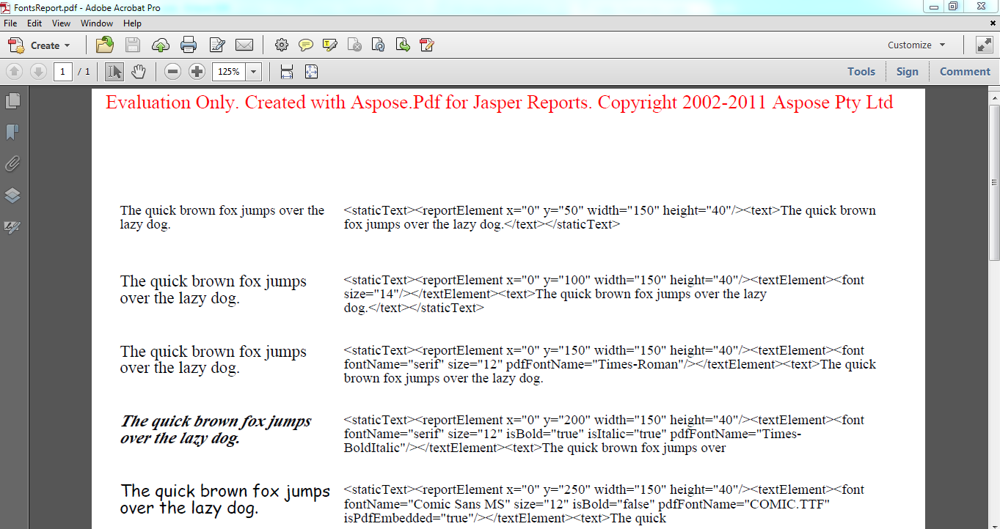

{}

Make sure to take advantage of the free Aspose.PDF for JasperReports evaluation as it has no time limit, and free technical support is provided for evaluation users too.

{}

{}

It is the same download for both the evaluation and the paid version of Aspose.PDF for JasperReports. Simply download Aspose.PDF for JasperReports from the download page, install it and it will work in the evaluation mode by default.

Evaluation mode injects an Evaluation Warning into exported documents. When you have purchased a license, simply apply the license and Aspose.PDF for JasperReports will then work in the licensed mode.

**Aspose.PDF for JasperReports injects an Evaluation Warning when working in the evaluation mode.**

{}
