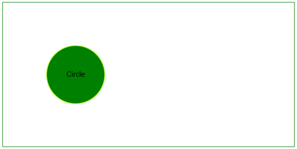

## Add Circle object

Like bar graphs, circle graphs can be used to display data in a number of separate categories. Unlike bar graphs, however, circle graphs can be used only when you have data for all the categories that make up the whole. So let's take a look at adding a [Circle](https://reference.aspose.com/pdf/java/com.aspose.pdf.drawing/Circle) object with Aspose.PDF for Java.

Follow the steps below:

1. Create [Document](https://reference.aspose.com/pdf/java/com.aspose.pdf/Document) instance

1. Create [Drawing object](https://reference.aspose.com/pdf/java/com.aspose.pdf.drawing/package-frame) with certain dimensions

1. Set [Border](https://reference.aspose.com/pdf/java/com.aspose.pdf.drawing/Graph#setBorder-com.aspose.pdf.BorderInfo-) for Drawing object

1. Add [Graph](https://reference.aspose.com/pdf/java/com.aspose.pdf.drawing/Graph) object to paragraphs collection of page

1. Save our PDF file

```java
public static void ExampleCircle() {
        // Create Document instance
        Document pdfDocument = new Document();
        // Add page to pages collection of PDF file
        Page page = pdfDocument.getPages().add();

        // Create Drawing object with certain dimensions
        Graph graph = new Graph(400, 200);
        // Set border for Drawing object
        BorderInfo borderInfo = new BorderInfo(BorderSide.All, Color.getGreen());
        graph.setBorder(borderInfo);

        Circle circle = new Circle(100,100,40);

        circle.getGraphInfo().setColor(Color.getGreenYellow());
        graph.getShapes().add(circle);

        // Add Graph object to paragraphs collection of page
        page.getParagraphs().add(graph);

        // Save PDF file
        pdfDocument.save(_dataDir + "DrawingCircle1_out.pdf");
    }
```

Our drawn circle will look like this:


## Create Filled Circle Object

This example shows how to add a Circle object that is filled with color.

```java

    public static void ExampleFilledCircle() {
        // Create Document instance
        Document pdfDocument = new Document();
        // Add page to pages collection of PDF file
        Page page = pdfDocument.getPages().add();

        // Create Drawing object with certain dimensions
        Graph graph = new Graph(400, 200);
        // Set border for Drawing object
        BorderInfo borderInfo = new BorderInfo(BorderSide.All, Color.getGreen());
        graph.setBorder(borderInfo);

        Circle circle = new Circle(100,100,40);
        circle.getGraphInfo().setColor(Color.getGreenYellow());       
        circle.getGraphInfo().setFillColor(Color.getGreenYellow());

        graph.getShapes().add(circle);

        // Add Graph object to paragraphs collection of page
        page.getParagraphs().add(graph);

        // Save PDF file
        pdfDocument.save(_dataDir + "DrawingCircle2_out.pdf");
    }
```

Let's see the result of adding a filled Circle:


