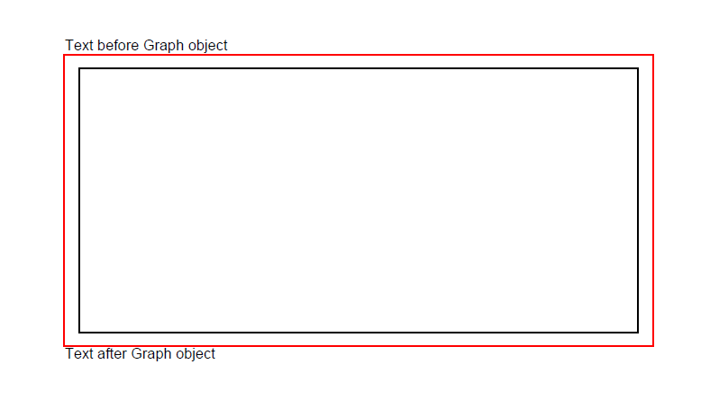

## Add Rectangle object

Aspose.PDF for Java supports the feature to add graph objects (for example graph, line, rectangle etc.) to PDF documents. You also get the leverage to add [Rectangle](https://reference.aspose.com/pdf/java/com.aspose.pdf.drawing/Rectangle) object where you also offers the feature to fill rectangle object with a certain color, control Z-Order, add gradiant color fill and etc.

First, let's look at the possibility of creating a Rectangle object.

Follow the steps below:

1. Create a new PDF [Document](https://reference.aspose.com/pdf/java/com.aspose.pdf/Document)

1. Add [Page](https://reference.aspose.com/pdf/java/com.aspose.pdf/Page) to pages collection of PDF file

1. Add [Text fragment](https://reference.aspose.com/pdf/java/com.aspose.pdf/TextFragment) to paragraphs collection of page instance

1. Create [Graph](https://reference.aspose.com/pdf/java/com.aspose.pdf.drawing/Graph) instance

1. Set border for [Drawing object](https://reference.aspose.com/pdf/java/com.aspose.pdf.drawing/package-frame)

1. Create Rectangle instance

1. Add [Rectangle](https://reference.aspose.com/pdf/java/com.aspose.pdf.drawing/Rectangle) object to shapes collection of Graph object

1. Add graph object to paragraphs collection of page instance

1. Add [Text fragment](https://reference.aspose.com/pdf/java/com.aspose.pdf/TextFragment) to paragraphs collection of page instance

1. And save your PDF file

```java
package com.aspose.pdf.examples;

import com.aspose.pdf.BorderInfo;
import com.aspose.pdf.BorderSide;
import com.aspose.pdf.Color;
import com.aspose.pdf.Document;
import com.aspose.pdf.Page;
import com.aspose.pdf.Point;
import com.aspose.pdf.TextFragment;
import com.aspose.pdf.drawing.*;

public class WorkingWithGraphs {

    private static String _dataDir = "/home/aspose/pdf-examples/Samples/";

    public static void ExampleRectangle() {

        // Create a new PDF document
        Document pdfDocument = new Document();

        // Add page to pages collection of PDF file
        Page page = pdfDocument.getPages().add();

        // Add text fragment to paragraphs collection of page instance
        page.getParagraphs().add(new TextFragment("Text before Graph object"));

        // Create Graph instance
        Graph graph = new Graph(400, 200);

        // Set border for Drawing object
        BorderInfo borderInfo = new BorderInfo(BorderSide.All, Color.getRed());
        graph.setBorder(borderInfo);

        // Create Rectangle instance
        Rectangle rect = new Rectangle(10, 10, 380, 180);

        // Add rectangle object to shapes collection of Graph object
        graph.getShapes().add(rect);

        // Add graph object to paragraphs collection of page instance
        page.getParagraphs().add(graph);

        // Add text fragment to paragraphs collection of page instance
        page.getParagraphs().add(new TextFragment("Text after Graph object"));

        // Save PDF file
        pdfDocument.save(_dataDir + "CreateRectangle_out.pdf");
    }
```



## Create Filled Rectangle Object

Aspose.PDF for Java also offers the feature to fill rectangle object with a certain color.

The following code snippet shows how to add a [Rectangle](https://reference.aspose.com/pdf/java/com.aspose.pdf/Rectangle) object that is filled with color.

```java
   public static void ExampleRectangleFilledSolidColor() {

        Document pdfDocument = new Document();

        // Add page to pages collection of PDF file
        Page page = pdfDocument.getPages().add();
        // Create Graph instance
        Graph graph = new Graph(100, 400);

        // Add graph object to paragraphs collection of page instance
        page.getParagraphs().add(graph);

        // Create Rectangle instance
        Rectangle rect = new Rectangle(100, 100, 200, 120);

        // Specify fill color for Graph object
        rect.getGraphInfo().setFillColor(Color.getRed());

        // Add rectangle object to shapes collection of Graph object
        graph.getShapes().add(rect);

        // Save PDF file
        pdfDocument.save(_dataDir + "CreateFilledRectangle_out.pdf");
    }
```

Look at the result of rectangle filled solid color:


## Add Drawing with Gradient Fill

Aspose.PDF for Java supports the feature to add graph objects to PDF documents and sometimes it is required to fill graph objects with Gradient Color. To Fill graph objects with Gradient Color, We need to set setPatterColorSpace with gradientAxialShading object as following.

The following code snippet shows how to add a [Rectangle](https://reference.aspose.com/pdf/java/com.aspose.pdf/Rectangle) object that is filled with Gradient Color.

```java
   public static void ExampleRectangleFilledGradient() {

        Document pdfDocument = new Document();
        Page page = pdfDocument.getPages().add();

        Graph graph = new Graph(300, 300);
        page.getParagraphs().add(graph);
        Rectangle rect = new Rectangle(0, 0, 300, 300);
        graph.getShapes().add(rect);

        // Specify Gradient fill color for Graph object and fill
        Color gradientFill = new com.aspose.pdf.Color();
        rect.getGraphInfo().setFillColor(gradientFill);

        GradientAxialShading gradientAxialShading = new GradientAxialShading(Color.getRed(), Color.getBlue());

        gradientAxialShading.setStart(new Point(0, 0));
        gradientAxialShading.setEnd(new Point(300, 300));
        gradientFill.setPatternColorSpace(gradientAxialShading);

        // Save PDF file
        pdfDocument.save(_dataDir + "AddDrawingWithGradientFill_out.pdf");
    }
```


## Create Rectangle with Alpha color channel

Aspose.PDF for Java supports to fill rectangle object with a certain color. A rectangle object can also have Alpha color channel to give transparent appearance. The following code snippet shows how to add a [Rectangle](https://reference.aspose.com/pdf/java/com.aspose.pdf/Rectangle) object with Alpha color channel.

Pixels of the image can store information about their opacity along with color value. This allows creating images with transparent or semi-transparent areas.

Instead of making a color transparent, each pixel stores information on how opaque it is. This opacity data is called alpha channel and is typically stored after the color channels of the pixel.

In our code snippet we used [fromArgb](https://reference.aspose.com/pdf/java/com.aspose.pdf/Color#fromArgb-int-int-int-) method of [com.aspose.pdf.Color](https://reference.aspose.com/pdf/java/com.aspose.pdf/Color). We need to specify values where the first 3 are color components, specified in the range 0 to 255, and the last is the opacity level (alpha channel), specified by fractional numbers from 0 to 1.

```java
    public static void ExampleRectangleAlphaChannelColor() {
        Document pdfDocument = new Document();
        Page page = pdfDocument.getPages().add();

        // Create Graph instance
        Graph graph = new Graph(100, 400);

        // Create rectangle object with specific dimensions
        Rectangle rect1 = new Rectangle(100, 100, 200, 100);
        Color color1 = Color.fromArgb(128, 224, 0, 224);
        rect1.getGraphInfo().setFillColor(color1);
        // Add rectangle object to shapes collection of Graph instance
        graph.getShapes().add(rect1);

        // Create second rectangle object
        Rectangle rect2 = new Rectangle(200, 150, 200, 100);
        Color color2 = Color.fromArgb(64, 0, 224, 224);
        rect2.getGraphInfo().setFillColor(color2);
        graph.getShapes().add(rect2);

        // Add graph instance to paragraph collection of page object
        page.getParagraphs().add(graph);

        // Save PDF file
        pdfDocument.save(_dataDir + "CreateRectangleWithAlphaColor_out.pdf");
    }
```


## Control Z-Order of Rectangle

Aspose.PDF for Java supports the feature to add graph objects (for example graph, line, rectangle etc.) to PDF documents. When adding more than one instance of same object inside PDF file, we can control their rendering by specifying the Z-Order. Z-Order is also used when we need to render objects on top of each other.

The following code snippet shows the steps to render [Rectangle](https://reference.aspose.com/pdf/java/com.aspose.pdf/Rectangle) objects on top of each other.

```java
   public static void Controlling_Z_Order() {

        Document pdfDocument = new Document();
        Page page = pdfDocument.getPages().add();

        // Create a new rectangle with Color as Red, Z-Order as 0 and certain dimensions
        AddRectangle(page, 50, 40, 60, 40, Color.getRed(), 2);
        // Create a new rectangle with Color as Blue, Z-Order as 0 and certain
        // dimensions
        AddRectangle(page, 20, 20, 30, 30, Color.getBlue(), 1);
        // Create a new rectangle with Color as Green, Z-Order as 0 and certain
        // dimensions
        AddRectangle(page, 40, 40, 60, 30, Color.getGreen(), 0);

        // Save resultant PDF file
        pdfDocument.save(_dataDir + "ControlRectangleZOrder_out.pdf");

    }
```


