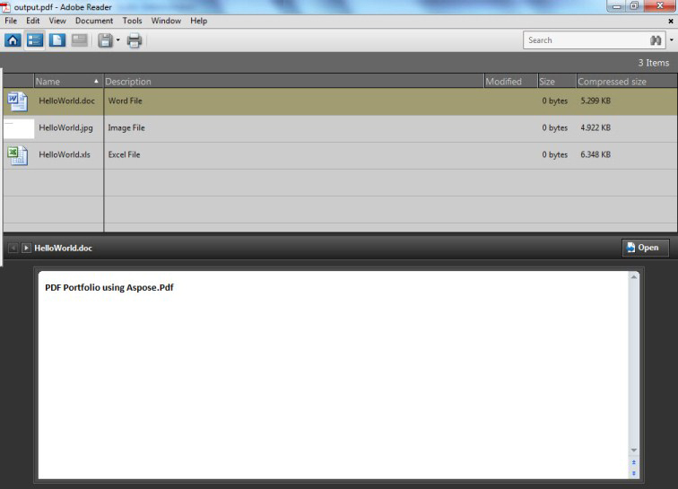

First, let's figure out **What is a PDF Portfolio file format?**

For example, take a PDF Portfolio file that contains a Word, Excel, PowerPoint presentations etc,  as attachments. Here each of the attachment file maintains its original document format, but is embedded or assembled into one PDF Portfolio file. You may of course, open, read or edit each of the individual file of the PDF Portfolio as if it is on a drive or folder. In addition, just like a normal PDF document, you can also apply watermark, set passwords and security permissions such as ability to view, print or make changes to the attachments of the PDF Portfolio.
We may place or assemble native files, in their original type or formats as attachments, into a PDF Portfolio file.

## How to Create a PDF Portfolio

Aspose.PDF allows creating PDF Portfolio documents using the [Document](https://reference.aspose.com/pdf/java/com.aspose.pdf/Document) class. Add a file into a Document.Collection object after getting it with the [FileSpecification](https://reference.aspose.com/pdf/java/com.aspose.pdf/FileSpecification) class. When the files have been added, use the Document class' Save method to save the portfolio document.

The following example uses a Microsoft Excel File, a Word document and an image file to create a PDF Portfolio.

The code below results in the following portfolio.

### A PDF Portfolio created with Aspose.PDF



```java
    public static void CreatePortfolio() throws IOException {
        // Instantiate Document Object
        Document pdfDocument = new Document();

        // Instantiate document Collection object
        pdfDocument.setCollection(new Collection());

        // Get Files to add to Portfolio
        FileSpecification excel = new FileSpecification(_dataDir + "HelloWorld.xlsx");
        FileSpecification word = new FileSpecification(_dataDir + "HelloWorld.docx");
        FileSpecification image = new FileSpecification(_dataDir + "aspose-logo.jpg");

        // Provide description of the files
        excel.setDescription ("Excel File");
        word.setDescription ("Word File");
        image.setDescription ("Image File");

        // Add files to document collection
        pdfDocument.getCollection().add(excel);
        pdfDocument.getCollection().add(word);
        pdfDocument.getCollection().add(image);

        // Save Portfolio document
        pdfDocument.save(_dataDir + "CreatePDFPortfolio_out.pdf");
    }
```

## Extract files from PDF Portfolio

PDF Portfolios allow you to bring together content from a variety of sources (for example, PDF, Word, Excel, JPEG files) into one unified container. The original files retain their individual identities but are assembled into a PDF Portfolio file. Users can open, read, edit, and format each component file independently of the other component files.

Aspose.PDF allows the creation of PDF Portfolio documents using [Document](https://reference.aspose.com/pdf/java/com.aspose.pdf/Document) class. It also offers the capability to extract files from PDF portfolio.

The following code snippet shows you the steps to extract files from PDF portfolio.


```java
    public static void ExtractPortfolio() throws IOException {
        // Open a document
        Document pdfDocument = new Document(_dataDir + "PDFPortfolio.pdf");
        // Get collection of embedded files
        EmbeddedFileCollection embeddedFiles = pdfDocument.getEmbeddedFiles();

        // Itterate through individual file of Portfolio
        for (FileSpecification fileSpecification : embeddedFiles) {
            InputStream initialStream = fileSpecification.getContents();
            byte[] buffer = new byte[fileSpecification.getContents().available()];
            initialStream.read(buffer);

            File targetFile = new File(_dataDir + fileSpecification.getName());
            OutputStream outStream = new FileOutputStream(targetFile);
            outStream.write(buffer);
            outStream.close();
        }
    }
```

## Remove Files from PDF Portfolio

In order to delete/remove files from PDF portfolio, try using the following code lines.

```java
public static void RemoveFilesFromPDFPortfolio() {
    // Load source PDF Portfolio
    Document pdfDocument = new Document(_dataDir + "PDFPortfolio.pdf");
    pdfDocument.getCollection().delete();
    pdfDocument.save(_dataDir + "No_PortFolio_out.pdf");
}
```
