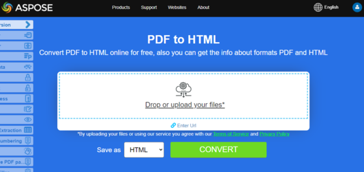

Aspose.PDF for Java provides many features for converting various file formats to PDF documents and converting PDF files into various output formats. This article discusses how to convert a PDF file into HTML format and save the images from the PDF file in a particular folder.

{}
**Try to convert PDF to HTML online**

Aspose.PDF for Java presents you online free application ["PDF to HTML"](https://products.aspose.app/pdf/conversion/pdf-to-html), where you may try to investigate the functionality and quality it works.

[](https://products.aspose.app/pdf/conversion/pdf-to-html)
{}

When converting large PDF file with several pages to HTML format, the output appears as a single HTML page. It can end up being very long. To control page size, it is possible to split the output into several pages during PDF to HTML conversion.

## Convert PDF pages to HTML

Aspose.PDF for Java provides many features for converting various file formats to PDF documents and converting PDF files into various output formats. This article discusses how to convert a PDF file into HTML format and save the images from the PDF file in a particular folder.

The following code snippet shows you all the possible options that you can use when converting PDF to HTML.

```java
// Open the source PDF document
Document pdfDocument = new Document(_dataDir + "PDFToHTML.pdf");

// Save the file into MS document format
pdfDocument.save(_dataDir + "output_out.html", SaveFormat.Html);
```

## Convert PDF to HTML - Splitting Output to Multi-page HTML

Aspose.PDF for Java supports the feature to convert PDF documents to various output formats including HTML. However when converting large PDF files (comprised of multiple pages), you may have a requirement to save individual PDF page to separate HTML file.

When converting large PDF file with several pages to HTML format, the output appears as a single HTML page. It can end up being very long. To control page size, it is possible to split the output into several pages during PDF to HTML conversion. Please try using the following code snippet.

```java
// Open the source PDF document
Document document = new Document(_dataDir + "PDFToHTML.pdf");

// Instantiate HTML SaveOptions object
HtmlSaveOptions htmlOptions = new HtmlSaveOptions();

// Specify to split the output into multiple pages
htmlOptions.setSplitIntoPages(true);

// Save the document
document.save(_dataDir + "MultiPageHTML_out.html", htmlOptions);    
```

## Convert PDF to HTML - Avoid Saving Images in SVG Format

The default output format for saving images when converting from PDF to HTML is SVG. During conversion, some images from PDF are transformed into SVG vector images. This could be slow. Instead, the images could be transformed into PNG. To allow this, Aspose.PDF has the option to use SVG for vectors or to create PNGs.

In order to completely remove the rendering of images as SVG format when converting PDF files to HTML format, please try using the following code snippet.

```java
 // Load the PDF file
Document document = new Document(DATA_DIR + "PDFToHTML.pdf")

// Instantiate HTML save saveOptions object
HtmlSaveOptions saveOptions = new HtmlSaveOptions();

// Specify the folder where SVG images are saved during PDF to HTML conversion
saveOptions.setSpecialFolderForSvgImages(DATA_DIR.toString());

// Save the output file
document.save(DATA_DIR + "SaveSVGFiles_out.html", saveOptions);
```

## Compressing SVG Images During Conversion

To compress SVG images during PDF to HTML conversion, please try using the following code:

```java
// Load the PDF file
Document document = new Document(DATA_DIR + "PDFToHTML.pdf");

// Create HtmlSaveOption with tested feature
HtmlSaveOptions saveOptions = new HtmlSaveOptions();

// Compress the SVG images if there are any
saveOptions.setCompressSvgGraphicsIfAny(true);
document.save(DATA_DIR + "SaveSVGFiles_out.html", saveOptions);
document.close();
```

## Convert PDF to HTML - Specify Images Folder

By default, when converting a PDF file to HTML, the images in the PDF are saved in a separate folder created in same directory that the output HTML is created. But sometimes, it is necessary to specify a different folder for saving images to when generating HTML files. To accomplish this, we introduced the [SaveOptions](https://reference.aspose.com/pdf/java/com.aspose.pdf/SaveOptions). 
[SpecialFolderForAllImages method](https://reference.aspose.com/pdf/java/com.aspose.pdf/htmlsaveoptions/#setSpecialFolderForAllImages-java.lang.String-) is used to specify the target folder for storing images.

```java
// Load the PDF file
Document document = new Document(DATA_DIR + "PDFToHTML.pdf");
HtmlSaveOptions saveOptions = new HtmlSaveOptions();

// Specify the separate folder to save images
saveOptions.setSpecialFolderForAllImages(DATA_DIR.toString());
document.save(DATA_DIR + "SaveSVGFiles_out.html", saveOptions);
document.close();
```

## Create Subsequent Files with Body Contents Only

With the following simple code snippet, you can split the output HTML into pages. In the output pages, all HTML objects must go exactly where they go now (fonts processing and output, CSS creation and output, images creation and output), except that the output HTML will contain contents currently placed inside thetags (now “body” tags will be omitted).

```java
Document document = new Document(DATA_DIR + "PDFToHTML.pdf");

HtmlSaveOptions saveOptions = new HtmlSaveOptions();

saveOptions.setHtmlMarkupGenerationMode(HtmlSaveOptions.HtmlMarkupGenerationModes.WriteOnlyBodyContent);
saveOptions.setSplitIntoPages(true);

document.save(DATA_DIR + "CreateSubsequentFiles_out.html", saveOptions);
document.close();
```

## Transparent Text rendering

In case the source/input PDF file contains transparent texts shadowed by foreground images, then there might be text rendering issues. So in order to cater such scenarios, `setSaveShadowedTextsAsTransparentTexts` and `setSaveTransparentTexts` methods can be used.

```java
Document document = new Document(DATA_DIR + "PDFToHTML.pdf");

// Instantiate HTML SaveOptions object
HtmlSaveOptions htmlsaveOptions = new HtmlSaveOptions();
htmlsaveOptions.setSaveShadowedTextsAsTransparentTexts(true);
htmlsaveOptions.setSaveTransparentTexts(true);

// Save the document
document.save(DATA_DIR + "TransparentTextRendering_out.html", htmlsaveOptions);
document.close();
```

## PDF document layers rendering

We can render PDF document layers in separate layer type element during PDF to HTML conversion:

```java
Document document = new Document(DATA_DIR + "PDFToHTML.pdf");
// Instantiate HTML SaveOptions object

HtmlSaveOptions htmlsaveOptions = new HtmlSaveOptions();

// Specify to render PDF document layers separately in output HTML
htmlsaveOptions.setConvertMarkedContentToLayers(true);

// Save the document
document.save(DATA_DIR + "LayersRendering_out.html", htmlsaveOptions);
document.close();
```

PDF to HTML conversion is one of Aspose.PDF's most popular features because it makes it possible to view the content of PDF files on various platforms without using a PDF document viewer. The output HTML accords with to WWW standards and can easily be displayed in all web browsers. Using this feature, the PDF files can be viewed over hand held devices because you do not need to install any PDF viewing application but can use a simple web browser.

## PDF to HTML - Exclude Font Resources

If you intend to exclude all or some font resources during the conversion of PDF to HTML, Aspose.PDF for Java API lets you achieve this with the help of HtmlSaveOptions class. The API offers two options for this purpose.

- `htmlOptions.FontSavingMode = HTmlSaveOptions.FontSavingModes.DontSave` - to prevent exporting all the fonts
- `htmlOptions.ExcludeFontNameList = (new String[] { "ArialMT", "SymbolMT" });` - is for prevent exporting specific fonts (font names to be specified without hash)

In order to convert PDF to HTML excluding font resources, use the following steps:

1. Define a new object of HtmlSaveOptions class
1. Define and set the font names to be prevented from exporting in HtmlSaveOptions.ExcludeFontNameList
1. Conver the PDF to HTML using the save method

```java
HtmlSaveOptions htmlsaveOptions = new HtmlSaveOptions();
htmlsaveOptions.setExplicitListOfSavedPages(
        new int[]{
                1
        }
);
htmlsaveOptions.setFixedLayout(true);
htmlsaveOptions.setCompressSvgGraphicsIfAny(false);
htmlsaveOptions.setSaveTransparentTexts(true);
htmlsaveOptions.setSaveShadowedTextsAsTransparentTexts(true);
htmlsaveOptions.setExcludeFontNameList(new String[]{"ArialMT", "SymbolMT"});
htmlsaveOptions.setFontSavingMode(HtmlSaveOptions.FontSavingModes.DontSave);
htmlsaveOptions.setDefaultFontName("Comic Sans MS");
htmlsaveOptions.setUseZOrder(true);
htmlsaveOptions
        .setLettersPositioningMethod(LettersPositioningMethods.UseEmUnitsAndCompensationOfRoundingErrorsInCss);
htmlsaveOptions
        .setPartsEmbeddingMode(HtmlSaveOptions.PartsEmbeddingModes.NoEmbedding);
htmlsaveOptions
        .setRasterImagesSavingMode(HtmlSaveOptions.RasterImagesSavingModes.AsEmbeddedPartsOfPngPageBackground);
htmlsaveOptions.setSplitIntoPages(false);

Document document = new Document(DATA_DIR + "sample.pdf");
document.save(DATA_DIR + "output_out.html", htmlsaveOptions);
document.close();
```
