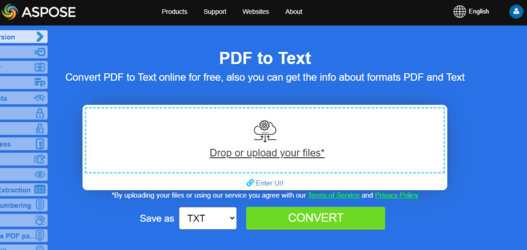

## Convert PDF to EPUB

{}
**Try to convert PDF to EPUB online**

Aspose.PDF for Java presents you online free application ["PDF to EPUB"](https://products.aspose.app/pdf/conversion/pdf-to-epub), where you may try to investigate the functionality and quality it works.

[](https://products.aspose.app/pdf/conversion/pdf-to-epub)
{}

**<abbr title="Electronic Publication">EPUB</abbr>** (short for electronic publication) is a free and open e-book standard from the International Digital Publishing Forum (IDPF). Files have the extension .epub.EPUB is designed for reflowable content, meaning that an EPUB reader can optimize text for a particular display device. EPUB also supports fixed-layout content. The format is intended as a single format that publishers and conversion houses can use in-house, as well as for distribution and sale. It supersedes the Open eBook standard.

Aspose.PDF for Java supports the feature to convert PDF documents to EPUB format. Aspose.PDF for Java has a class named [EpubSaveOptions](https://reference.aspose.com/pdf/java/com.aspose.pdf/EpubSaveOptions) which can be used as the second argument to the [Document](https://reference.aspose.com/pdf/java/com.aspose.pdf/Document).save(..) method, to generate an EPUB file. Please try using the following code snippet to accomplish this requirement.

```java
// Load PDF document
Document document = new Document(DATA_DIR + "PDFToEPUB.pdf");
// Instantiate Epub Save options
EpubSaveOptions options = new EpubSaveOptions();
// Specify the layout for contents
options.setContentRecognitionMode(EpubSaveOptions.RecognitionMode.Flow);
// Save the ePUB document
document.save(DATA_DIR + "PDFToEPUB_out.epub", options);
document.close();
```

## Convert PDF to LaTeX/TeX

**Aspose.PDF for Java** support converting PDF to LaTeX/TeX.
The LaTeX file format is a text file format with the special markup and used in TeX-based document preparation system for high-quality typesetting.

To convert PDF files to TeX, Aspose.PDF has the class [TeXSaveOptions](https://reference.aspose.com/pdf/java/com.aspose.pdf/TeXSaveOptions) which provides the method `setOutDirectoryPath` for saving temporary images during the conversion process.

The following code snippet shows the process of converting PDF files into the TEX format with Java.

```java
String documentFileName = Paths.get(DATA_DIR.toString(), "PDFToTeX.pdf").toString();
String texDocumentFileName = Paths.get(DATA_DIR.toString(), "PDFToTeX_out.tex").toString();

// Create Document object
Document document = new Document(documentFileName);

// Instantiate LaTex save option
TeXSaveOptions saveOptions = new TeXSaveOptions();

// Specify the output directory
String pathToOutputDirectory = DATA_DIR.toString();

// Set the output directory path for save option object
saveOptions.setOutDirectoryPath(pathToOutputDirectory);

// Save PDF file into LaTex format
document.save(texDocumentFileName, saveOptions);
document.close();
```

{}
**Try to convert PDF to LaTeX/TeX online**

Aspose.PDF for Java presents you online free application ["PDF to LaTeX"](https://products.aspose.app/pdf/conversion/pdf-to-tex), where you may try to investigate the functionality and quality it works.

[](https://products.aspose.app/pdf/conversion/pdf-to-tex)
{}

## Convert PDF to Text

**Aspose.PDF for Java** support converting whole PDF document and single page to a Text file. 

### Convert whole PDF document to Text file

You can convert PDF document to TXT file using Visit method of [TextAbsorber](https://reference.aspose.com/pdf/java/com.aspose.pdf/textabsorber) class.

The following code snippet explains how to extract the texts from the all pages.

```java
// Open document
String pdfFileName = Paths.get(DATA_DIR.toString(), "demo.pdf").toString();
String txtFileName = Paths.get(DATA_DIR.toString(), "PDFToTXT_out.txt").toString();

// Load PDF document
Document document = new Document(pdfFileName);
TextAbsorber ta = new TextAbsorber();
ta.visit(document);
// Save the extracted text in text file
BufferedWriter writer = new BufferedWriter(new FileWriter(txtFileName));
writer.write(ta.getText());
writer.close();
```

{}
**Try to convert Convert PDF to Text online**

Aspose.PDF for Java presents you online free application ["PDF to Text"](https://products.aspose.app/pdf/conversion/pdf-to-txt), where you may try to investigate the functionality and quality it works.

[](https://products.aspose.app/pdf/conversion/pdf-to-txt)
{}

### Convert PDF page to text file

You can convert PDF document to TXT file with Aspose.PDF for Java. You should use Visit method of [TextAbsorber](https://reference.aspose.com/pdf/java/com.aspose.pdf/textabsorber) class for resolve this task.

The following code snippet explains how to extract the texts from the particular pages.

```java
String pdfFileName = Paths.get(DATA_DIR.toString(), "demo.pdf").toString();
String txtFileName = Paths.get(DATA_DIR.toString(), "PDFToTXT_out.txt").toString();

// Load PDF document
Document document = new Document(pdfFileName);

TextAbsorber ta = new TextAbsorber();
int[] pages = new int[] { 1, 3, 4 };

for (int page : pages) {
    ta.visit(document.getPages().get_Item(page));
}

// Save the extracted text in text file
BufferedWriter writer = new BufferedWriter(new FileWriter(txtFileName));
writer.write(ta.getText());
writer.close();
document.close();
```

## Convert PDF to XPS

**Aspose.PDF for Java** gives a possibility to convert PDF files to <abbr title="XML Paper Specification">XPS</abbr> format. Let try to use the presented code snippet for converting PDF files to XPS format with Java.

{}
**Try to convert PDF to XPS online**

Aspose.PDF for Java presents you online free application ["PDF to XPS"](https://products.aspose.app/pdf/conversion/pdf-to-xps), where you may try to investigate the functionality and quality it works.

[](https://products.aspose.app/pdf/conversion/pdf-to-xps)
{}

The XPS file type is primarily associated with the XML Paper Specification by Microsoft Corporation. The XML Paper Specification (XPS), formerly codenamed Metro and subsuming the Next Generation Print Path (NGPP) marketing concept, is Microsoft's initiative to integrate document creation and viewing into the Windows operating system.

To convert PDF files to XPS, Aspose.PDF has the class [XpsSaveOptions](https://reference.aspose.com/pdf/java/com.aspose.pdf/XpsSaveOptions) class that is used as the second argument to the Document.save(..) constructor to generate the XPS file. The following code snippet shows the process of converting PDF files into XPS format.

```java
String documentFileName = Paths.get(DATA_DIR.toString(), "sample.pdf").toString();
String xpsDocumentFileName = Paths.get(DATA_DIR.toString(), "sample-res-xps.xps").toString();

// Create Document object
Document document = new Document(documentFileName);

// Instantiate XPS Save options
XpsSaveOptions saveOptions = new XpsSaveOptions();

// Save output in XML format
document.save(xpsDocumentFileName, saveOptions);
document.close();
```
