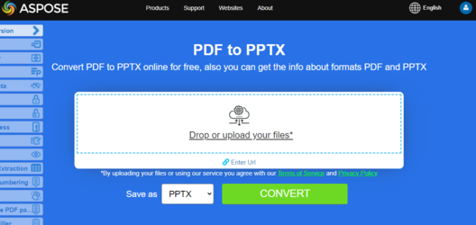

**Aspose.PDF for Java** lets you track the progress of PDF to PPTX conversion.
We have an API named Aspose.Slides which offers the feature to create as well as manipulate PPT/PPTX presentations. This API also provides the feature to convert PPT/PPTX files to PDF format. In Aspose.PDF for Java, we have introduced a feature to transform PDF documents into PPTX format. During this conversion, the individual pages of the PDF file are converted to separate slides in the PPTX file.

During PDF to PPTX conversion, the text is rendered as Text where you can select/update it, instead of its rendered as an image. Please note that in order to convert PDF files to PPTX format, Aspose.PDF provides a class named PptxSaveOptions. An object of the [PptxSaveOptions](https://reference.aspose.com/pdf/java/com.aspose.pdf/PptxSaveOptions) class is passed as a second argument to the [Document](https://reference.aspose.com/pdf/java/com.aspose.pdf/Document).save(..) method.

Check next code snippet to resolve your tasks with conversion PDF to PowerPoint format:

```java
public final class ConvertPDFtoPPTX {

    private ConvertPDFtoPPTX() {

    }

    private static final Path DATA_DIR = Paths.get("/home/aspose/pdf-examples/Samples");

    public static void run() throws IOException {
        convertPDFtoPPTX_Simple();
        convertPDFtoPPTX_SlideAsImages();
        convertPDFtoPPTX_ProgresDetails();
    }

    public static void convertPDFtoPPTX_Simple() {
        String documentFileName = Paths.get(DATA_DIR.toString(), "PDFToPPTX.pdf").toString();
        String pptxDocumentFileName = Paths.get(DATA_DIR.toString(), "PDFToPPTX_out.pptx").toString();

        // Load PDF document
        Document document = new Document(documentFileName);

        // Instantiate PptxSaveOptions instance
        PptxSaveOptions pptx_save = new PptxSaveOptions();

        // Save the output in PPTX format
        document.save(pptxDocumentFileName, pptx_save);
        document.close();
    }
}
```

## Convert PDF to PPTX with Slides as Images

In case if you need to convert a searchable PDF to PPTX as images instead of selectable text, Aspose.PDF provides such a feature via [Aspose.Pdf.PptxSaveOptions](https://reference.aspose.com/pdf/java/com.aspose.pdf/PptxSaveOptions) class. To achieve this, set property SlidesAsImages  of [PptxSaveOptios](https://reference.aspose.com/pdf/java/com.aspose.pdf/PptxSaveOptions) class to 'true' as shown in the following code sample.

The following code snippet shows the process for converting PDF files into PPTX format Slides as Images. 

```java
public static void convertPDFtoPPTX_SlideAsImages() {
    String documentFileName = Paths.get(DATA_DIR.toString(), "PDFToPPTX.pdf").toString();
    String pptxDocumentFileName = Paths.get(DATA_DIR.toString(), "PDFToPPTX_out.pptx").toString();

    // Load PDF document
    Document document = new Document(documentFileName);
    // Instantiate PptxSaveOptions instance
    PptxSaveOptions pptxSaveOptions = new PptxSaveOptions();
    // Save the output in PPTX format
    pptxSaveOptions.setSlidesAsImages(true);

    document.save(pptxDocumentFileName, pptxSaveOptions);
    document.close();
}
```

## Show Progress On Console with Aspose.PDF for Java looks like this:

```java
package com.aspose.pdf.examples.conversion;

import com.aspose.pdf.Document;
import com.aspose.pdf.PptxSaveOptions;

import java.io.IOException;
import java.nio.file.Path;
import java.nio.file.Paths;

/**
 * Convert PDF to PPTX.
 */
public final class ConvertPDFtoPPTX {

    private ConvertPDFtoPPTX() {

    }

    private static final Path DATA_DIR = Paths.get("/home/aspose/pdf-examples/Samples");

    public static void run() throws IOException {
        convertPDFtoPPTX_ProgressDetails();
    }

    public static void convertPDFtoPPTX_ProgressDetails() {
        String documentFileName = Paths.get(DATA_DIR.toString(), "PDFToPPTX.pdf").toString();
        String pptxDocumentFileName = Paths.get(DATA_DIR.toString(), "PDFToPPTX_out.pptx").toString();

        // Load PDF document
        Document document = new Document(documentFileName);

        // Instantiate PptxSaveOptions instance
        PptxSaveOptions pptx_save = new PptxSaveOptions();

        // Specify Custom Progress Handler
        pptx_save.setCustomProgressHandler(new ShowProgressOnConsole());

        // Save the output in PPTX format
        document.save(pptxDocumentFileName, pptx_save);
        document.close();
    }
}
```

## Progress Detail of PPTX Conversion

Aspose.PDF for Java lets you track the progress of PDF to PPTX conversion. The [Aspose.Pdf.PptxSaveOptions](https://reference.aspose.com/pdf/java/com.aspose.pdf/PptxSaveOptions) class provides [CustomProgressHandler](https://reference.aspose.com/pdf/java/com.aspose.pdf/HtmlSaveOptions) property that can be specified to a custom method for tracking the progress of conversion as shown in the following code sample.

```java
package com.aspose.pdf.examples;

import java.time.LocalDateTime;

import com.aspose.pdf.ProgressEventType;
import com.aspose.pdf.UnifiedSaveOptions.ConversionProgressEventHandler;
import com.aspose.pdf.UnifiedSaveOptions.ProgressEventHandlerInfo;

class ShowProgressOnConsole extends ConversionProgressEventHandler{

    @Override
    public void invoke(ProgressEventHandlerInfo eventInfo) {        
        switch (eventInfo.EventType) {
            case ProgressEventType.TotalProgress:
                System.out.println(
                        String.format("%s  - Conversion progress : %d %%.", LocalDateTime.now().toString(), eventInfo.Value));
                break;
            case ProgressEventType.ResultPageCreated:
                System.out.println(String.format("%s  - Result page's %s of %d layout created.", LocalDateTime.now().toString(),
                        eventInfo.Value, eventInfo.MaxValue));
                break;
            case ProgressEventType.ResultPageSaved:
                System.out.println(String.format("%s  - Result page %d of %d exported.", LocalDateTime.now(), eventInfo.Value, eventInfo.MaxValue));
                break;
            case ProgressEventType.SourcePageAnalysed:
                System.out.println(String.format("%s  - Source page %d of %d analyzed.", LocalDateTime.now(),  eventInfo.Value, eventInfo.MaxValue));
                break;
            default:
                break;
        }
    }
```

{}
**Try to convert PDF to PowerPoint online**

Aspose.PDF for Java presents you online free application ["PDF to PPTX"](https://products.aspose.app/pdf/conversion/pdf-to-pptx), where you may try to investigate the functionality and quality it works.

[](https://products.aspose.app/pdf/conversion/pdf-to-pptx)
{}
