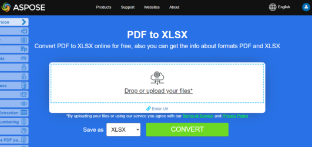

## Creating spreadsheets from PDF using  JavaScript

**Aspose.PDF for JavaScript** support the feature of converting PDF files to Excel, and CSV formats.

{}
**Try to convert PDF to Excel online**

Aspose.PDF for JavaScript presents you online free application ["PDF to XLSX"](https://products.aspose.app/pdf/conversion/pdf-to-xlsx), where you may try to investigate the functionality and quality it works.

[](https://products.aspose.app/pdf/conversion/pdf-to-xlsx)
{}

Converting operation depends on the number of pages in the document and can be very time-consuming. Therefore, we highly recommend using Web Workers. 

This code demonstrates a way to offload resource-intensive PDF file converting tasks to a web worker to prevent blocking the main UI thread. It also offers a user-friendly way to download the converted file.

## Convert PDF to XLSX

```js

  /*Create Web Worker*/
    const AsposePDFWebWorker = new Worker("AsposePDFforJS.js");
    AsposePDFWebWorker.onerror = evt => console.log(`Error from Web Worker: ${evt.message}`);
    AsposePDFWebWorker.onmessage = evt => document.getElementById('output').textContent = 
      (evt.data == 'ready') ? 'loaded!' :
        (evt.data.json.errorCode == 0) ? `Result:\n${DownloadFile(evt.data.json.fileNameResult, "application/vnd.openxmlformats-officedocument.spreadsheetml.sheet", evt.data.params[0])}` : `Error: ${evt.data.json.errorText}`;

    /*Event handler*/
    const ffileToXlsX = e => {
      const file_reader = new FileReader();
      file_reader.onload = event => {
        /*convert a PDF-file to XlsX and save the "ResultPDFtoXlsX.xlsx" - Ask Web Worker*/
        AsposePDFWebWorker.postMessage({ "operation": 'AsposePdfToXlsX', "params": [event.target.result, e.target.files[0].name, "ResultPDFtoXlsX.xlsx"] }, [event.target.result]);
      };
      file_reader.readAsArrayBuffer(e.target.files[0]);
    };
  /// [Code snippet]

    /*make a link to download the result file*/
    const DownloadFile = (filename, mime, content) => {
        mime = mime || "application/octet-stream";
        var link = document.createElement("a"); 
        link.href = URL.createObjectURL(new Blob([content], {type: mime}));
        link.download = filename;
        link.innerHTML = "Click here to download the file " + filename;
        document.body.appendChild(link); 
        document.body.appendChild(document.createElement("br"));
        return filename;
      }
```

The following JavaScript code snippet shows simple example of coverting PDF pages into XlsX  files:

1. Select a PDF file for converting.
1. Create a 'FileReader'.
1. The [AsposePdfToXlsX](https://reference.aspose.com/pdf/javascript-cpp/core/asposepdftoxlsx/) function is executed.
1. The name of the resulting file is set, in this example "ResultPDFtoXlsX.xlsx".
1. Next, if the 'json.errorCode' is 0, then your result File is given the name you specified earlier. If the 'json.errorCode' parameter is not equal to 0 and, accordingly, there will be an error in your file, then information about such an error will be contained in the 'json.errorText' file.
1. As a result, the [DownloadFile](https://reference.aspose.com/pdf/javascript-cpp/misc/downloadfile/) function generates a link and allows you to download the resulting file to the user's operating system.

```js

  var ffileToXlsX = function (e) {
    const file_reader = new FileReader();
    file_reader.onload = (event) => {
      /*convert a PDF-file to XlsX and save the "ResultPDFtoXlsX.xlsx"*/
      const json = AsposePdfToXlsX(event.target.result, e.target.files[0].name, "ResultPDFtoXlsX.xlsx");
      if (json.errorCode == 0) document.getElementById('output').textContent = json.fileNameResult;
      else document.getElementById('output').textContent = json.errorText;
      /*make a link to download the result file*/
      DownloadFile(json.fileNameResult, "application/vnd.openxmlformats-officedocument.spreadsheetml.sheet");
    }
    file_reader.readAsArrayBuffer(e.target.files[0]);
  }
```

## Convert PDF to CSV

```js

    /*Create Web Worker*/
    const AsposePDFWebWorker = new Worker("AsposePDFforJS.js");
    AsposePDFWebWorker.onerror = evt => console.log(`Error from Web Worker: ${evt.message}`);
    AsposePDFWebWorker.onmessage = evt => document.getElementById('output').textContent = 
      (evt.data == 'ready') ? 'loaded!' :
        (evt.data.json.errorCode == 0) ? 
          `Files(tables) count: ${evt.data.json.filesCount.toString()}\n${evt.data.params.forEach(
            (element, index) => DownloadFile(evt.data.json.filesNameResult[index], "text/csv", element) ) ?? ""}` : 
          `Error: ${evt.data.json.errorText}`;

    /*Event handler*/
    const ffileToCSV = e => {
      const file_reader = new FileReader();
      file_reader.onload = event => {
        /*Convert a PDF-file to CSV (extract tables) with template "ResultPdfTablesToCSV{0:D2}.csv" ({0}, {0:D2}, {0:D3}, ... format page number), TAB as delimiter and save - Ask Web Worker*/
        AsposePDFWebWorker.postMessage({ "operation": 'AsposePdfTablesToCSV', "params": [event.target.result, e.target.files[0].name, "ResultPdfTablesToCSV{0:D2}.csv", "\t"] }, [event.target.result]);
      };
      file_reader.readAsArrayBuffer(e.target.files[0]);
    };

    /*Make a link to download the result file*/
    const DownloadFile = (filename, mime, content) => {
        mime = mime || "application/octet-stream";
        var link = document.createElement("a"); 
        link.href = URL.createObjectURL(new Blob([content], {type: mime}));
        link.download = filename;
        link.innerHTML = "Click here to download the file " + filename;
        document.body.appendChild(link); 
        document.body.appendChild(document.createElement("br"));
        return filename;
      }
```

The following JavaScript code snippet shows simple example of coverting PDF into CSV:

1. Select a PDF file for converting.
1. Create a 'FileReader'.
1. The [AsposePdfTablesToCSV](https://reference.aspose.com/pdf/javascript-cpp/convert/asposepdftablestocsv/) function is executed.
1. The name of the resulting file is set, in this example "ResultPdfTablesToCSV{0:D2}.csv".
1. Next, if the 'json.errorCode' is 0, then your result File is given the name you specified earlier. If the 'json.errorCode' parameter is not equal to 0 and, accordingly, there will be an error in your file, then information about such an error will be contained in the 'json.errorText' file.
1. As a result, the [DownloadFile](https://reference.aspose.com/pdf/javascript-cpp/misc/downloadfile/) function generates a link and allows you to download the resulting file to the user's operating system.

```js

  var ffileToCSV = function (e) {
      const file_reader = new FileReader();
      file_reader.onload = (event) => {
        /*Convert a PDF-file to CSV (extract tables) with template "ResultPdfTablesToCSV{0:D2}.csv" ({0}, {0:D2}, {0:D3}, ... format page number), TAB as delimiter*/
        const json = AsposePdfTablesToCSV(event.target.result, e.target.files[0].name, "ResultPdfTablesToCSV{0:D2}.csv", "\t");
        if (json.errorCode == 0) {
          document.getElementById('output').textContent = "Files(tables) count: " + json.filesCount.toString();
          /*Make links to result files*/
          for (let fileIndex = 0; fileIndex < json.filesCount; fileIndex++) DownloadFile(json.filesNameResult[fileIndex], "text/csv");
        }
        else document.getElementById('output').textContent = json.errorText;
      };
      file_reader.readAsArrayBuffer(e.target.files[0]);
    };
```


