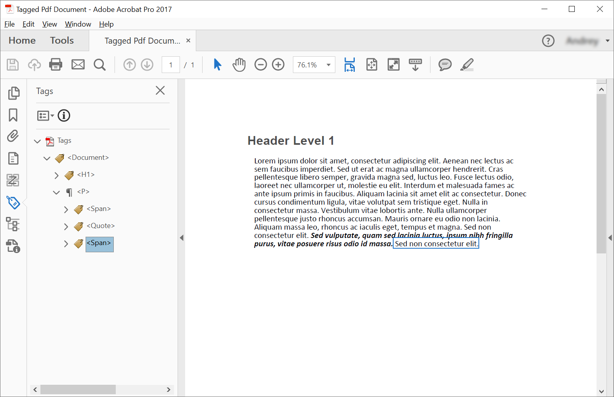

<script type="application/ld+json">
{
    "@context": "https://schema.org",
    "@type": "TechArticle",
    "headline": "Create Tagged PDF using C#",
    "alternativeHeadline": "Programmatically create tagged PDFs using C#",
    "abstract": "Programmatically create tagged PDF documents using C# and Aspose.PDF, ensuring PDF/UA compliance.  This feature enables the creation of structured PDF documents with elements like headers and paragraphs, supporting nested structures and text styling for accessibility.  The library also includes validation to confirm PDF/UA standards are met",
    "author": {
        "@type": "Person",
        "name": "Anastasiia Holub",
        "givenName": "Anastasiia",
        "familyName": "Holub",
        "url": "https://www.linkedin.com/in/anastasiia-holub-750430225/"
    },
    "genre": "pdf document generation",
    "keywords": "Tagged PDF, C#, Aspose.PDF, PDF/UA, Structure Elements, ITaggedContent, AppendChild,  StructureTextState",
    "wordcount": "1163",
    "proficiencyLevel": "Beginner",
    "publisher": {
        "@type": "Organization",
        "name": "Aspose.PDF for .NET",
        "url": "https://products.aspose.com/pdf",
        "logo": "https://www.aspose.cloud/templates/aspose/img/products/pdf/aspose_pdf-for-net.svg",
        "alternateName": "Aspose",
        "sameAs": [
            "https://facebook.com/aspose.pdf/",
            "https://twitter.com/asposepdf",
            "https://www.youtube.com/channel/UCmV9sEg_QWYPi6BJJs7ELOg/featured",
            "https://www.linkedin.com/company/aspose",
            "https://stackoverflow.com/questions/tagged/aspose",
            "https://aspose.quora.com/",
            "https://aspose.github.io/"
        ],
        "contactPoint": [
            {
                "@type": "ContactPoint",
                "telephone": "+1 903 306 1676",
                "contactType": "sales",
                "areaServed": "US",
                "availableLanguage": "en"
            },
            {
                "@type": "ContactPoint",
                "telephone": "+44 141 628 8900",
                "contactType": "sales",
                "areaServed": "GB",
                "availableLanguage": "en"
            },
            {
                "@type": "ContactPoint",
                "telephone": "+61 2 8006 6987",
                "contactType": "sales",
                "areaServed": "AU",
                "availableLanguage": "en"
            }
        ]
    },
    "url": "/net/create-tagged-pdf/",
    "mainEntityOfPage": {
        "@type": "WebPage",
        "@id": "/net/create-tagged-pdf/"
    },
    "dateModified": "2022-11-25",
    "description": "This article explains how to create structure's elements for Tagged PDF document programmatically using Aspose.PDF for .NET."
}
</script>

Creating a Tagged PDF means adding (or creating) certain elements to the document that will enable the document to be validated in accordance with PDF/UA requirements. These elements are called often Structure Elements.

The following code snippet also work with [Aspose.PDF.Drawing](/pdf/net/drawing/) library.

## Creating Tagged PDF (Simple Scenario)

In order to create structure elements in a Tagged PDF Document, Aspose.PDF offers methods to create structure element using [ITaggedContent](https://reference.aspose.com/pdf/net/aspose.pdf.tagged/itaggedcontent) interface. Following code snippet shows how to create Tagged PDF which contain 2 elements: header and paragraph.



```csharp
// For complete examples and data files, visit https://github.com/aspose-pdf/Aspose.PDF-for-.NET
private static void CreateTaggedPdfDocument01()
{
    // The path to the documents directory
    var dataDir = RunExamples.GetDataDir_AsposePdf_WorkingDocuments();

    // Create PDF document
    using (var document = new Aspose.Pdf.Document())
    {
        // Get Content for work with TaggedPdf
        Aspose.Pdf.Tagged.ITaggedContent taggedContent = document.TaggedContent;
        var rootElement = taggedContent.RootElement;

        // Set Title and Language for Document
        taggedContent.SetTitle("Tagged Pdf Document");
        taggedContent.SetLanguage("en-US");

        Aspose.Pdf.LogicalStructure.HeaderElement mainHeader = taggedContent.CreateHeaderElement();
        mainHeader.SetText("Main Header");

        Aspose.Pdf.LogicalStructure.ParagraphElement paragraphElement = taggedContent.CreateParagraphElement();
        paragraphElement.SetText("Lorem ipsum dolor sit amet, consectetur adipiscing elit. " +
            "Aenean nec lectus ac sem faucibus imperdiet. Sed ut erat ac magna ullamcorper hendrerit. " +
            "Cras pellentesque libero semper, gravida magna sed, luctus leo. Fusce lectus odio, laoreet" +
            "nec ullamcorper ut, molestie eu elit. Interdum et malesuada fames ac ante ipsum primis in faucibus." +
            "Aliquam lacinia sit amet elit ac consectetur. Donec cursus condimentum ligula, vitae volutpat" +
            "sem tristique eget. Nulla in consectetur massa. Vestibulum vitae lobortis ante. Nulla ullamcorper" +
            "pellentesque justo rhoncus accumsan. Mauris ornare eu odio non lacinia. Aliquam massa leo, rhoncus" +
            "ac iaculis eget, tempus et magna. Sed non consectetur elit. Sed vulputate, quam sed lacinia luctus," +
            "ipsum nibh fringilla purus, vitae posuere risus odio id massa. Cras sed venenatis lacus.");

        rootElement.AppendChild(mainHeader);
        rootElement.AppendChild(paragraphElement);

        // Save Tagged PDF document
        document.Save(dataDir + "TaggedPdfDocument_out.pdf");
    }
}
```



```csharp
// For complete examples and data files, visit https://github.com/aspose-pdf/Aspose.PDF-for-.NET
private static void CreateTaggedPdfDocument01()
{
    // The path to the documents directory
    var dataDir = RunExamples.GetDataDir_AsposePdf_WorkingDocuments();

    // Create PDF Document
    using var document = new Aspose.Pdf.Document();

    // Get Content for work with TaggedPdf
    Aspose.Pdf.Tagged.ITaggedContent taggedContent = document.TaggedContent;
    var rootElement = taggedContent.RootElement;

    // Set Title and Language for Document
    taggedContent.SetTitle("Tagged Pdf Document");
    taggedContent.SetLanguage("en-US");

    Aspose.Pdf.LogicalStructure.HeaderElement mainHeader = taggedContent.CreateHeaderElement();
    mainHeader.SetText("Main Header");

    Aspose.Pdf.LogicalStructure.ParagraphElement paragraphElement = taggedContent.CreateParagraphElement();
    paragraphElement.SetText("Lorem ipsum dolor sit amet, consectetur adipiscing elit. " +
        "Aenean nec lectus ac sem faucibus imperdiet. Sed ut erat ac magna ullamcorper hendrerit. " +
        "Cras pellentesque libero semper, gravida magna sed, luctus leo. Fusce lectus odio, laoreet" +
        "nec ullamcorper ut, molestie eu elit. Interdum et malesuada fames ac ante ipsum primis in faucibus." +
        "Aliquam lacinia sit amet elit ac consectetur. Donec cursus condimentum ligula, vitae volutpat" +
        "sem tristique eget. Nulla in consectetur massa. Vestibulum vitae lobortis ante. Nulla ullamcorper" +
        "pellentesque justo rhoncus accumsan. Mauris ornare eu odio non lacinia. Aliquam massa leo, rhoncus" +
        "ac iaculis eget, tempus et magna. Sed non consectetur elit. Sed vulputate, quam sed lacinia luctus," +
        "ipsum nibh fringilla purus, vitae posuere risus odio id massa. Cras sed venenatis lacus.");

    rootElement.AppendChild(mainHeader);
    rootElement.AppendChild(paragraphElement);

    // Save Tagged PDF Document
    document.Save(dataDir + "TaggedPdfDocument_out.pdf");
}
```



We will get a following document after creation:


## Creating Tagged PDF with nested elements (Creating Structure Elements Tree)

In some cases, we need to create more complex sturcutre, eg. place quotes in paragraph. 
In order to create structure elements tree we should use [AppendChild](https://reference.aspose.com/pdf/net/aspose.pdf.logicalstructure/element/methods/appendchild) method.
Following code snippet shows how to create structure elements tree of Tagged PDF Document:



```csharp
// For complete examples and data files, visit https://github.com/aspose-pdf/Aspose.PDF-for-.NET
private static void CreateTaggedPdfDocument02()
{
    // The path to the documents directory
    var dataDir = RunExamples.GetDataDir_AsposePdf_WorkingDocuments();

    // Create PDF Document
    using (var document = new Aspose.Pdf.Document())
    {
        // Get Content for work with TaggedPdf
        Aspose.Pdf.Tagged.ITaggedContent taggedContent = document.TaggedContent;
        var rootElement = taggedContent.RootElement;

        // Set Title and Language for Document
        taggedContent.SetTitle("Tagged Pdf Document");
        taggedContent.SetLanguage("en-US");

        Aspose.Pdf.LogicalStructure.HeaderElement header1 = taggedContent.CreateHeaderElement(1);
        header1.SetText("Header Level 1");

        Aspose.Pdf.LogicalStructure.ParagraphElement paragraphWithQuotes = taggedContent.CreateParagraphElement();
        paragraphWithQuotes.StructureTextState.Font = Aspose.Pdf.Text.FontRepository.FindFont("Calibri");
        
        // Adjust position
        paragraphWithQuotes.AdjustPosition(new Aspose.Pdf.Tagged.PositionSettings
            {
                Margin = new Aspose.Pdf.MarginInfo(10, 5, 10, 5)
            });

        Aspose.Pdf.LogicalStructure.SpanElement spanElement1 = taggedContent.CreateSpanElement();
        spanElement1.SetText("Lorem ipsum dolor sit amet, consectetur adipiscing elit. Aenean nec lectus ac sem faucibus imperdiet. Sed ut erat ac magna ullamcorper hendrerit. Cras pellentesque libero semper, gravida magna sed, luctus leo. Fusce lectus odio, laoreet nec ullamcorper ut, molestie eu elit. Interdum et malesuada fames ac ante ipsum primis in faucibus. Aliquam lacinia sit amet elit ac consectetur. Donec cursus condimentum ligula, vitae volutpat sem tristique eget. Nulla in consectetur massa. Vestibulum vitae lobortis ante. Nulla ullamcorper pellentesque justo rhoncus accumsan. Mauris ornare eu odio non lacinia. Aliquam massa leo, rhoncus ac iaculis eget, tempus et magna. Sed non consectetur elit. ");

        Aspose.Pdf.LogicalStructure.QuoteElement quoteElement = taggedContent.CreateQuoteElement();
        quoteElement.SetText("Sed vulputate, quam sed lacinia luctus, ipsum nibh fringilla purus, vitae posuere risus odio id massa.");
        quoteElement.StructureTextState.FontStyle = Aspose.Pdf.Text.FontStyles.Bold | Aspose.Pdf.Text.FontStyles.Italic;
        Aspose.Pdf.LogicalStructure.SpanElement spanElement2 = taggedContent.CreateSpanElement();
        spanElement2.SetText(" Sed non consectetur elit.");

        paragraphWithQuotes.AppendChild(spanElement1);
        paragraphWithQuotes.AppendChild(quoteElement);
        paragraphWithQuotes.AppendChild(spanElement2);

        rootElement.AppendChild(header1);
        rootElement.AppendChild(paragraphWithQuotes);

        // Save Tagged PDF Document
        document.Save(dataDir + "TaggedPdfDocument_out.pdf");
    }
}
```



```csharp
// For complete examples and data files, visit https://github.com/aspose-pdf/Aspose.PDF-for-.NET
private static void CreateTaggedPdfDocument02()
{
    // The path to the documents directory
    var dataDir = RunExamples.GetDataDir_AsposePdf_WorkingDocuments();

    // Create PDF Document
    using var document = new Aspose.Pdf.Document();

    // Get Content for work with TaggedPdf
    Aspose.Pdf.Tagged.ITaggedContent taggedContent = document.TaggedContent;
    var rootElement = taggedContent.RootElement;

    // Set Title and Language for Document
    taggedContent.SetTitle("Tagged Pdf Document");
    taggedContent.SetLanguage("en-US");

    Aspose.Pdf.LogicalStructure.HeaderElement header1 = taggedContent.CreateHeaderElement(1);
    header1.SetText("Header Level 1");

    Aspose.Pdf.LogicalStructure.ParagraphElement paragraphWithQuotes = taggedContent.CreateParagraphElement();
    paragraphWithQuotes.StructureTextState.Font = Aspose.Pdf.Text.FontRepository.FindFont("Calibri");
    
    paragraphWithQuotes.AdjustPosition(new Aspose.Pdf.Tagged.PositionSettings
        {
            Margin = new Aspose.Pdf.MarginInfo(10, 5, 10, 5)
        });

    Aspose.Pdf.LogicalStructure.SpanElement spanElement1 = taggedContent.CreateSpanElement();
    spanElement1.SetText("Lorem ipsum dolor sit amet, consectetur adipiscing elit. Aenean nec lectus ac sem faucibus imperdiet. Sed ut erat ac magna ullamcorper hendrerit. Cras pellentesque libero semper, gravida magna sed, luctus leo. Fusce lectus odio, laoreet nec ullamcorper ut, molestie eu elit. Interdum et malesuada fames ac ante ipsum primis in faucibus. Aliquam lacinia sit amet elit ac consectetur. Donec cursus condimentum ligula, vitae volutpat sem tristique eget. Nulla in consectetur massa. Vestibulum vitae lobortis ante. Nulla ullamcorper pellentesque justo rhoncus accumsan. Mauris ornare eu odio non lacinia. Aliquam massa leo, rhoncus ac iaculis eget, tempus et magna. Sed non consectetur elit. ");

    Aspose.Pdf.LogicalStructure.QuoteElement quoteElement = taggedContent.CreateQuoteElement();
    quoteElement.SetText("Sed vulputate, quam sed lacinia luctus, ipsum nibh fringilla purus, vitae posuere risus odio id massa.");
    quoteElement.StructureTextState.FontStyle = Aspose.Pdf.Text.FontStyles.Bold | Aspose.Pdf.Text.FontStyles.Italic;
    Aspose.Pdf.LogicalStructure.SpanElement spanElement2 = taggedContent.CreateSpanElement();
    spanElement2.SetText(" Sed non consectetur elit.");

    paragraphWithQuotes.AppendChild(spanElement1);
    paragraphWithQuotes.AppendChild(quoteElement);
    paragraphWithQuotes.AppendChild(spanElement2);

    rootElement.AppendChild(header1);
    rootElement.AppendChild(paragraphWithQuotes);

    // Save Tagged PDF Document
    document.Save(dataDir + "TaggedPdfDocument_out.pdf");
}
```



We will get a following document after creation:


## Styling Text Structure

In order to style text structure in a Tagged PDF Document, Aspose.PDF offers [Font](https://reference.aspose.com/pdf/net/aspose.pdf.logicalstructure/structuretextstate/properties/font), [FontSize](https://reference.aspose.com/pdf/net/aspose.pdf.logicalstructure/structuretextstate/properties/fontsize), [FontStyle](https://reference.aspose.com/pdf/net/aspose.pdf.logicalstructure/structuretextstate/properties/fontstyle) and [ForegroundColor](https://reference.aspose.com/pdf/net/aspose.pdf.logicalstructure/structuretextstate/properties/foregroundcolor) properties of [StructureTextState](https://reference.aspose.com/pdf/net/aspose.pdf.logicalstructure/structuretextstate) Class. Following code snippet shows how to style text structure in a Tagged PDF Document:



```csharp
// For complete examples and data files, visit https://github.com/aspose-pdf/Aspose.PDF-for-.NET
private static void AddStyle()
{
    // The path to the documents directory
    var dataDir = RunExamples.GetDataDir_AsposePdf_WorkingDocuments();

    // Create PDF Document
    using (var document = new Aspose.Pdf.Document())
    {
        // Get Content for work with TaggedPdf
        Aspose.Pdf.Tagged.ITaggedContent taggedContent = document.TaggedContent;

        // Set Title and Language for Document
        taggedContent.SetTitle("Tagged Pdf Document");
        taggedContent.SetLanguage("en-US");

        Aspose.Pdf.LogicalStructure.ParagraphElement p = taggedContent.CreateParagraphElement();
        taggedContent.RootElement.AppendChild(p);

        p.StructureTextState.FontSize = 18F;
        p.StructureTextState.ForegroundColor = Aspose.Pdf.Color.Red;
        p.StructureTextState.FontStyle = Aspose.Pdf.Text.FontStyles.Italic;

        p.SetText("Red italic text.");

        // Save Tagged Pdf Document
        document.Save(dataDir + "StyleTextStructure_out.pdf");
    }
}
```



```csharp
// For complete examples and data files, visit https://github.com/aspose-pdf/Aspose.PDF-for-.NET
private static void AddStyle()
{
    // The path to the documents directory
    var dataDir = RunExamples.GetDataDir_AsposePdf_WorkingDocuments();

    // Create PDF Document
    using var document = new Aspose.Pdf.Document();

    // Get Content for work with TaggedPdf
    Aspose.Pdf.Tagged.ITaggedContent taggedContent = document.TaggedContent;

    // Set Title and Language for Document
    taggedContent.SetTitle("Tagged Pdf Document");
    taggedContent.SetLanguage("en-US");

    Aspose.Pdf.LogicalStructure.ParagraphElement p = taggedContent.CreateParagraphElement();
    taggedContent.RootElement.AppendChild(p);

    p.StructureTextState.FontSize = 18F;
    p.StructureTextState.ForegroundColor = Aspose.Pdf.Color.Red;
    p.StructureTextState.FontStyle = Aspose.Pdf.Text.FontStyles.Italic;

    p.SetText("Red italic text.");

    // Save Tagged Pdf Document
    document.Save(dataDir + "StyleTextStructure_out.pdf");
}
```



## Adjust position of Text Structure

The following code snippet shows how to adjust Text Structure position in the Tagged PDF document:



```csharp
// For complete examples and data files, visit https://github.com/aspose-pdf/Aspose.PDF-for-.NET
private static void AdjustPosition()
{
    // The path to the documents directory
    var dataDir = RunExamples.GetDataDir_AsposePdf_WorkingDocuments();

    // Create PDF Document
    using (var document = new Aspose.Pdf.Document())
    {
        // Get Content for work with TaggedPdf
        var taggedContent = document.TaggedContent;

        // Set Title and Language for Document
        taggedContent.SetTitle("Tagged Pdf Document");
        taggedContent.SetLanguage("en-US");

        var p = taggedContent.CreateParagraphElement();
        taggedContent.RootElement.AppendChild(p);

        p.SetText("Red italic text.");

        // Adjust position
        p.AdjustPosition(new Aspose.Pdf.Tagged.PositionSettings
        {
            HorizontalAlignment = Aspose.Pdf.HorizontalAlignment.None,
            Margin = new Aspose.Pdf.MarginInfo
            {
                Left = 20,
                Right = 0,
                Top = 20,
                Bottom = 0
            },
            VerticalAlignment = Aspose.Pdf.VerticalAlignment.None,
            IsFirstParagraphInColumn = false,
            IsKeptWithNext = false,
            IsInNewPage = false,
            IsInLineParagraph = false
        });

        // Save Tagged Pdf Document
        document.Save(dataDir + "StyleTextStructure_out.pdf");
    }
}
```



```csharp
// For complete examples and data files, visit https://github.com/aspose-pdf/Aspose.PDF-for-.NET
private static void AdjustPosition()
{
    // The path to the documents directory
    var dataDir = RunExamples.GetDataDir_AsposePdf_WorkingDocuments();

    // Create PDF Document
    using (var document = new Aspose.Pdf.Document())
    {
        // Get Content for work with TaggedPdf
        var taggedContent = document.TaggedContent;

        // Set Title and Language for Document
        taggedContent.SetTitle("Tagged Pdf Document");
        taggedContent.SetLanguage("en-US");

        var p = taggedContent.CreateParagraphElement();
        taggedContent.RootElement.AppendChild(p);

        p.SetText("Red italic text.");

        // Adjust position
        p.AdjustPosition(new Aspose.Pdf.Tagged.PositionSettings
        {
            HorizontalAlignment = Aspose.Pdf.HorizontalAlignment.None,
            Margin = new Aspose.Pdf.MarginInfo
            {
                Left = 20,
                Right = 0,
                Top = 20,
                Bottom = 0
            },
            VerticalAlignment = Aspose.Pdf.VerticalAlignment.None,
            IsFirstParagraphInColumn = false,
            IsKeptWithNext = false,
            IsInNewPage = false,
            IsInLineParagraph = false
        });

        // Save Tagged Pdf Document
        document.Save(dataDir + "StyleTextStructure_out.pdf");
    }
}
```



## Illustrating Structure Elements

In order to illustrate structure elements in a Tagged PDF Document, Aspose.PDF offers [IllustrationElement](https://reference.aspose.com/pdf/net/aspose.pdf.logicalstructure/illustrationelement) class. Following code snippet shows how to illustrate structure elements in a Tagged PDF Document:



```csharp
// For complete examples and data files, visit https://github.com/aspose-pdf/Aspose.PDF-for-.NET
private static void IllustrateStructureElements()
{
    // The path to the documents directory
    var dataDir = RunExamples.GetDataDir_AsposePdf_WorkingDocuments();

    // Create PDF Document
    using (var document = new Aspose.Pdf.Document())
    {
        // Get Content for work with TaggedPdf
        Aspose.Pdf.Tagged.ITaggedContent taggedContent = document.TaggedContent;

        // Set Title and Language for Document
        taggedContent.SetTitle("Tagged Pdf Document");
        taggedContent.SetLanguage("en-US");

        Aspose.Pdf.LogicalStructure.IllustrationElement figure1 = taggedContent.CreateFigureElement();
        taggedContent.RootElement.AppendChild(figure1);
        figure1.AlternativeText = "Figure One";
        figure1.Title = "Image 1";
        figure1.SetTag("Fig1");
        figure1.SetImage(dataDir + "image.png");
        
        // Adjust position
        figure1.AdjustPosition(new Aspose.Pdf.Tagged.PositionSettings
        {
            Margin = new Aspose.Pdf.MarginInfo
            {
                Left = 50,
                Top = 20
            },
        });

        // Save Tagged Pdf Document
        document.Save(dataDir + "IllustrationStructureElements_out.pdf");
    }
}
```



```csharp
// For complete examples and data files, visit https://github.com/aspose-pdf/Aspose.PDF-for-.NET
private static void IllustrateStructureElements()
{
    // The path to the documents directory
    var dataDir = RunExamples.GetDataDir_AsposePdf_WorkingDocuments();

    // Create PDF Document
    using var document = new Aspose.Pdf.Document();

    // Get Content for work with TaggedPdf
    Aspose.Pdf.Tagged.ITaggedContent taggedContent = document.TaggedContent;

    // Set Title and Language for Document
    taggedContent.SetTitle("Tagged Pdf Document");
    taggedContent.SetLanguage("en-US");

    Aspose.Pdf.LogicalStructure.IllustrationElement figure1 = taggedContent.CreateFigureElement();
    taggedContent.RootElement.AppendChild(figure1);
    figure1.AlternativeText = "Figure One";
    figure1.Title = "Image 1";
    figure1.SetTag("Fig1");
    figure1.SetImage(dataDir + "image.png");
    
    // Adjust position
    figure1.AdjustPosition(new Aspose.Pdf.Tagged.PositionSettings
    {
        Margin = new Aspose.Pdf.MarginInfo
        {
            Left = 50,
            Top = 20
        },
    });

    // Save Tagged Pdf Document
    document.Save(dataDir + "IllustrationStructureElements_out.pdf");
}
```



## Validate Tagged PDF

Aspose.PDF for .NET provides the ability to validate PDF/UA Tagged PDF Document. Validation of PDF/UA standard supports:

- Checks for XObjects.
- Checks for Actions.
- Checks for Optional Content.
- Checks for Embedded Files.
- Checks for Acroform Fields(Validate Natural Language and Alternate Name and Digital Signatures).
- Checks for XFA Form Fields.
- Checks for Security settings.
- Checks for Navigation.
- Checks for Annotations.

The code snippet below shows how to validate the Tagged PDF Document. Corresponding problems will be displayed in the XML log report.



```csharp
// For complete examples and data files, visit https://github.com/aspose-pdf/Aspose.PDF-for-.NET
private static void ValidateTaggedPdf()
{
    // The path to the documents directory
    var dataDir = RunExamples.GetDataDir_AsposePdf_WorkingDocuments();

    // Open PDF document
    using (var document = new Aspose.Pdf.Document(dataDir + "StructureElements.pdf"))
    {
        bool isValid = document.Validate(dataDir + "StructureElements_log.xml", Aspose.Pdf.PdfFormat.PDF_UA_1);
    }
}
```



```csharp
// For complete examples and data files, visit https://github.com/aspose-pdf/Aspose.PDF-for-.NET
private static void ValidateTaggedPdf()
{
    // The path to the documents directory
    var dataDir = RunExamples.GetDataDir_AsposePdf_WorkingDocuments();

    // Open PDF document
    using var document = new Aspose.Pdf.Document(dataDir + "StructureElements.pdf");

    bool isValid = document.Validate(dataDir + "StructureElements_log.xml", Aspose.Pdf.PdfFormat.PDF_UA_1);
}
```



<script type="application/ld+json">
{
    "@context": "http://schema.org",
    "@type": "SoftwareApplication",
    "name": "Aspose.PDF for .NET Library",
    "image": "https://www.aspose.cloud/templates/aspose/img/products/pdf/aspose_pdf-for-net.svg",
    "url": "https://www.aspose.com/",
    "publisher": {
        "@type": "Organization",
        "name": "Aspose.PDF",
        "url": "https://products.aspose.com/pdf",
        "logo": "https://www.aspose.cloud/templates/aspose/img/products/pdf/aspose_pdf-for-net.svg",
        "alternateName": "Aspose",
        "sameAs": [
            "https://facebook.com/aspose.pdf/",
            "https://twitter.com/asposepdf",
            "https://www.youtube.com/channel/UCmV9sEg_QWYPi6BJJs7ELOg/featured",
            "https://www.linkedin.com/company/aspose",
            "https://stackoverflow.com/questions/tagged/aspose",
            "https://aspose.quora.com/",
            "https://aspose.github.io/"
        ],
        "contactPoint": [
            {
                "@type": "ContactPoint",
                "telephone": "+1 903 306 1676",
                "contactType": "sales",
                "areaServed": "US",
                "availableLanguage": "en"
            },
            {
                "@type": "ContactPoint",
                "telephone": "+44 141 628 8900",
                "contactType": "sales",
                "areaServed": "GB",
                "availableLanguage": "en"
            },
            {
                "@type": "ContactPoint",
                "telephone": "+61 2 8006 6987",
                "contactType": "sales",
                "areaServed": "AU",
                "availableLanguage": "en"
            }
        ]
    },
    "offers": {
        "@type": "Offer",
        "price": "1199",
        "priceCurrency": "USD"
    },
    "applicationCategory": "PDF Manipulation Library for .NET",
    "downloadUrl": "https://www.nuget.org/packages/Aspose.PDF/",
    "operatingSystem": "Windows, MacOS, Linux",
    "screenshot": "https://docs.aspose.com/pdf/net/create-pdf-document/screenshot.png",
    "softwareVersion": "2022.1",
    "aggregateRating": {
        "@type": "AggregateRating",
        "ratingValue": "5",
        "ratingCount": "16"
    }
}
</script>
