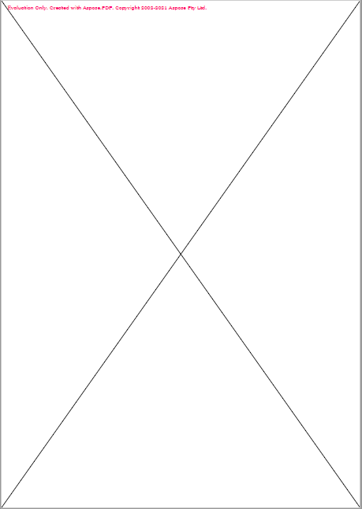

<script type="application/ld+json">
{
    "@context": "https://schema.org",
    "@type": "TechArticle",
    "headline": "Add Line Object to PDF file",
    "alternativeHeadline": "Enhance PDFs with Custom Line Objects Using .NET",
    "abstract": "Enhance your PDF documents by seamlessly adding line objects with Aspose.PDF for .NET. This new functionality allows precise control over line attributes, including dash patterns and colors, enabling users to create visually appealing graphical representations within their PDF files. Discover how to implement this feature easily with comprehensive code examples and clear step-by-step instructions",
    "author": {
        "@type": "Person",
        "name": "Anastasiia Holub",
        "givenName": "Anastasiia",
        "familyName": "Holub",
        "url": "https://www.linkedin.com/in/anastasiia-holub-750430225/"
    },
    "genre": "pdf document generation",
    "keywords": "Add Line Object, PDF manipulation, Aspose.PDF for .NET, Line object, Drawing in PDF, Graph object, Rectangle in PDF, Dotted Dashed Line, Draw Line Across the Page, PDF document generation",
    "wordcount": "729",
    "proficiencyLevel": "Beginner",
    "publisher": {
        "@type": "Organization",
        "name": "Aspose.PDF for .NET",
        "url": "https://products.aspose.com/pdf",
        "logo": "https://www.aspose.cloud/templates/aspose/img/products/pdf/aspose_pdf-for-net.svg",
        "alternateName": "Aspose",
        "sameAs": [
            "https://facebook.com/aspose.pdf/",
            "https://twitter.com/asposepdf",
            "https://www.youtube.com/channel/UCmV9sEg_QWYPi6BJJs7ELOg/featured",
            "https://www.linkedin.com/company/aspose",
            "https://stackoverflow.com/questions/tagged/aspose",
            "https://aspose.quora.com/",
            "https://aspose.github.io/"
        ],
        "contactPoint": [
            {
                "@type": "ContactPoint",
                "telephone": "+1 903 306 1676",
                "contactType": "sales",
                "areaServed": "US",
                "availableLanguage": "en"
            },
            {
                "@type": "ContactPoint",
                "telephone": "+44 141 628 8900",
                "contactType": "sales",
                "areaServed": "GB",
                "availableLanguage": "en"
            },
            {
                "@type": "ContactPoint",
                "telephone": "+61 2 8006 6987",
                "contactType": "sales",
                "areaServed": "AU",
                "availableLanguage": "en"
            }
        ]
    },
    "url": "/net/add-line/",
    "mainEntityOfPage": {
        "@type": "WebPage",
        "@id": "/net/add-line/"
    },
    "dateModified": "2024-11-25",
    "description": "This article explains how to create a line object to your PDF using Aspose.PDF for .NET."
}
</script>

The following code snippet also work with [Aspose.PDF.Drawing](/pdf/net/drawing/) library.

## Add Line object

Aspose.PDF for .NET supports the feature to add graph objects (for example graph, line, rectangle etc.) to PDF documents. You also get the leverage to add [Line](https://reference.aspose.com/pdf/net/aspose.pdf.drawing/line) object where you can also specify the dash pattern, color and other formatting for Line element.

Follow the steps below:

1. Create a new PDF [Document](https://reference.aspose.com/pdf/net/aspose.pdf/document).
1. Add [Page](https://reference.aspose.com/pdf/net/aspose.pdf/page) to pages collection of PDF file.
1. Create [Graph](https://reference.aspose.com/pdf/net/aspose.pdf.drawing/graph) instance.
1. Add Graph object to paragraphs collection of page instance.
1. Create [Rectangle](https://reference.aspose.com/pdf/net/aspose.pdf.drawing/rectangle) instance.
1. Set line width.
1. Add [Rectangle](https://reference.aspose.com/pdf/net/aspose.pdf.drawing/rectangle) object to shapes collection of Graph object.

1. Save your PDF file.

The following code snippet shows how to add a [Rectangle](https://reference.aspose.com/pdf/net/aspose.pdf.drawing/rectangle) object that is filled with color.

```csharp
// For complete examples and data files, visit https://github.com/aspose-pdf/Aspose.PDF-for-.NET
private static void AddLineObjectToPDF()
{
    // The path to the document directory
    var dataDir = RunExamples.GetDataDir_AsposePdf_Images();

    // Create PDF document
    using (var document = new Aspose.Pdf.Document())
    {
        // Add page
        var page = document.Pages.Add();

        // Create Graph instance
        var graph = new Aspose.Pdf.Drawing.Graph(100, 400);

        // Add graph object to paragraphs collection of page instance
        page.Paragraphs.Add(graph);

        // Create Line instance with specified coordinates
        var line = new Aspose.Pdf.Drawing.Line(new float[] { 100, 100, 200, 100 });

        // Specify dash settings for the line
        line.GraphInfo.DashArray = new int[] { 0, 1, 0 };
        line.GraphInfo.DashPhase = 1;

        // Add line object to shapes collection of Graph object
        graph.Shapes.Add(line);

        // Save PDF document
        document.Save(dataDir + "AddLineObject_out.pdf");
    }
}
```


## How to add Dotted Dashed Line to your PDF document

```csharp
// For complete examples and data files, visit https://github.com/aspose-pdf/Aspose.PDF-for-.NET
private static void DashLengthInBlackAndDashLengthInWhite()
{
    // The path to the document directory
    var dataDir = RunExamples.GetDataDir_AsposePdf_Images();

    // Create PDF document
    using (var document = new Aspose.Pdf.Document())
    {
        // Add page
        var page = document.Pages.Add();

        // Create Drawing object with certain dimensions
        var canvas = new Aspose.Pdf.Drawing.Graph(100, 400);

        // Add drawing object to paragraphs collection of page instance
        page.Paragraphs.Add(canvas);

        // Create Line object
        var line = new Aspose.Pdf.Drawing.Line(new float[] { 100, 100, 200, 100 });

        // Set color for Line object
        line.GraphInfo.Color = Aspose.Pdf.Color.Red;

        // Specify dash array for line object
        line.GraphInfo.DashArray = new int[] { 3, 2 }; // Dash and gap lengths in points

        // Set the dash phase for Line instance
        line.GraphInfo.DashPhase = 1;

        // Add line to shapes collection of drawing object
        canvas.Shapes.Add(line);

        // Save PDF document
        document.Save(dataDir + "DashLengthInBlackAndDashLengthInWhite_out.pdf");
    }
}
```

Let's check the result:


## Draw Line Across the Page

We can also use line object to draw a cross starting from Left-Bottom to Right-Upper corner and Left-Top corner to Bottom-Right corner.

Please take a look over following code snippet to accomplish this requirement.

```csharp
// For complete examples and data files, visit https://github.com/aspose-pdf/Aspose.PDF-for-.NET
private static void ExampleLineAcrossPage()
{
    // The path to the document directory
    var dataDir = RunExamples.GetDataDir_AsposePdf_Images();

    // Create PDF document
    using (var document = new Aspose.Pdf.Document())
    {
        // Add page
        var page = document.Pages.Add();

        // Set page margin on all sides as 0
        page.PageInfo.Margin.Left = 0;
        page.PageInfo.Margin.Right = 0;
        page.PageInfo.Margin.Bottom = 0;
        page.PageInfo.Margin.Top = 0;

        // Create Graph object with Width and Height equal to page dimensions
        var graph = new Aspose.Pdf.Drawing.Graph(
            (float)page.PageInfo.Width,
            (float)page.PageInfo.Height);

        // Create first line object starting from Lower-Left to Top-Right corner of page
        var line1 = new Aspose.Pdf.Drawing.Line(new float[]
        {
            (float)page.Rect.LLX, 0,
            (float)page.PageInfo.Width,
            (float)page.Rect.URY
        });

        // Add line to shapes collection of Graph object
        graph.Shapes.Add(line1);

        // Create second line object starting from Top-Left corner to Bottom-Right corner of page
        var line2 = new Aspose.Pdf.Drawing.Line(new float[]
        {
            0, (float)page.Rect.URY,
            (float)page.PageInfo.Width, (float)page.Rect.LLX
        });

        // Add line to shapes collection of Graph object
        graph.Shapes.Add(line2);

        // Add Graph object to paragraphs collection of page
        page.Paragraphs.Add(graph);

        // Save PDF document
        document.Save(dataDir + "ExampleLineAcrossPage_out.pdf");
    }
}
```



<script type="application/ld+json">
{
    "@context": "http://schema.org",
    "@type": "SoftwareApplication",
    "name": "Aspose.PDF for .NET Library",
    "image": "https://www.aspose.cloud/templates/aspose/img/products/pdf/aspose_pdf-for-net.svg",
    "url": "https://www.aspose.com/",
    "publisher": {
        "@type": "Organization",
        "name": "Aspose.PDF",
        "url": "https://products.aspose.com/pdf",
        "logo": "https://www.aspose.cloud/templates/aspose/img/products/pdf/aspose_pdf-for-net.svg",
        "alternateName": "Aspose",
        "sameAs": [
            "https://facebook.com/aspose.pdf/",
            "https://twitter.com/asposepdf",
            "https://www.youtube.com/channel/UCmV9sEg_QWYPi6BJJs7ELOg/featured",
            "https://www.linkedin.com/company/aspose",
            "https://stackoverflow.com/questions/tagged/aspose",
            "https://aspose.quora.com/",
            "https://aspose.github.io/"
        ],
        "contactPoint": [
            {
                "@type": "ContactPoint",
                "telephone": "+1 903 306 1676",
                "contactType": "sales",
                "areaServed": "US",
                "availableLanguage": "en"
            },
            {
                "@type": "ContactPoint",
                "telephone": "+44 141 628 8900",
                "contactType": "sales",
                "areaServed": "GB",
                "availableLanguage": "en"
            },
            {
                "@type": "ContactPoint",
                "telephone": "+61 2 8006 6987",
                "contactType": "sales",
                "areaServed": "AU",
                "availableLanguage": "en"
            }
        ]
    },
    "offers": {
        "@type": "Offer",
        "price": "1199",
        "priceCurrency": "USD"
    },
    "applicationCategory": "PDF Manipulation Library for .NET",
    "downloadUrl": "https://www.nuget.org/packages/Aspose.PDF/",
    "operatingSystem": "Windows, MacOS, Linux",
    "screenshot": "https://docs.aspose.com/pdf/net/create-pdf-document/screenshot.png",
    "softwareVersion": "2022.1",
    "aggregateRating": {
        "@type": "AggregateRating",
        "ratingValue": "5",
        "ratingCount": "16"
    }
}
</script>
