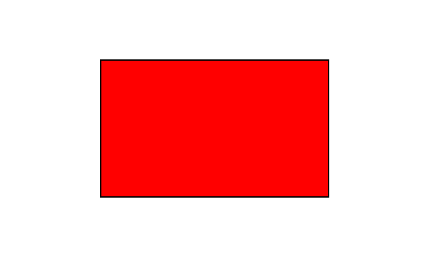
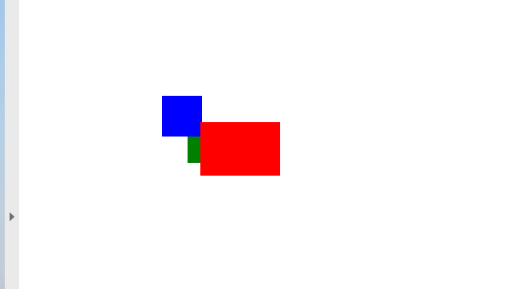

<script type="application/ld+json">
{
    "@context": "https://schema.org",
    "@type": "TechArticle",
    "headline": "Add Rectangle Object to PDF file",
    "alternativeHeadline": "Add Rectangle to PDF file",
    "abstract": "The new feature in Aspose.PDF for .NET allows users to seamlessly add Rectangle objects to PDF documents. This functionality includes options to customize the rectangles with solid colors, gradient fills, and transparency, delivering enhanced visual customization and layering control for PDF content",
    "author": {
        "@type": "Person",
        "name": "Anastasiia Holub",
        "givenName": "Anastasiia",
        "familyName": "Holub",
        "url": "https://www.linkedin.com/in/anastasiia-holub-750430225/"
    },
    "genre": "pdf document generation",
    "keywords": "Add Rectangle, PDF document generation, Aspose.PDF for .NET, Rectangle object, fill rectangle, gradient color fill, Z-Order control, alpha channel color, graph objects in PDF, create filled rectangle",
    "wordcount": "1263",
    "proficiencyLevel": "Beginner",
    "publisher": {
        "@type": "Organization",
        "name": "Aspose.PDF for .NET",
        "url": "https://products.aspose.com/pdf",
        "logo": "https://www.aspose.cloud/templates/aspose/img/products/pdf/aspose_pdf-for-net.svg",
        "alternateName": "Aspose",
        "sameAs": [
            "https://facebook.com/aspose.pdf/",
            "https://twitter.com/asposepdf",
            "https://www.youtube.com/channel/UCmV9sEg_QWYPi6BJJs7ELOg/featured",
            "https://www.linkedin.com/company/aspose",
            "https://stackoverflow.com/questions/tagged/aspose",
            "https://aspose.quora.com/",
            "https://aspose.github.io/"
        ],
        "contactPoint": [
            {
                "@type": "ContactPoint",
                "telephone": "+1 903 306 1676",
                "contactType": "sales",
                "areaServed": "US",
                "availableLanguage": "en"
            },
            {
                "@type": "ContactPoint",
                "telephone": "+44 141 628 8900",
                "contactType": "sales",
                "areaServed": "GB",
                "availableLanguage": "en"
            },
            {
                "@type": "ContactPoint",
                "telephone": "+61 2 8006 6987",
                "contactType": "sales",
                "areaServed": "AU",
                "availableLanguage": "en"
            }
        ]
    },
    "url": "/net/add-rectangle/",
    "mainEntityOfPage": {
        "@type": "WebPage",
        "@id": "/net/add-rectangle/"
    },
    "dateModified": "2024-11-25",
    "description": "This article explains how to create a Rectangle object to your PDF using Aspose.PDF for .NET."
}
</script>

The following code snippet also work with [Aspose.PDF.Drawing](/pdf/net/drawing/) library.

## Add Rectangle object

Aspose.PDF for .NET supports the feature to add graph objects (for example graph, line, rectangle etc.) to PDF documents. You also get the leverage to add [Rectangle](https://reference.aspose.com/pdf/net/aspose.pdf.drawing/rectangle) object where you also offers the feature to fill rectangle object with a certain color, control Z-Order, add gradiant color fill and etc.

First, let's look at the possibility of creating a Rectangle object.

Follow the steps below:

1. Create a new PDF [Document](https://reference.aspose.com/pdf/net/aspose.pdf/document).
1. Add [Page](https://reference.aspose.com/pdf/net/aspose.pdf/page) to pages collection of PDF file.
1. Add [Text fragment](https://reference.aspose.com/pdf/net/aspose.pdf/texfragment) to paragraphs collection of page instance.
1. Create [Graph](https://reference.aspose.com/pdf/net/aspose.pdf.drawing/graph) instance.
1. Set border for [Drawing object](https://reference.aspose.com/pdf/net/aspose.pdf.drawing).
1. Create Rectangle instance.

1. Add [Rectangle](https://reference.aspose.com/pdf/net/aspose.pdf.drawing/rectangle) object to shapes collection of Graph object.
1. Add graph object to paragraphs collection of page instance.
1. Add [Text fragment](https://reference.aspose.com/pdf/net/aspose.pdf/texfragment) to paragraphs collection of page instance.

1. And save your PDF file

```csharp
private static void AddRectangle(Aspose.Pdf.Page page, float x, float y, float width, float height, Aspose.Pdf.Color color, int zIndex)
{
    // Create a Graph object with dimensions matching the specified rectangle
    var graph = new Aspose.Pdf.Drawing.Graph(width, height)
    {
        // Prevent the graph from repositioning automatically
        IsChangePosition = false,
        // Set the Left coordinate position for the Graph instance
        Left = x,
        // Set the Top coordinate position for the Graph instance
        Top = y
    };

    // Create a Rectangle object inside the Graph
    var rect = new Aspose.Pdf.Drawing.Rectangle(0, 0, width, height)
    {
        // Set the fill color of the rectangle
        GraphInfo =
        {
            FillColor = color,
            // Set the border color of the rectangle
            Color = color
        }
    };

    // Add the rectangle to the Shapes collection of the Graph
    graph.Shapes.Add(rect);

    // Set the Z-Index for the Graph object to control layering
    graph.ZIndex = zIndex;

    // Add the Graph object to the Paragraphs collection of the page
    page.Paragraphs.Add(graph);
}
```


## Create Filled Rectangle Object

Aspose.PDF for .NET also offers the feature to fill rectangle object with a certain color.

The following code snippet shows how to add a [Rectangle](https://reference.aspose.com/pdf/net/aspose.pdf.drawing/rectangle) object that is filled with color.

```csharp
private static void RectangleFilled()
{
    // Path to the document directory
    var dataDir = RunExamples.GetDataDir_AsposePdf_Images();

    // Create Document instance using 'using' block to ensure proper disposal
    using (var document = new Aspose.Pdf.Document())
    {
        // Add page to pages collection of PDF file
        var page = document.Pages.Add();

        // Create Graph instance
        var graph = new Aspose.Pdf.Drawing.Graph(100, 400);

        // Add graph object to paragraphs collection of page instance
        page.Paragraphs.Add(graph);

        // Create Rectangle instance with specified dimensions
        var rect = new Aspose.Pdf.Drawing.Rectangle(100, 100, 200, 120)
        {
            // Specify fill color for the Rectangle object
            GraphInfo = 
            { 
                FillColor = Aspose.Pdf.Color.Red 
            }
        };

        // Add rectangle object to shapes collection of Graph object
        graph.Shapes.Add(rect);

        // Save PDF file
        document.Save(dataDir + "CreateFilledRectangle_out.pdf");
    }
}
```

Look at the result of rectangle filled solid color:



## Add Drawing with Gradient Fill

Aspose.PDF for .NET supports the feature to add graph objects to PDF documents and sometimes it is required to fill graph objects with Gradient Color. To Fill graph objects with Gradient Color, We need to set setPatterColorSpace with gradientAxialShading object as following.

The following code snippet shows how to add a [Rectangle](https://reference.aspose.com/pdf/net/aspose.pdf.drawing/rectangle) object that is filled with Gradient Color.

```csharp
// For complete examples and data files, visit https://github.com/aspose-pdf/Aspose.PDF-for-.NET

private static void CreateFilledRectangleGradientFill()
{
    // Path to the document directory
    var dataDir = RunExamples.GetDataDir_AsposePdf_Images();

    // Create Document instance using 'using' block to ensure proper disposal
    using (var document = new Aspose.Pdf.Document())
    {
        // Add page to pages collection of PDF file
        var page = document.Pages.Add();

        // Create Graph instance
        var graph = new Aspose.Pdf.Drawing.Graph(400, 400);

        // Add graph object to paragraphs collection of page instance
        page.Paragraphs.Add(graph);

        // Create Rectangle instance
        var rect = new Aspose.Pdf.Drawing.Rectangle(0, 0, 300, 300);

        // Create a gradient fill color
        var gradientColor = new Aspose.Pdf.Color();
        var gradientSettings = new Aspose.Pdf.Drawing.GradientAxialShading(Aspose.Pdf.Color.Red, Aspose.Pdf.Color.Blue)
        {
            Start = new Aspose.Pdf.Point(0, 0),
            End = new Aspose.Pdf.Point(350, 350)
        };
        gradientColor.PatternColorSpace = gradientSettings;

        // Apply gradient fill color to the rectangle
        rect.GraphInfo.FillColor = gradientColor;

        // Add rectangle object to shapes collection of Graph object
        graph.Shapes.Add(rect);

        // Save PDF file
        document.Save(dataDir + "CreateFilledRectangleGradient_out.pdf");
    }
}
```


## Create Rectangle with Alpha color channel

Aspose.PDF for .NET supports to fill rectangle object with a certain color. A rectangle object can also have Alpha color channel to give transparent appearance. The following code snippet shows how to add a [Rectangle](https://reference.aspose.com/pdf/net/aspose.pdf.drawing/rectangle) object with Alpha color channel.

Pixels of the image can store information about their opacity along with color value. This allows creating images with transparent or semi-transparent areas.

Instead of making a color transparent, each pixel stores information on how opaque it is. This opacity data is called alpha channel and is typically stored after the color channels of the pixel.

```csharp
// For complete examples and data files, visit https://github.com/aspose-pdf/Aspose.PDF-for-.NET

private static void RectangleFilled_AlphaChannel()
{
    // Path to the document directory
    var dataDir = RunExamples.GetDataDir_AsposePdf_Images();

    // Create Document instance using 'using' block to ensure proper disposal
    using (var document = new Aspose.Pdf.Document())
    {
        // Add page to pages collection of PDF file
        var page = document.Pages.Add();

        // Create Graph instance
        var graph = new Aspose.Pdf.Drawing.Graph(100, 400);

        // Add graph object to paragraphs collection of page instance
        page.Paragraphs.Add(graph);

        // Create first rectangle with alpha channel fill color
        var rect = new Aspose.Pdf.Drawing.Rectangle(100, 100, 200, 120)
        {
            GraphInfo = 
            { 
                FillColor = Aspose.Pdf.Color.FromArgb(128, 244, 180, 0) 
            }
        };

        // Add the first rectangle to the shapes collection of the Graph object
        graph.Shapes.Add(rect);

        // Create second rectangle with different alpha channel fill color
        var rect1 = new Aspose.Pdf.Drawing.Rectangle(200, 150, 200, 100)
        {
            GraphInfo = 
            { 
                FillColor = Aspose.Pdf.Color.FromArgb(160, 120, 0, 120) 
            }
        };

        // Add the second rectangle to the shapes collection of the Graph object
        graph.Shapes.Add(rect1);

        // Save PDF file
        document.Save(dataDir + "CreateFilledRectangle_out.pdf");
    }
}
```


## Control Z-Order of Rectangle

Aspose.PDF for .NET supports the feature to add graph objects (for example graph, line, rectangle etc.) to PDF documents. When adding more than one instance of same object inside PDF file, we can control their rendering by specifying the Z-Order. Z-Order is also used when we need to render objects on top of each other.

The following code snippet shows the steps to render [Rectangle](https://reference.aspose.com/pdf/net/aspose.pdf.drawing/rectangle) objects on top of each other.

```csharp
// For complete examples and data files, visit https://github.com/aspose-pdf/Aspose.PDF-for-.NET

private static void AddRectangleZOrder()
{
    // Path to the document directory
    var dataDir = RunExamples.GetDataDir_AsposePdf_Images();

    // Instantiate Document class object using 'using' block to ensure proper disposal
    using (var document = new Aspose.Pdf.Document())
    {
        // Add page to pages collection of PDF file
        var page = document.Pages.Add();

        // Set size of PDF page
        page.SetPageSize(375, 300);

        // Set left and top margins for the page object as 0
        page.PageInfo.Margin.Left = 0;
        page.PageInfo.Margin.Top = 0;

        // Create rectangles with different colors and Z-Order values
        AddRectangle(page, 50, 40, 60, 40, Aspose.Pdf.Color.Red, 2);
        AddRectangle(page, 20, 20, 30, 30, Aspose.Pdf.Color.Blue, 1);
        AddRectangle(page, 40, 40, 60, 30, Aspose.Pdf.Color.Green, 0);

        // Save the resultant PDF file
        document.Save(dataDir + "ControlRectangleZOrder_out.pdf");
    }
}
```



<script type="application/ld+json">
{
    "@context": "http://schema.org",
    "@type": "SoftwareApplication",
    "name": "Aspose.PDF for .NET Library",
    "image": "https://www.aspose.cloud/templates/aspose/img/products/pdf/aspose_pdf-for-net.svg",
    "url": "https://www.aspose.com/",
    "publisher": {
        "@type": "Organization",
        "name": "Aspose.PDF",
        "url": "https://products.aspose.com/pdf",
        "logo": "https://www.aspose.cloud/templates/aspose/img/products/pdf/aspose_pdf-for-net.svg",
        "alternateName": "Aspose",
        "sameAs": [
            "https://facebook.com/aspose.pdf/",
            "https://twitter.com/asposepdf",
            "https://www.youtube.com/channel/UCmV9sEg_QWYPi6BJJs7ELOg/featured",
            "https://www.linkedin.com/company/aspose",
            "https://stackoverflow.com/questions/tagged/aspose",
            "https://aspose.quora.com/",
            "https://aspose.github.io/"
        ],
        "contactPoint": [
            {
                "@type": "ContactPoint",
                "telephone": "+1 903 306 1676",
                "contactType": "sales",
                "areaServed": "US",
                "availableLanguage": "en"
            },
            {
                "@type": "ContactPoint",
                "telephone": "+44 141 628 8900",
                "contactType": "sales",
                "areaServed": "GB",
                "availableLanguage": "en"
            },
            {
                "@type": "ContactPoint",
                "telephone": "+61 2 8006 6987",
                "contactType": "sales",
                "areaServed": "AU",
                "availableLanguage": "en"
            }
        ]
    },
    "offers": {
        "@type": "Offer",
        "price": "1199",
        "priceCurrency": "USD"
    },
    "applicationCategory": "PDF Manipulation Library for .NET",
    "downloadUrl": "https://www.nuget.org/packages/Aspose.PDF/",
    "operatingSystem": "Windows, MacOS, Linux",
    "screenshot": "https://docs.aspose.com/pdf/net/create-pdf-document/screenshot.png",
    "softwareVersion": "2022.1",
    "aggregateRating": {
        "@type": "AggregateRating",
        "ratingValue": "5",
        "ratingCount": "16"
    }
}
</script>
