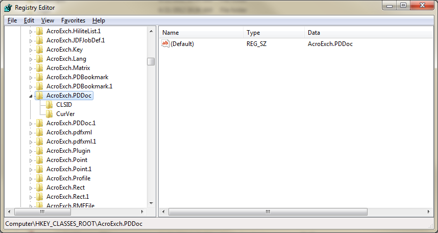

<script type="application/ld+json">
{
    "@context": "https://schema.org",
    "@type": "TechArticle",
    "headline": "Generate Thumbnail Images from PDF",
    "alternativeHeadline": "Generate Thumbnails from PDF Documents Effortlessly",
    "abstract": "The new feature allows users to efficiently generate thumbnail images directly from PDF documents. This functionality enhances document management by transforming PDF pages into easily shareable image formats, streamlining workflows for developers and users alike. With support for various image formats, this feature simplifies the process of visualizing PDF content without the need for external software like Adobe Acrobat",
    "author": {
        "@type": "Person",
        "name": "Anastasiia Holub",
        "givenName": "Anastasiia",
        "familyName": "Holub",
        "url": "https://www.linkedin.com/in/anastasiia-holub-750430225/"
    },
    "genre": "pdf document generation",
    "keywords": "Generate Thumbnail Images, PDF documents, Aspose.PDF for .NET, Acrobat SDK, image formats, PDF Manipulation Library, JavaScript, interapplication communication, thumbnail images, JPEG conversion",
    "wordcount": "767",
    "proficiencyLevel": "Beginner",
    "publisher": {
        "@type": "Organization",
        "name": "Aspose.PDF for .NET",
        "url": "https://products.aspose.com/pdf",
        "logo": "https://www.aspose.cloud/templates/aspose/img/products/pdf/aspose_pdf-for-net.svg",
        "alternateName": "Aspose",
        "sameAs": [
            "https://facebook.com/aspose.pdf/",
            "https://twitter.com/asposepdf",
            "https://www.youtube.com/channel/UCmV9sEg_QWYPi6BJJs7ELOg/featured",
            "https://www.linkedin.com/company/aspose",
            "https://stackoverflow.com/questions/tagged/aspose",
            "https://aspose.quora.com/",
            "https://aspose.github.io/"
        ],
        "contactPoint": [
            {
                "@type": "ContactPoint",
                "telephone": "+1 903 306 1676",
                "contactType": "sales",
                "areaServed": "US",
                "availableLanguage": "en"
            },
            {
                "@type": "ContactPoint",
                "telephone": "+44 141 628 8900",
                "contactType": "sales",
                "areaServed": "GB",
                "availableLanguage": "en"
            },
            {
                "@type": "ContactPoint",
                "telephone": "+61 2 8006 6987",
                "contactType": "sales",
                "areaServed": "AU",
                "availableLanguage": "en"
            }
        ]
    },
    "url": "/net/generate-thumbnail-images-from-pdf-documents/",
    "mainEntityOfPage": {
        "@type": "WebPage",
        "@id": "/net/generate-thumbnail-images-from-pdf-documents/"
    },
    "dateModified": "2024-11-26",
    "description": "This section describes how to generate thumbnail images from PDF documents"
}
</script>

{}

The Adobe Acrobat SDK is a set of tools that help you develop software that interacts with Acrobat technology. The SDK contains header files, type libraries, simple utilities, sample code, and documentation.

Using the Acrobat SDK, you can develop software that integrates with Acrobat and Adobe Reader in several ways:

- **JavaScript** — Write scripts, either in an individual PDF document or externally, to extend the functionality of Acrobat or Adobe Reader.
- **Plug-ins** — Create plug-ins that are dynamically linked to and extend the functionality of Acrobat or Adobe Reader.
- **Interapplication communication** — Write a separate application process that uses interapplication communication (IAC) to control Acrobat functionality. DDE and OLE are supported on Microsoft® Windows®, and Apple events/AppleScript on Mac OS®. IAC is not available on UNIX®.

Aspose.PDF for .NET provides a lot of the same functionality, freeing you from dependence on Adobe Acrobat Automation. This article shows how to generate thumbnail images from PDF documents using first the Acrobat SDK and then Aspose.PDF.

{}

## Developing Application using Acrobat Interapplication communication API

Think of the Acrobat API as having two distinct layers that use Acrobat Interapplication Communication (IAC) objects:

- The Acrobat application (AV) layer. The AV layer lets you control how the document is viewed. For example, the view of a document object resides in the layer associated with Acrobat.
- The portable document (PD) layer. The PD layer provides access to the information within a document, such as a page. From the PD layer you can perform basic manipulations of PDF documents, such as deleting, moving, or replacing pages, as well as changing annotation attributes. You can also print PDF pages, select text, access manipulated text, and create or delete thumbnails.

As our intent is to convert PDF pages into thumbnail images, so we are focusing more over IAC. The IAC API contains objects such as PDDoc, PDPage, PDAnnot, and others, which enable the user to deal with the portable document (PD) layer. The following code sample scans a folder and converts PDF pages into thumbnail images. With using the Acrobat SDK, we could also read the PDF metadata and retrieve the number of pages in the document.

### Acrobat Approach

In order to generate the thumbnail images for each document, we have used the Adobe Acrobat 7.0 SDK and the Microsoft .NET 2.0 Framework.

The [Acrobat SDK](https://opensource.adobe.com/dc-acrobat-sdk-docs/acrobatsdk/) combined with the full version of Adobe Acrobat exposes a COM library of objects (sadly the free Adobe Reader does not expose the COM interfaces) that can be used to manipulate and access PDF information. Using these COM objects via COM Interop, load the PDF document, get the first page and render that page to the clipboard. Then, with the .NET Framework, copy this to a bitmap, scale and combine the image and save the result as a GIF or PNG file.

Once Adobe Acrobat is installed, use regedit.exe and look under HKEY_CLASSES_ROOT for entry entry called AcroExch.PDDoc.

**The registry showing the AcroExch.PDDDoc entry**



```csharp
private static void GenerateThumbnailImagesFromPDF()
{
    // Acrobat objects
    Acrobat.CAcroPDDoc pdfDoc;
    Acrobat.CAcroPDPage pdfPage;
    Acrobat.CAcroRect pdfRect;
    Acrobat.CAcroPoint pdfPoint;

    AppSettingsReader appSettings = new AppSettingsReader();
    string pdfInputPath = appSettings.GetValue("pdfInputPath", typeof(string)).ToString();
    string pngOutputPath = appSettings.GetValue("pngOutputPath", typeof(string)).ToString();
    string templatePortraitFile = Application.StartupPath + @"\pdftemplate_portrait.gif";
    string templateLandscapeFile = Application.StartupPath + @"\pdftemplate_landscape.gif";

    try
    {
        // Get list of files to process from the input path
        string[] files = Directory.GetFiles(pdfInputPath, "*.pdf");

        for (int n = 0; n < files.Length; n++)
        {
            string inputFile = files[n];
            string outputFile = Path.Combine(pngOutputPath, Path.GetFileNameWithoutExtension(inputFile) + ".png");

            // Create the document
            pdfDoc = (Acrobat.CAcroPDDoc)Microsoft.VisualBasic.Interaction.CreateObject("AcroExch.PDDoc", "");

            if (pdfDoc.Open(inputFile) == 0)
            {
                throw new FileNotFoundException($"Unable to open PDF file: {inputFile}");
            }

            int pageCount = pdfDoc.GetNumPages();
            pdfPage = (Acrobat.CAcroPDPage)pdfDoc.AcquirePage(0);
            pdfPoint = (Acrobat.CAcroPoint)pdfPage.GetSize();

            pdfRect = (Acrobat.CAcroRect)Microsoft.VisualBasic.Interaction.CreateObject("AcroExch.Rect", "");
            pdfRect.Left = 0;
            pdfRect.right = pdfPoint.x;
            pdfRect.Top = 0;
            pdfRect.bottom = pdfPoint.y;

            pdfPage.CopyToClipboard(pdfRect, 0, 0, 100);
            IDataObject clipboardData = Clipboard.GetDataObject();

            if (clipboardData.GetDataPresent(DataFormats.Bitmap))
            {
                Bitmap pdfBitmap = (Bitmap)clipboardData.GetData(DataFormats.Bitmap);

                int thumbnailWidth = 45;
                int thumbnailHeight = 59;
                string templateFile = pdfPoint.x < pdfPoint.y ? templatePortraitFile : templateLandscapeFile;

                if (pdfPoint.x > pdfPoint.y)
                {
                    // Swap width and height for landscape orientation
                    (thumbnailWidth, thumbnailHeight) = (thumbnailHeight, thumbnailWidth);
                }

                Bitmap templateBitmap = new Bitmap(templateFile);
                Image pdfImage = pdfBitmap.GetThumbnailImage(thumbnailWidth, thumbnailHeight, null, IntPtr.Zero);

                Bitmap thumbnailBitmap = new Bitmap(thumbnailWidth + 7, thumbnailHeight + 7, System.Drawing.Imaging.PixelFormat.Format32bppArgb);

                templateBitmap.MakeTransparent();

                using (Graphics thumbnailGraphics = Graphics.FromImage(thumbnailBitmap))
                {
                    thumbnailGraphics.DrawImage(pdfImage, 2, 2, thumbnailWidth, thumbnailHeight);
                    thumbnailGraphics.DrawImage(templateBitmap, 0, 0);
                    thumbnailBitmap.Save(outputFile, System.Drawing.Imaging.ImageFormat.Png);
                }

                Console.WriteLine("Generated thumbnail: {0}", outputFile);

                pdfDoc.Close();
                Marshal.ReleaseComObject(pdfPage);
                Marshal.ReleaseComObject(pdfRect);
                Marshal.ReleaseComObject(pdfDoc);
            }
        }
    }
    catch (Exception ex)
    {
        Console.WriteLine($"An error occurred: {ex}");
    }
}
```

## Aspose.PDF for .NET Approach

Aspose.PDF for .NET provides extensive support for dealing with PDF documents. It also supports the capability to convert the pages of PDF documents to a variety of image formats. The functionality described above can easily be achieved using Aspose.PDF for .NET.

Aspose.PDF has distinct benefits:

- You don't need to have Adobe Acrobat installed on your system to work with PDF files.
- Using Aspose.PDF for .NET is simple and easy to understand as compared to Acrobat Automation.

If we need to convert PDF pages into JPEGs, the [Aspose.PDF.Devices](https://reference.aspose.com/pdf/net/aspose.pdf.devices) namespace provides a class named [JpegDevice](https://reference.aspose.com/pdf/net/aspose.pdf.devices/jpegdevice) for rendering PDF pages into JPEG images. Please take a look over the following code snippet.

```csharp
private static void GenerateThumbnailImagesFromPDF()
{
    // For complete examples and data files, please go to https://github.com/aspose-pdf/Aspose.PDF-for-.NET
    // The path to the documents directory.
    string dataDir = RunExamples.GetDataDir_AsposePdf_Images();

    // Retrieve names of all the PDF files in a particular directory
    string[] fileEntries = Directory.GetFiles(dataDir, "*.pdf");

    // Iterate through all the files entries in array
    for (int counter = 0; counter < fileEntries.Length; counter++)
    {
        //Open document
        using (var pdfDocument = new Document(fileEntries[counter]))
        {
            for (int pageCount = 1; pageCount <= pdfDocument.Pages.Count; pageCount++)
            {
                using (FileStream imageStream = new FileStream(dataDir + "\\Thumbanils" + counter.ToString() + "_" + pageCount + ".jpg", FileMode.Create))
                {
                    //Create Resolution object
                    Resolution resolution = new Resolution(300);
                    //JpegDevice jpegDevice = new JpegDevice(500, 700, resolution, 100);
                    JpegDevice jpegDevice = new JpegDevice(45, 59, resolution, 100);
                    //Convert a particular page and save the image to stream
                    jpegDevice.Process(pdfDocument.Pages[pageCount], imageStream);
                }
            }
        }
    }
}
```

{}

- Thank you to CodeProject for [Generate Thumbnail Image from PDF document](https://www.codeproject.com/Articles/5887/Generate-Thumbnail-Images-from-PDF-Documents).
- Thank you to Acrobat for the [Acrobat SDK reference](https://opensource.adobe.com/dc-acrobat-sdk-docs/acrobatsdk/documentation.html).

{}

<script type="application/ld+json">
{
    "@context": "http://schema.org",
    "@type": "SoftwareApplication",
    "name": "Aspose.PDF for .NET Library",
    "image": "https://www.aspose.cloud/templates/aspose/img/products/pdf/aspose_pdf-for-net.svg",
    "url": "https://www.aspose.com/",
    "publisher": {
        "@type": "Organization",
        "name": "Aspose.PDF",
        "url": "https://products.aspose.com/pdf",
        "logo": "https://www.aspose.cloud/templates/aspose/img/products/pdf/aspose_pdf-for-net.svg",
        "alternateName": "Aspose",
        "sameAs": [
            "https://facebook.com/aspose.pdf/",
            "https://twitter.com/asposepdf",
            "https://www.youtube.com/channel/UCmV9sEg_QWYPi6BJJs7ELOg/featured",
            "https://www.linkedin.com/company/aspose",
            "https://stackoverflow.com/questions/tagged/aspose",
            "https://aspose.quora.com/",
            "https://aspose.github.io/"
        ],
        "contactPoint": [
            {
                "@type": "ContactPoint",
                "telephone": "+1 903 306 1676",
                "contactType": "sales",
                "areaServed": "US",
                "availableLanguage": "en"
            },
            {
                "@type": "ContactPoint",
                "telephone": "+44 141 628 8900",
                "contactType": "sales",
                "areaServed": "GB",
                "availableLanguage": "en"
            },
            {
                "@type": "ContactPoint",
                "telephone": "+61 2 8006 6987",
                "contactType": "sales",
                "areaServed": "AU",
                "availableLanguage": "en"
            }
        ]
    },
    "offers": {
        "@type": "Offer",
        "price": "1199",
        "priceCurrency": "USD"
    },
    "applicationCategory": "PDF Manipulation Library for .NET",
    "downloadUrl": "https://www.nuget.org/packages/Aspose.PDF/",
    "operatingSystem": "Windows, MacOS, Linux",
    "screenshot": "https://docs.aspose.com/pdf/net/create-pdf-document/screenshot.png",
    "softwareVersion": "2022.1",
    "aggregateRating": {
        "@type": "AggregateRating",
        "ratingValue": "5",
        "ratingCount": "16"
    }
}
</script>
