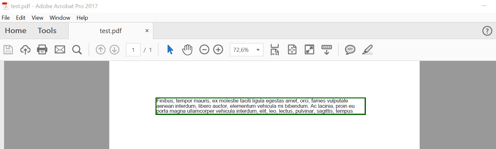
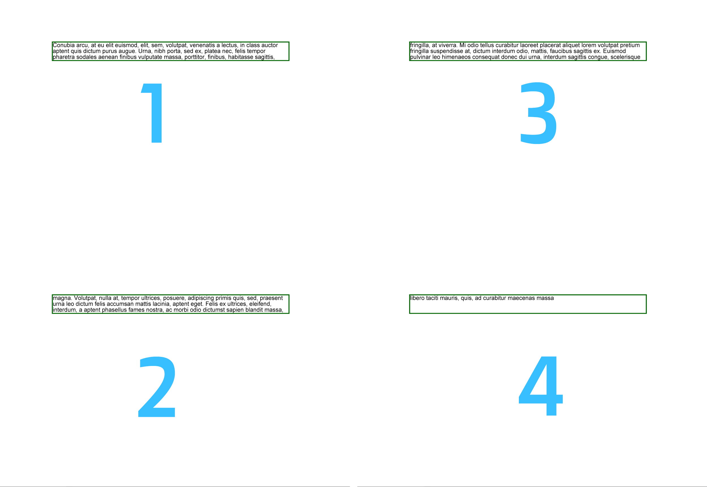

<script type="application/ld+json">
{
    "@context": "https://schema.org",
    "@type": "TechArticle",
    "headline": "Using FloatingBox for text generation",
    "alternativeHeadline": "FloatingBox Enhances PDF Text Layout Options",
    "abstract": "The FloatingBox feature enhances PDF text formatting by allowing users to manage text placement with precision, including multi-column layouts and adjustable offsets. It supports text clipping, background colors, and options for repeating content across pages, making it a versatile tool for creating structured and visually appealing documents",
    "author": {
        "@type": "Person",
        "name": "Anastasiia Holub",
        "givenName": "Anastasiia",
        "familyName": "Holub",
        "url": "https://www.linkedin.com/in/anastasiia-holub-750430225/"
    },
    "genre": "pdf document generation",
    "wordcount": "682",
    "proficiencyLevel": "Beginner",
    "publisher": {
        "@type": "Organization",
        "name": "Aspose.PDF for .NET",
        "url": "https://products.aspose.com/pdf",
        "logo": "https://www.aspose.cloud/templates/aspose/img/products/pdf/aspose_pdf-for-net.svg",
        "alternateName": "Aspose",
        "sameAs": [
            "https://facebook.com/aspose.pdf/",
            "https://twitter.com/asposepdf",
            "https://www.youtube.com/channel/UCmV9sEg_QWYPi6BJJs7ELOg/featured",
            "https://www.linkedin.com/company/aspose",
            "https://stackoverflow.com/questions/tagged/aspose",
            "https://aspose.quora.com/",
            "https://aspose.github.io/"
        ],
        "contactPoint": [
            {
                "@type": "ContactPoint",
                "telephone": "+1 903 306 1676",
                "contactType": "sales",
                "areaServed": "US",
                "availableLanguage": "en"
            },
            {
                "@type": "ContactPoint",
                "telephone": "+44 141 628 8900",
                "contactType": "sales",
                "areaServed": "GB",
                "availableLanguage": "en"
            },
            {
                "@type": "ContactPoint",
                "telephone": "+61 2 8006 6987",
                "contactType": "sales",
                "areaServed": "AU",
                "availableLanguage": "en"
            }
        ]
    },
    "url": "/net/floating-box/",
    "mainEntityOfPage": {
        "@type": "WebPage",
        "@id": "/net/floating-box/"
    },
    "dateModified": "2024-11-25",
    "description": "Aspose.PDF can perform not only simple and easy tasks but also cope with more complex goals. Check the next section for advanced users and developers."
}
</script>

This feature also work in [Aspose.PDF.Drawing](/pdf/net/drawing/) library.

## Basics of using the FloatingBox tool

The Floating Box tool is a special tool for placing text and other content on a PDF page. Its main feature is text clipping when it overlaps the size of the FloatingBox.

```cs
// For complete examples and data files, please go to https://github.com/aspose-pdf/Aspose.PDF-for-.NET
private static void CreateAndAddFloatingBox()
{
    // Create the document
    using (var document = new Aspose.Pdf.Document())
    {
        var page = document.Pages.Add();
        // Create and fill box
        var box = new Aspose.Pdf.FloatingBox(400, 30)
        {
            Border = new Aspose.Pdf.BorderInfo(Aspose.Pdf.BorderSide.All, 1.5f, Aspose.Pdf.Color.DarkGreen),
            IsNeedRepeating = false,
        };
        box.Paragraphs.Add(new Aspose.Pdf.Text.TextFragment("text example"));
        // Add box
        page.Paragraphs.Add(box);
    }
}
```  

In the example above, we are creating a FloatingBox with a width of 400 pt and a height of 30 pt.
Also, in this example, more text was intentionally created than could fit in the given size.
As a result, the text was cut off.



Property `IsNeedRepeating` with `false` vaule limit text with 1 page.

If we set this property to `true` the text will be reflow to the next page in the same position.



## Advanced features of FloatingBox

### Multi-column support

#### Multi-column layout (simple case)

`FloatingBox` supports multi-column layout. To create such a layout, you must define the values ​​of the ColumnInfo properties.

* `ColumnWidths` is a string with enumeration of width in pt.
* `ColumnSpacing` is a string with width of the gap between columns.
* `ColumnCount` is a number of columns.

```cs
// For complete examples and data files, please go to https://github.com/aspose-pdf/Aspose.PDF-for-.NET
private static void MultiColumnLayout()
{
    // The path to the documents directory
    var dataDir = RunExamples.GetDataDir_AsposePdf_Tooltip();

    // Create the document
    using (var document = new Aspose.Pdf.Document())
    {
        // Add page
        var page = document.Pages.Add();
        // Set margin settings
        page.PageInfo.Margin = new Aspose.Pdf.MarginInfo(36, 18, 36, 18);
        var columnCount = 3;
        var spacing = 10;
        var width = page.PageInfo.Width
            - page.PageInfo.Margin.Left
            - page.PageInfo.Margin.Right
            - (columnCount - 1) * spacing;
        var columnWidth = width / 3;
        // Create FloatingBox
        var box = new Aspose.Pdf.FloatingBox()
        {
            IsNeedRepeating = true
        };
        box.ColumnInfo.ColumnWidths = $"{columnWidth} {columnWidth} {columnWidth}";
        box.ColumnInfo.ColumnSpacing = $"{spacing}";
        box.ColumnInfo.ColumnCount = 3;

        var phrase = "text example";
        var paragraphs = new string[10]
        {
            phrase, phrase, phrase, phrase, phrase,
            phrase, phrase, phrase, phrase, phrase,
        };
        foreach (var paragraph in paragraphs)
        {
            box.Paragraphs.Add(new Aspose.Pdf.Text.TextFragment(paragraph));
        }
        // Add a box to a page
        page.Paragraphs.Add(box);
        // Save the document
        document.Save(dataDir + "sample_out.pdf");
    }
}
```

We used the additional library LoremNET in the above example and created 20 paragraphs. These paragraphs were divided into three columns and filled the following pages until the text ran out.

#### Multi-column layout with forced column start

We will do the same with the following example as the previous one. The difference is that we created 3 paragraphs. We can force FloatingBox to render each paragraph in the new column. To do that we need to set `IsFirstParagraphInColumn` when we adding text to the FloatingBox object.

```cs
// For complete examples and data files, please go to https://github.com/aspose-pdf/Aspose.PDF-for-.NET
private static void MultiColumnLayout2()
{
    // The path to the documents directory
    var dataDir = RunExamples.GetDataDir_AsposePdf_Tooltip();

    // Create the document
    using (var document = new Aspose.Pdf.Document())
    {
        // Add page
        var page = document.Pages.Add();
        // Set margin settings
        page.PageInfo.Margin = new Aspose.Pdf.MarginInfo(36, 18, 36, 18);
        var columnCount = 3;
        var spacing = 10;
        var width = page.PageInfo.Width
            - page.PageInfo.Margin.Left
            - page.PageInfo.Margin.Right
            - (columnCount - 1) * spacing;
        var columnWidth = width / 3;
        // Create the FloatingBox
        var box = new Aspose.Pdf.FloatingBox()
        {
            IsNeedRepeating = true
        };
        box.ColumnInfo.ColumnWidths = $"{columnWidth} {columnWidth} {columnWidth}";
        box.ColumnInfo.ColumnSpacing = $"{spacing}";
        box.ColumnInfo.ColumnCount = 3;

        var phrase = "text example";
        var paragraphs = new string[10]
        {
            phrase, phrase, phrase, phrase, phrase,
            phrase, phrase, phrase, phrase, phrase,
        };
        foreach (var paragraph in paragraphs)
        {
            var text = new Aspose.Pdf.Text.TextFragment(paragraph)
            {
                IsFirstParagraphInColumn = true
            };
            box.Paragraphs.Add(text);
        }

        // Add a box to a page
        page.Paragraphs.Add(box);
        // Save the document
        document.Save(dataDir + "sample_out.pdf");
    }
}
```

### Background support

You can set desired background color by using `BackgroundColor` property.

```cs
// For complete examples and data files, please go to https://github.com/aspose-pdf/Aspose.PDF-for-.NET
private static void BackgroundSupport()
{
    // Create the document
    using (var document = new Aspose.Pdf.Document())
    {
        var page = document.Pages.Add();
        var box = new Aspose.Pdf.FloatingBox(400, 60)
        {
            IsNeedRepeating = false,
            BackgroundColor = Aspose.Pdf.Color.LightGreen,
        };
        var text = "text example";
        box.Paragraphs.Add(new Aspose.Pdf.Text.TextFragment(text));
        page.Paragraphs.Add(box);
    }
}
```

### Positioning support

The location of the FloatingBox on the generated page is determined by the `PositioningMode`, `Left`, `Top` properties.
When the `PositioningMode` value is
- `ParagraphPositioningMode.Default` (default value)
	The location is determined by the previously placed elements.
	Adding an element is taken into account when determining the location of subsequent elements.
	If the value of at least one of the Left, Top properties is not zero, then they are also taken into account, but this uses a not entirely obvious logic and it is better not to use this.

- `ParagraphPositioningMode.Absolute`
	The location is specified by the Left and Top values, does not depend on previous elements and does not affect the location of subsequent ones.

```cs
// For complete examples and data files, please go to https://github.com/aspose-pdf/Aspose.PDF-for-.NET
private static void OffsetSupport()
{
    // Create the document
    using (var document = new Aspose.Pdf.Document())
    {
        // Add page
        var page = document.Pages.Add();
        // Create FloatingBox
        var box = new Aspose.Pdf.FloatingBox()
        {
            Top = 45,
            Left = 15,
            PositioningMode = Aspose.Pdf.ParagraphPositioningMode.Absolute
            Border = new Aspose.Pdf.BorderInfo(Aspose.Pdf.BorderSide.All, 1.5f, Aspose.Pdf.Color.DarkGreen)
        };
        box.Paragraphs.Add(new Aspose.Pdf.Text.TextFragment("text example 1"));

        page.Paragraphs.Add(new Aspose.Pdf.Text.TextFragment("text example 2"));
        // Add the box to the page
        page.Paragraphs.Add(box);
        page.Paragraphs.Add(new Aspose.Pdf.Text.TextFragment("text example 3"));
    }
}
```
