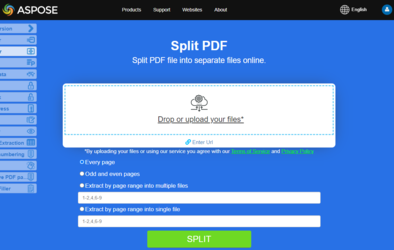

<script type="application/ld+json">
{
    "@context": "https://schema.org",
    "@type": "TechArticle",
    "headline": "Split PDF programmatically",
    "alternativeHeadline": "Effortlessly split PDF into individual files with C#",
    "abstract": "Allows developers to programmatically split PDF documents into individual files using C#. This feature simplifies the management of PDF content by enabling the extraction of distinct pages into separate PDF files within .NET applications, enhancing workflow efficiency and document handling capabilities",
    "author": {
        "@type": "Person",
        "name": "Anastasiia Holub",
        "givenName": "Anastasiia",
        "familyName": "Holub",
        "url": "https://www.linkedin.com/in/anastasiia-holub-750430225/"
    },
    "genre": "pdf document generation",
    "wordcount": "326",
    "proficiencyLevel": "Beginner",
    "publisher": {
        "@type": "Organization",
        "name": "Aspose.PDF for .NET",
        "url": "https://products.aspose.com/pdf",
        "logo": "https://www.aspose.cloud/templates/aspose/img/products/pdf/aspose_pdf-for-net.svg",
        "alternateName": "Aspose",
        "sameAs": [
            "https://facebook.com/aspose.pdf/",
            "https://twitter.com/asposepdf",
            "https://www.youtube.com/channel/UCmV9sEg_QWYPi6BJJs7ELOg/featured",
            "https://www.linkedin.com/company/aspose",
            "https://stackoverflow.com/questions/tagged/aspose",
            "https://aspose.quora.com/",
            "https://aspose.github.io/"
        ],
        "contactPoint": [
            {
                "@type": "ContactPoint",
                "telephone": "+1 903 306 1676",
                "contactType": "sales",
                "areaServed": "US",
                "availableLanguage": "en"
            },
            {
                "@type": "ContactPoint",
                "telephone": "+44 141 628 8900",
                "contactType": "sales",
                "areaServed": "GB",
                "availableLanguage": "en"
            },
            {
                "@type": "ContactPoint",
                "telephone": "+61 2 8006 6987",
                "contactType": "sales",
                "areaServed": "AU",
                "availableLanguage": "en"
            }
        ]
    },
    "url": "/net/split-pdf-document/",
    "mainEntityOfPage": {
        "@type": "WebPage",
        "@id": "/net/split-pdf-document/"
    },
    "dateModified": "2024-11-26",
    "description": "This topic shows how to split PDF pages into individual PDF files in your .NET applications with C#."
}
</script>

## Live Example

[Aspose.PDF Splitter](https://products.aspose.app/pdf/splitter) is an online free web application that allows you to investigate how presentation splitting functionality works.

[](https://products.aspose.app/pdf/splitter)

This topic shows how to split PDF pages into individual PDF files in your .NET applications. To split PDF pages into single page PDF files using C#, the following steps can be followed:

1. Loop through the pages of PDF document through the [Document](https://reference.aspose.com/pdf/net/aspose.pdf/document) object's [PageCollection](https://reference.aspose.com/pdf/net/aspose.pdf/pagecollection) collection.
1. For each iteration, create a new Document object and add the individual [Page](https://reference.aspose.com/pdf/net/aspose.pdf/page) object into the empty document.
1. Save the new PDF using [Save](https://reference.aspose.com/pdf/net/aspose.pdf.document/save/methods/4) method.

The following code snippet also work with [Aspose.PDF.Drawing](/pdf/net/drawing/) library.

## Split PDF into multiple files or separate pdfs

The following C# code snippet shows you how to split PDF pages into individual PDF files.

```csharp
// For complete examples and data files, please go to https://github.com/aspose-pdf/Aspose.PDF-for-.NET
private static void SplitDocument()
{
    // The path to the documents directory
    var dataDir = RunExamples.GetDataDir_AsposePdf_Pages();

    // Open the document
    using (var document1 = new Aspose.Pdf.Document(dataDir + "SplitToPages.pdf"))
    {
        int pageCount = 1;

        // Loop through all the pages
        foreach (var page in document1.Pages)
        {
            // Create the document
            using (var document2 = new Aspose.Pdf.Document())
            {
                document2.Pages.Add(page);
                // Save the document
                document2.Save(dataDir + "Page_" + pageCount + "_out.pdf");
                pageCount++;
            }
        }
    }
}
```

<script type="application/ld+json">
{
    "@context": "http://schema.org",
    "@type": "SoftwareApplication",
    "name": "Aspose.PDF for .NET Library",
    "image": "https://www.aspose.cloud/templates/aspose/img/products/pdf/aspose_pdf-for-net.svg",
    "url": "https://www.aspose.com/",
    "publisher": {
        "@type": "Organization",
        "name": "Aspose.PDF",
        "url": "https://products.aspose.com/pdf",
        "logo": "https://www.aspose.cloud/templates/aspose/img/products/pdf/aspose_pdf-for-net.svg",
        "alternateName": "Aspose",
        "sameAs": [
            "https://facebook.com/aspose.pdf/",
            "https://twitter.com/asposepdf",
            "https://www.youtube.com/channel/UCmV9sEg_QWYPi6BJJs7ELOg/featured",
            "https://www.linkedin.com/company/aspose",
            "https://stackoverflow.com/questions/tagged/aspose",
            "https://aspose.quora.com/",
            "https://aspose.github.io/"
        ],
        "contactPoint": [
            {
                "@type": "ContactPoint",
                "telephone": "+1 903 306 1676",
                "contactType": "sales",
                "areaServed": "US",
                "availableLanguage": "en"
            },
            {
                "@type": "ContactPoint",
                "telephone": "+44 141 628 8900",
                "contactType": "sales",
                "areaServed": "GB",
                "availableLanguage": "en"
            },
            {
                "@type": "ContactPoint",
                "telephone": "+61 2 8006 6987",
                "contactType": "sales",
                "areaServed": "AU",
                "availableLanguage": "en"
            }
        ]
    },
    "offers": {
        "@type": "Offer",
        "price": "1199",
        "priceCurrency": "USD"
    },
    "applicationCategory": "PDF Manipulation Library for .NET",
    "downloadUrl": "https://www.nuget.org/packages/Aspose.PDF/",
    "operatingSystem": "Windows, MacOS, Linux",
    "screenshot": "https://docs.aspose.com/pdf/net/create-pdf-document/screenshot.png",
    "softwareVersion": "2022.1",
    "aggregateRating": {
        "@type": "AggregateRating",
        "ratingValue": "5",
        "ratingCount": "16"
    }
}
</script>
