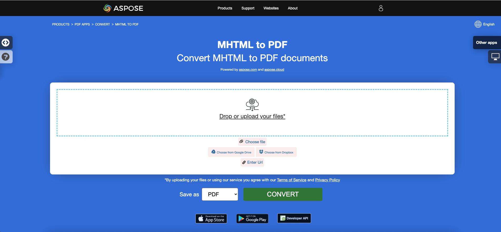

<script type="application/ld+json">
{
    "@context": "https://schema.org",
    "@type": "TechArticle",
    "headline": "Convert HTML to PDF in .NET",
    "alternativeHeadline": "Convert HTML and MHTML to PDF with C#",
    "abstract": "The conversion feature in Aspose.PDF for .NET allows seamless transformation of HTML and MHTML documents into high-quality PDF files. With advanced customization options, users can control font embedding, media queries, and external resource management while ensuring that web pages or local HTML files are accurately rendered into PDF format with flexibility tailored to their specific needs",
    "author": {
        "@type": "Person",
        "name": "Anastasiia Holub",
        "givenName": "Anastasiia",
        "familyName": "Holub",
        "url": "https://www.linkedin.com/in/anastasiia-holub-750430225/"
    },
    "genre": "pdf document generation",
    "wordcount": "1889",
    "proficiencyLevel": "Beginner",
    "publisher": {
        "@type": "Organization",
        "name": "Aspose.PDF for .NET",
        "url": "https://products.aspose.com/pdf",
        "logo": "https://www.aspose.cloud/templates/aspose/img/products/pdf/aspose_pdf-for-net.svg",
        "alternateName": "Aspose",
        "sameAs": [
            "https://facebook.com/aspose.pdf/",
            "https://twitter.com/asposepdf",
            "https://www.youtube.com/channel/UCmV9sEg_QWYPi6BJJs7ELOg/featured",
            "https://www.linkedin.com/company/aspose",
            "https://stackoverflow.com/questions/tagged/aspose",
            "https://aspose.quora.com/",
            "https://aspose.github.io/"
        ],
        "contactPoint": [
            {
                "@type": "ContactPoint",
                "telephone": "+1 903 306 1676",
                "contactType": "sales",
                "areaServed": "US",
                "availableLanguage": "en"
            },
            {
                "@type": "ContactPoint",
                "telephone": "+44 141 628 8900",
                "contactType": "sales",
                "areaServed": "GB",
                "availableLanguage": "en"
            },
            {
                "@type": "ContactPoint",
                "telephone": "+61 2 8006 6987",
                "contactType": "sales",
                "areaServed": "AU",
                "availableLanguage": "en"
            }
        ]
    },
    "url": "/net/convert-html-to-pdf/",
    "mainEntityOfPage": {
        "@type": "WebPage",
        "@id": "/net/convert-html-to-pdf/"
    },
    "dateModified": "2024-11-25",
    "description": "Aspose.PDF can perform not only simple and easy tasks but also cope with more complex goals. Check the next section for advanced users and developers."
}
</script>

## Overview 

This article explains how to **convert HTML to PDF using C#**. It covers the following topics.

The following code snippet also work with [Aspose.PDF.Drawing](/pdf/net/drawing/) library.

- [Convert HTML to PDF](#csharp-html-to-pdf)
- [Convert WebPage to PDF](#csharp-webpage-to-pdf)
- [Convert MHTML to PDF](#csharp-mhtml-to-pdf)

**Aspose.PDF for .NET** is a PDF manipulation API that lets you convert any existing HTML documents to PDF seamlessly. The process of converting HTML to PDF can be flexibly customized.

## Convert HTML to PDF

The following C# code sample shows how to convert an HTML document to a PDF.

<a name="csharp-html-to-pdf"><strong>Convert HTML to PDF</strong></a>

1. Create an instance of the [HtmlLoadOptions](https://reference.aspose.com/pdf/net/aspose.pdf/htmlloadoptions/) class.
2. Initialize [Document](https://reference.aspose.com/pdf/net/aspose.pdf/document/) object.
3. Save output PDF document by calling **Document.Save()** method.

```csharp
// For complete examples and data files, visit https://github.com/aspose-pdf/Aspose.PDF-for-.NET
private static void ConvertHTMLtoPDF()
{
    // The path to the documents directory
    var dataDir = RunExamples.GetDataDir_AsposePdf();

    // Load the HTML file into a document using HtmlLoadOptions
    var options = new Aspose.Pdf.HtmlLoadOptions();

    // Open HTML document
    using (var document = new Aspose.Pdf.Document(dataDir + "test.html", options))
    {
        // Save PDF document
        document.Save(dataDir + "ConvertHTMLtoPDF_out.pdf");
    }
}
```

{}
**Try to convert HTML to PDF online**

Aspose presents you online free application ["HTML to PDF"](https://products.aspose.app/html/en/conversion/html-to-pdf), where you may try to investigate the functionality and quality it works.

[](https://products.aspose.app/html/en/conversion/html-to-pdf)
{}

## Advanced conversion from HTML to PDF

The HTML Conversion engine has several options that allow us to control the conversion process.

### Media Queries Support

Media queries are a popular technique for delivering a tailored style sheet to different devices. We can set device type using [`HtmlMediaType`](https://reference.aspose.com/pdf/net/aspose.pdf/htmlloadoptions/properties/htmlmediatype) property.

```csharp
// For complete examples and data files, visit https://github.com/aspose-pdf/Aspose.PDF-for-.NET
private static void ConvertHTMLtoPDFAdvancedMediaType()
{
    // The path to the documents directory
    var dataDir = RunExamples.GetDataDir_AsposePdf();

    // Load the HTML file into a document using HtmlLoadOptions with Print media type
    var options = new HtmlLoadOptions
    {
        // Set Print or Screen mode
        HtmlMediaType = Aspose.Pdf.HtmlMediaType.Print
    };

    // Open HTML document
    using (var document = new Aspose.Pdf.Document(dataDir + "test.html", options))
    {
        // Save PDF document
        document.Save(dataDir + "ConvertHTMLtoPDFAdvancedMediaType_out.pdf");
    }
}
```

### Enable (disable) font embedding

HTML pages often use fonts (i.g. fonts from local folder, Google Fonts, etc). We can also control the embedding of fonts in a document using a [`IsEmbedFonts`](https://reference.aspose.com/pdf/net/aspose.pdf/htmlloadoptions/properties/isembedfonts) property.

```csharp
 // For complete examples and data files, visit https://github.com/aspose-pdf/Aspose.PDF-for-.NET
 private static void ConvertHTMLtoPDFAdvancedEmbedFonts()
 {
     // The path to the documents directory
     var dataDir = RunExamples.GetDataDir_AsposePdf();

     // Load the HTML file into a document using HtmlLoadOptions with the font embedding option set
     var options = new Aspose.Pdf.HtmlLoadOptions
     {
         // Disable font embedding
         IsEmbedFonts = false
     };

     // Open HTML document
     using (var document = new Aspose.Pdf.Document(dataDir + "test_fonts.html", options))
     {
         // Save PDF document
         document.Save(dataDir + "ConvertHTMLtoPDFAdvanced_EmbedFonts_out.pdf");
     }
 }
```

### Manage external resource loading

The Conversion Engine provides a mechanism that allows you to control the loading of certain resources associated with the HTML document.
The [`HtmlLoadOptions`](https://reference.aspose.com/pdf/net/aspose.pdf/htmlloadoptions) class has the property [`CustomLoaderOfExternalResources`](https://reference.aspose.com/pdf/net/aspose.pdf/htmlloadoptions/fields/customloaderofexternalresources) with which we can define the behavior of the resource loader.
Assume we need to replace all PNG images with single image `test.jpg` and replace external URL to internal for other resources.
To do this we can define a custom loader `SamePictureLoader` and points [`CustomLoaderOfExternalResources`](https://reference.aspose.com/pdf/net/aspose.pdf/htmlloadoptions/fields/customloaderofexternalresources) to this name.

```csharp
// For complete examples and data files, visit https://github.com/aspose-pdf/Aspose.PDF-for-.NET
private static void ConvertHTMLtoPDFAdvanced_DummyImage()
{
    // The path to the documents directory
    var dataDir = RunExamples.GetDataDir_AsposePdf();

    // Load the HTML file into a document with a custom resource loader for external images
    var options = new Aspose.Pdf.HtmlLoadOptions
    {
        CustomLoaderOfExternalResources = SamePictureLoader
    };

    // Open HTML document
    using (var document = new Aspose.Pdf.Document(dataDir + "test.html", options))
    {
        // Save PDF document
        document.Save(dataDir + "html_test.pdf");
    }
}

private static Aspose.Pdf.LoadOptions.ResourceLoadingResult SamePictureLoader(string resourceURI)
{
    // The path to the documents directory
    var dataDir = RunExamples.GetDataDir_AsposePdf();
    Aspose.Pdf.LoadOptions.ResourceLoadingResult result;

    if (resourceURI.EndsWith(".png"))
    {
        byte[] resultBytes = File.ReadAllBytes(dataDir + "test.jpg");
        result = new Aspose.Pdf.LoadOptions.ResourceLoadingResult(resultBytes)
        {
            // Set MIME Type
            MIMETypeIfKnown = "image/jpeg"
        };
    }
    else
    {
        result = new Aspose.Pdf.LoadOptions.ResourceLoadingResult(GetContentFromUrl(resourceURI));
    }
    return result;
}

private static byte[] GetContentFromUrl(string url)
{
    var httpClient = new System.Net.Http.HttpClient();
    return httpClient.GetByteArrayAsync(url).GetAwaiter().GetResult();
}
```

## Convert Web page to PDF

Converting a web page is slightly different than converting a local HTML document. In order to convert Web page contents to PDF format, we can first fetch the HTML page contents using HttpClient instance, create Stream object, pass the contents to the Document object and render the output in PDF format.

When converting a web page hosted on a webserver to PDF:

<a name="csharp-webpage-to-pdf"><strong>Convert WebPage to PDF</strong></a>

1. Read the contents of the page using an HttpClient object.
1. Instantiate the [HtmlLoadOptions](https://reference.aspose.com/pdf/net/aspose.pdf/htmlloadoptions) object and set the base URL.
1. Initialize a Document object while passing the stream object.
1. Optionally, set the page size and/or orientation.

```csharp
// For complete examples and data files, visit https://github.com/aspose-pdf/Aspose.PDF-for-.NET
private static void ConvertHTMLtoPDFAdvanced_WebPage()
{
    // The path to the documents directory
    var dataDir = RunExamples.GetDataDir_AsposePdf();

    const string url = "https://en.wikipedia.org/wiki/Aspose_API";

    // Set page size A3 and Landscape orientation;   
    var options = new Aspose.Pdf.HtmlLoadOptions(url)
    {
        PageInfo =
        {
            Width = 842,
            Height = 1191,
            IsLandscape = true
        }
    };

    // Load the web page content as a stream and create a PDF document
    using (var document = new Aspose.Pdf.Document(GetContentFromUrlAsStream(url), options))
    {
        // Save PDF document
        document.Save(dataDir + "html_test.pdf");
    }
}

private static Stream GetContentFromUrlAsStream(string url, System.Net.ICredentials credentials = null)
{
    using (var handler = new System.Net.Http.HttpClientHandler { Credentials = credentials })
    using (var httpClient = new System.Net.Http.HttpClient(handler))
    {
        return httpClient.GetStreamAsync(url).GetAwaiter().GetResult();
    }
}
```

### Provide credentials Web page to PDF conversion

Sometimes we need to perform the conversion of HTML files which require authentication and access privileges, so that only authentic users can fetch the page contents. It also includes the scenario where some resources/data referenced inside HTML are fetched from some external server which requires authentication and in order to cater to this requirement, the [`ExternalResourcesCredentials`](https://reference.aspose.com/pdf/net/aspose.pdf/htmlloadoptions/fields/externalresourcescredentials) property is added to [`HtmlLoadOptions`](https://reference.aspose.com/pdf/net/aspose.pdf/htmlloadoptions) class. Following code snippet shows the steps to pass credentials to request HTML & its respective resources while converting HTML file to PDF conversion.

```csharp
 // For complete examples and data files, visit https://github.com/aspose-pdf/Aspose.PDF-for-.NET
 private static void ConvertHTMLtoPDFAdvancedAuthorized()
 {
     // The path to the documents directory
     var dataDir = RunExamples.GetDataDir_AsposePdf();

     const string url = "http://httpbin.org/basic-auth/user1/password1";
     var credentials = new System.Net.NetworkCredential("user1", "password1");

     var options = new Aspose.Pdf.HtmlLoadOptions(url)
     {
         ExternalResourcesCredentials = credentials
     };

     using (var document = new Aspose.Pdf.Document(GetContentFromUrlAsStream(url, credentials), options))
     {
         // Save PDF document
         document.Save(dataDir + "HtmlTest_out.pdf");
     }
 }

private static Stream GetContentFromUrlAsStream(string url, System.Net.ICredentials credentials = null)
{
    using (var handler = new System.Net.Http.HttpClientHandler { Credentials = credentials })
    using (var httpClient = new System.Net.Http.HttpClient(handler))
    {
        return httpClient.GetStreamAsync(url).GetAwaiter().GetResult();
    }
}
```

### Render all HTML content in a single Page

Aspose.PDF for .NET provides the ability to render all contents on a single page while converting HTML file to PDF format. For example, if you have some HTML content which output size is greater than one page, you can use option for rendering output data into a single PDF page. For using this option HtmlLoadOptions class was extended by IsRenderToSinglePage flag. The code snippet below shows how to use this functionality.

```csharp
 // For complete examples and data files, visit https://github.com/aspose-pdf/Aspose.PDF-for-.NET
 private static void ConvertHTMLtoPDFAdvancedSinglePageRendering()
 {
     // The path to the documents directory
     var dataDir = RunExamples.GetDataDir_AsposePdf();

     // Initialize HtmlLoadOptions
     var options = new Aspose.Pdf.HtmlLoadOptions
     {
         // Set Render to single page property
         IsRenderToSinglePage = true
     };

     // Open PDF document
     using (var document = new Aspose.Pdf.Document(dataDir + "HTMLToPDF.html", options))
     {
         // Save PDF document
         document.Save(dataDir + "RenderContentToSamePage_out.pdf");
     }
 }
```

### Render HTML with SVG Data

Aspose.PDF for .NET provides ability to convert HTML page to PDF document. Since HTML allows adding SVG graphic element as a tag in the page, Aspose.PDF also supports conversion of such data into the resultant PDF file. The following code snippet shows how to convert HTML files with SVG graphic tags to Tagged PDF Documents.

```csharp
// For complete examples and data files, visit https://github.com/aspose-pdf/Aspose.PDF-for-.NET
private static void ConvertHTMLtoPDFWithSVG()
{
    // The path to the documents directory
    var dataDir = RunExamples.GetDataDir_AsposePdf();

    // Initialize HtmlLoadOptions
    var options = new Aspose.Pdf.HtmlLoadOptions(Path.GetDirectoryName(dataDir + "HTMLSVG.html"));

    // Initialize Document object
    using (var document = new Aspose.Pdf.Document(dataDir + "HTMLSVG.html", options))
    {
        // Save PDF document
        document.Save(dataDir + "RenderHTMLwithSVGData_out.pdf");
    }
}
```

## Convert MHTML to PDF 

{}
**Try to convert MHTML to PDF online**

Aspose.PDF for .NET presents you online free application ["MHTML to PDF"](https://products.aspose.app/pdf/conversion/mhtml-to-pdf), where you may try to investigate the functionality and quality it works.

[](https://products.aspose.app/pdf/conversion/mhtml-to-pdf)
{}

<abbr title="MIME encapsulation of aggregate HTML documents">MHTML</abbr>, short for MIME HTML, is a web page archive format used to combine resources that are typically represented by external links (such as images, Flash animations, Java applets, and audio files) with HTML code into a single file. The content of an MHTML file is encoded as if it were an HTML email message, using the MIME type multipart/related. Aspose.PDF for .NET can convert HTML files to PDF format and with the release of Aspose.PDF for .NET 9.0.0, we have introduced a new feature that lets you convert MHTML files to PDF format. Next code snippet show how to covert MHTML files to PDF format with C#:

<a name="csharp-mhtml-to-pdf"><strong>Convert MHTML to PDF</strong></a>

1. Create an instance of the [MhtLoadOptions](https://reference.aspose.com/pdf/net/aspose.pdf/mhtloadoptions/) class.
2. Initialize [Document](https://reference.aspose.com/pdf/net/aspose.pdf/document/) object.
3. Save output PDF document by calling **Document.Save()** method.

```csharp
// For complete examples and data files, visit https://github.com/aspose-pdf/Aspose.PDF-for-.NET
private static void ConvertMHTtoPDF()
{
    // The path to the documents directory
    var dataDir = RunExamples.GetDataDir_AsposePdf();

    // Initialize MhtLoadOptions with page setup
    var options = new Aspose.Pdf.MhtLoadOptions()
    {
        PageInfo = { Width = 842, Height = 1191, IsLandscape = true }
    };

    // Initialize Document object using the MHT file and options
    using (var document = new Aspose.Pdf.Document(dataDir + "fileformatinfo.mht", options))
    {
        // Save PDF document
        document.Save(dataDir + "MhtmlTest_out.pdf");
    }
}
```
