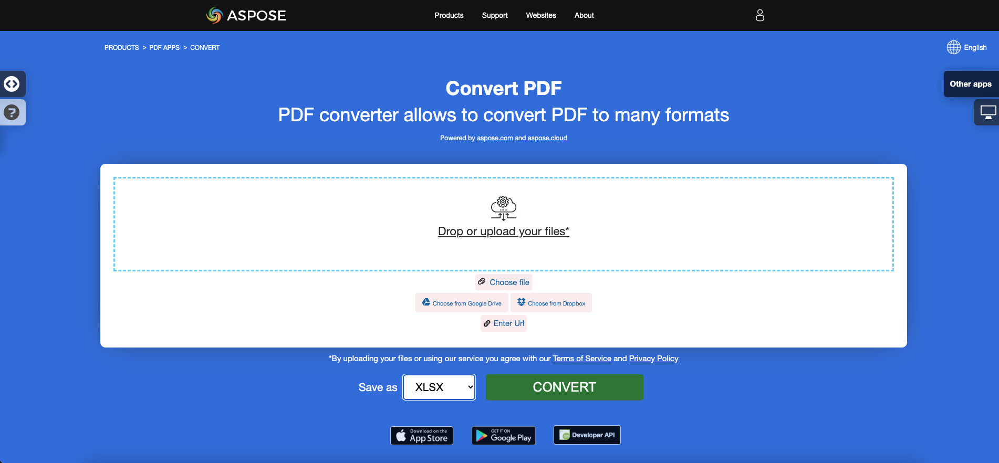

<script type="application/ld+json">
{
    "@context": "https://schema.org",
    "@type": "TechArticle",
    "headline": "Convert PDF to Excel in .NET",
    "alternativeHeadline": "Convert PDF Files to Excel Formats with C#",
    "abstract": "Discover the powerful capability of Aspose.PDF for .NET to effortlessly convert PDF documents into various Excel formats, including XLS, XLSX, CSV, and ODS, using C#. This feature not only allows for the transformation of individual PDF pages into separate Excel worksheets but also offers options for combined sheets, providing flexibility for users to manage their PDF data efficiently",
    "author": {
        "@type": "Person",
        "name": "Anastasiia Holub",
        "givenName": "Anastasiia",
        "familyName": "Holub",
        "url": "https://www.linkedin.com/in/anastasiia-holub-750430225/"
    },
    "genre": "pdf document generation",
    "wordcount": "1780",
    "proficiencyLevel": "Beginner",
    "publisher": {
        "@type": "Organization",
        "name": "Aspose.PDF for .NET",
        "url": "https://products.aspose.com/pdf",
        "logo": "https://www.aspose.cloud/templates/aspose/img/products/pdf/aspose_pdf-for-net.svg",
        "alternateName": "Aspose",
        "sameAs": [
            "https://facebook.com/aspose.pdf/",
            "https://twitter.com/asposepdf",
            "https://www.youtube.com/channel/UCmV9sEg_QWYPi6BJJs7ELOg/featured",
            "https://www.linkedin.com/company/aspose",
            "https://stackoverflow.com/questions/tagged/aspose",
            "https://aspose.quora.com/",
            "https://aspose.github.io/"
        ],
        "contactPoint": [
            {
                "@type": "ContactPoint",
                "telephone": "+1 903 306 1676",
                "contactType": "sales",
                "areaServed": "US",
                "availableLanguage": "en"
            },
            {
                "@type": "ContactPoint",
                "telephone": "+44 141 628 8900",
                "contactType": "sales",
                "areaServed": "GB",
                "availableLanguage": "en"
            },
            {
                "@type": "ContactPoint",
                "telephone": "+61 2 8006 6987",
                "contactType": "sales",
                "areaServed": "AU",
                "availableLanguage": "en"
            }
        ]
    },
    "url": "/net/convert-pdf-to-excel/",
    "mainEntityOfPage": {
        "@type": "WebPage",
        "@id": "/net/convert-pdf-to-excel/"
    },
    "dateModified": "2024-11-25",
    "description": "Aspose.PDF can perform not only simple and easy tasks but also cope with more complex goals. Check the next section for advanced users and developers."
}
</script>

## Overview

This article explains how to **convert PDF to Excel formats using C#**. It covers the following topics.

The following code snippet also work with [Aspose.PDF.Drawing](/pdf/net/drawing/) library.

_Format_: **XLS**

- [C# PDF to XLS](#csharp-pdf-to-xls)
- [C# Convert PDF to XLS](#csharp-pdf-to-xls)
- [C# How to convert PDF file to XLS](#csharp-pdf-to-xls)

_Format_: **XLSX**

- [C# PDF to XLSX](#csharp-pdf-to-xlsx)
- [C# Convert PDF to XLSX](#csharp-pdf-to-xlsx)
- [C# How to convert PDF file to XLSX](#csharp-pdf-to-xlsx)

_Format_: **Excel**

- [C# PDF to Excel](#csharp-pdf-to-xlsx)
- [C# PDF to Excel XLS](#csharp-pdf-to-xls)
- [C# PDF to Excel XLSX](#csharp-pdf-to-xlsx)

_Format_: **Single Excel Worksheet**

- [C# Convert PDF to XLS having Single Worksheet](#csharp-pdf-to-excel-single)
- [C# Convert PDF to XLSX having Single Worksheet](#csharp-pdf-to-excel-single)

_Format_: **XML Spreadsheet 2003 format**

- [C# PDF to XML Excel](#csharp-pdf-to-excel-xml-2003)
- [C# Convert PDF to XML Excel Spreadsheet](#csharp-pdf-to-excel-xml-2003)

_Format_: **CSV**

- [C# PDF to CSV](#csharp-pdf-to-csv)
- [C# Convert PDF to CSV](#csharp-pdf-to-csv)
- [C# How to convert PDF file to CSV](#csharp-pdf-to-csv)

_Format_: **ODS**

- [C# PDF to ODS](#csharp-pdf-to-ods)
- [C# Convert PDF to ODS](#csharp-pdf-to-ods)
- [C# How to convert PDF file to ODS](#csharp-pdf-to-ods)

## C# PDF to Excel Conversions

**Aspose.PDF for .NET** support the feature of converting PDF files to Excel 2007, CSV and SpeadsheetML formats.

Aspose.PDF for .NET is a PDF manipulation component, we have introduced a feature that renders PDF file to Excel workbook (XLSX files). During this conversion, the individual pages of the PDF file are converted to Excel worksheets.

{}
**Try to convert PDF to Excel online**

Aspose.PDF for .NET presents you online free application ["PDF to XLSX"](https://products.aspose.app/pdf/conversion/pdf-to-xlsx), where you may try to investigate the functionality and quality it works.

[](https://products.aspose.app/pdf/conversion/pdf-to-xlsx)
{}

In order to convert PDF files to <abbr title="Microsoft Excel Open XML Spreadsheet">XLSX</abbr> format, Aspose.PDF has a class called [ExcelSaveOptions](https://reference.aspose.com/pdf/net/aspose.pdf/excelsaveoptions). An object of the ExcelSaveOptions class is passed as a second argument to the Document.Save(..) constructor.

The following code snippet shows the process for converting PDF file into XLS or XLSX format with Aspose.PDF for .NET.

<a name="csharp-pdf-to-xls"><strong>Steps: Convert PDF to XLS in C#</strong></a>

1. Create an instance of **Document** object with the source PDF document.
2. Create an instance of **ExcelSaveOptions**.
3. Save it to **XLS** format specifying **.xls extension** by calling **Document.Save()** method and passing it **ExcelSaveOptions**.

<a name="csharp-pdf-to-xlsx"><strong>Steps: Convert PDF to XLSX in C#</strong></a>

1. Create an instance of **Document** object with the source PDF document.
2. Create an instance of **ExcelSaveOptions**.
3. Save it to **XLSX** format specifying **.xlsx extension** by calling **Document.Save()** method and passing it **ExcelSaveOptions**.

```csharp
  // For complete examples and data files, visit https://github.com/aspose-pdf/Aspose.PDF-for-.NET
 private static void ConvertPDFtoExcel()
 {
     var dataDir = RunExamples.GetDataDir_AsposePdf();
     // Open the source PDF document
     using (var document = new Aspose.Pdf.Document(dataDir + "input.pdf"))
     {
         // Instantiate ExcelSaveOptions object
         var saveOptions = new Aspose.Pdf.ExcelSaveOptions();

         // Save the file in XLSX format
         document.Save(dataDir + "PDFToXLS_out.xlsx", saveOptions);
     }
 }
```

## Convert PDF to XLS with Control Column

When converting a PDF to XLS format, a blank column is added to the output file as first column. The in ExcelSaveOptions class' InsertBlankColumnAtFirst option is used to control this column. The default value is `false`, which means that blank columns will not be inserted.

```csharp
// For complete examples and data files, visit https://github.com/aspose-pdf/Aspose.PDF-for-.NET
private static void ConvertPDFtoExcelAdvanced_InsertBlankColumnAtFirst()
{
    var dataDir = RunExamples.GetDataDir_AsposePdf();
    // Open the source PDF document
    using (var document = new Aspose.Pdf.Document(dataDir + "input.pdf"))
    {

        // Instantiate ExcelSaveOptions object
        var saveOptions = new Aspose.Pdf.ExcelSaveOptions
        {
            InsertBlankColumnAtFirst = false
        };

        // Save the file in XLSX format
        document.Save(dataDir + "PDFToXLS_out.xlsx", saveOptions);
    }
}
```

## Convert PDF to Single Excel Worksheet

When exporting a PDF file with a lot of pages to XLS, each page is exported to a different sheet in the Excel file. This is because the MinimizeTheNumberOfWorksheets property is set to false by default. To ensure that all pages are exported to one single sheet in the output Excel file, set the MinimizeTheNumberOfWorksheets property to true.

<a name="csharp-pdf-to-excel-single"><strong>Steps: Convert PDF to XLS or XLSX Single Worksheet in C#</strong></a>

1. Create an instance of **Document** object with the source PDF document.
2. Create an instance of **ExcelSaveOptions** with **MinimizeTheNumberOfWorksheets = true**.
3. Save it to **XLS** or **XLSX** format having single worksheet by calling **Document.Save()** method and passing it **ExcelSaveOptions**.

```csharp
 // For complete examples and data files, visit https://github.com/aspose-pdf/Aspose.PDF-for-.NET
private static void ConvertPDFtoExcelAdvanced_MinimizeTheNumberOfWorksheets()
{
    var dataDir = RunExamples.GetDataDir_AsposePdf();
    // Open the source PDF document
    using (var document = new Aspose.Pdf.Document(dataDir + "input.pdf"))
    {

        // Instantiate ExcelSaveOptions object
        var saveOptions = new Aspose.Pdf.ExcelSaveOptions
        {
            MinimizeTheNumberOfWorksheets = true
        };

        // Save the file in XLSX format
        document.Save(dataDir + "PDFToXLS_out.xlsx", saveOptions);
    }
}
```

## Convert to other spreadsheet formats

### Convert to XML Spreadsheet 2003 format

Since version 20.8 Aspose.PDF uses Microsoft Excel Open XML Spreadsheet 2007 file format as default for storing data. In order to convert PDF files to XML Spreadsheet 2003 format, Aspose.PDF has a class called [ExcelSaveOptions](https://reference.aspose.com/pdf/net/aspose.pdf/excelsaveoptions) with [Format](https://reference.aspose.com/pdf/net/aspose.pdf/excelsaveoptions/properties/format). An object of the [ExcelSaveOptions](https://reference.aspose.com/pdf/net/aspose.pdf/excelsaveoptions) class is passed as a second argument to the [Document.Save(..)](https://reference.aspose.com/pdf/net/aspose.pdf/document/methods/save/index) method.

The following code snippet shows the process for converting PDF file into XLS Excel 2003 XML format.

<a name="csharp-pdf-to-excel-xml-2003"><strong>Steps: Convert PDF to Excel 2003 XML Format in C#</strong></a>

1. Create an instance of **Document** object with the source PDF document.
2. Create an instance of **ExcelSaveOptions** with **Format = ExcelSaveOptions.ExcelFormat.XMLSpreadSheet2003**.
3. Save it to **XLS - Excel 2003 XML Format** format by calling **Document.Save()** method and passing it **ExcelSaveOptions**.

```csharp
  // For complete examples and data files, visit https://github.com/aspose-pdf/Aspose.PDF-for-.NET
 private static void ConvertPDFtoExcelAdvanced_SaveXLS2003()
 {
     var dataDir = RunExamples.GetDataDir_AsposePdf();
     // Open the source PDF document
     using (var document = new Aspose.Pdf.Document(dataDir + "input.pdf"))
     {

         // Instantiate ExcelSaveOptions object
         var saveOptions = new Aspose.Pdf.ExcelSaveOptions
         {
             Format = Aspose.Pdf.ExcelSaveOptions.ExcelFormat.XMLSpreadSheet2003
         };

         // Save the file in XLS format
         document.Save(dataDir + "PDFToXLS_out.xls", saveOptions);
     }
 }
```

### Convert to CSV

Conversion to CSV format performs in the same way as above. All is what you need - set the appropriate format.

<a name="csharp-pdf-to-csv"><strong>Steps: Convert PDF to CSV in C#</strong></a>

1. Create an instance of **Document** object with the source PDF document.
2. Create an instance of **ExcelSaveOptions** with **Format = ExcelSaveOptions.ExcelFormat.CSV**.
3. Save it to **CSV** format by calling **Document.Save()** method and passing it **ExcelSaveOptions**.


```csharp
// For complete examples and data files, visit https://github.com/aspose-pdf/Aspose.PDF-for-.NET
private static void ConvertPDFToCSV()
{
    var dataDir = RunExamples.GetDataDir_AsposePdf();
    // Open the source PDF document
    using (var document = new Aspose.Pdf.Document(dataDir + "input.pdf"))
    {
        // Instantiate ExcelSaveOptions object
        var saveOptions = new Aspose.Pdf.ExcelSaveOptions
        {
            Format = Aspose.Pdf.ExcelSaveOptions.ExcelFormat.CSV
        };
        // Save the file in CSV format
        document.Save(dataDir + "PDFToXLS_out.csv", saveOptions);
    }
}
```

### Convert to ODS

<a name="csharp-pdf-to-ods"><strong>Steps: Convert PDF to ODS in C#</strong></a>

1. Create an instance of **Document** object with the source PDF document.
2. Create an instance of **ExcelSaveOptions** with **Format = ExcelSaveOptions.ExcelFormat.ODS**.
3. Save it to **ODS** format by calling **Document.Save()** method and passing it **ExcelSaveOptions**.


Conversion to ODS format performs in the same way as all other formats.

```csharp
// For complete examples and data files, visit https://github.com/aspose-pdf/Aspose.PDF-for-.NET
private static void ConvertPDFToODS()
{
    var dataDir = RunExamples.GetDataDir_AsposePdf();
    // Open the source PDF document
    using (var document = new Aspose.Pdf.Document(dataDir + "input.pdf"))
    {

        // Instantiate ExcelSaveOptions object
        var saveOptions = new Aspose.Pdf.ExcelSaveOptions
        {
            Format = Aspose.Pdf.ExcelSaveOptions.ExcelFormat.ODS
        };

        // Save the file in ODS format
        document.Save(dataDir + "PDFToODS_out.ods", saveOptions);
    }
}
```

## See Also 

This article also covers these topics. The codes are same as above.

_Format_: **Excel**
- [C# PDF to Excel Code](#csharp-pdf-to-xlsx)
- [C# PDF to Excel API](#csharp-pdf-to-xlsx)
- [C# PDF to Excel Programmatically](#csharp-pdf-to-xlsx)
- [C# PDF to Excel Library](#csharp-pdf-to-xlsx)
- [C# Save PDF as Excel](#csharp-pdf-to-xlsx)
- [C# Generate Excel from PDF](#csharp-pdf-to-xlsx)
- [C# Create Excel from PDF](#csharp-pdf-to-xlsx)
- [C# PDF to Excel Converter](#csharp-pdf-to-xlsx)

_Format_: **XLS**
- [C# PDF to XLS Code](#csharp-pdf-to-xls)
- [C# PDF to XLS API](#csharp-pdf-to-xls)
- [C# PDF to XLS Programmatically](#csharp-pdf-to-xls)
- [C# PDF to XLS Library](#csharp-pdf-to-xls)
- [C# Save PDF as XLS](#csharp-pdf-to-xls)
- [C# Generate XLS from PDF](#csharp-pdf-to-xls)
- [C# Create XLS from PDF](#csharp-pdf-to-xls)
- [C# PDF to XLS Converter](#csharp-pdf-to-xls)

_Format_: **XLSX**
- [C# PDF to XLSX Code](#csharp-pdf-to-xlsx)
- [C# PDF to XLSX API](#csharp-pdf-to-xlsx)
- [C# PDF to XLSX Programmatically](#csharp-pdf-to-xlsx)
- [C# PDF to XLSX Library](#csharp-pdf-to-xlsx)
- [C# Save PDF as XLSX](#csharp-pdf-to-xlsx)
- [C# Generate XLSX from PDF](#csharp-pdf-to-xlsx)
- [C# Create XLSX from PDF](#csharp-pdf-to-xlsx)
- [C# PDF to XLSX Converter](#csharp-pdf-to-xlsx)

_Format_: **CSV**
- [C# PDF to CSV Code](#csharp-pdf-to-csv)
- [C# PDF to CSV API](#csharp-pdf-to-csv)
- [C# PDF to CSV Programmatically](#csharp-pdf-to-csv)
- [C# PDF to CSV Library](#csharp-pdf-to-csv)
- [C# Save PDF as CSV](#csharp-pdf-to-csv)
- [C# Generate CSV from PDF](#csharp-pdf-to-csv)
- [C# Create CSV from PDF](#csharp-pdf-to-csv)
- [C# PDF to CSV Converter](#csharp-pdf-to-csv)

_Format_: **ODS**
- [C# PDF to ODS Code](#csharp-pdf-to-ods)
- [C# PDF to ODS API](#csharp-pdf-to-ods)
- [C# PDF to ODS Programmatically](#csharp-pdf-to-ods)
- [C# PDF to ODS Library](#csharp-pdf-to-ods)
- [C# Save PDF as ODS](#csharp-pdf-to-ods)
- [C# Generate ODS from PDF](#csharp-pdf-to-ods)
- [C# Create ODS from PDF](#csharp-pdf-to-ods)
- [C# PDF to ODS Converter](#csharp-pdf-to-ods)
