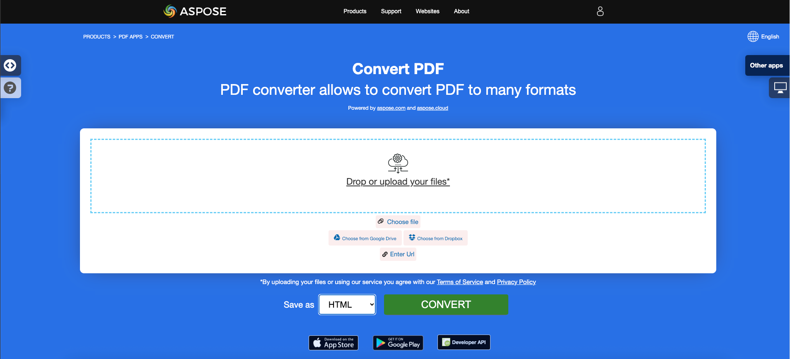

<script type="application/ld+json">
{
    "@context": "https://schema.org",
    "@type": "TechArticle",
    "headline": "Convert PDF to HTML in .NET",
    "alternativeHeadline": "Convert PDF Files to HTML with Simplified Options in C#",
    "abstract": "Introducing a powerful new feature in Aspose.PDF for .NET that enables seamless conversion of PDF documents to HTML format. This functionality supports multi-page output, SVG image management, and options for transparent text rendering, allowing developers to easily transform PDFs into web-ready content with just a few lines of C# code",
    "author": {
        "@type": "Person",
        "name": "Anastasiia Holub",
        "givenName": "Anastasiia",
        "familyName": "Holub",
        "url": "https://www.linkedin.com/in/anastasiia-holub-750430225/"
    },
    "genre": "pdf document generation",
    "wordcount": "1368",
    "proficiencyLevel": "Beginner",
    "publisher": {
        "@type": "Organization",
        "name": "Aspose.PDF for .NET",
        "url": "https://products.aspose.com/pdf",
        "logo": "https://www.aspose.cloud/templates/aspose/img/products/pdf/aspose_pdf-for-net.svg",
        "alternateName": "Aspose",
        "sameAs": [
            "https://facebook.com/aspose.pdf/",
            "https://twitter.com/asposepdf",
            "https://www.youtube.com/channel/UCmV9sEg_QWYPi6BJJs7ELOg/featured",
            "https://www.linkedin.com/company/aspose",
            "https://stackoverflow.com/questions/tagged/aspose",
            "https://aspose.quora.com/",
            "https://aspose.github.io/"
        ],
        "contactPoint": [
            {
                "@type": "ContactPoint",
                "telephone": "+1 903 306 1676",
                "contactType": "sales",
                "areaServed": "US",
                "availableLanguage": "en"
            },
            {
                "@type": "ContactPoint",
                "telephone": "+44 141 628 8900",
                "contactType": "sales",
                "areaServed": "GB",
                "availableLanguage": "en"
            },
            {
                "@type": "ContactPoint",
                "telephone": "+61 2 8006 6987",
                "contactType": "sales",
                "areaServed": "AU",
                "availableLanguage": "en"
            }
        ]
    },
    "url": "/net/convert-pdf-to-html/",
    "mainEntityOfPage": {
        "@type": "WebPage",
        "@id": "/net/convert-pdf-to-html/"
    },
    "dateModified": "2024-11-25",
    "description": "Aspose.PDF can perform not only simple and easy tasks but also cope with more complex goals. Check the next section for advanced users and developers."
}
</script>

## Overview

This article explains how to **convert PDF to HTML using C#**. It covers these topics.

_Format_: **HTML**
- [C# PDF to HTML](#csharp-pdf-to-html)
- [C# Convert PDF to HTML](#csharp-pdf-to-html)
- [C# How to convert PDF file to HTML](#csharp-pdf-to-html)

The following code snippet also work with [Aspose.PDF.Drawing](/pdf/net/drawing/) library.

## Convert PDF to HTML

**Aspose.PDF for .NET** provides many features for converting various file formats into PDF documents and converting PDF files into various output formats. This article discusses how to convert a PDF file into <abbr title="HyperText Markup Language">HTML</abbr>. Aspose.PDF for .NET provides the capability to convert HTML files into PDF format using the InLineHtml approach. We have had many requests for functionality that converts a PDF file into HTML format and have provided this feature. Please note that this feature also supports XHTML 1.0.

**Aspose.PDF for .NET** support the features  to convert a PDF file into HTML. The main tasks you can accomplish with the Aspose.PDF library are listed:

- Convert PDF to HTML.
- Splitting Output to Multi-page HTML.
- Specify Folder for Storing SVG Files.
- Compressing SVG Images During Conversion.
- Specifying the Images Folder.
- Create Subsequent Files with Body Contents Only.
- Transparent Text rendering.
- PDF document layers rendering.

{}
**Try to convert PDF to HTML online**

Aspose.PDF for .NET presents you online free application ["PDF to HTML"](https://products.aspose.app/pdf/conversion/pdf-to-html), where you may try to investigate the functionality and quality it works.

[](https://products.aspose.app/pdf/conversion/pdf-to-html)
{}

Aspose.PDF for .NET provides a two-line code for transforming a source PDF file to HTML. The [`SaveFormat enumeration`](https://reference.aspose.com/pdf/net/aspose.pdf/saveformat) contains the value Html which lets you save the source file to HTML. The following code snippet shows the process of converting a PDF file into HTML.

<a name="csharp-pdf-to-html"><strong>Steps: Convert PDF to HTML in C#</strong></a>

1. Create an instance of [Document](https://reference.aspose.com/pdf/net/aspose.pdf/document/) object with the source PDF document.
2. Save it to **SaveFormat.Html** format by calling **Document.Save()** method.

```csharp
private static void ConvertPDFtoHTML()
{
    var dataDir = RunExamples.GetDataDir_AsposePdf();

    // Open the source PDF document
    var document = new Aspose.Pdf.Document(dataDir + "PDFToHTML.pdf");

    // Save the file into HTML format
    document.Save(dataDir + "output_out.html", Aspose.Pdf.SaveFormat.Html);
}
```

### Splitting Output to Multi-page HTML

When converting large PDF file with several pages to HTML format, the output appears as a single HTML page. It can end up being very long. To control page size, it is possible to split the output into several pages during PDF to HTML conversion. Please try using the following code snippet.

```csharp
private static void ConvertPDFtoMultiPageHTML()
{
    var dataDir = RunExamples.GetDataDir_AsposePdf();

    // Open the source PDF document
    var document = new Aspose.Pdf.Document(dataDir + "PDFToHTML.pdf");

    // Instantiate HTML SaveOptions object
    var htmlOptions = new Aspose.Pdf.HtmlSaveOptions
    {
        // Specify to split the output into multiple pages
        SplitIntoPages = true
    };

    // Save the document
    document.Save(dataDir + "MultiPageHTML_out.html", htmlOptions);
}
```

### Specify Folder for Storing SVG Files

During PDF to HTML conversion, it is possible to specify the folder that SVG images should be saved to. Use the [`HtmlSaveOption class`](https://reference.aspose.com/pdf/net/aspose.pdf/htmlsaveoptions) [`SpecialFolderForSvgImages property`](https://reference.aspose.com/pdf/net/aspose.pdf/htmlsaveoptions/fields/specialfolderforsvgimages) to specify a special SVG image directory. This property gets or sets the path to the directory to which SVG images must be saved to when encountered during conversion. If the parameter is empty or null, then any SVG files are saved together with other image files.

```csharp
private static void SavePDFtoHTMLWithSVG()
{
    var dataDir = RunExamples.GetDataDir_AsposePdf();

    // Load the PDF file
    var document = new Aspose.Pdf.Document(dataDir + "PDFToHTML.pdf");

    // Instantiate HTML save options object
    var newOptions = new Aspose.Pdf.HtmlSaveOptions
    {
        // Specify the folder where SVG images are saved during PDF to HTML conversion
        SpecialFolderForSvgImages = dataDir
    };

    // Save the output file
    document.Save(dataDir + "SaveSVGFiles_out.html", newOptions);
}

```

### Compressing SVG Images During Conversion

To compress SVG images during PDF to HTML conversion, please try using the following code:

```csharp
private static void SavePDFtoCompressedHTMLWithSVG()
{
    var dataDir = RunExamples.GetDataDir_AsposePdf();

    // Load the PDF file
    var document = new Aspose.Pdf.Document(dataDir + "PDFToHTML.pdf");

    // Create HtmlSaveOptions with tested feature
    var newOptions = new Aspose.Pdf.HtmlSaveOptions
    {
        // Compress the SVG images if there are any
        CompressSvgGraphicsIfAny = true
    };

    // Save the output file
    document.Save(dataDir + "CompressedSVGHTML_out.html", newOptions);
}
```

### Specifying the Images Folder

We can also specify the folder that images will be saved to during PDF to HTML conversion:

```csharp
private static void SavePDFtoHTMLWithSeparateImageFolder()
{
    var dataDir = RunExamples.GetDataDir_AsposePdf();

    // Load the PDF file
    var document = new Aspose.Pdf.Document(dataDir + "PDFToHTML.pdf");

    // Create HtmlSaveOptions with tested feature
    var newOptions = new Aspose.Pdf.HtmlSaveOptions
    {
        // Specify the separate folder to save images
        SpecialFolderForAllImages = dataDir
    };

    // Save the output file
    document.Save(dataDir + "HTMLWithSeparateImageFolder_out.html", newOptions);
}
```

### Create Subsequent Files with Body Contents Only

Recently, we were asked to introduce a feature where PDF files are converted to HTML and the user can get only the contents of the `<body>` tag for each page. This would produce one file with CSS, `<html>`, `<head>` details and all pages in other files just with `<body>` contents.

To meet this requirement, a new property, HtmlMarkupGenerationMode, was introduced to the HtmlSaveOptions class.

With the following simple code snippet, you can split the output HTML into pages. In the output pages, all HTML objects must go exactly where they go now (fonts processing and output, CSS creation and output, images creation and output), except that the output HTML will contain contents currently placed inside thetags (now “body” tags will be omitted). However, when using this approach, the link to the CSS is the responsibility of your code, because things like will be stripped out. For this purpose, you may read the CSS via File.ReadAllText() and send it via AJAX to to a web page where it will be applied by jQuery.

```csharp
private static void ConvertPDFToHTMLWithBodyContent()
{
    var dataDir = RunExamples.GetDataDir_AsposePdf();

    // Load the PDF file
    var document = new Aspose.Pdf.Document(dataDir + "PDFToHTML.pdf");

    // Initialize HtmlSaveOptions
    var options = new Aspose.Pdf.HtmlSaveOptions
    {
        // Set HtmlMarkupGenerationMode to generate only body content
        HtmlMarkupGenerationMode = Aspose.Pdf.HtmlSaveOptions.HtmlMarkupGenerationModes.WriteOnlyBodyContent,

        // Specify to split the output into multiple pages
        SplitIntoPages = true
    };

    // Save the output file
    document.Save(dataDir + "CreateSubsequentFiles_out.html", options);
}
```

### Transparent Text rendering

In case the source/input PDF file contains transparent texts shadowed by foreground images, then there might be text rendering issues. So in order to cater such scenarios, SaveShadowedTextsAsTransparentTexts and SaveTransparentTexts properties can be used.

```csharp
private static void ConvertPDFToHTMLWithTransparentTextRendering()
{
    var dataDir = RunExamples.GetDataDir_AsposePdf();

    // Load the PDF document
    var document = new Aspose.Pdf.Document(dataDir + "PDFToHTML.pdf");

    // Initialize HtmlSaveOptions
    var htmlOptions = new Aspose.Pdf.HtmlSaveOptions
    {
        // Enable transparent text rendering
        SaveShadowedTextsAsTransparentTexts = true,
        SaveTransparentTexts = true
    };

    // Save the output HTML
    document.Save(dataDir + "TransparentTextRendering_out.html", htmlOptions);
}
```

### PDF document layers rendering

We can render PDF document layers in separate layer type element during PDF to HTML conversion:

```csharp
private static void ConvertPDFToHTMLWithLayersRendering()
{
    var dataDir = RunExamples.GetDataDir_AsposePdf();

    // Load the PDF document
    var document = new Aspose.Pdf.Document(dataDir + "PDFToHTML.pdf");

    // Instantiate HTML SaveOptions object
    var htmlOptions = new Aspose.Pdf.HtmlSaveOptions
    {
        // Enable rendering of PDF document layers separately in the output HTML
        ConvertMarkedContentToLayers = true
    };

    // Save the document as HTML
    document.Save(dataDir + "LayersRendering_out.html", htmlOptions);
}
```

## See Also 

This article also covers these topics. The codes are same as above.

_Format_: **HTML**
- [C# PDF to HTML Code](#csharp-pdf-to-html)
- [C# PDF to HTML API](#csharp-pdf-to-html)
- [C# PDF to HTML Programmatically](#csharp-pdf-to-html)
- [C# PDF to HTML Library](#csharp-pdf-to-html)
- [C# Save PDF as HTML](#csharp-pdf-to-html)
- [C# Generate HTML from PDF](#csharp-pdf-to-html)
- [C# Create HTML from PDF](#csharp-pdf-to-html)
- [C# PDF to HTML Converter](#csharp-pdf-to-html)
