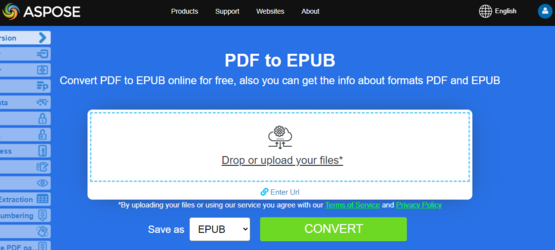
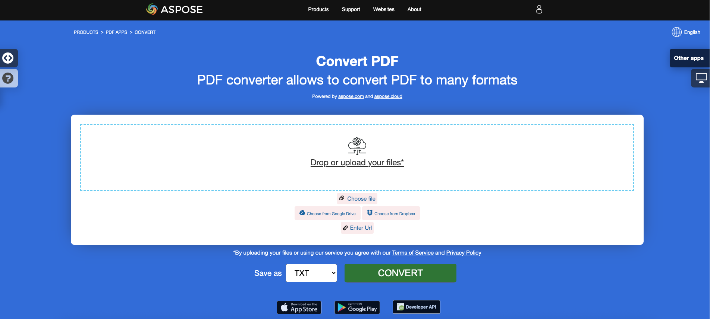

<script type="application/ld+json">
{
    "@context": "https://schema.org",
    "@type": "TechArticle",
    "headline": "Convert PDF to EPUB, LaTeX, Text, XPS in C#",
    "alternativeHeadline": "Add PDF format conversion to EPUB, LaTeX, Text, XPS in C#",
    "abstract": "Aspose.PDF for .NET introduces a powerful feature that allows seamless conversion of PDF files into various formats, including EPUB, LaTeX, Text, XPS, and Markdown. This functionality enhances document accessibility and usability by enabling developers to effortlessly integrate diverse file format conversions into their C# applications, thereby catering to a broader audience and optimizing content for different platforms",
    "author": {
        "@type": "Person",
        "name": "Anastasiia Holub",
        "givenName": "Anastasiia",
        "familyName": "Holub",
        "url": "https://www.linkedin.com/in/anastasiia-holub-750430225/"
    },
    "genre": "pdf document generation",
    "wordcount": "1419",
    "proficiencyLevel": "Beginner",
    "publisher": {
        "@type": "Organization",
        "name": "Aspose.PDF for .NET",
        "url": "https://products.aspose.com/pdf",
        "logo": "https://www.aspose.cloud/templates/aspose/img/products/pdf/aspose_pdf-for-net.svg",
        "alternateName": "Aspose",
        "sameAs": [
            "https://facebook.com/aspose.pdf/",
            "https://twitter.com/asposepdf",
            "https://www.youtube.com/channel/UCmV9sEg_QWYPi6BJJs7ELOg/featured",
            "https://www.linkedin.com/company/aspose",
            "https://stackoverflow.com/questions/tagged/aspose",
            "https://aspose.quora.com/",
            "https://aspose.github.io/"
        ],
        "contactPoint": [
            {
                "@type": "ContactPoint",
                "telephone": "+1 903 306 1676",
                "contactType": "sales",
                "areaServed": "US",
                "availableLanguage": "en"
            },
            {
                "@type": "ContactPoint",
                "telephone": "+44 141 628 8900",
                "contactType": "sales",
                "areaServed": "GB",
                "availableLanguage": "en"
            },
            {
                "@type": "ContactPoint",
                "telephone": "+61 2 8006 6987",
                "contactType": "sales",
                "areaServed": "AU",
                "availableLanguage": "en"
            }
        ]
    },
    "url": "/net/convert-pdf-to-other-files/",
    "mainEntityOfPage": {
        "@type": "WebPage",
        "@id": "/net/convert-pdf-to-other-files/"
    },
    "dateModified": "2024-11-25",
    "description": "Aspose.PDF can perform not only simple and easy tasks but also cope with more complex goals. Check the next section for advanced users and developers."
}
</script>

## Convert PDF to EPUB

{}
**Try to convert PDF to EPUB online**

Aspose.PDF for .NET presents you online free application ["PDF to EPUB"](https://products.aspose.app/pdf/conversion/pdf-to-epub), where you may try to investigate the functionality and quality it works.

[](https://products.aspose.app/pdf/conversion/pdf-to-epub)
{}

**<abbr title="Electronic Publication">EPUB</abbr>** is a free and open e-book standard from the International Digital Publishing Forum (IDPF). Files have the extension .epub.
EPUB is designed for reflowable content, meaning that an EPUB reader can optimize text for a particular display device. EPUB also supports fixed-layout content. The format is intended as a single format that publishers and conversion houses can use in-house, as well as for distribution and sale. It supersedes the Open eBook standard.

The following code snippet also work with [Aspose.PDF.Drawing](/pdf/net/drawing/) library.

Aspose.PDF for .NET also supports the feature to convert PDF documents to EPUB format. Aspose.PDF for .NET has a class named EpubSaveOptions which can be used as the second argument to [`Document.Save(..)`](https://reference.aspose.com/pdf/net/aspose.pdf/document/methods/save/index) method, to generate an EPUB file.
Please try using the following code snippet to accomplish this requirement with C#.

```csharp
// For complete examples and data files, please go to https://github.com/aspose-pdf/Aspose.PDF-for-.NET
// The path to the documents directory.
string dataDir = RunExamples.GetDataDir_AsposePdf_DocumentConversion();
// Load PDF document
Document document = new Document(dataDir + "PDFToEPUB.pdf");
// Instantiate Epub Save options
EpubSaveOptions options = new EpubSaveOptions();
// Specify the layout for contents
options.ContentRecognitionMode = EpubSaveOptions.RecognitionMode.Flow;
// Save the ePUB document
document.Save(dataDir + "PDFToEPUB_out.epub", options);
```

## Convert PDF to LaTeX/TeX

**Aspose.PDF for .NET** support converting PDF to LaTeX/TeX.
The LaTeX file format is a text file format with the special markup and used in TeX-based document preparation system for high-quality typesetting.

{}
**Try to convert PDF to LaTeX/TeX online**

Aspose.PDF for .NET presents you online free application ["PDF to LaTeX"](https://products.aspose.app/pdf/conversion/pdf-to-tex), where you may try to investigate the functionality and quality it works.

[](https://products.aspose.app/pdf/conversion/pdf-to-tex)
{}

To convert PDF files to TeX, Aspose.PDF has the class [LaTeXSaveOptions](https://reference.aspose.com/pdf/net/aspose.pdf/latexsaveoptions) which provides the property OutDirectoryPath for saving temporary images during the conversion process.

The following code snippet shows the process of converting PDF files into the TEX format with C#.

```csharp
// For complete examples and data files, please go to https://github.com/aspose-pdf/Aspose.PDF-for-.NET
// The path to the documents directory.
string dataDir = RunExamples.GetDataDir_AsposePdf_DocumentConversion();

// Create Document object
Document document = new Document(dataDir + "PDFToTeX.pdf");

// Instantiate LaTex save option          
LaTeXSaveOptions saveOptions = new LaTeXSaveOptions();

// Specify the output directory
string pathToOutputDirectory = dataDir;

// Set the output directory path for save option object
saveOptions.OutDirectoryPath = pathToOutputDirectory;

// Save PDF file into LaTex format           
document.Save(dataDir + "PDFToTeX_out.tex", saveOptions);
```

## Convert PDF to Text

**Aspose.PDF for .NET** support converting whole PDF document and single page to a Text file.

### Convert whole PDF document to Text file

You can convert PDF document to TXT file using [Visit](https://reference.aspose.com/pdf/net/aspose.pdf.text/textabsorber/methods/visit/index) method of [TextAbsorber](https://reference.aspose.com/pdf/net/aspose.pdf.text/textabsorber) class.

The following code snippet explains how to extract the texts from the all pages.

```csharp
public static void ConvertPDFDocToTXT()
{
    // Open document
    Document document = new Document(dataDir + "demo.pdf");
    TextAbsorber ta = new TextAbsorber();
    ta.Visit(document);
    // Save the extracted text in text file
    File.WriteAllText(dataDir + "input_Text_Extracted_out.txt",ta.Text);
}
```

{}
**Try to convert Convert PDF to Text online**

Aspose.PDF for .NET presents you online free application ["PDF to Text"](https://products.aspose.app/pdf/conversion/pdf-to-txt), where you may try to investigate the functionality and quality it works.

[](https://products.aspose.app/pdf/conversion/pdf-to-txt)
{}

### Convert PDF page to text file

You can convert PDF document to TXT file with Aspose.PDF for .NET. You should use `Visit` method of `TextAbsorber` class for resolve this task.

The following code snippet explains how to extract the texts from the particular pages.

```csharp
public static void ConvertPDFPagestoTXT()
{
    Document document = new Document(dataDir + "demo.pdf");
    TextAbsorber ta = new TextAbsorber();
    var pages = new [] {1, 3, 4};
    foreach (var page in pages)
    {
        ta.Visit(document.Pages[page]);
    }
   
    // Save the extracted text in text file
    File.WriteAllText(dataDir + "input_Text_Extracted_out.txt", ta.Text);
}
```

## Convert PDF to XPS

**Aspose.PDF for .NET** gives a possibility to convert PDF files to <abbr title="XML Paper Specification">XPS</abbr> format. Let try to use the presented code snippet for converting PDF files to XPS format with C#.

{}
**Try to convert PDF to XPS online**

Aspose.PDF for .NET presents you online free application ["PDF to XPS"](https://products.aspose.app/pdf/conversion/pdf-to-xps), where you may try to investigate the functionality and quality it works.

[](https://products.aspose.app/pdf/conversion/pdf-to-xps)
{}

The XPS file type is primarily associated with the XML Paper Specification by Microsoft Corporation. The XML Paper Specification (XPS), formerly codenamed Metro and subsuming the Next Generation Print Path (NGPP) marketing concept, is Microsoft's initiative to integrate document creation and viewing into the Windows operating system.

To convert PDF files to XPS, Aspose.PDF has the class [XpsSaveOptions](https://reference.aspose.com/net/pdf/aspose.pdf/xpssaveoptions) that is used as the second argument to the [Document.Save(..)](https://reference.aspose.com/pdf/net/aspose.pdf/document/methods/save/index) method to generate the XPS file.

Since the 24.2 release, Aspose.PDF has implemented converting Searchable PDF to XPS while keeping Text Selectable in the resultant XPS. To preserve text, it's necessary to set the XpsSaveOptions.SaveTransparentTexts property to true.

The following code snippet shows the process of converting PDF file into XPS format.

```csharp
using (var document = new Aspose.Pdf.Document("input.pdf"))
{
    var xpsOptions = new XpsSaveOptions
    {
        SaveTransparentTexts = true
    };
    document.Save("output.xps", xpsOptions);
}
```

## Convert PDF to Markdown

**Aspose.PDF for .NET** gives a possibility to convert PDF files to <abbr title="Markdown">MD</abbr> format. Let try to use the presented code snippet for converting PDF files to MD format with C#.

Markdown is a lightweight markup language designed to represent plain text formatting with maximum human readability and machine-readability to advanced publishing languages.

### Optimize image usage by PDF to Markdown converter

You can notice that in directories with images, the number of images is smaller than the number of images in PDF files.

Since the markdown file cannot set the image size, without the MarkdownSaveOptions.UseImageHtmlTag option, the same kind of pictures with different sizes are saved as different.

For the enabled option MarkdownSaveOptions.UseImageHtmlTag will save unique images, which are scaled in the document by the img tag.

The code opens a PDF document, configures the parameters for converting it to a Markdown file (saving any images in the folder named "images"), and saves the resulting Markdown file in the specified output path.

The following code snippet shows the process of converting PDF file into MD format.

```csharp
string inputPdfPath = "";
string markdownOutputFilePath = "";

// Create a new Document object using the specified input PDF path.
using (Document document = new Document(inputPdfPath))
{
    // Create an instance of MarkdownSaveOptions to configure the Markdown export settings.
    MarkdownSaveOptions saveOptions = new MarkdownSaveOptions()
    {
        // Set to false to prevent the use of HTML  tags for images in the Markdown output.
        UseImageHtmlTag = false
    }
    
    // Specify the directory name where resources (like images) will be stored.
    saveOptions.ResourcesDirectoryName = "images";

    // Save the document in Markdown format to the specified output file path using the defined save options.    
    document.Save(markdownOutputFilePath, saveOptions);
}
```

### Convert PDF to MobiXml

MobiXML is a popular eBook format, designed to be usen on mobile platforms.
The following code snippet explains how to convert PDF document to MobiXML file.
```csharp
// For complete examples and data files, please go to https://github.com/aspose-pdf/Aspose.PDF-for-.NET      
private static void ConvertPdfToMobiXml()
{
    string dataDir = RunExamples.GetDataDir_AsposePdf_DocumentConversion();  
    // Load source PDF file
    using (var document = new Aspose.Pdf.Document(dataDir + "PDFToXML.pdf"))
    {
        // Save output in XML format
        document.Save(dataDir + "PDFToXML_out.xml", Aspose.Pdf.SaveFormat.MobiXml);
    }
}
```