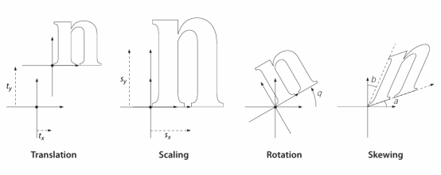
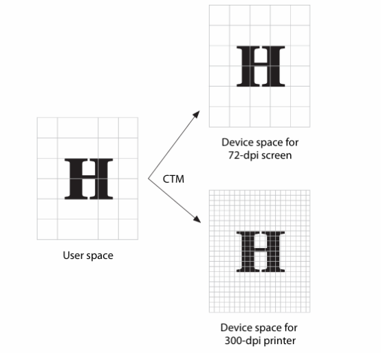
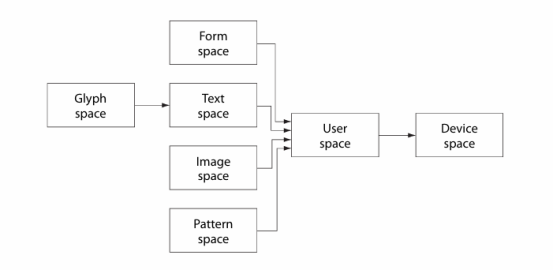
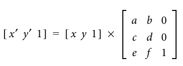
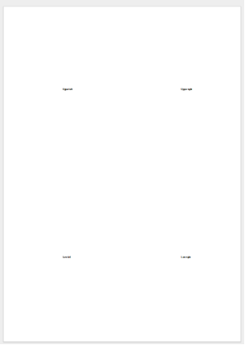

<script type="application/ld+json">
{
    "@context": "https://schema.org",
    "@type": "TechArticle",
    "headline": "Coordinate system",
    "alternativeHeadline": "The coordinate systems in PDF and Aspose.PDF",
    "abstract": "This article explains how coordinate systems and transformation matrices work in PDF documents using Aspose.PDF, enabling precise control over content positioning and rendering.",
    "author": {
        "@type": "Person",
        "name": "Anastasiia Holub",
        "givenName": "Anastasiia",
        "familyName": "Holub",
        "url": "https://www.linkedin.com/in/anastasiia-holub-750430225/"
    },
    "genre": "pdf document generation",
    "wordcount": "600",
    "proficiencyLevel": "Beginner",
    "publisher": {
        "@type": "Organization",
        "name": "Aspose.PDF for .NET",
        "url": "https://products.aspose.com/pdf",
        "logo": "https://www.aspose.cloud/templates/aspose/img/products/pdf/aspose_pdf-for-net.svg",
        "alternateName": "Aspose",
        "sameAs": [
            "https://facebook.com/aspose.pdf/",
            "https://twitter.com/asposepdf",
            "https://www.youtube.com/channel/UCmV9sEg_QWYPi6BJJs7ELOg/featured",
            "https://www.linkedin.com/company/aspose",
            "https://stackoverflow.com/questions/tagged/aspose",
            "https://aspose.quora.com/",
            "https://aspose.github.io/"
        ],
        "contactPoint": [
            {
                "@type": "ContactPoint",
                "telephone": "+1 903 306 1676",
                "contactType": "sales",
                "areaServed": "US",
                "availableLanguage": "en"
            },
            {
                "@type": "ContactPoint",
                "telephone": "+44 141 628 8900",
                "contactType": "sales",
                "areaServed": "GB",
                "availableLanguage": "en"
            },
            {
                "@type": "ContactPoint",
                "telephone": "+61 2 8006 6987",
                "contactType": "sales",
                "areaServed": "AU",
                "availableLanguage": "en"
            }
        ]
    },
    "url": "/net/coordinate-system/",
    "mainEntityOfPage": {
        "@type": "WebPage",
        "@id": "/net/coordinate-system/"
    },
    "dateModified": "2025-04-22",
    "description": "Aspose.PDF can perform not only simple and easy tasks but also cope with more complex goals. Check the next section for advanced users and developers."
}
</script>

In both a PDF document and when working with the Aspose.PDF library, the coordinate system starts from the bottom-left corner of the page.
The point (0,0) corresponds to the bottom-left corner. This means that when placing images, text, or other objects, it is important to remember that the Y-axis increases upwards, unlike in some other coordinate systems.
Each page has its own coordinate system. The coordinates are specified in platform-independent units. The PDF specification states that PDF operates with multiple coordinate spaces.

## Device Space

Each output device — whether a display, printer, etc. uses its own coordinate system to render images.
This system is called device space. The origin (point 0,0) may be located in different positions depending on the device.
Additionally, the orientation of coordinate axes may vary: the vertical Y-axis can increase either from bottom to top or from top to bottom.
Device resolutions also vary. Displays often have a resolution of 72 or 96 pixels per inch, whereas printers may have 300, 600, or even higher dots per inch.
Some devices may also have different resolutions along the horizontal and vertical axes.
If graphic elements are specified directly in device space coordinates, the result becomes dependent on the characteristics of the particular device.
This can lead to distorted rendering: the same object may appear differently on screen and in print.
For example, a line 8 inches long, specified in display coordinates with a resolution of 72 ppi, would occupy less than one inch when printed on a 600 dpi printer.

## User Space
To avoid such issues, PDF uses a device-independent coordinate system(user space) which ensures consistent graphics rendering regardless of the output device.
During page rendering, the content is transformed from user space to device space, taking into account the specific features of the output device.
Each page in the document has its own user space coordinate system. The length of one unit along both axes is equal to 1/72 inch.
You can change the measurement units by setting the UserUnit, which by default equals 1. This value can be specified using the UserUnit property of the page object.
The UserUnit acts as a multiplier to 1/72 inch.

The transformation from user space to device space is defined by the Current Transformation Matrix(CTM). 



Image 1. Matrix transformation of coordinate space. Taken from the ISO 32000-2:2020 specification

If you are creating page content using PDF operators, you can modify the CTM (Current Transformation Matrix) using the `Aspose.Pdf.ConcatenateMatrix` operator, which concatenates the current matrix with the one you provide.
This allows you to perform rotation, translation, and scaling of the rendered content.



Image 2.Transformation to device space. Taken from the ISO 32000-2:2020 specification

In addition to user space and device space, PDF uses several other coordinate systems, each serving specific purposes:

## Text Space
Text is positioned in its own coordinate system—text space. Transformation from text space to user space is performed using a dedicated text matrix along with various text rendering settings.

## Glyph Space
Font characters (glyphs) are defined in glyph space. This space is transformed into text space via the font matrix.
For most fonts, a scale of 1000 glyph space units = 1 text space unit is used.
In some fonts, such as Type 3 fonts, this matrix is explicitly defined.

## Image Space
Raster images are defined in their own image space. This space is always automatically transformed into user space:
images are considered to have a width and height of 1 unit, regardless of their actual resolution.
To correctly display an image, its scale and position are set by modifying the transformation matrix (scaling, rotation).

## Form Space
Forms (Form XObjects) are independent content fragments that can be embedded as graphical elements. 
Each form is defined in its own form space, which is then transformed into user space using a form matrix.



Image 3. Relationships between coordinate spaces. Taken from the ISO 32000-2:2020 specification

## Transform matrix
This matrix enables operations such as scaling, rotation, translation, shearing, and reflection of objects on the page.
It is a 3×3 two-dimensional matrix, but in PDF only 6 numerical parameters are used: [a b c d e f].
This matrix is applied to each point (x, y) of the transformed space using the following formulas:
x' = a * x + c * y + e  
y' = b * x + d * y + f



Image 4.Coordinate transformation equation. Taken from the ISO 32000-2:2020 specification

Coordinate transformation formula — taken from the ISO 32000-2:2020 specification.
Depending on the values of the matrix elements, different types of transformations can be defined:
- Translation: [1 0 0 1 e f] — moves an object by e units along the X-axis and f units along the Y-axis.
- Scaling: [a 0 0 d 0 0] — scales an object by a times along X and d times along Y.
- Rotation: [cos(θ) sin(θ) -sin(θ) cos(θ) 0 0] — rotates an object by an angle θ (in radians).
- Shearing: Along X [1 0 c 1 0 0], Along Y [1 b 0 1 0 0].
- Reflection: Across X-axis [1 0 0 -1 0 0], Across Y-axis [-1 0 0 1 0 0]

Example of setting a transformation matrix:

```csharp
// For complete examples and data files, visit https://github.com/aspose-pdf/Aspose.PDF-for-.NET
var matrix = new Aspose.Pdf.Matrix(new double[]{a, b, c, d, e, f});
page.Contents.Add(new Aspose.Pdf.Operators.ConcatenateMatrix(matrix));
```

In Example 1, you can see that attempting to render text at the corner coordinates of the page results in only the text at the origin being visible.
The rest of the text falls outside the visible area and is clipped.



```csharp
// For complete examples and data files, visit https://github.com/aspose-pdf/Aspose.PDF-for-.NET
private static string CoordinatesExample1()
{
    // The path to the documents directory
    var dataDir = RunExamples.GetDataDir_AsposePdf_Text();
    string outputFilePath = dataDir + "coordinates1.pdf";
    
    // Create new document
    using (var document = new Aspose.Pdf.Document())
    {
        // Get particular page
        var page = document.Pages.Add();
    
        // Create TextBuilder object
        var textBuilder = new Aspose.Pdf.Text.TextBuilder(page);
    
        DrawText("Low left", 0, 0, textBuilder);
        DrawText("Low right", (int)page.CropBox.URX, 0, textBuilder);
        DrawText("Upper left", 0, (int)page.CropBox.URY, textBuilder);
        DrawText("Upper right", (int)page.CropBox.URX, (int)page.CropBox.URY, textBuilder);
    
        // Save PDF document
        document.Save(outputFilePath);
    }

    return outputFilePath;
}

private static void DrawText(string text, int x, int y, TextBuilder textBuilder)
{
    // Create text fragment
    var textFragment = new Aspose.Pdf.Text.TextFragment(text);
    textFragment.Position = new Aspose.Pdf.Text.Position(x, y);

    // Set text properties
    textFragment.TextState.FontSize = 12;
    textFragment.TextState.Font = Aspose.Pdf.Text.FontRepository.FindFont("TimesNewRoman");

    // Append the text fragment to the PDF page
    textBuilder.AppendText(textFragment);
}
```



```csharp
// For complete examples and data files, visit https://github.com/aspose-pdf/Aspose.PDF-for-.NET
private static string CoordinatesExample1()
{
    // The path to the documents directory
    var dataDir = RunExamples.GetDataDir_AsposePdf_Text();
    string outputFilePath = dataDir + "coordinates1.pdf";
    
    // Create new document
    using var document = new Aspose.Pdf.Document();
    
    // Get particular page
    var page = document.Pages.Add();

    // Create TextBuilder object
    var textBuilder = new Aspose.Pdf.Text.TextBuilder(page);

    DrawText("Low left", 0, 0, textBuilder);
    DrawText("Low right", (int)page.CropBox.URX, 0, textBuilder);
    DrawText("Upper left", 0, (int)page.CropBox.URY, textBuilder);
    DrawText("Upper right", (int)page.CropBox.URX, (int)page.CropBox.URY, textBuilder);

    // Save PDF document
    document.Save(outputFilePath);    

    return outputFilePath;
}

private static void DrawText(string text, int x, int y, TextBuilder textBuilder)
{
    // Create text fragment
    var textFragment = new Aspose.Pdf.Text.TextFragment(text);
    textFragment.Position = new Aspose.Pdf.Text.Position(x, y);

    // Set text properties
    textFragment.TextState.FontSize = 12;
    textFragment.TextState.Font = Aspose.Pdf.Text.FontRepository.FindFont("TimesNewRoman");

    // Append the text fragment to the PDF page
    textBuilder.AppendText(textFragment);
}
```




Image 5. The result of the example 1 execution.

In Example 2, we scale the coordinate system and shift it to the center of the page. 



```csharp
// For complete examples and data files, visit https://github.com/aspose-pdf/Aspose.PDF-for-.NET
private static void Example2()
{
    // The path to the documents directory
    var dataDir = RunExamples.GetDataDir_AsposePdf_Text();

    string sourcePdf = Example1();

    // Open document
    using (var document = new Aspose.Pdf.Document(sourcePdf))
    {
        Page page = document.Pages[1];
		
        // Get the page's dimensions
        double pageWidth = page.CropBox.Width;
        double pageHeight = page.CropBox.Height;

        // Set the scale factor
        double scale = 0.5;

        // Calculate the offset
        double offsetX = (pageWidth - pageWidth * scale) / 2;
        double offsetY = (pageHeight - pageHeight * scale) / 2;
		
        // Get the page's contents
        var contents = page.Contents;

        // Add the current graphical state to the content's beginning
        contents.Insert(1, new Aspose.Pdf.Operators.GSave());
        // Scale and move the coordinate system to fit the content in the center of the page
        contents.Insert(2,
            new Aspose.Pdf.Operators.ConcatenateMatrix(scale, 0, 0, scale, offsetX, offsetY));
	   
        contents.Add(new Aspose.Pdf.Operators.GRestore());

        // Save PDF document
        document.Save(dataDir + "coordinates2.pdf");
      }
}
```



```csharp
// For complete examples and data files, visit https://github.com/aspose-pdf/Aspose.PDF-for-.NET
private static void Example2()
{
    // The path to the documents directory
    var dataDir = RunExamples.GetDataDir_AsposePdf_Text();

    string sourcePdf = Example1();

    // Open document
    using var document = new Aspose.Pdf.Document(sourcePdf);
    
    Page page = document.Pages[1];
    
    // Get the page's dimensions
    double pageWidth = page.CropBox.Width;
    double pageHeight = page.CropBox.Height;

    // Set the scale factor
    double scale = 0.5;

    // Calculate the offset
    double offsetX = (pageWidth - pageWidth * scale) / 2;
    double offsetY = (pageHeight - pageHeight * scale) / 2;
    
    // Get the page's contents
    var contents = page.Contents;

    // Add the current graphical state to the content's beginning
    contents.Insert(1, new Aspose.Pdf.Operators.GSave());
    // Scale and move the coordinate system to fit the content in the center of the page
    contents.Insert(2,
        new Aspose.Pdf.Operators.ConcatenateMatrix(scale, 0, 0, scale, offsetX, offsetY));
   
    contents.Add(new Aspose.Pdf.Operators.GRestore());

    // Save PDF document
    document.Save(dataDir + "coordinates2.pdf");
      
}
```





Image 6. The result of the example 2 execution.

