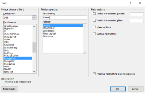
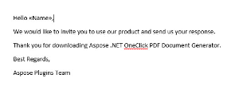
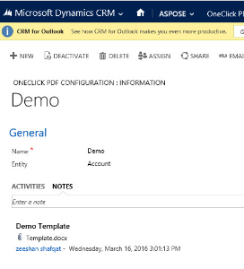
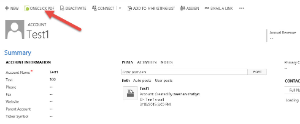
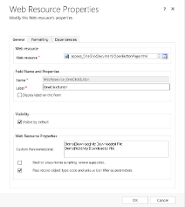
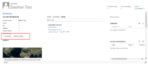

## Create Template and Add in CRM

- Open word and create a template.
- Insert MailMerge fields for data comming from CRM.

- Make sure that the Field name matches exactly with the CRM field.
- Templates are specific to use with individual entity.

- Once the Template is created, Open OneClick PDF Configuration entity in CRM and Create a New record.
- Give the name of the template, select entity the template is defined for and attach the created document in the attachment.

## Generate Document from Ribbon Button

- Open Record where you want to generate document. (Make sure a template is already attached in the configuration for that entity)
- Click OneClick PDF button from the ribbon.

- From the Popup: Select template, File Name and Action and Click Generate.
- Check the Downloaded file or Notes, on basis of the selection.

## Configure OneClick Buttons and use them

- In Order to use OneClick Button directly from Form, Open Form Customization.
- Insert WebResource where you want to add OneClick Buttons.
- Select OpenButtonPage in Webresource and give it a Name.
- Configure the Buttons in Data field in the following sample.

- Use seperate line for each button and use the following syntax:
  - Syntax:Template Name |<Action: Download/Note>|Output FileName
  - Example:Demo|Download|My Downloaded File
- Save and publish the customization.
- The button is available on the form.

