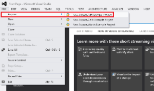
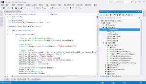

## Introduction

Microsoft Visual Studio is an integrated development environment (IDE) from Microsoft. It is used to develop computer programs for Microsoft Windows, as well as web sites, web applications and web services. Visual Studio uses Microsoft software development platforms such as Windows API, Windows Forms, Windows Presentation Foundation, Windows Store and Microsoft Silverlight. It can produce both native code and managed code.

### Aspose.PDF for .NET

Aspose.PDF for .NET is a PDF document creation and manipulation component that enables your .NET applications to read, write and manipulate existing PDF documents without using Adobe Acrobat.

For more details about [Aspose.PDF for .NET API](https://products.aspose.com/pdf/net/)

### Explore Aspose.PDF for .NET Examples using Visual Studio

Aspose Visual Studio Plugin - **Explore Aspose.PDF for .NET Examples** is a great tool to quickly download and explore Aspose.PDF for .NET API examples. It saves lots of time and efforts by providing a very simple option to seamlessly select, download and open the latest example projects without having to leave your Visual Studio.

This version provides the following features:

- Supports Visual Studio 2010 and Visual Studio 2012 and Visual Studio 2013.
- Easy to launch from **File > Aspose** menu in Visual Studio
- Saves time and reduces the learning curve.
- Enables you to select and open the latest Aspose.PDF for .NET API examples hosted on Github.com.
- Allow you to open **C#** or **VB.NET** examples project
- A selected project is automatically opened in Visual Studio with all required references set to give you a ready to run and explore environment.
- Automatically downloads the latest API libraries from **NuGet** and examples from **GitHub**.

## System Requirements and Supported Platforms

In order to install and use Aspose Visual Studio Plugin you need to have one of the following Visual Studio version installed

- Visual Studio 2010, 2012, 2013

Please feel free to contact us if you find any issues in installing or using this plugin.

## Downloading

You can download Aspose Visual Studio Plugin from one of the following locations

- [Visual Studio Gallery](https://marketplace.visualstudio.com/items?itemName=AsposeMarketplace.AsposePdfforNET)
- [Github](https://github.com/aspose-pdf/Aspose.PDF-for-.NET/releases/tag/AsposePdfExamplesVSPlugin)

## Installing

It is very simple and easy to install Aspose Visual Studio Plugin, please follow these simple steps

- Double click the downloaded msi file
- Follow the steps, you can simply press Next on each screen to install it using standard settings.

You will get a success dialog once the installation is completed.

**Note:** Please make sure to restart Visual Studio for the changes to take effect.

## Using

Once installed you can easy launch and use the interactive plugin as described below:
**1.** Open the plugin by selecting **File > Aspose** followed by **New Aspose.PDF Example Project** in Visual Studio.

**2.** The first time you open the plugin you see the API selection dialog as shown below. It will take few minutes to download the latest API and their libraries from **NuGet** and latest examples source code from **GitHub**.

**3.** In the Select an API to View Examples dialog, select or change the location where the example projects will be created and also select or change examples project type as **C#** or **VB.NET** and click **Continue** to open the example project in Visual Studio.

**4.** New Examples projects as per project type selection of **C#** or **VB.NET** in Visual Studio.

|**C# Examples**|**VB.NET Examples**|
| :- | :- |
|||

## Video Demo

Please check [the video](https://www.youtube.com/watch?v=FyJ2TFlbLE4) below to see the module in action.

## Support, Extend and Contribute

### Support

From the very first days of Aspose, we knew that just giving our customers good products would not be enough. We also needed to deliver good service. We are developers ourselves and understand how frustrating it is when a technical issue or a quirk in the software stops you from doing what you need to do. We're here to solve problems, not create them.

This is why we offer free support. Anyone who uses our product, whether they have bought them or are using an evaluation, deserves our full attention and respect.

You can log any issues or suggestions related to Aspose Visual Studio Plugin using any of the following platforms

- [Visual Studio Gallery - Q and A](https://marketplace.visualstudio.com/items?itemName=AsposeMarketplace.AsposePdfforNET)
- [Github](https://github.com/asposePdf/Aspose.PDF-for-.NET/issues)

### Extend and Contribute

**Explore Aspose.PDF for .NET Examples** for Visual Studio is open source and its source code is available on the major social coding websites listed below. Developers are encouraged to download the source code and extend the functionality as per their own requirements.

#### Source Code

You can get the latest source code from one of the following locations

- [Github](https://github.com/asposePdf/Aspose.PDF-for-.NET)

#### How to configure the source code

You need to have the following installed in order to open and extend the source code

- Visual Studio 2010

Please follow these simple steps to get started

1. Download/Clone the source code.
1. Open Visual Studio 2010 and Choose **File** > **Open Project**
1. Browse to the latest source code that you have downloaded and open **AsposeVisualStudioPlugin.sln**

#### Source code overview

There are two projects in the solution

- **AsposeVisualStudioPlugin** - Contains the integration with Visual Studio, selection and automatic download of Aspose APIs and Examples.
- **Installer** - Wix installer project to generate msi installer file for the plugin.
