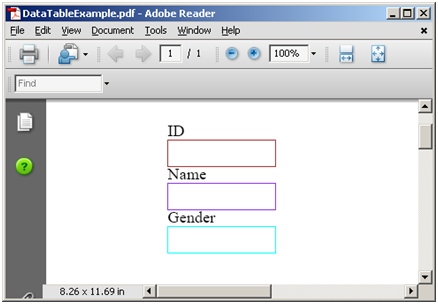
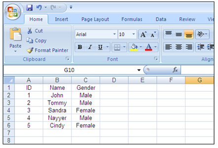
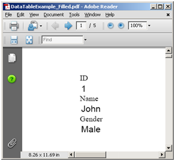
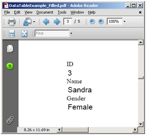

<script type="application/ld+json">
{
    "@context": "https://schema.org",
    "@type": "TechArticle",
    "headline": "Export Excel data to fill PDF form",
    "alternativeHeadline": "Export Excel Data to Auto-Fill PDF Forms",
    "abstract": "The feature in Aspose.PDF for .NET allows users to seamlessly export data from Excel worksheets into PDF forms using the AutoFiller Class. By leveraging the ExportDataTable method, users can transform Excel data into a DataTable and efficiently fill out PDF forms, streamlining the process of data entry and increasing productivity. This functionality ensures that PDF forms are populated accurately and automatically based on the data structure in Excel",
    "author": {
        "@type": "Person",
        "name": "Anastasiia Holub",
        "givenName": "Anastasiia",
        "familyName": "Holub",
        "url": "https://www.linkedin.com/in/anastasiia-holub-750430225/"
    },
    "genre": "pdf document generation",
    "wordcount": "908",
    "proficiencyLevel": "Beginner",
    "publisher": {
        "@type": "Organization",
        "name": "Aspose.PDF for .NET",
        "url": "https://products.aspose.com/pdf",
        "logo": "https://www.aspose.cloud/templates/aspose/img/products/pdf/aspose_pdf-for-net.svg",
        "alternateName": "Aspose",
        "sameAs": [
            "https://facebook.com/aspose.pdf/",
            "https://twitter.com/asposepdf",
            "https://www.youtube.com/channel/UCmV9sEg_QWYPi6BJJs7ELOg/featured",
            "https://www.linkedin.com/company/aspose",
            "https://stackoverflow.com/questions/tagged/aspose",
            "https://aspose.quora.com/",
            "https://aspose.github.io/"
        ],
        "contactPoint": [
            {
                "@type": "ContactPoint",
                "telephone": "+1 903 306 1676",
                "contactType": "sales",
                "areaServed": "US",
                "availableLanguage": "en"
            },
            {
                "@type": "ContactPoint",
                "telephone": "+44 141 628 8900",
                "contactType": "sales",
                "areaServed": "GB",
                "availableLanguage": "en"
            },
            {
                "@type": "ContactPoint",
                "telephone": "+61 2 8006 6987",
                "contactType": "sales",
                "areaServed": "AU",
                "availableLanguage": "en"
            }
        ]
    },
    "url": "/net/export-excel-worksheet-data-to-fill-pdf-form/",
    "mainEntityOfPage": {
        "@type": "WebPage",
        "@id": "/net/export-excel-worksheet-data-to-fill-pdf-form/"
    },
    "dateModified": "2024-11-25",
    "description": "Aspose.PDF can perform not only simple and easy tasks but also cope with more complex goals. Check the next section for advanced users and developers."
}
</script>

{}

[Aspose.Pdf.Facades namespace](https://reference.aspose.com/pdf/net/aspose.pdf.facades) in [Aspose.PDF for .NET](/pdf/net/) offers various ways to fill the Pdf forms. You can import data from XML file, DFD, XFDF, use API and even can use the data from Excel worksheet.
We would be using [ExportDataTable](https://reference.aspose.com/cells/net/aspose.cells/range/methods/exportdatatable/index) method of [Cells](https://reference.aspose.com/pdf/net/aspose.pdf/cells) class of [Aspose.Cells](https://docs.aspose.com//cells/net) to export the data from Excel sheet in to DataTable object. Then we need would be importing this data into Pdf form using [ImportDataTable](https://reference.aspose.com/pdf/net/aspose.pdf.facades/autofiller/methods/importdatatable) method of [AutoFiller](https://reference.aspose.com/pdf/net/aspose.pdf.facades/autofiller) class. Make sure that, the Column name of DataTable is same as field name over PDF form.

{}

## Implementation details

In the following scenario we are going to using a PDF form, which contains three form fields named ID, Name and Gender.



In the Form specified above has one page, with three fields named as "ID", "Name" and "Gender" consequently. We would be extracting the data from the following excel sheet into DataTable object.



We need to create an object of [AutoFiller](https://reference.aspose.com/pdf/net/aspose.pdf.facades/autofiller) class and bind the Pdf form present in the above pictures and use the [ImportDataTable](https://reference.aspose.com/pdf/net/aspose.pdf.facades/autofiller/methods/importdatatable) method to fill the form fields using the data present in DataTable object.
Once the method is called a new Pdf form file is generated, which contains five pages with form filled based over the data from Excel sheet. Input Pdf form was single page and resultant is five pages, because the number of data rows in excel sheet is 5. The DataTable class offers the capability to use the first row of the sheet as ColumnName.

|****|****|
| :- | :- |
|||

```csharp
// For complete examples and data files, visit https://github.com/aspose-pdf/Aspose.PDF-for-.NET
private static void ExportExcelToPdfForm()
{
    // The path to the documents directory
    var dataDir = RunExamples.GetDataDir_AsposePdf_Excel();

    var workbook = new Workbook();
    // Creating a file stream containing the Excel file to be opened
    using (FileStream fstream = new FileStream(dataDir + "newBook1.xls", FileMode.Open))
    {
        // Opening the Excel file through the file stream
        workbook.Open(fstream);
        // Accessing the first worksheet in the Excel file
        var worksheet = workbook.Worksheets[0];
        // Exporting the contents of 7 rows and 2 columns starting from 1st cell to DataTable
        System.Data.DataTable dataTable = worksheet.Cells.ExportDataTable(0, 0, worksheet.Cells.MaxRow + 1, worksheet.Cells.MaxColumn + 1, true);
        // Create an object of AutoFiller class
        using (var autoFiller = new Aspose.Pdf.Facades.AutoFiller())
        {
            // The input pdf file that contains form fields
            autoFiller.InputFileName = dataDir + "DataTableExample.pdf";
            // The resultant pdf, that will contain the form fields filled with information from DataTable
            autoFiller.OutputFileName = dataDir + "DataTableExample_out.pdf";
            // Call the method to import the data from DataTable object into Pdf form fields
            autoFiller.ImportDataTable(dataTable);
            // Save PDF document
            autoFiller.Save();
        }
    }
}
```

For filling from XLSX please use next code snippet:

```csharp
// For complete examples and data files, visit https://github.com/aspose-pdf/Aspose.PDF-for-.NET
private static void FillFromXLSX()
{
    // The path to the documents directory
    var dataDir = RunExamples.GetDataDir_AsposePdf_Excel();

    // Create an object of AutoFiller class
    using (var autoFiller = new Aspose.Pdf.Facades.AutoFiller())
    {
        // Bind PDF document
        autoFiller.BindPdf(dataDir + "Sample-Form-01.pdf");

        System.Data.DataTable dataTable = GenerateDataTable();

        // Call the method to import the data from DataTable object into Pdf form fields
        autoFiller.ImportDataTable(dataTable);

        // Save PDF document
        autoFiller.Save(dataDir + "Sample-Form-01_out.pdf");
    }
}
```

Aspose.PDF for .NET allows you to generate Data Table in PDF document:

```csharp
// For complete examples and data files, visit https://github.com/aspose-pdf/Aspose.PDF-for-.NET
private static System.Data.DataTable GenerateDataTable()
{
    string[] names = new[] { "Olivia", "Oliver", "Amelia", "George", "Isla", "Harry", "Ava", "Noah" };
    // Create a new DataTable
    var table = new System.Data.DataTable("Students");

    // Create new DataColumn, set DataType,
    // ColumnName and add to DataTable
    var column = new System.Data.DataColumn
    {
        DataType = System.Type.GetType("System.Int32"),
        ColumnName = "id",
        ReadOnly = true,
        Unique = true
    };
    // Add the Column to the DataColumnCollection
    table.Columns.Add(column);

    // Create second column
    column = new System.Data.DataColumn
    {
        DataType = System.Type.GetType("System.String"),
        ColumnName = "First Name",
        AutoIncrement = false,
        Caption = "First Name",
        ReadOnly = false,
        Unique = false
    };
    // Add the column to the table
    table.Columns.Add(column);

    // Make the ID column the primary key column
    var primaryKeyColumns = new System.Data.DataColumn[1];
    primaryKeyColumns[0] = table.Columns["id"];
    table.PrimaryKey = primaryKeyColumns;

    // Create three new DataRow objects and add
    // them to the DataTable
    var rand = new Random();
    System.Data.DataRow row;
    for (int i = 1; i <= 4; i++)
    {
        row = table.NewRow();
        row["id"] = i;
        row["First Name"] = names[rand.Next(names.Length)];
        table.Rows.Add(row);
    }
    return table;
}
```

## Conclusion

{}
[Aspose.Pdf.Facades](https://reference.aspose.com/pdf/net/aspose.pdf.facades) also offers the capability to fill PDF form using data from database but this feature is currently supported in .NET version.
{}
