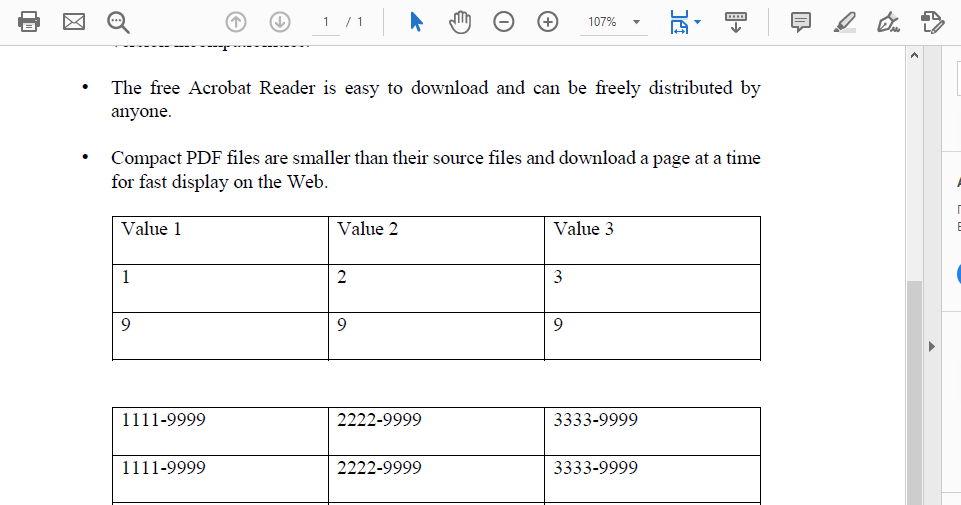
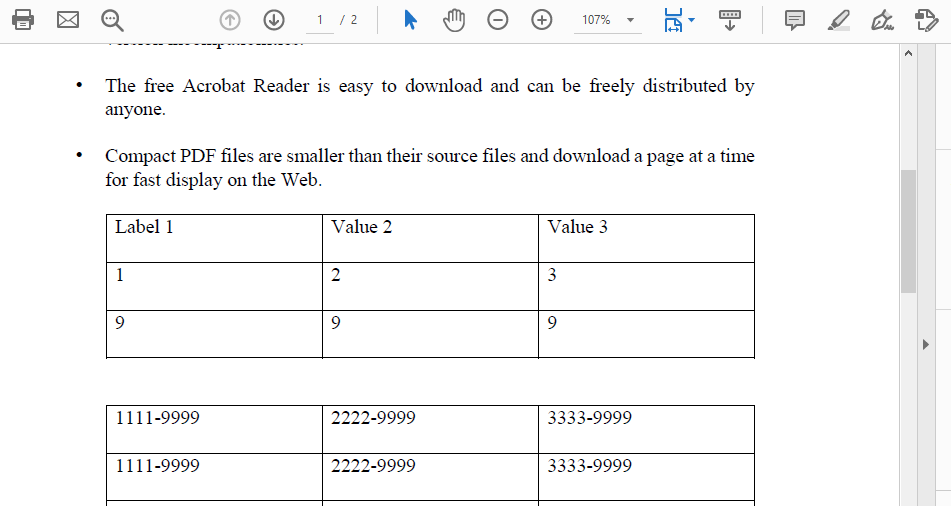
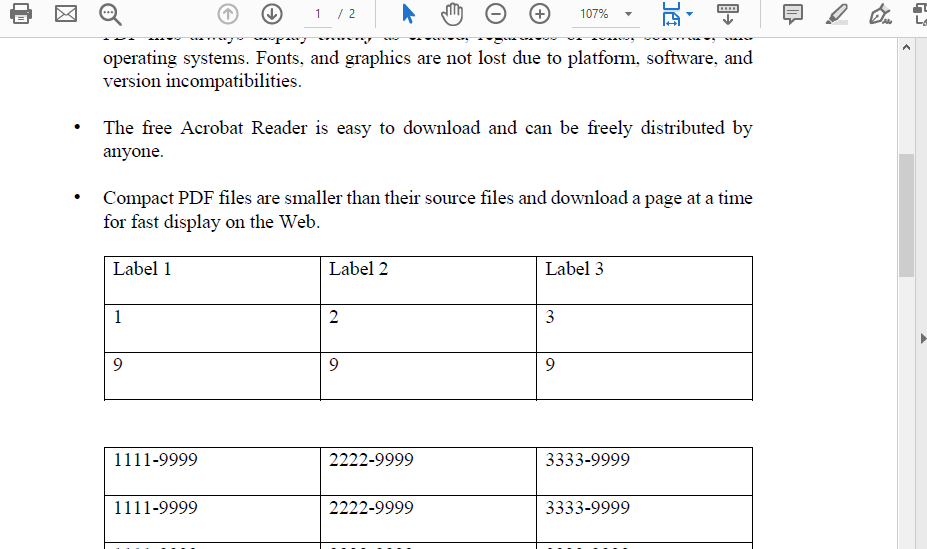

<script type="application/ld+json">
{
    "@context": "https://schema.org",
    "@type": "TechArticle",
    "headline": "Replace Text - Facades",
    "alternativeHeadline": "Effortless Text Replacement in PDF Files",
    "abstract": "The Replace Text feature in the PdfContentEditor class allows users to efficiently modify textual content within existing PDF documents. By using simple methods like BindPdf and ReplaceText, users can seamlessly update text, adjust font sizes, and customize text formatting, including bold and color, all while maintaining the integrity of the original document. This functionality enhances PDF editing capabilities, making it easier to manage content dynamically",
    "author": {
        "@type": "Person",
        "name": "Anastasiia Holub",
        "givenName": "Anastasiia",
        "familyName": "Holub",
        "url": "https://www.linkedin.com/in/anastasiia-holub-750430225/"
    },
    "genre": "pdf document generation",
    "wordcount": "550",
    "proficiencyLevel": "Beginner",
    "publisher": {
        "@type": "Organization",
        "name": "Aspose.PDF for .NET",
        "url": "https://products.aspose.com/pdf",
        "logo": "https://www.aspose.cloud/templates/aspose/img/products/pdf/aspose_pdf-for-net.svg",
        "alternateName": "Aspose",
        "sameAs": [
            "https://facebook.com/aspose.pdf/",
            "https://twitter.com/asposepdf",
            "https://www.youtube.com/channel/UCmV9sEg_QWYPi6BJJs7ELOg/featured",
            "https://www.linkedin.com/company/aspose",
            "https://stackoverflow.com/questions/tagged/aspose",
            "https://aspose.quora.com/",
            "https://aspose.github.io/"
        ],
        "contactPoint": [
            {
                "@type": "ContactPoint",
                "telephone": "+1 903 306 1676",
                "contactType": "sales",
                "areaServed": "US",
                "availableLanguage": "en"
            },
            {
                "@type": "ContactPoint",
                "telephone": "+44 141 628 8900",
                "contactType": "sales",
                "areaServed": "GB",
                "availableLanguage": "en"
            },
            {
                "@type": "ContactPoint",
                "telephone": "+61 2 8006 6987",
                "contactType": "sales",
                "areaServed": "AU",
                "availableLanguage": "en"
            }
        ]
    },
    "url": "/net/replace-text-facades/",
    "mainEntityOfPage": {
        "@type": "WebPage",
        "@id": "/net/replace-text-facades/"
    },
    "dateModified": "2024-11-25",
    "description": "Aspose.PDF can perform not only simple and easy tasks but also cope with more complex goals. Check the next section for advanced users and developers."
}
</script>

## Replace Text in an Existing PDF File

In order to replace text in an existing PDF file, you need to create an object of [PdfContentEditor](https://reference.aspose.com/pdf/net/aspose.pdf.facades/pdfcontenteditor) class and bind an input PDF file using [BindPdf](https://reference.aspose.com/pdf/net/aspose.pdf.facades/facade/methods/bindpdf/index) method. After that, you need to call [ReplaceText](https://reference.aspose.com/pdf/net/aspose.pdf.facades/pdfcontenteditor/methods/replacetext/index) method. You need to save the updated PDF file using [Save](https://reference.aspose.com/pdf/net/aspose.pdf/document/methods/save) method of [PdfContentEditor](https://reference.aspose.com/pdf/net/aspose.pdf.facades/pdfcontenteditor) class. The following code snippet shows you how to replace text in an existing PDF file.



```csharp
// For complete examples and data files, visit https://github.com/aspose-pdf/Aspose.PDF-for-.NET
private static void ReplaceText01()
{
    // The path to the documents directory
    var dataDir = RunExamples.GetDataDir_AsposePdf_WorkingDocuments();

    // Instantiate PdfContentEditor object
    using (var editor = new Aspose.Pdf.Facades.PdfContentEditor())
    {
        // Bind PDF document
        editor.BindPdf(dataDir + "sample.pdf");
        editor.ReplaceText("Value", "Label");

        // Save PDF document
        editor.Save(dataDir + "PdfContentEditorDemo01_out.pdf");
    }
}
```



```csharp
// For complete examples and data files, visit https://github.com/aspose-pdf/Aspose.PDF-for-.NET
private static void ReplaceText01()
{
    // The path to the documents directory
    var dataDir = RunExamples.GetDataDir_AsposePdf_WorkingDocuments();

    // Instantiate PdfContentEditor Object
    using var editor = new Aspose.Pdf.Facades.PdfContentEditor();

    // Bind PDF document
    editor.BindPdf(dataDir + "sample.pdf");
    editor.ReplaceText("Value", "Label");

    // Save PDF document
    editor.Save(dataDir + "PdfContentEditorDemo01_out.pdf");
}
```



Check how it's looks in the original document:



And check the result after replacing the text:



In the second example, you will see how, in addition to replacing the text, you can also increase or decrease the font size:



```csharp
// For complete examples and data files, visit https://github.com/aspose-pdf/Aspose.PDF-for-.NET
private static void ReplaceText02()
{
    // The path to the documents directory
    var dataDir = RunExamples.GetDataDir_AsposePdf_WorkingDocuments();

    // Instantiate PdfContentEditor object
    using (var editor = new Aspose.Pdf.Facades.PdfContentEditor())
    {
        // Bind PDF document
        editor.BindPdf(dataDir + "sample.pdf");
        editor.ReplaceText("Value", "Label", 12);

        // Save PDF document
        editor.Save(dataDir + "PdfContentEditorDemo02_out.pdf");
    }
}
```



```csharp
// For complete examples and data files, visit https://github.com/aspose-pdf/Aspose.PDF-for-.NET
private static void ReplaceText02()
{
    // The path to the documents directory
    var dataDir = RunExamples.GetDataDir_AsposePdf_WorkingDocuments();

    // Instantiate PdfContentEditor object
    using var editor = new Aspose.Pdf.Facades.PdfContentEditor();

    // Bind PDF document
    editor.BindPdf(dataDir + "sample.pdf");
    editor.ReplaceText("Value", "Label", 12);

    // Save PDF document
    editor.Save(dataDir + "PdfContentEditorDemo02_out.pdf");
}
```



For more advanced possibilities for working with our text, we will use the [TextState](https://reference.aspose.com/pdf/net/aspose.pdf.text/textstate) method. With this method, we can make text bold, italic, colored, and so on.



```csharp
// For complete examples and data files, visit https://github.com/aspose-pdf/Aspose.PDF-for-.NET
private static void ReplaceText03()
{
    // The path to the documents directory
    var dataDir = RunExamples.GetDataDir_AsposePdf_WorkingDocuments();

    // Instantiate PdfContentEditor object
    using (var editor = new Aspose.Pdf.Facades.PdfContentEditor())
    {
        // Bind PDF document
        editor.BindPdf(dataDir + "sample.pdf");

        var textState = new Aspose.Pdf.Text.TextState
        {
            ForegroundColor = Aspose.Pdf.Color.Red,
            FontSize = 12,
        };

        editor.ReplaceText("Value", "Label", textState);

        // Save PDF document
        editor.Save(dataDir + "PdfContentEditorDemo03_out.pdf");
    }
}
```



```csharp
// For complete examples and data files, visit https://github.com/aspose-pdf/Aspose.PDF-for-.NET
private static void ReplaceText03()
{
    // The path to the documents directory
    var dataDir = RunExamples.GetDataDir_AsposePdf_WorkingDocuments();

    // Instantiate PdfContentEditor object
    using var editor = new Aspose.Pdf.Facades.PdfContentEditor();

    // Bind PDF document
    editor.BindPdf(dataDir + "sample.pdf");

    var textState = new Aspose.Pdf.Text.TextState
    {
        ForegroundColor = Aspose.Pdf.Color.Red,
        FontSize = 12,
    };

    editor.ReplaceText("Value", "Label", textState);

    // Save PDF document
    editor.Save(dataDir + "PdfContentEditorDemo03_out.pdf");
}
```



In case you need to replace all the specified text in the document, use the following code snippet. That is, the replacement of the text will take place wherever the text specified for replacement will be encountered, and it will also count the number of such replacements.



```csharp
// For complete examples and data files, visit https://github.com/aspose-pdf/Aspose.PDF-for-.NET
private static void ReplaceText04()
{
    // The path to the documents directory
    var dataDir = RunExamples.GetDataDir_AsposePdf_WorkingDocuments();

    // Instantiate PdfContentEditor object
    using (var editor = new Aspose.Pdf.Facades.PdfContentEditor())
    {
        // Bind PDF document
        editor.BindPdf(dataDir + "sample.pdf");
        int count = 0;

        while (editor.ReplaceText("Value", "Label"))
        {
            count++;
        }

        Console.WriteLine($"{count} occurrences have been replaced.");

        // Save PDF document
        editor.Save(dataDir + "PdfContentEditorDemo04_out.pdf");
    }
}
```



```csharp
// For complete examples and data files, visit https://github.com/aspose-pdf/Aspose.PDF-for-.NET
private static void ReplaceText04()
{
    // The path to the documents directory
    var dataDir = RunExamples.GetDataDir_AsposePdf_WorkingDocuments();

    // Instantiate PdfContentEditor object
    using var editor = new Aspose.Pdf.Facades.PdfContentEditor();

    // Bind PDF document
    editor.BindPdf(dataDir + "sample.pdf");
    int count = 0;

    while (editor.ReplaceText("Value", "Label"))
    {
        count++;
    }

    Console.WriteLine($"{count} occurrences have been replaced.");

    // Save PDF document
    editor.Save(dataDir + "PdfContentEditorDemo04_out.pdf");
}
```





The following code snippet shows how to make all the text replacements but on a specific page of your document.



```csharp
// For complete examples and data files, visit https://github.com/aspose-pdf/Aspose.PDF-for-.NET
private static void ReplaceText05()
{
    // The path to the documents directory
    var dataDir = RunExamples.GetDataDir_AsposePdf_WorkingDocuments();

    // Instantiate PdfContentEditor object
    using (var editor = new Aspose.Pdf.Facades.PdfContentEditor())
    {
        // Bind PDF document
        editor.BindPdf(dataDir + "sample.pdf");
        int count = 0;

        while (editor.ReplaceText("9999", 2, "ABCDE"))
        {
            count++;
        }

        Console.WriteLine($"{count} occurrences have been replaced.");

        // Save PDF document
        editor.Save(dataDir + "PdfContentEditorDemo05_out.pdf");
    }
}
```



```csharp
// For complete examples and data files, visit https://github.com/aspose-pdf/Aspose.PDF-for-.NET
private static void ReplaceText05()
{
    // The path to the documents directory
    var dataDir = RunExamples.GetDataDir_AsposePdf_WorkingDocuments();

    // Instantiate PdfContentEditor object
    using var editor = new Aspose.Pdf.Facades.PdfContentEditor();

    // Bind PDF document
    editor.BindPdf(dataDir + "sample.pdf");
    int count = 0;

    while (editor.ReplaceText("9999", 2, "ABCDE"))
    {
        count++;
    }

    Console.WriteLine($"{count} occurrences have been replaced.");

    // Save PDF document
    editor.Save(dataDir + "PdfContentEditorDemo05_out.pdf");
}
```



In the next code snippet, we will show how to replace, for example, a given number with the letters we need.



```csharp
// For complete examples and data files, visit https://github.com/aspose-pdf/Aspose.PDF-for-.NET
private static void ReplaceText06()
{
    // The path to the documents directory
    var dataDir = RunExamples.GetDataDir_AsposePdf_WorkingDocuments();

    // Instantiate PdfContentEditor object
    using (var editor = new Aspose.Pdf.Facades.PdfContentEditor
           {
               ReplaceTextStrategy = new Aspose.Pdf.Facades.ReplaceTextStrategy
               {
                   IsRegularExpressionUsed = true,
                   ReplaceScope = Aspose.Pdf.Facades.ReplaceTextStrategy.Scope.ReplaceAll
               }
           })
    {
        // Bind PDF document
        editor.BindPdf(dataDir + "sample.pdf");
        editor.ReplaceText("\\d{4}", "ABCDE");

        // Save PDF document
        editor.Save(dataDir + "PdfContentEditorDemo06_out.pdf");
    }
}
```



```csharp
// For complete examples and data files, visit https://github.com/aspose-pdf/Aspose.PDF-for-.NET
private static void ReplaceText06()
{
    // The path to the documents directory
    var dataDir = RunExamples.GetDataDir_AsposePdf_WorkingDocuments();

    // Instantiate PdfContentEditor object
    using var editor = new Aspose.Pdf.Facades.PdfContentEditor
    {
        ReplaceTextStrategy = new Aspose.Pdf.Facades.ReplaceTextStrategy
        {
            IsRegularExpressionUsed = true,
            ReplaceScope = Aspose.Pdf.Facades.ReplaceTextStrategy.Scope.ReplaceAll
        }
    };

    // Bind PDF document
    editor.BindPdf(dataDir + "sample.pdf");
    editor.ReplaceText("\\d{4}", "ABCDE");

    // Save PDF document
    editor.Save(dataDir + "PdfContentEditorDemo06_out.pdf");
}
```


