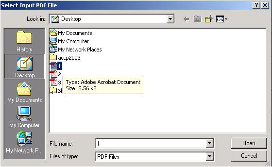
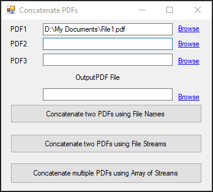
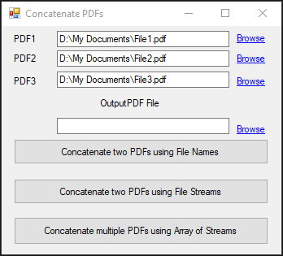
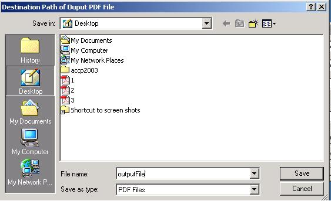
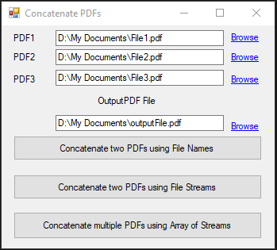
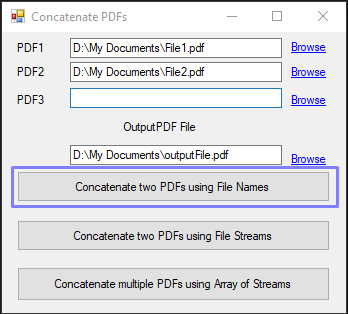
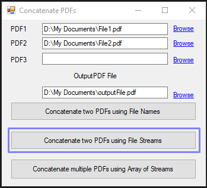
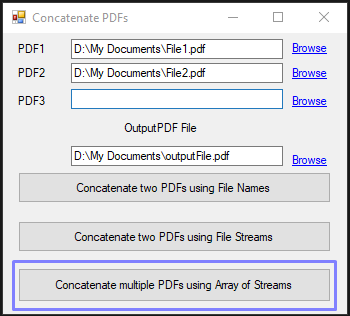

<script type="application/ld+json">
{
    "@context": "https://schema.org",
    "@type": "TechArticle",
    "headline": "Merge PDF files",
    "alternativeHeadline": "Effortlessly Combine Multiple PDFs",
    "abstract": "Merge multiple PDF files into a single document seamlessly with the new functionality in Aspose.PDF for .NET. This feature allows developers to concatenate any number of PDFs through simple method calls, enhancing productivity in PDF management and manipulation. Effortlessly integrate this capability into various .NET applications, including ASP.NET and Windows applications, with versatile approaches that cater to different needs",
    "author": {
        "@type": "Person",
        "name": "Anastasiia Holub",
        "givenName": "Anastasiia",
        "familyName": "Holub",
        "url": "https://www.linkedin.com/in/anastasiia-holub-750430225/"
    },
    "genre": "pdf document generation",
    "wordcount": "840",
    "proficiencyLevel": "Beginner",
    "publisher": {
        "@type": "Organization",
        "name": "Aspose.PDF for .NET",
        "url": "https://products.aspose.com/pdf",
        "logo": "https://www.aspose.cloud/templates/aspose/img/products/pdf/aspose_pdf-for-net.svg",
        "alternateName": "Aspose",
        "sameAs": [
            "https://facebook.com/aspose.pdf/",
            "https://twitter.com/asposepdf",
            "https://www.youtube.com/channel/UCmV9sEg_QWYPi6BJJs7ELOg/featured",
            "https://www.linkedin.com/company/aspose",
            "https://stackoverflow.com/questions/tagged/aspose",
            "https://aspose.quora.com/",
            "https://aspose.github.io/"
        ],
        "contactPoint": [
            {
                "@type": "ContactPoint",
                "telephone": "+1 903 306 1676",
                "contactType": "sales",
                "areaServed": "US",
                "availableLanguage": "en"
            },
            {
                "@type": "ContactPoint",
                "telephone": "+44 141 628 8900",
                "contactType": "sales",
                "areaServed": "GB",
                "availableLanguage": "en"
            },
            {
                "@type": "ContactPoint",
                "telephone": "+61 2 8006 6987",
                "contactType": "sales",
                "areaServed": "AU",
                "availableLanguage": "en"
            }
        ]
    },
    "url": "/net/how-to-concatenate-pdf-files-in-different-ways/",
    "mainEntityOfPage": {
        "@type": "WebPage",
        "@id": "/net/how-to-concatenate-pdf-files-in-different-ways/"
    },
    "dateModified": "2024-11-25",
    "description": "Aspose.PDF can perform not only simple and easy tasks but also cope with more complex goals. Check the next section for advanced users and developers."
}
</script>

{}

This article describes that how you can [Concatenate](https://reference.aspose.com/pdf/net/aspose.pdf.facades/pdffileeditor/methods/concatenate/index) multiple PDF Documents into a Single PDF Document with the help of [Aspose.PDF for .NET](/pdf/net/) Component. [Aspose.PDF for .NET](/pdf/net/) makes this job like a piece of cake.

{}

All you have to do is to call [Concatenate](https://reference.aspose.com/pdf/net/aspose.pdf.facades/pdffileeditor/methods/concatenate/index) method of [PdfFileEditor](https://reference.aspose.com/pdf/net/aspose.pdf.facades/pdffileeditor) class and all of your input PDF files will be concatenated together and a single PDF file will be generated. Let's create an application to practice the concatenation of PDF files. We will create an application using Visual Studio.NET 2019.

{}

Aspose.PDF for .NET can be used in any kind of application running on .NET Framework either it is an ASP.NET web application or a Windows Application

{}

## How to Concatenate PDF Files in Different Ways

In the form, there are three Text Boxes (textBox1, textBox2, textBox3) having their respective Link Labels (linkLabel1, linkLabel2, linkLabel3) for browsing the PDF files. By clicking "Browse" Link Label, an Input File Dialog (inputFileDialog1) will appear that will enable us to choose the PDF files (to be concatenated).

```csharp
private void linkLabel1_LinkClicked(object sender, System.Windows.Forms.LinkLabelLinkClickedEventArgs e)
{
    if (openFileDialog1.ShowDialog()==DialogResult.OK)
    {
        textBox1.Text=openFileDialog1.FileName;
    }
}
```

A windows form application's view is shown for the demonstration of the [PdfFileEditor](https://reference.aspose.com/pdf/net/aspose.pdf.facades/pdffileeditor) class for the Concatenation of PDF Files.



After we choose the PDF file and click OK button. The complete file name with path is assigned to the related Text Box.



Similarly, we can choose two or three Input PDF Files to concatenate as shown below:



The last Text Box (textBox4) will take the Destination Path of the Output PDF file with its name where this output file will be created.





## Concatenate() Method

Concatenate() method can be used in three ways. let's take a closer look at each of them:

### Approach 1

- Concatenate(string firstInputFile, string secInputFile, string outputFile)

This approach is good only if you need to join only two PDF files. First two arguments (firstInputFile and secInputFile) provide the complete file names with their storage path of the two input PDF files that are to be concatenated. Third argument (outputFile) provides the desired file name with path of the output PDF file.



```csharp
private void button1_Click(object sender, System.EventArgs e)
{
    var pdfEditor = new Aspose.Pdf.Facades.PdfFileEditor();
    pdfEditor.Concatenate(textBox1.Text,textBox2.Text,textBox4.Text);
}
```

### Approach 2

- Concatenate(Stream firstInputStream, Stream secInputStream, Stream outputStream)

Similar to the above approach, this approach also allows joining two PDF files. First two arguments (firstInputStream and secInputStream) provide the two input PDF files as Streams (a stream is an array of bits/bytes) that are to be concatenated. Third argument (outputStream) provides the stream representation of desired output PDF file.



```csharp
private void button2_Click(object sender, System.EventArgs e)
{
    using (var pdf1 = new FileStream(textBox1.Text, FileMode.Open))
    {
        using (var pdf2 = new FileStream(textBox2.Text, FileMode.Open))
        {
            using (var outputStream = new FileStream(textBox4.Text, FileMode.Create))
            {
                var pdfEditor = new Aspose.Pdf.Facades.PdfFileEditor();
                pdfEditor.Concatenate(pdf1, pdf2, outputStream);
            }
        }
    }
}
```

### Approach 3

- Concatenate(Stream inputStreams[], Stream outputStream)

If you want to join more than two PDF files then this approach would be your ultimate choice. First argument (inputStreams[]) provides the input PDF files in the form of an Array of Streams that are to be concatenated. Second argument (outputStream) provides the stream representation of desired output PDF file.



```csharp
private void button3_Click(object sender, System.EventArgs e)
{
    using (var pdf1 = new FileStream(textBox1.Text, FileMode.Open))
    {
        using (var pdf2 = new FileStream(textBox2.Text, FileMode.Open))
        {
            using (var pdf3 = new FileStream(textBox3.Text, FileMode.Open))
            {
                var pdfStreams = new Stream[] { pdf1, pdf2, pdf3 };
                using (var outputStream = new FileStream(textBox4.Text, FileMode.Create))
                {
                    var pdfEditor = new Aspose.Pdf.Facades.PdfFileEditor();
                    pdfEditor.Concatenate(pdfStreams, outputStream);
                }
            }
        }
    }
}
```
