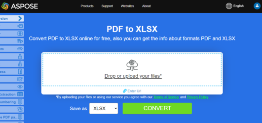

## Creating spreadsheets from PDF using Node.js 

**Aspose.PDF for Node.js via C++** support the feature of converting PDF files to Excel file.

{}
**Try to convert PDF to Excel online**

Aspose.PDF for Node.js presents you online free application ["PDF to XLSX"](https://products.aspose.app/pdf/conversion/pdf-to-xlsx), where you may try to investigate the functionality and quality it works.

[](https://products.aspose.app/pdf/conversion/pdf-to-xlsx)
{}

## Convert PDF to XLSX

In case you want to convert PDF document, you can use [AsposePdfToXlsX](https://reference.aspose.com/pdf/nodejs-cpp/convert/asposepdftoxlsx/) function. 
Please check the following code snippet in order to convert in Node.js environment.

**CommonJS:**

1. Call `require` and import `asposepdfnodejs` module as `AsposePdf` variable.
1. Specify the name of the PDF file that will be converted.
1. Call `AsposePdf` as Promise and perform the operation for converting file. Receive the object if successful.
1. Call the function [AsposePdfToXlsX](https://reference.aspose.com/pdf/nodejs-cpp/convert/asposepdftoxlsx/).
1. Convert PDF file. Thus, if 'json.errorCode' is 0, the result of the operation is saved in "ResultPDFtoXlsX.xlsx". If the json.errorCode parameter is not 0 and, accordingly, an error appears in your file, the error information will be contained in 'json.errorText'.

```js

  const AsposePdf = require('asposepdfnodejs');
  const pdf_file = 'Aspose.pdf';
  AsposePdf().then(AsposePdfModule => {
      /*Convert a PDF-file to XlsX and save the "ResultPDFtoXlsX.xlsx"*/
      const json = AsposePdfModule.AsposePdfToXlsX(pdf_file, "ResultPDFtoXlsX.xlsx");
      console.log("AsposePdfToXlsX => %O", json.errorCode == 0 ? json.fileNameResult : json.errorText);
  });
```

**ECMAScript/ES6:**

1. Import the `asposepdfnodejs` module.
1. Specify the name of the PDF file that will be converted.
1. Initialize the AsposePdf module. Receive the object if successful.
1. Call the function [AsposePdfToXlsX](https://reference.aspose.com/pdf/nodejs-cpp/convert/asposepdftoxlsx/).
1. Convert PDF file. Thus, if 'json.errorCode' is 0, the result of the operation is saved in "ResultPDFtoXlsX.xlsx". If the json.errorCode parameter is not 0 and, accordingly, an error appears in your file, the error information will be contained in 'json.errorText'.

```js

  import AsposePdf from 'asposepdfnodejs';
  const AsposePdfModule = await AsposePdf();
  const pdf_file = 'Aspose.pdf';
  /*Convert a PDF-file to XlsX and save the "ResultPDFtoXlsX.xlsx"*/
  const json = AsposePdfModule.AsposePdfToXlsX(pdf_file, "ResultPDFtoXlsX.xlsx");
  console.log("AsposePdfToXlsX => %O", json.errorCode == 0 ? json.fileNameResult : json.errorText);
```

