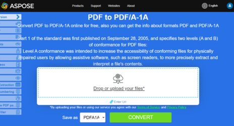

**Aspose.PDF for PHP** allows you to convert a PDF file to a PDF/A compliant PDF file. Before doing so, the file must be validated. This article explains how.

Please note we follow Adobe Preflight for validating PDF/A conformance. All tools on the market have their own "representation" of PDF/A conformance. Please check this article on [PDF/A validation tools](http://wiki.opf-labs.org/display/SPR/PDFA+Validation+tools+give+different+results) for reference. We chose Adobe products for verifying how Aspose.PDF produces PDF files because Adobe is at the center of everything connected to PDF.

Before converting the PDF to a PDF/A compliant file, validate the PDF using the validate method. The validation result is stored in an XML file and then this result is also passed to the convert method. You can also specify the action for the elements which can not be converted using the [ConvertErrorAction](https://reference.aspose.com/pdf/java/com.aspose.pdf/converterroraction) enumeration.

## PDF to PDF/A Conversion

The following code snippet shows how to convert PDF files to PDF/A-1b compliant PDF.

```php
// Create a new Document object and load the input PDF file.
$document = new Document($inputFile);

// Convert the document to PDF/A-1a format and specify the log file and error action.
$res = $document->convert($logFile, PdfFormat::$PDF_A_1A, ConvertErrorAction::$Delete);

// Save the converted document to the output file.
$document->save($outputFile);
```

To perform validation only, use the following line of code:

```php
// Create a new Document object and load the input PDF file.
$document = new Document($inputFile);

// Convert the document to PDF/A-1a format and specify the log file and error action.
$res = $document->convert($logFile, PdfFormat::$PDF_A_1A, ConvertErrorAction::$Delete);

// Validate PDF for PDF/A-1a
if ($document->validate("validation-result-A1A.xml", PdfFormat.PDF_A_1A))
{
    echo "Valid";
}
else
{
    echo "Not valid";
}
```

{}
**Try to convert PDF to PDF/A online**

Aspose.PDF for PHP presents you online free application ["PDF to PDF/A-1A"](https://products.aspose.app/pdf/conversion/pdf-to-pdfa1a), where you may try to investigate the functionality and quality it works.

[](https://products.aspose.app/pdf/conversion/pdf-to-pdfa1a)
{}
