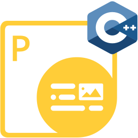

## Welcome to Aspose.PDF for Python via C++

{}

Aspose.PDF for Python supports the development of applications across various operating systems, including Windows and Linux, as long as Python 3.5 or a later version is installed.

The main feature of Aspose.PDF for Python via C++ is that it does not require .NET, Java, and other native libraries. Its speed is much higher than on other Python products.

Aspose.PDF for Python via C++ offers a complete set of functions for working with PDF documents. Learn them on the next Documentation Pages.

{}

## Chapters

- [Converting documents](/pdf/python-cpp/converting/)
- [Advanced operations](/pdf/python-cpp/advanced-operations/)
- [Release Notes](https://releases.aspose.com/pdf/pythoncpp/)

## Aspose.PDF for Python via C++ Resources

The following are the links to some useful resources you may need to accomplish your tasks.

- [Aspose.PDF for Python via C++ Release Notes](https://releases.aspose.com/pdf/pythoncpp/)
- [Aspose.PDF for Python via C++ Product Page](https://products.aspose.com/pdf/python-cpp/)
- [Download Aspose.PDF for Python via C++](https://releases.aspose.com/pdf/pythoncpp/)
- [Install Aspose.PDF for Python via PyPI](https://pypi.org/project/aspose-pdf-cpp-for-python/)
- [Aspose.PDF for Python via C++ API Reference Guide](https://reference.aspose.com/pdf/python-cpp/)
- [Aspose.PDF for Python via C++ Free Support Forum](https://forum.aspose.com/c/pdf/10)
- [Aspose.PDF for Python via C++ Paid Support Helpdesk](https://helpdesk.aspose.com/)
