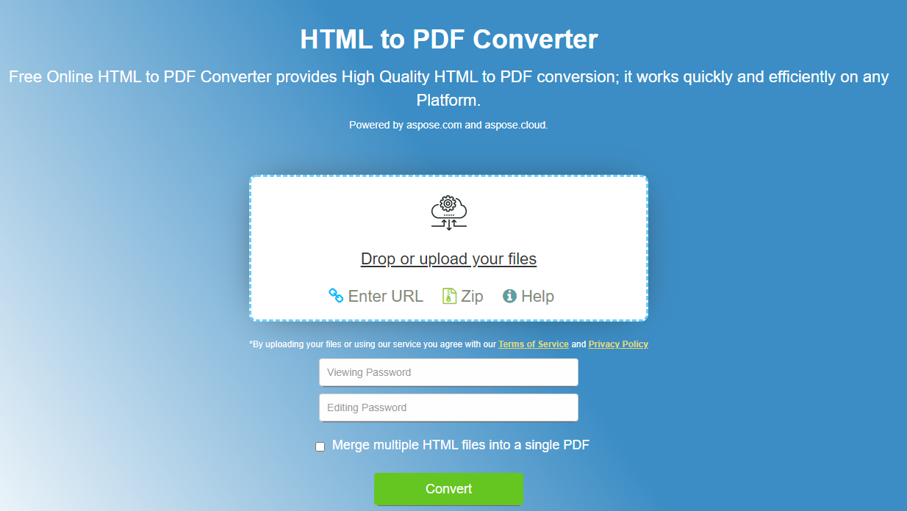

## Overview 

Aspose.PDF for Python via Java is a professional solution that allows you to create PDF files from web pages and raw HTML code in your applications.

This article explains how to **convert HTML to PDF using Python**. It covers the following topics.

_Format_: **HTML**
- [Python HTML to PDF](#python-html-to-pdf)
- [Python Convert HTML to PDF](#python-html-to-pdf)
- [Python How to convert HTML to PDF](#python-html-to-pdf)

## Python HTML to PDF Conversion

**Aspose.PDF for Python** is a PDF manipulation API that lets you convert any existing HTML documents to PDF seamlessly. The process of converting HTML to PDF can be flexibly customized.

## Convert HTML to PDF

The following Python code sample shows how to convert an HTML document to a PDF.

1. Create an instance of the [HtmlLoadOptions](https://reference.aspose.com/pdf/python-net/aspose.pdf/htmlloadoptions/) class.
2. Initialize [Document](https://reference.aspose.com/pdf/python-net/aspose.pdf/document/) object.
3. Save output PDF document by calling **Document.Save()** method.

```python

from asposepdf import Api


# init license
documentName = "testdata/license/Aspose.PDF.PythonviaJava.lic"
licenseObject = Api.License()
licenseObject.setLicense(documentName)

# conversion from byte array
documentName = "input.html"
with open(documentName, "rb") as file:
    byte_array = file.read()
doc = Api.Document(byte_array, Api.LoadFormat.HTML)
documentOutName = "result_fromHtml.pdf"
doc.save(documentOutName)

# conversion from file
documentName = "input.html"
doc = Api.Document(documentName, Api.LoadFormat.HTML)
documentOutName = "result2_fromHtml.pdf"
doc.save(documentOutName)
```

{}
**Try to convert HTML to PDF online**

Aspose presents you online free application ["HTML to PDF"](https://products.aspose.app/html/en/conversion/html-to-pdf), where you may try to investigate the functionality and quality it works.

[](https://products.aspose.app/html/en/conversion/html-to-pdf)
{}


