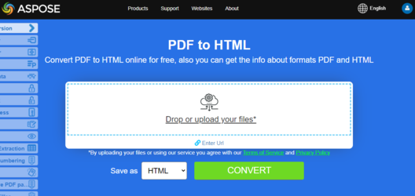

## Overview

This article explains how to **convert PDF to HTML using Python**. It covers these topics.

_Format_: **HTML**
- [Python PDF to HTML](#python-pdf-to-html)
- [Python Convert PDF to HTML](#python-pdf-to-html)
- [Python How to convert PDF file to HTML](#python-pdf-to-html)


## Convert PDF to HTML

**Aspose.PDF for Python via .NET** provides many features for converting various file formats into PDF documents and converting PDF files into various output formats. This article discusses how to convert a PDF file into <abbr title="HyperText Markup Language">HTML</abbr>. You can use just a couple of lines of code Python for converting PDF To HTML. You may need to convert PDF to HTML if you want to create a website or add content to an online forum. One way to convert PDF to HTML is to programmatically use Python.

{}
**Try to convert PDF to HTML online**

Aspose.PDF for Python presents you online free application ["PDF to HTML"](https://products.aspose.app/pdf/conversion/pdf-to-html), where you may try to investigate the functionality and quality it works.

[](https://products.aspose.app/pdf/conversion/pdf-to-html)
{}

<a name="csharp-pdf-to-html"><strong>Steps: Convert PDF to HTML in Python</strong></a>

1. Create an instance of [Document](https://reference.aspose.com/pdf/python-java/aspose.pdf/document/) object with the source PDF document.
2. Save it to [HtmlSaveOptions](https://reference.aspose.com/pdf/python-java/aspose.pdf/htmlsaveoptions/) by calling [Document.save()](https://reference.aspose.com/pdf/python-java/aspose.pdf/document/#methods) method.

```python


from asposepdf import Api

documentName = "../../testdata/source.pdf"
documentOutName = "../../testout/result.html"
# Open PDF document
document = Api.Document(documentName)

# save document in HTML format
save_options = Api.HtmlSaveOptions()
document.save(documentOutName, save_options)
```

## See Also 

This article also covers these topics. The codes are same as above.

_Format_: **HTML**
- [Python PDF to HTML Code](#python-pdf-to-html)
- [Python PDF to HTML API](#python-pdf-to-html)
- [Python PDF to HTML Programmatically](#python-pdf-to-html)
- [Python PDF to HTML Library](#python-pdf-to-html)
- [Python Save PDF as HTML](#python-pdf-to-html)
- [Python Generate HTML from PDF](#python-pdf-to-html)
- [Python Create HTML from PDF](#python-pdf-to-html)
- [Python PDF to HTML Converter](#python-pdf-to-html)
