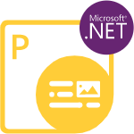

<h2>Welcome to Aspose.PDF for Python via .NET</h2>

{}

Aspose.PDF is a .NET component built to allow developers to create PDF documents, whether simple or complex, on the fly programmatically. Aspose.PDF for Python via .NET allows developers to insert tables, graphs, images, hyperlinks, custom fonts - and more - into PDF documents. Moreover, it is also possible to compress PDF documents. Aspose.PDF for Python via .NET provides excellent security features to develop secure PDF documents. And the most distinct feature of Aspose.PDF for Python via .NET is that it supports the creation of PDF documents through both an API and from XML templates.

{}

<h2>Chapters</h2>

- [What's new](/pdf/python-net/whatsnew/)
- [Overview](/pdf/python-net/overview/)
- [Get Started](/pdf/python-net/get-started/)
- [Basic operations](/pdf/python-net/basic-operations/)
- [Converting documents](/pdf/python-net/converting/)
- [Parsing PDF documents](/pdf/python-net/parsing/)
- [Advanced operations](/pdf/python-net/advanced-operations/)
- [Release Notes](https://releases.aspose.com/pdf/pythonnet/release-notes/)

<h2>Aspose.PDF for Python via .NET Resources</h2>

The following are the links to some useful resources you may need to accomplish your tasks.

- [Aspose.PDF for Python via .NET Features](/pdf/python-net/key-features/)
- [Aspose.PDF for Python via .NET Release Notes](https://releases.aspose.com/pdf/pythonnet/release-notes/)
- [Aspose.PDF for Python via .NET Product Page](https://products.aspose.com/pdf/python-net/)
- [Download Aspose.PDF for Python via .NET](https://releases.aspose.com/pdf/pythonnet/)
- [Install Aspose.PDF for Python via .NET NuGet Package](https://www.nuget.org/packages/Aspose.PDF/)
- [Aspose.PDF for Python via .NET API Reference Guide](https://reference.aspose.com/pdf/net)!
- [Aspose.PDF for Python via .NET Free Support Forum](https://forum.aspose.com/c/pdf/10)
- [Aspose.PDF for Python via .NET Paid Support Helpdesk](https://helpdesk.aspose.com/)
