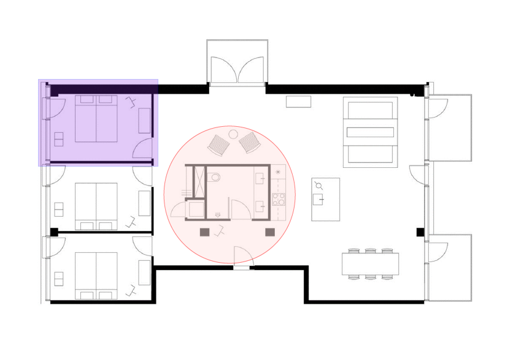

## Add Square and Circle Annotations

In PDF documents, a square annotation refers to a specific type of annotation that is represented by a square shape. Square annotations are used to highlight or draw attention to a specific area or section within the document.

[Square](https://reference.aspose.com/pdf/python-net/aspose.pdf.annotations/squareannotation/) and [Circle](https://reference.aspose.com/pdf/python-net/aspose.pdf.annotations/circleannotation/) annotations shall display, respectively, a rectangle or an ellipse on the page.

Steps for creating Square or Circle Annotations:

1. Load the PDF file - new [Document](https://reference.aspose.com/pdf/python-net/aspose.pdf/document/).
1. Create new [SquareAnnotation](https://reference.aspose.com/pdf/python-net/aspose.pdf.annotations/squareannotation) and set parameters (new Rectangle, title, color, interior_color, opacity).
1. After we need to Add Square Annotation to the page.

The following code snippet shows you how to add Square Annotations in a PDF page.

```python

    import aspose.pdf as ap

    document = ap.Document(input_file)

    squareAnnotation = ap.annotations.SquareAnnotation(document.pages[1], ap.Rectangle(60, 600, 250, 450, True))
    squareAnnotation.title = "John Smith"
    squareAnnotation.color = ap.Color.blue
    squareAnnotation.interior_color = ap.Color.blue_violet
    squareAnnotation.opacity = 0.25

    document.pages[1].annotations.append(squareAnnotation)

    document.save(output_file)
```

The following code snippet shows you how to add Circle Annotations in a PDF page.

```python

    import aspose.pdf as ap

    # Open document
    document = ap.Document(input_file)

    circleAnnotation = ap.annotations.CircleAnnotation(
        document.pages[1], ap.Rectangle(270, 160, 483, 383, True)
    )
    circleAnnotation.title = "John Smith"
    circleAnnotation.color = ap.Color.red
    circleAnnotation.interior_color = ap.Color.misty_rose
    circleAnnotation.opacity = 0.5
    circleAnnotation.popup = ap.annotations.PopupAnnotation(
        document.pages[1], ap.Rectangle(842, 316, 1021, 459, True)
    )

    document.pages[1].annotations.append(circleAnnotation)
    document.save(output_file)
```

As an example, we will see the following result of adding Square and Circle annotations to a PDF document:



### Get Circle Annotation

Please try using the following code snippet to Get Circle Annotation from PDF document.

```python

    import aspose.pdf as ap

    document = ap.Document(input_file)
    circleAnnotations = [
        a
        for a in document.pages[1].annotations
        if (a.annotation_type == ap.annotations.AnnotationType.CIRCLE)
    ]

    for ca in circleAnnotations:
        print(ca.rect)
```

### Get Square Annotation

Please try using the following code snippet to Get Square Annotation from PDF document.

```python

    import aspose.pdf as ap

    document = ap.Document(input_file)
    squareAnnotations = [
        a
        for a in document.pages[1].annotations
        if (a.annotation_type == ap.annotations.AnnotationType.SQUARE)
    ]

    for pa in squareAnnotations:
        print(pa.rect)
```


### Delete Circle Annotation

The following code snippet shows how to Delete Circle Annotation from PDF file.

```python

    import aspose.pdf as ap

    document = ap.Document(input_file)
    circleAnnotations = [
        a
        for a in document.pages[1].annotations
        if (a.annotation_type == ap.annotations.AnnotationType.CIRCLE)
    ]

    for ca in circleAnnotations:
        document.pages[1].annotations.delete(ca)

    document.save(output_file)
```

### Delete Square Annotation

The following code snippet shows how to Delete Square Annotation from PDF file.

```python

    import aspose.pdf as ap

    document = ap.Document(input_file)
    squareAnnotations = [
        a
        for a in document.pages[1].annotations
        if (a.annotation_type == ap.annotations.AnnotationType.SQUARE)
    ]

    for pa in squareAnnotations:
        document.pages[1].annotations.delete(pa)

    document.save(output_file)
```

## Add Polygon and Polyline Annotations

The Polyline tool allows you to create shapes and outlines with an arbitrary number of sides on the document.

[Polygon Annotations](https://reference.aspose.com/pdf/python-net/aspose.pdf.annotations/polygonannotation/) represent polygons on a page. They can have any number of vertices connected by straight lines.

[Polyline Annotations](https://reference.aspose.com/pdf/python-net/aspose.pdf.annotations/polylineannotation/) are also similar to polygons, the only difference is that the first and last vertices are not implicitly connected.

Steps with which we create Polygon annotations:

1. Load the PDF file - new [Document](https://reference.aspose.com/pdf/python-net/aspose.pdf/document/).
1. Create new [Polygon Annotation](https://reference.aspose.com/pdf/python-net/aspose.pdf.annotations/polygonannotation) and set Polygon parameters (new Rectangle, new Points, title, color, interior_color and opacity).
1. After we can Add annotations to the page.

The following code snippet shows how to add Polygon Annotations to a PDF file:

```python

    import aspose.pdf as ap

    document = ap.Document(input_file)

    polygonAnnotation = ap.annotations.PolygonAnnotation(
        document.pages[1],
        ap.Rectangle(200, 300, 400, 400, True),
        [
            ap.Point(200, 300),
            ap.Point(220, 300),
            ap.Point(250, 330),
            ap.Point(300, 304),
            ap.Point(300, 400),
        ],
    )
    polygonAnnotation.title = "John Smith"
    polygonAnnotation.color = ap.Color.blue
    polygonAnnotation.interior_color = ap.Color.blue_violet
    polygonAnnotation.opacity = 0.25

    document.pages[1].annotations.append(polygonAnnotation)
    document.save(output_file)
```

The following code snippet shows how to add Polyline Annotations to a PDF file:

1. Load the PDF file - new [Document](https://reference.aspose.com/pdf/python-net/aspose.pdf/document/).
1. Create new [Polyline Annotations](https://reference.aspose.com/pdf/python-net/aspose.pdf.annotations/polylineannotation/) and set Polygon parameters (new Rectangle, new Points, title, color, interior_color and opacity).
1. After we can Add annotations to the page.

```python

    import aspose.pdf as ap

    document = ap.Document(input_file)

    polylineAnnotation = ap.annotations.PolylineAnnotation(
        document.pages[1],
        ap.Rectangle(270, 193, 571, 383, True),
        [
            ap.Point(545, 150),
            ap.Point(545, 190),
            ap.Point(667, 190),
            ap.Point(667, 110),
            ap.Point(626, 111),
        ],
    )
    polylineAnnotation.title = "John Smith"
    polylineAnnotation.color = ap.Color.red
    polylineAnnotation.popup = ap.annotations.PopupAnnotation(
        document.pages[1], ap.Rectangle(842, 196, 1021, 338, True)
    )

    document.pages[1].annotations.append(polylineAnnotation)
    document.save(output_file)
```

### Get Polygon and Polyline Annotations

Please try using the following code snippet to Get Polygon Annotations in PDF document.

```python

    import aspose.pdf as ap

    document = ap.Document(input_file)
    polygonAnnotations = [
        a
        for a in document.pages[1].annotations
        if (a.annotation_type == ap.annotations.AnnotationType.POLYGON)
    ]

    for pa in polygonAnnotations:
        print(pa.rect)
```

Please try using the following code snippet to Get Polyline Annotations in PDF document.

```python

    import aspose.pdf as ap

    document = ap.Document(input_file)
    polylineAnnotations = [
        a
        for a in document.pages[1].annotations
        if (a.annotation_type == ap.annotations.AnnotationType.POLY_LINE)
    ]

    for pa in polylineAnnotations:
        print(pa.rect)
```

### Delete Polygon and Polyline Annotations

The following code snippet shows how Delete Polygon Annotations from a PDF file.

```python

    import aspose.pdf as ap

    document = ap.Document(input_file)
    polygonAnnotations = [
        a
        for a in document.pages[1].annotations
        if (a.annotation_type == ap.annotations.AnnotationType.POLYGON)
    ]

    for pa in polygonAnnotations:
        document.pages[1].annotations.delete(pa)

    document.save(output_file)
```

The following code snippet shows how Delete Polyline Annotations from a PDF file.

```python

    import aspose.pdf as ap

    document = ap.Document(input_file)
    polylineAnnotations = [
        a
        for a in document.pages[1].annotations
        if (a.annotation_type == ap.annotations.AnnotationType.POLY_LINE)
    ]

    for pa in polylineAnnotations:
        document.pages[1].annotations.delete(pa)

    document.save(output_file)
```

