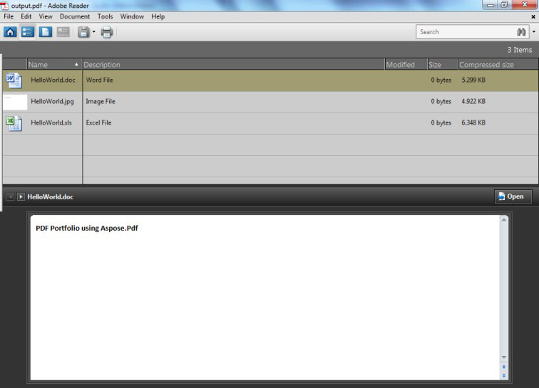

Creating a PDF portfolio allows consolidating and archiving different types of files into a single, consistent document. Such a document could include text files, images, spreadsheets, presentations, and other materials, and ensure that all relevant material is stored and organized in one place.

The PDF portfolio will help to show your presentation in a high-quality way, wherever you use it. In general, creating a PDF portfolio is a very current and modern task.

Use a PDF portfolio when you want to distribute a collection of related files together while keeping each file in its original format inside one PDF container.

## How to Create a PDF Portfolio

Aspose.PDF for Python via .NET allows creating PDF Portfolio documents using the [Document](https://reference.aspose.com/pdf/python-net/aspose.pdf/document/) class. Add a file into a document.collection object after getting it with the [FileSpecification](https://reference.aspose.com/pdf/python-net/aspose.pdf/filespecification/) class. When the files have been added, use the Document class' [save()](https://reference.aspose.com/pdf/python-net/aspose.pdf/document/#methods) method to save the portfolio document.

The following example uses a Microsoft Excel File, a Word document and an image file to create a PDF Portfolio.

The code below results in the following portfolio.

### A PDF Portfolio created with Aspose.PDF for Python



```python

    import aspose.pdf as ap

    # Instantiate Document Object
    document = ap.Document()

    # Instantiate document Collection object
    document.collection = ap.Collection()

    # Get Files to add to Portfolio
    excel = ap.FileSpecification(input_excel)
    word = ap.FileSpecification(input_doc)
    image = ap.FileSpecification(input_jpg)

    # Provide description of the files
    excel.description = "Excel File"
    word.description = "Word File"
    image.description = "Image File"

    # Add files to document collection
    document.collection.append(excel)
    document.collection.append(word)
    document.collection.append(image)

    # Save Portfolio document
    document.save(output_pdf)
```

## Remove Files from PDF Portfolio

In order to delete/remove files from PDF portfolio, try using the following code lines.

```python

    import aspose.pdf as ap

    # Open document
    document = ap.Document(input_pdf)
    document.collection.delete()

    # Save updated file
    document.save(output_pdf)
```

## Related Attachment Topics

- [Work with PDF attachments in Python](/pdf/python-net/attachments/)
- [Add attachments to PDF in Python](/pdf/python-net/add-attachment-to-pdf-document/)
- [Remove attachments from PDF in Python](/pdf/python-net/removing-attachment-from-an-existing-pdf/)

