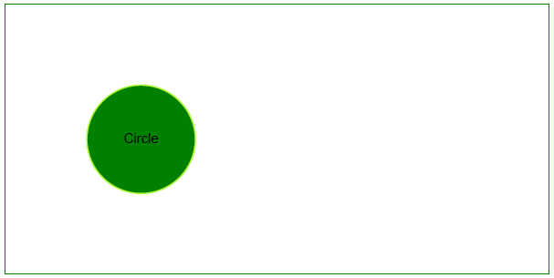

## Add Circle object

Like bar graphs, circle graphs can be used to display data in a number of separate categories. Unlike bar graphs, however, circle graphs can be used only when you have data for all the categories that make up the whole. So let's take a look at adding a [Circle](https://reference.aspose.com/pdf/python-net/aspose.pdf.drawing/circle/) object with Aspose.PDF for Python .NET.

This example illustrates how to programmatically draw a circle within a PDF document using Aspose.PDF for Python via .NET. By leveraging the drawing module, developers can create complex graphical elements with precise control over their appearance and positioning. This capability is essential for applications that require dynamic generation of graphical content within PDFs, such as technical diagrams, charts, or custom illustrations.

Follow the steps below:

1. Create [Document](https://reference.aspose.com/pdf/python-net/aspose.pdf/document/) instance.
1. Create [Drawing object](https://reference.aspose.com/pdf/python-net/aspose.pdf.drawing/) with certain dimensions.
1. Set [border](https://reference.aspose.com/pdf/python-net/aspose.pdf.drawing/graph/#properties) for Drawing object.
1. Add [Graph](https://reference.aspose.com/pdf/python-net/aspose.pdf.drawing/graph/) object to paragraphs collection of page.
1. Save our PDF file.

```python

    import aspose.pdf as ap
    import aspose.pdf.drawing as drawing
    import datetime

    # Create PDF document
    document = ap.Document()

    # Add page
    page = document.pages.add()

    # Create Drawing object with certain dimensions
    graph = drawing.Graph(400, 200)

    # Set border for Drawing object
    border_info = ap.BorderInfo(ap.BorderSide.ALL, ap.Color.green)
    graph.border = border_info

    # Create a circle with the specified coordinates and radius
    circle = drawing.Circle(100, 100, 40)

    # Set the circle's color
    circle.graph_info = drawing.GraphInfo()
    circle.graph_info.color = ap.Color.green_yellow

    # Add the circle to the graph shapes
    graph.shapes.add(circle)

    # Add Graph object to paragraphs collection of page
    page.paragraphs.add(graph)

    # Save PDF document
    document.save(path_outfile)
```

Our drawn circle will look like this:


## Create Filled Circle Object

This example shows how to add a Circle object that is filled with color.

```python

    import aspose.pdf as ap
    import aspose.pdf.drawing as drawing
    import datetime

    # Create PDF document
    document = ap.Document()

    # Add page
    page = document.pages.add()

    # Create Drawing object with certain dimensions
    graph = drawing.Graph(400, 200)

    # Set border for Drawing object
    border_info = ap.BorderInfo(ap.BorderSide.ALL, ap.Color.green)
    graph.border = border_info

    # Create a filled circle
    circle = drawing.Circle(100, 100, 40)
    circle.graph_info = drawing.GraphInfo()
    circle.graph_info.color = ap.Color.green_yellow
    circle.graph_info.fill_color = ap.Color.green
    circle.text = ap.text.TextFragment("Circle")

    # Add the circle to the graph shapes
    graph.shapes.add(circle)

    # Add Graph object to paragraphs collection of page
    page.paragraphs.add(graph)

    # Save PDF document
    document.save(path_outfile)
```

Let's see the result of adding a filled Circle:



