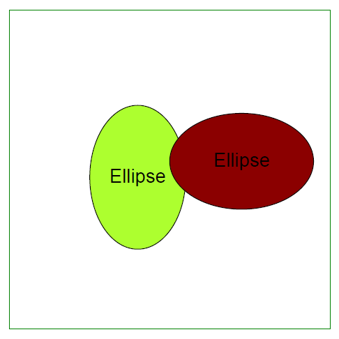

## Add Ellipse object

Aspose.PDF for Python via .NET supports to add [Ellipse](https://reference.aspose.com/pdf/python-net/aspose.pdf.drawing/ellipse/) objects to PDF documents. It also offers the feature to fill ellipse  object with a certain color.

This example illustrates how to programmatically draw and customize ellipses within a PDF document using Aspose.PDF for Python via .NET. By leveraging the drawing module, developers can create complex graphical elements with precise control over their appearance and positioning. This capability is essential for applications that require dynamic generation of graphical content within PDFs, such as technical diagrams, charts, or custom illustrations.

```python

    import aspose.pdf as ap
    import aspose.pdf.drawing as drawing
    import datetime

    # Create PDF document
    document = ap.Document()

    # Add a page
    page = document.pages.add()

    # Create Drawing object with certain dimensions
    graph = drawing.Graph(400, 400)

    # Set border for Drawing object
    border_info = ap.BorderInfo(ap.BorderSide.ALL, ap.Color.green)
    graph.border = border_info

    # Create first ellipse with specified coordinates and radii
    ellipse1 = drawing.Ellipse(150, 100, 120, 60)
    ellipse1.graph_info.color = ap.Color.green_yellow
    ellipse1.text = ap.TextFragment("Ellipse")

    # Add first ellipse to graph
    graph.shapes.add(ellipse1)

    # Create second ellipse with different dimensions and color
    ellipse2 = drawing.Ellipse(50, 50, 18, 300)
    ellipse2.graph_info.color = ap.Color.dark_red

    # Add second ellipse to graph
    graph.shapes.add(ellipse2)

    # Add Graph object to paragraphs collection of page
    page.paragraphs.add(graph)

    # Save PDF document
    document.save(path_outfile)

```


## Create Filled Ellipse Object

The following code snippet shows how to add a [Ellipse](https://reference.aspose.com/pdf/python-net/aspose.pdf.drawing/ellipse/) object that is filled with color.

```python

    import aspose.pdf as ap
    import aspose.pdf.drawing as drawing
    import datetime

    # Create PDF document
    document = ap.Document()

    # Add a page
    page = document.pages.add()

    # Create Drawing object with certain dimensions
    graph = drawing.Graph(400, 400)

    # Set border for Drawing object
    border_info = ap.BorderInfo(ap.BorderSide.ALL, ap.Color.green)
    graph.border = border_info

    # Create first ellipse and set its fill color
    ellipse1 = drawing.Ellipse(100, 100, 120, 180)
    ellipse1.graph_info.fill_color = ap.Color.green_yellow

    # Add first ellipse to graph
    graph.shapes.add(ellipse1)

    # Create second ellipse and set its fill color
    ellipse2 = drawing.Ellipse(200, 150, 180, 120)
    ellipse2.graph_info.fill_color = ap.Color.dark_red

    # Add second ellipse to graph
    graph.shapes.add(ellipse2)

    # Add Graph object to paragraphs collection of page
    page.paragraphs.add(graph)

    # Save PDF document
    document.save(path_outfile)
```


## Add Text inside the Ellipse

Aspose.PDF for Python via .NET supports to add text inside the Graph Object. Text property of Graph Object provides option to set text of the Graph Object. The following code snippet shows how to add text inside a Rectangle object.

```python

    import aspose.pdf as ap
    import aspose.pdf.drawing as drawing
    import datetime

    # Create Document instance
    document = ap.Document()

    # Add page to pages collection of PDF file
    page = document.pages.add()

    # Create Graph instance
    graph = drawing.Graph(400, 400)

    # Set border for Drawing object
    border_info = ap.BorderInfo(ap.BorderSide.ALL, ap.Color.green)
    graph.border = border_info

    text_fragment = ap.text.TextFragment("Ellipse")
    text_fragment.text_state.font = ap.text.FontRepository.find_font("Helvetica")
    text_fragment.text_state.font_size = 24

    ellipse1 = ap.drawing.Ellipse(100, 100, 120, 180)
    ellipse1.graph_info.fill_color = ap.Color.green_yellow
    ellipse1.text = text_fragment
    graph.shapes.append(ellipse1)

    ellipse2 = ap.drawing.Ellipse(200, 150, 180, 120)
    ellipse2.graph_info.fill_color = ap.Color.dark_red
    ellipse2.text = text_fragment
    graph.shapes.append(ellipse2)

    # Add Graph object to paragraphs collection of page
    page.paragraphs.add(graph)

    # Save PDF file
    document.save(path_outfile)
```


