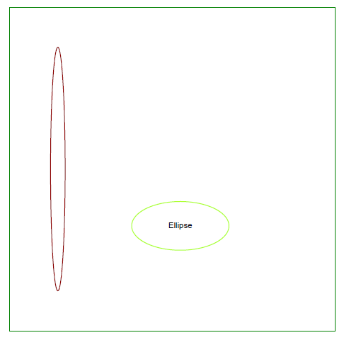

## Add Ellipse object

Aspose.PDF for Python via .NET lets you add [Ellipse](https://reference.aspose.com/pdf/python-net/aspose.pdf.drawing/ellipse/) shapes to PDF pages with the [Graph](https://reference.aspose.com/pdf/python-net/aspose.pdf.drawing/graph/) class. You can draw ellipse outlines, apply fill colors, and place text inside ellipse objects.

```python
import aspose.pdf as ap
import aspose.pdf.drawing as drawing

def add_ellipse(outfile: str):
    document = ap.Document()
    page = document.pages.add()
    graph = drawing.Graph(400, 400)
    graph.border = ap.BorderInfo(ap.BorderSide.ALL, ap.Color.green)

    ellipse1 = drawing.Ellipse(150, 100, 120, 60)
    ellipse1.graph_info.color = ap.Color.green_yellow
    ellipse1.text = ap.text.TextFragment("Ellipse")
    graph.shapes.add(ellipse1)

    ellipse2 = drawing.Ellipse(50, 50, 18, 300)
    ellipse2.graph_info.color = ap.Color.dark_red
    graph.shapes.add(ellipse2)

    page.paragraphs.add(graph)
    document.save(outfile)
```



## Create Filled Ellipse Object

The following code snippet shows how to add a [Ellipse](https://reference.aspose.com/pdf/python-net/aspose.pdf.drawing/ellipse/) object that is filled with color.

```python
import aspose.pdf as ap
import aspose.pdf.drawing as drawing

def create_ellipse_filled(outfile: str):
    document = ap.Document()
    page = document.pages.add()
    graph = drawing.Graph(400, 400)
    graph.border = ap.BorderInfo(ap.BorderSide.ALL, ap.Color.green)

    ellipse1 = drawing.Ellipse(100, 100, 120, 180)
    ellipse1.graph_info.fill_color = ap.Color.green_yellow
    graph.shapes.add(ellipse1)

    ellipse2 = drawing.Ellipse(200, 150, 180, 120)
    ellipse2.graph_info.fill_color = ap.Color.dark_red
    graph.shapes.add(ellipse2)

    page.paragraphs.add(graph)
    document.save(outfile)
```


## Add Text inside the Ellipse

Aspose.PDF for Python via .NET also lets you place text inside shape objects. The following example adds text to ellipse shapes.

```python
import aspose.pdf as ap
import aspose.pdf.drawing as drawing

def add_text_inside_ellipse(outfile: str):
    document = ap.Document()
    page = document.pages.add()
    graph = drawing.Graph(400, 400)
    graph.border = ap.BorderInfo(ap.BorderSide.ALL, ap.Color.green)

    text_fragment = ap.text.TextFragment("Ellipse")
    text_fragment.text_state.font = ap.text.FontRepository.find_font("Helvetica")
    text_fragment.text_state.font_size = 24

    ellipse1 = ap.drawing.Ellipse(100, 100, 120, 180)
    ellipse1.graph_info.fill_color = ap.Color.green_yellow
    ellipse1.text = text_fragment
    graph.shapes.add(ellipse1)

    ellipse2 = ap.drawing.Ellipse(200, 150, 180, 120)
    ellipse2.graph_info.fill_color = ap.Color.dark_red
    ellipse2.text = text_fragment
    graph.shapes.add(ellipse2)

    page.paragraphs.add(graph)
    document.save(outfile)
```


## Related Graph Topics

- [Work with PDF graphs in Python](/pdf/python-net/working-with-graphs/)
- [Add circle shapes to PDF in Python](/pdf/python-net/add-circle/)
- [Add curve shapes to PDF in Python](/pdf/python-net/add-curve/)
- [Add rectangle shapes to PDF in Python](/pdf/python-net/add-rectangle/)
