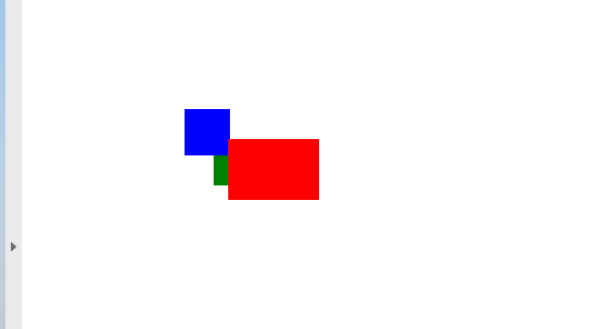

## Add Rectangle object

Aspose.PDF for Python via .NET supports the feature to add graph objects (for example graph, line, rectangle etc.) to PDF documents. You also get the leverage to add [Rectangle](https://reference.aspose.com/pdf/python-net/aspose.pdf.drawing/rectangle/) object where you also offers the feature to fill rectangle object.

First, let's look at the possibility of creating a Rectangle object.

Follow the steps below:

1. Create a new PDF [Document](https://reference.aspose.com/pdf/python-net/aspose.pdf/document/).
1. Add [Page](https://reference.aspose.com/pdf/python-net/aspose.pdf/page/) to pages collection of PDF file.
1. Add [Text fragment](https://reference.aspose.com/pdf/python-net/aspose.pdf/texfragment/) to paragraphs collection of page instance.
1. Create [Graph](https://reference.aspose.com/pdf/python-net/aspose.pdf.drawing/graph/) instance.
1. Set border for [Drawing object](https://reference.aspose.com/pdf/python-net/aspose.pdf.drawing/).
1. Add [Rectangle](https://reference.aspose.com/pdf/python-net/aspose.pdf.drawing/rectangle/) object to shapes collection of Graph object.
1. Add graph object to paragraphs collection of page instance.
1. Add [Text fragment](https://reference.aspose.com/pdf/python-net/aspose.pdf/texfragment/) to paragraphs collection of page instance.
1. And save your PDF file

```python
import aspose.pdf as ap
import aspose.pdf.drawing as drawing
import sys
from os import path

def add_rectangle(outfile: str):
    document = ap.Document()
    page = document.pages.add()
    text_fragment = ap.text.TextFragment("Rectangle")
    page.paragraphs.add(text_fragment)

    graph = drawing.Graph(400, 300)
    page.paragraphs.add(graph)
    graph.border = ap.BorderInfo(ap.BorderSide.ALL, ap.Color.red)

    rect = drawing.Rectangle(20, 20, 350, 250)
    graph.shapes.add(rect)
    page.paragraphs.add(text_fragment)

    document.save(outfile)
```


## Create Filled Rectangle Object

Aspose.PDF for Python via .NET also offers the feature to fill rectangle object with a certain color.

The following code snippet shows how to add a [Rectangle](https://reference.aspose.com/pdf/python-net/aspose.pdf.drawing/rectangle/) object that is filled with color.

```python
import aspose.pdf as ap
import aspose.pdf.drawing as drawing
import sys
from os import path

def create_rectangle_filled(outfile: str):
    document = ap.Document()
    page = document.pages.add()
    graph = drawing.Graph(100, 400)
    page.paragraphs.add(graph)

    rect = drawing.Rectangle(100, 100, 200, 120)
    rect.graph_info.fill_color = ap.Color.red
    graph.shapes.add(rect)

    document.save(outfile)
```

Look at the result of rectangle filled solid color:


## Add Drawing with Gradient Fill

Aspose.PDF for Python via .NET supports the feature to add graph objects to PDF documents and sometimes it is required to fill graph objects with Gradient Color.

The following code snippet shows how to add a [Rectangle](https://reference.aspose.com/pdf/python-net/aspose.pdf.drawing/rectangle/) object that is filled with Gradient Color.

```python
import aspose.pdf as ap
import aspose.pdf.drawing as drawing
import sys
from os import path

def add_drawing_with_gradient_fill(outfile: str):
    document = ap.Document()
    page = document.pages.add()
    graph = drawing.Graph(400, 400)
    page.paragraphs.add(graph)

    rect = drawing.Rectangle(0, 0, 300, 300)
    gradient_color = ap.Color()
    gradient_settings = drawing.GradientAxialShading(ap.Color.red, ap.Color.blue)
    gradient_settings.start = ap.Point(0, 0)
    gradient_settings.end = ap.Point(350, 350)
    gradient_color.pattern_color_space = gradient_settings
    rect.graph_info.fill_color = gradient_color
    graph.shapes.add(rect)

    document.save(outfile)
```


## Create Rectangle with Alpha color channel

Aspose.PDF for Python .NET supports to fill rectangle object with a certain color. A rectangle object can also have Alpha color channel to give transparent appearance. The following code snippet shows how to add a [Rectangle](https://reference.aspose.com/pdf/python-net/aspose.pdf.drawing/rectangle/) object with Alpha color channel.

```python
import aspose.pdf as ap
import aspose.pdf.drawing as drawing
import sys
from os import path

def create_rectangle_with_alpha_color_channel(outfile: str):
    document = ap.Document()
    page = document.pages.add()
    graph = drawing.Graph(100, 400)
    page.paragraphs.add(graph)

    rect = drawing.Rectangle(100, 100, 200, 120)
    rect.graph_info.fill_color = ap.Color.from_argb(128, 244, 180, 0)
    graph.shapes.add(rect)

    rect1 = drawing.Rectangle(200, 150, 200, 100)
    rect1.graph_info.fill_color = ap.Color.from_argb(160, 120, 0, 120)
    graph.shapes.add(rect1)

    document.save(outfile)
```


## Control Z-Order of shapes

Aspose.PDF for .NET supports the feature to add graph objects (for example graph, line, rectangle etc.) to PDF documents. When adding more than one instance of same object inside PDF file, we can control their rendering by specifying the Z-Order. Z-Order is also used when we need to render objects on top of each other.

The following code snippet shows the steps to render [Rectangle](https://reference.aspose.com/pdf/python-net/aspose.pdf.drawing/rectangle/) objects on top of each other.

```python
import aspose.pdf as ap
import aspose.pdf.drawing as drawing
import sys
from os import path

def control_z_order_of_rectangle(outfile: str):
    document = ap.Document()
    page = document.pages.add()
    page.set_page_size(375, 300)
    page.page_info.margin.left = 0
    page.page_info.margin.top = 0

    _add_rectangle_to_page(page, 50, 40, 60, 40, ap.Color.red, 2)
    _add_rectangle_to_page(page, 20, 20, 30, 30, ap.Color.blue, 1)
    _add_rectangle_to_page(page, 40, 40, 60, 30, ap.Color.green, 0)

    document.save(outfile)
```



## Related Graph Topics

- [Work with PDF graphs in Python](/pdf/python-net/working-with-graphs/)
- [Check shape bounds in PDF graphs with Python](/pdf/python-net/aspose-pdf-drawing-graph-shapes-bounds-check/)
- [Add line shapes to PDF in Python](/pdf/python-net/add-line/)
- [Add ellipse shapes to PDF in Python](/pdf/python-net/add-ellipse/)