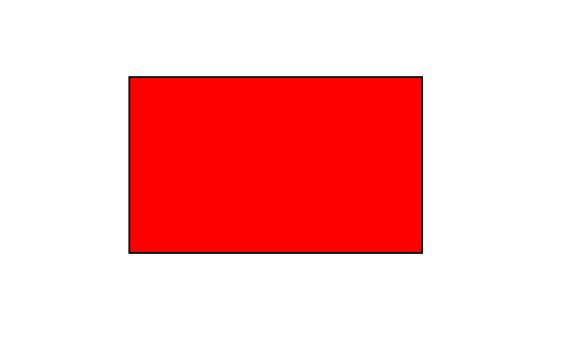

## Add Rectangle object

Aspose.PDF for Python via .NET supports the feature to add graph objects (for example graph, line, rectangle etc.) to PDF documents. You also get the leverage to add [Rectangle](https://reference.aspose.com/pdf/python-net/aspose.pdf.drawing/rectangle/) object where you also offers the feature to fill rectangle object.

First, let's look at the possibility of creating a Rectangle object.

Follow the steps below:

1. Create a new PDF [Document](https://reference.aspose.com/pdf/python-net/aspose.pdf/document/).
1. Add [Page](https://reference.aspose.com/pdf/python-net/aspose.pdf/page/) to pages collection of PDF file.
1. Add [Text fragment](https://reference.aspose.com/pdf/python-net/aspose.pdf/texfragment/) to paragraphs collection of page instance.
1. Create [Graph](https://reference.aspose.com/pdf/python-net/aspose.pdf.drawing/graph/) instance.
1. Set border for [Drawing object](https://reference.aspose.com/pdf/python-net/aspose.pdf.drawing/).
1. Add [Rectangle](https://reference.aspose.com/pdf/python-net/aspose.pdf.drawing/rectangle/) object to shapes collection of Graph object.
1. Add graph object to paragraphs collection of page instance.
1. Add [Text fragment](https://reference.aspose.com/pdf/python-net/aspose.pdf/texfragment/) to paragraphs collection of page instance.
1. And save your PDF file

```python

    import aspose.pdf as ap
    import aspose.pdf.drawing as drawing
    import datetime

    # Create Document instance
    document = ap.Document()

    # Add page to pages collection of PDF file
    page = document.pages.add()
    text_fragment = ap.text.TextFragment("Rectangle")

    # Add Text fragment to paragraphs collection of page instance
    page.paragraphs.add(text_fragment)

    # Create Graph instance
    graph = drawing.Graph(400, 300)

    # Add graph object to paragraphs collection of page instance
    page.paragraphs.add(graph)

    # Set border for Drawing object
    border_info = ap.BorderInfo(ap.BorderSide.ALL, ap.Color.red)
    graph.border = border_info

    # Create Rectangle instance
    rect = drawing.Rectangle(20, 20, 350, 250)

    # Add rectangle object to shape collection of Graph object
    graph.shapes.append(rect)

    # Add Text fragment to paragraphs collection of page instance
    page.paragraphs.add(text_fragment)

    # Save PDF file
    document.save(path_outfile)
```


## Create Filled Rectangle Object

Aspose.PDF for Python via .NET also offers the feature to fill rectangle object with a certain color.

The following code snippet shows how to add a [Rectangle](https://reference.aspose.com/pdf/python-net/aspose.pdf.drawing/rectangle/) object that is filled with color.

```python

    import aspose.pdf as ap
    import aspose.pdf.drawing as drawing
    import datetime

    # Create PDF document
    document = ap.Document()

    # Add a page
    page = document.pages.add()

    # Create Graph instance
    graph = drawing.Graph(100, 400)

    # Add graph object to the paragraphs collection of the page instance
    page.paragraphs.add(graph)

    # Create Rectangle instance with specified dimensions
    rect = drawing.Rectangle(100, 100, 200, 120)

    # Specify fill color for the Rectangle object
    rect.graph_info.fill_color = ap.Color.red

    # Add rectangle object to the shapes collection of the Graph object
    graph.shapes.add(rect)

    # Save PDF document
    document.save(path_outfile)
```

Look at the result of rectangle filled solid color:



## Add Drawing with Gradient Fill

Aspose.PDF for Python via .NET supports the feature to add graph objects to PDF documents and sometimes it is required to fill graph objects with Gradient Color.

The following code snippet shows how to add a [Rectangle](https://reference.aspose.com/pdf/python-net/aspose.pdf.drawing/rectangle/) object that is filled with Gradient Color.

```python

    import aspose.pdf as ap
    import aspose.pdf.drawing as drawing
    import datetime

    # Create Document instance
    document = ap.Document()

    # Add page to pages collection of PDF file
    page = document.pages.add()

    # Create Graph instance
    graph = drawing.Graph(400, 400)

    # Add graph object to paragraphs collection of page instance
    page.paragraphs.add(graph)

    # Create Rectangle instance
    rect = drawing.Rectangle(0, 0, 300, 300)

    # Specify fill color for Graph object
    gradient_color = ap.Color()
    gradient_settings = drawing.GradientAxialShading(ap.Color.red, ap.Color.blue)
    gradient_settings.start = ap.Point(0, 0)
    gradient_settings.end = ap.Point(350, 350)
    gradient_color.pattern_color_space = gradient_settings
    rect.graph_info.fill_color = gradient_color

    # Add rectangle object to shape collection of Graph object
    graph.shapes.append(rect)

    # Save PDF file
    document.save(output_file)
```


## Create Rectangle with Alpha color channel

Aspose.PDF for Python .NET supports to fill rectangle object with a certain color. A rectangle object can also have Alpha color channel to give transparent appearance. The following code snippet shows how to add a [Rectangle](https://reference.aspose.com/pdf/python-net/aspose.pdf.drawing/rectangle/) object with Alpha color channel.

```python

    import aspose.pdf as ap
    import aspose.pdf.drawing as drawing
    import datetime

    # Create Document instance
    document = ap.Document()

    # Add page to pages collection of PDF file
    page = document.pages.add()

    # Create Graph instance
    graph = drawing.Graph(100, 400)

    # Add graph object to paragraphs collection of page instance
    page.paragraphs.add(graph)

    # Create Rectangle instance
    rect = drawing.Rectangle(100, 100, 200, 120)

    # Specify fill color for Graph object
    rect.graph_info.fill_color = ap.Color.from_argb(128, 244, 180, 0)

    # Add rectangle object to shape collection of Graph object
    graph.shapes.append(rect)

    # Create second rectangle object
    rect1 = drawing.Rectangle(200, 150, 200, 100)
    rect1.graph_info.fill_color = ap.Color.from_argb(160, 120, 0, 120)
    graph.shapes.append(rect1)

    # Save PDF file
    document.save(output_file)
```


## Control Z-Order of Rectangle

Aspose.PDF for .NET supports the feature to add graph objects (for example graph, line, rectangle etc.) to PDF documents. When adding more than one instance of same object inside PDF file, we can control their rendering by specifying the Z-Order. Z-Order is also used when we need to render objects on top of each other.

The following code snippet shows the steps to render [Rectangle](https://reference.aspose.com/pdf/python-net/aspose.pdf.drawing/rectangle/) objects on top of each other.

```python

    import aspose.pdf as ap
    import aspose.pdf.drawing as drawing
    import datetime

    # Create Document instance
    document = ap.Document()

    # Add page to pages collection of PDF file
    page = document.pages.add()

    # Set size of PDF page
    page.set_page_size(375, 300)

    # Set left margin for page object as 0
    page.page_info.margin.left = 0

    # Set top margin of page object as 0
    page.page_info.margin.top = 0

    # Create a new rectangle with Color as Red, Z-Order as 0 and certain dimensions
    add_rectangle(page, 50, 40, 60, 40, ap.Color.red, 2)

    # Create a new rectangle with Color as Blue, Z-Order as 0 and certain dimensions
    add_rectangle_to_page(page, 20, 20, 30, 30, ap.Color.blue, 1)

    # Create a new rectangle with Color as Green, Z-Order as 0 and certain dimensions
    add_rectangle_to_page(page, 40, 40, 60, 30, ap.Color.green, 0)

    # Save resultant PDF file
    document.save(output_file)
```

