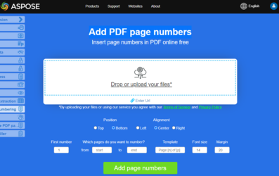

All the documents must have page numbers in it. The page number makes it easier for the reader to locate different parts of the document.
**Aspose.PDF for Python via .NET** allows you to add page numbers with [PageNumberStamp](https://reference.aspose.com/pdf/python-net/aspose.pdf/pagenumberstamp/).

You can use [PageNumberStamp](https://reference.aspose.com/pdf/python-net/aspose.pdf/pagenumberstamp/) class to add a page number stamp in a PDF file. [PageNumberStamp](https://reference.aspose.com/pdf/python-net/aspose.pdf/pagenumberstamp/) class provides properties necessary to create a page number based stamp like format, margins, alignments, starting number etc. In order to add page number stamp, you need to create a [Document](https://reference.aspose.com/pdf/python-net/aspose.pdf/document/) object and a [PageNumberStamp](https://reference.aspose.com/pdf/python-net/aspose.pdf/pagenumberstamp/) object using required properties. After that, you can call [add_stamp()](https://reference.aspose.com/pdf/python-net/aspose.pdf/page/#methods) method of the [Page](https://reference.aspose.com/pdf/python-net/aspose.pdf/page/) to add the stamp in the PDF. You can also set the font attributes of the page number stamp. The following code snippet shows you how to add page numbers in a PDF file.

```python

    import aspose.pdf as ap

    # Open document
    document = ap.Document(input_pdf)

    # Create page number stamp
    page_number_stamp = ap.PageNumberStamp()
    # Whether the stamp is background
    page_number_stamp.background = False
    page_number_stamp.format = "Page # of " + str(len(document.pages))
    page_number_stamp.bottom_margin = 10
    page_number_stamp.horizontal_alignment = ap.HorizontalAlignment.CENTER
    page_number_stamp.starting_number = 1
    # Set text properties
    page_number_stamp.text_state.font = ap.text.FontRepository.find_font("Arial")
    page_number_stamp.text_state.font_size = 14.0
    page_number_stamp.text_state.font_style = ap.text.FontStyles.BOLD
    page_number_stamp.text_state.font_style = ap.text.FontStyles.ITALIC
    page_number_stamp.text_state.foreground_color = ap.Color.aqua

    # Add stamp to particular page
    document.pages[1].add_stamp(page_number_stamp)

    # Save output document
    document.save(output_pdf)
```

## Live Example

[Add PDF page numbers](https://products.aspose.app/pdf/page-number) is an online free web application that allows you to investigate how adding page numbers functionality works.

[](https://products.aspose.app/pdf/page-number)

