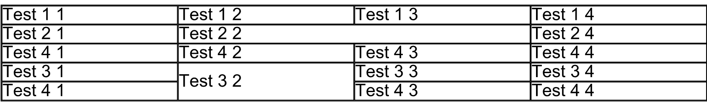
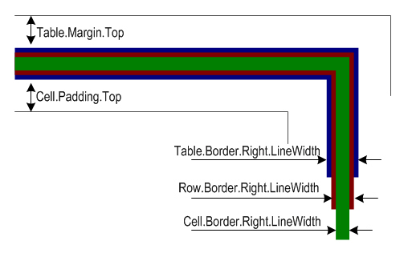
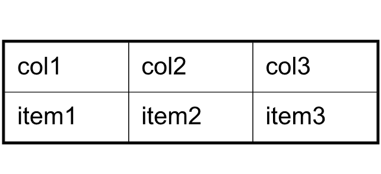

<script type="application/ld+json">
{
    "@context": "https://schema.org",
    "@type": "TechArticle",
    "headline": "Create or Add Table In PDF using Python ",
    "alternativeHeadline": "How to add Table In PDF with Python via .NET",
    "author": {
        "@type": "Person",
        "name":"Anastasiia Holub",
        "givenName": "Anastasiia",
        "familyName": "Holub",
        "url":"https://www.linkedin.com/in/anastasiia-holub-750430225/"
    },
    "genre": "pdf document generation",
    "keywords": "pdf, python, create table in pdf, add table",
    "wordcount": "302",
    "proficiencyLevel":"Beginner",
    "publisher": {
        "@type": "Organization",
        "name": "Aspose.PDF Doc Team",
        "url": "https://products.aspose.com/pdf",
        "logo": "https://www.aspose.cloud/templates/aspose/img/products/pdf/aspose_pdf-for-python-net.svg",
        "alternateName": "Aspose",
        "sameAs": [
            "https://facebook.com/aspose.pdf/",
            "https://twitter.com/asposepdf",
            "https://www.youtube.com/channel/UCmV9sEg_QWYPi6BJJs7ELOg/featured",
            "https://www.linkedin.com/company/aspose",
            "https://stackoverflow.com/questions/tagged/aspose",
            "https://aspose.quora.com/",
            "https://aspose.github.io/"
        ],
        "contactPoint": [
            {
                "@type": "ContactPoint",
                "telephone": "+1 903 306 1676",
                "contactType": "sales",
                "areaServed": "US",
                "availableLanguage": "en"
            },
            {
                "@type": "ContactPoint",
                "telephone": "+44 141 628 8900",
                "contactType": "sales",
                "areaServed": "GB",
                "availableLanguage": "en"
            },
            {
                "@type": "ContactPoint",
                "telephone": "+61 2 8006 6987",
                "contactType": "sales",
                "areaServed": "AU",
                "availableLanguage": "en"
            }
        ]
    },
    "url": "/python-net/add-table-in-existing-pdf-document/",
    "mainEntityOfPage": {
        "@type": "WebPage",
        "@id": "/python-net/add-table-in-existing-pdf-document/"
    },
    "dateModified": "2023-02-04",
    "description": "Aspose.PDF for Python via .NET is a library used to create, read, and edit PDF Tables. Check other advanced functions in this topic."
}
</script>

## Creating Table using Python

Tables are important when working with PDF documents. They provide great features for displaying information in a systematic manner. The Aspose.PDF namespace contains classes named [Table](https://reference.aspose.com/pdf/python-net/aspose.pdf/table/), [Cell](https://reference.aspose.com/pdf/python-net/aspose.pdf/cell/), and [Row](https://reference.aspose.com/pdf/python-net/aspose.pdf/row/) which provides functionality for creating tables when generating PDF documents from scratch.

Table can be created by creating object of Table Class.

```python

    table = ap.Table()
```

### Adding Table in Existing PDF Document

To add a table to an existing PDF file with Aspose.PDF for Python via .NET, take the following steps:

1. Load the source file.
1. Initialize a table and set its columns and rows.
1. Set table setting (we've set the borders).
1. Populate table.
1. Add the table to a page.
1. Save the file.

The following code snippets show how to add text in an existing PDF file.

```python

    import aspose.pdf as ap

    # Load source PDF document
    doc = ap.Document(input_file)
    # Initializes a new instance of the Table
    table = ap.Table()
    # Set the table border color as LightGray
    table.border = ap.BorderInfo(ap.BorderSide.ALL, 5, ap.Color.from_rgb(apd.Color.light_gray))
    # Set the border for table cells
    table.default_cell_border = ap.BorderInfo(ap.BorderSide.ALL, 5, ap.Color.from_rgb(apd.Color.light_gray))
    # Create a loop to add 10 rows
    for row_count in range(0, 10):
        # Add row to table
        row = table.rows.add()
        # Add table cells
        row.cells.add("Column (" + str(row_count) + ", 1)")
        row.cells.add("Column (" + str(row_count) + ", 2)")
        row.cells.add("Column (" + str(row_count) + ", 3)")
    # Add table object to first page of input document
    doc.pages[1].paragraphs.add(table)
    # Save updated document containing table object
    doc.save(output_file)
```

### ColSpan and RowSpan in Tables

Aspose.PDF for Python via .NET provides [col_span](https://reference.aspose.com/pdf/python-net/aspose.pdf/cell/#properties) property to merge the columns in a table and [row_span](https://reference.aspose.com/pdf/python-net/aspose.pdf/cell/#properties) property to merge the rows.

We use `col_span` or `row_span` property on the `Cell` object which creates the table cell. After applying the required properties the created cell can be added to the table.

```python

    import aspose.pdf as ap

    # Initialize the Document object by calling its empty constructor
    pdf_document = ap.Document()
    pdf_document.pages.add()
    # Initializes a new instance of the Table
    table = ap.Table()
    # Set the table border color as LightGray
    table.border = ap.BorderInfo(ap.BorderSide.ALL, 0.5, ap.Color.black)
    # Set the border for table cells
    table.default_cell_border = ap.BorderInfo(ap.BorderSide.ALL, 0.5, ap.Color.black)
    # Add 1st row to table
    row1 = table.rows.add()
    for cellCount in range(1, 5):
        # Add table cells
        row1.cells.add("Test 1" + str(cellCount))

    # Add 2nd row to table
    row2 = table.rows.add()
    row2.cells.add("Test 2 1")
    cell = row2.cells.add("Test 2 2")
    cell.col_span = 2
    row2.cells.add("Test 2 4")

    # Add 3rd row to table
    row3 = table.rows.add()
    row3.cells.add("Test 3 1")
    row3.cells.add("Test 3 2")
    row3.cells.add("Test 3 3")
    row3.cells.add("Test 3 4")

    # Add 4th row to table
    row4 = table.rows.add()
    row4.cells.add("Test 4 1")
    cell = row4.cells.add("Test 4 2")
    cell.row_span = 2
    row4.cells.add("Test 4 3")
    row4.cells.add("Test 4 4")

    # Add 5th row to table
    row5 = table.rows.add()
    row5.cells.add("Test 5 1")
    row5.cells.add("Test 5 3")
    row5.cells.add("Test 5 4")

    # Add table object to first page of input document
    pdf_document.pages[1].paragraphs.add(table)
    # Save updated document containing table object
    pdf_document.save(output_file)
```

The result of the execution code below is the table depicted on the following image:



## Working with Borders, Margins and Padding

Please note that it also supports the feature to set border style, margins and cell padding for tables. Before going into more technical details, it's important to understand the concepts of border, margins and padding which are presented below in a diagram:



In the above figure, you can see that the borders of table, row and cell overlap. Using Aspose.PDF, a table can have margins and cells can have paddings. To set cell margins, we have to set cell padding.

### Borders

To set the borders of Table, [Row](https://reference.aspose.com/pdf/python-net/aspose.pdf/row/) and [Cell](https://reference.aspose.com/pdf/python-net/aspose.pdf/cell/) objects, use the Table.border, Row.border and Cell.border properties. Cell borders can also be set using the [Table](https://reference.aspose.com/pdf/python-net/aspose.pdf/table/) or Row class [default_cell_border](https://reference.aspose.com/pdf/python-net/aspose.pdf/table/#properties) property. All border related properties discussed above are assigned an instance of the Row class, which is created by calling its constructor. The Row class has many overloads that take almost all the parameters required to customize the border.

### Margins or Padding

Cell padding can be managed using the Table class' [default_cell_padding](https://reference.aspose.com/pdf/python-net/aspose.pdf/row/#properties) property. All padding related properties are assigned an instance of the [MarginInfo](https://reference.aspose.com/pdf/python-net/aspose.pdf/margininfo/) class that takes information about the `left`, `right`, `top` and `bottom` parameters to create custom margins.

In the following example, the width of the cell border is set to 0.1 point, the width of the table border is set to 1 point and cell padding is set to 5 points.



```python

    import aspose.pdf as ap

    # Instantiate the Document object by calling its empty constructor
    doc = ap.Document()
    page = doc.pages.add()
    # Instantiate a table object
    tab1 = ap.Table()
    # Add the table in paragraphs collection of the desired section
    page.paragraphs.add(tab1)
    # Set with column widths of the table
    tab1.column_widths = "50 50 50"
    # Set default cell border using BorderInfo object
    tab1.default_cell_border = ap.BorderInfo(ap.BorderSide.ALL, 0.1)
    # Set table border using another customized BorderInfo object
    tab1.border = ap.BorderInfo(ap.BorderSide.ALL, 1)
    # Create MarginInfo object and set its left, bottom, right and top margins
    margin = ap.MarginInfo()
    margin.top = 5
    margin.left = 5
    margin.right = 5
    margin.bottom = 5
    # Set the default cell padding to the MarginInfo object
    tab1.default_cell_padding = margin
    # Create rows in the table and then cells in the rows
    row1 = tab1.rows.add()
    row1.cells.add("col1")
    row1.cells.add("col2")
    row1.cells.add()
    my_text = ap.text.TextFragment("col3 with large text string")
    # Row1.Cells.Add("col3 with large text string to be placed inside cell")
    row1.cells[2].paragraphs.add(my_text)
    row1.cells[2].is_word_wrapped = False
    row2 = tab1.rows.add()
    row2.cells.add("item1")
    row2.cells.add("item2")
    row2.cells.add("item3")
    # Save the Pdf
    doc.save(output_file)
```

To create table with rounded corner, use the [BorderInfo class](https://reference.aspose.com/pdf/python-net/aspose.pdf/borderinfo/) [rounded_border_radius](https://reference.aspose.com/pdf/python-net/aspose.pdf/borderinfo/#properties) value and set the table corner style to round.

```python
    
    import aspose.pdf as ap
    
    tab1 = ap.Table()
    graph = ap.GraphInfo()
    graph.color = ap.Color.red
    # Create a blank BorderInfo object
    b_info = ap.BorderInfo(ap.BorderSide.ALL, graph)
    # Set the border a rounder border where radius of round is 15
    b_info.rounded_border_radius = 15
    # Set the table Corner style as Round
    tab1.corner_style = ap.BorderCornerStyle.ROUND
    # Set the table border information
    tab1.border = b_info
```

## Appling Different AutoFit Settings to a Table

When designing a table using a visual tool like Microsoft Word, you'll frequently utilize one of the AutoFit features to conveniently adjust the table's size to the desired width. For example, you can employ the "AUTO_FIT_TO_WINDOW" option to match the table's width to the page or AUTO_FIT_TO_CONTENT. By default, when using Aspose.Pdf to create a new table, it employs the [column_adjustment](https://reference.aspose.com/pdf/python-net/aspose.pdf/table/#properties) with a "Customized" value. In the following code snippet, we set the object parameters [MarginInfo](https://reference.aspose.com/pdf/python-net/aspose.pdf/margininfo/) and [BorderInfo](https://reference.aspose.com/pdf/python-net/aspose.pdf/borderinfo/) objects in the table. Test the example and evaluate the result.


```python

    import aspose.pdf as ap

    # Instantiate the Pdf object by calling its empty constructor
    doc = ap.Document()
    # Create the section in the Pdf object
    sec1 = doc.pages.add()
    # Instantiate a table object
    tab1 = ap.Table()
    # Add the table in paragraphs collection of the desired section
    sec1.paragraphs.add(tab1)
    # Set with column widths of the table
    tab1.column_widths = "50 50 50"
    tab1.column_adjustment = ap.ColumnAdjustment.AUTO_FIT_TO_WINDOW
    # Set default cell border using BorderInfo object
    tab1.default_cell_border = ap.BorderInfo(ap.BorderSide.ALL, 0.1)
    # Set table border using another customized BorderInfo object
    tab1.border = ap.BorderInfo(ap.BorderSide.ALL, 1)
    # Create MarginInfo object and set its left, bottom, right and top margins
    margin = ap.MarginInfo()
    margin.top = 5
    margin.left = 5
    margin.right = 5
    margin.bottom = 5
    # Set the default cell padding to the MarginInfo object
    tab1.default_cell_padding = margin
    # Create rows in the table and then cells in the rows
    row1 = tab1.rows.add()
    row1.cells.add("col1")
    row1.cells.add("col2")
    row1.cells.add("col3")
    row2 = tab1.rows.add()
    row2.cells.add("item1")
    row2.cells.add("item2")
    row2.cells.add("item3")
    # Save updated document containing table object
    doc.save(output_file)
```

### Get Table Width

Sometimes, it is required to get table width dynamically. Aspose.PDF.Table class has a method [get_width()](https://reference.aspose.com/pdf/python-net/aspose.pdf/table/#methods) for the purpose. For example, you have not set table columns width explicitly and set [column_adjustment](https://reference.aspose.com/pdf/python-net/aspose.pdf/table/#properties) to 'AUTO_FIT_TO_CONTENT'. In this case you can get table width as following.

```python

    import aspose.pdf as ap

    # Create a new document
    doc = ap.Document()
    # Add page in document
    page = doc.pages.add()
    # Initialize new table
    table = ap.Table()
    table.column_adjustment = ap.ColumnAdjustment.AUTO_FIT_TO_CONTENT
    # Add row in table
    row = table.rows.add()
    # Add cell in table
    cell = row.cells.add("Cell 1 text")
    cell = row.cells.add("Cell 2 text")
    # Get table width
    print(table.get_width())
```

## Add SVG Image to Table Cell

Aspose.PDF for Python via .NET provides the capability to insert table cells into a PDF file. When constructing a table, you can include both text and images within these cells. Additionally, the API offers the functionality to transform SVG files into PDF format. By leveraging these functionalities together, you can load an SVG image and place it within a table cell.

The following code excerpt demonstrates the process of creating a table object and embedding an SVG image inside one of its cells.

```python

    import aspose.pdf as ap

    # Instantiate Document object
    doc = ap.Document()
    # Create an image instance
    img = ap.Image()
    # Set image type as SVG
    img.file_type = ap.ImageFileType.SVG
    # Path for source file
    img.file = DIR_INPUT_TABLE + "SVGToPDF.svg"
    # Set width for image instance
    img.fix_width = 50
    # Set height for image instance
    img.fix_height = 50
    # Create table instance
    table = ap.Table()
    # Set width for table cells
    table.column_widths = "100 100"
    # Create row object and add it to table instance
    row = table.rows.add()
    # Create cell object and add it to row instance
    cell = row.cells.add()
    # Add textfragment to paragraphs collection of cell object
    cell.paragraphs.add(ap.text.TextFragment("First cell"))
    # Add another cell to row object
    cell = row.cells.add()
    # Add SVG image to paragraphs collection of recently added cell instance
    cell.paragraphs.add(img)
    # Create page object and add it to pages collection of document instance
    page = doc.pages.add()
    # Add table to paragraphs collection of page object
    page.paragraphs.add(table)
    # Save PDF file
    doc.save(output_file)
```


## Insert a Page Break between rows of table

By default, when you create a table within a PDF file, the table will span across multiple pages if it extends beyond the table's bottom margin. However, there are situations where we need to enforce page breaks after a specific number of rows have been added to the table. The following code excerpt outlines the process of inserting a page break when 10 rows have been included in the table.

```python

    import aspose.pdf as ap

    # Instantiate Document instance
    doc = ap.Document()
    # Add page to pages collection of PDF file
    doc.pages.add()
    # Create table instance
    tab = ap.Table()
    # Set border style for table
    tab.border = ap.BorderInfo(ap.BorderSide.ALL, ap.Color.red)
    # Set default border style for table with border color as Red
    tab.default_cell_border = ap.BorderInfo(ap.BorderSide.ALL, ap.Color.red)
    # Specify table columns width
    tab.column_widths = "100 100"
    # Create a loop to add 200 rows for table
    for counter in range(0, 201):
        row = ap.Row()
        tab.rows.add(row)
        cell1 = ap.Cell()
        cell1.paragraphs.add(ap.text.TextFragment("Cell " + str(counter) + ", 0"))
        row.cells.add(cell1)
        cell2 = ap.Cell()
        cell2.paragraphs.add(ap.text.TextFragment("Cell " + str(counter) + ", 1"))
        row.cells.add(cell2)
        # When 10 rows are added, render new row in new page
        if counter % 10 == 0 and counter != 0:
            row.is_in_new_page = True
    # Add table to paragraphs collection of PDF file
    doc.pages[1].paragraphs.add(tab)
    # Save the PDF document
    doc.save(output_file)
```

## Render a Table on a New Page

By default, paragraphs are added to a Page object's Paragraphs collection. However, it is possible to render a table on a new page instead of directly after the previously added paragraph-level object on the page.

### Sample: How to Render a Table on a New Page using Python

To render a table on a new page, use the [is_in_new_page](https://reference.aspose.com/pdf/python-net/aspose.pdf/table/#properties) property in the [BaseParagraph](https://reference.aspose.com/pdf/python-net/aspose.pdf/baseparagraph/) class. The following code snippet shows how.

```python

    import aspose.pdf as ap

    doc = ap.Document()
    page_info = doc.page_info
    margin_info = page_info.margin

    margin_info.left = 37
    margin_info.right = 37
    margin_info.top = 37
    margin_info.bottom = 37

    page_info.is_landscape = True

    table = ap.Table()
    table.column_widths = "50 100"
    # Added page.
    cur_page = doc.pages.add()
    for i in range(1, 121):
        row = table.rows.add()
        row.fixed_row_height = 15
        cell1 = row.cells.add()
        cell1.paragraphs.add(ap.text.TextFragment("Content 1"))
        cell2 = row.cells.add()
        cell2.paragraphs.add(ap.text.TextFragment("HHHHH"))
    paragraphs = cur_page.paragraphs
    paragraphs.add(table)

    table1 = ap.Table()
    table1.column_widths = "100 100"
    for i in range(1, 11):
        row = table1.rows.add()
        cell1 = row.cells.add()
        cell1.paragraphs.add(ap.text.TextFragment("LAAAAAAA"))
        cell2 = row.cells.add()
        cell2.paragraphs.add(ap.text.TextFragment("LAAGGGGGG"))
    table1.is_in_new_page = True
    # I want to keep table 1 to next page please...
    paragraphs.add(table1)
    doc.save(output_file)
```

<script type="application/ld+json">
{
    "@context": "http://schema.org",
    "@type": "SoftwareApplication",
    "name": "Aspose.PDF for Python via .NET Library",
    "image": "https://www.aspose.cloud/templates/aspose/img/products/pdf/aspose_pdf-for-net.svg",
    "url": "https://www.aspose.com/",
    "publisher": {
        "@type": "Organization",
        "name": "Aspose.PDF",
        "url": "https://products.aspose.com/pdf",
        "logo": "https://www.aspose.cloud/templates/aspose/img/products/pdf/aspose_pdf-for-python-net.svg",
        "alternateName": "Aspose",
        "sameAs": [
            "https://facebook.com/aspose.pdf/",
            "https://twitter.com/asposepdf",
            "https://www.youtube.com/channel/UCmV9sEg_QWYPi6BJJs7ELOg/featured",
            "https://www.linkedin.com/company/aspose",
            "https://stackoverflow.com/questions/tagged/aspose",
            "https://aspose.quora.com/",
            "https://aspose.github.io/"
        ],
        "contactPoint": [
            {
                "@type": "ContactPoint",
                "telephone": "+1 903 306 1676",
                "contactType": "sales",
                "areaServed": "US",
                "availableLanguage": "en"
            },
            {
                "@type": "ContactPoint",
                "telephone": "+44 141 628 8900",
                "contactType": "sales",
                "areaServed": "GB",
                "availableLanguage": "en"
            },
            {
                "@type": "ContactPoint",
                "telephone": "+61 2 8006 6987",
                "contactType": "sales",
                "areaServed": "AU",
                "availableLanguage": "en"
            }
        ]
    },
    "offers": {
        "@type": "Offer",
        "price": "1199",
        "priceCurrency": "USD"
    },
    "applicationCategory": "PDF Manipulation Library for Python via .NET",
    "downloadUrl": "https://www.nuget.org/packages/Aspose.PDF/",
    "operatingSystem": "Windows, MacOS, Linux",
    "screenshot": "https://docs.aspose.com/pdf/python-net/create-pdf-document/example.png",
    "softwareVersion": "2022.1",
    "aggregateRating": {
        "@type": "AggregateRating",
        "ratingValue": "5",
        "ratingCount": "16"
    }
}
</script>
