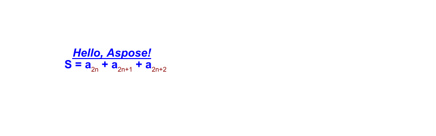
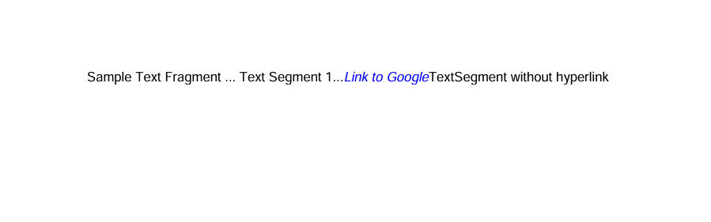
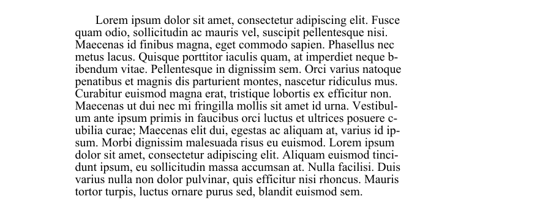
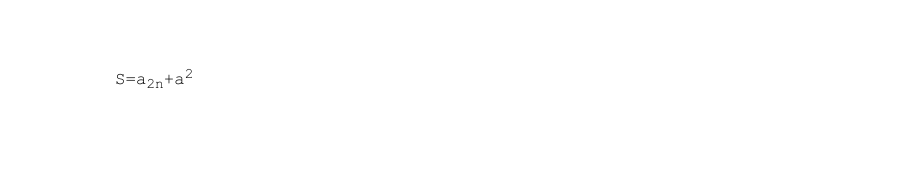
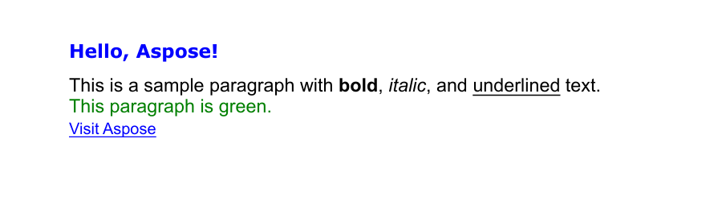

### Basic text operations

### Adding Text

Aspose.PDF for Python via .NET. shows how to add a simple text fragment to a specific position on a page. You will learn how to create a new PDF document, add a page, insert text at given coordinates, and save the resulting file.

1. Create a new Document object
1. Use 'document.pages.add()' to create a new blank page.
1. Create a TextFragment().
1. Set the text position using the Position() class. If you specify Position(), the text will be located in your document from left to right and shifted downwards.
1. Customize text appearance. You can set font size, color, font style, and more via text_fragment.text_state.
1. Append the TextFragment to the page’s paragraph collection with page.paragraphs.add(text_fragment).
1. Save the document.

The following code snippet shows you how to add text in an existing PDF file:

```python

    import os
    from aspose.pdf import Document, Color, Rectangle, License, HorizontalAlignment, WebHyperlink, HtmlFragment, TeXFragment
    from aspose.pdf.text import ()

    path_outfile = os.path.join(self.data_dir, outfile)
    # Create a new document
    document = Document()
    page = document.pages.add()

    # Add a text fragment at a specific position
    text_fragment = TextFragment("Hello, Aspose!")
    text_fragment.position = Position(100, 600)

    page.paragraphs.add(text_fragment)
    document.save(path_outfile)
```

This code example uses a TextFragment. But you can also add text to a PDF page using a TextParagraph. Let's explore the difference.
The **TextFragment** is a single piece of Text. TextFragment represents a single unit of text — essentially, one text string that can be placed, styled, and positioned independently. It’s ideal when you need to add simple, small amounts of text.

The **TextParagraph** is a group of TextFragments. TextParagraph is a container or collection of one or more TextFragment objects. It’s ideal when you need to group multiple fragments — for example, to create a block of text with several lines, words, or formatted elements.
A TextParagraph also manages text alignment, line spacing, and automatic layout on the page. The use of the red line is only possible with TextParagraph.

### Add Text with Font Styling

This is a more advanced example that demonstrates text styling, font customization, and mixed-format text (using subscript text segments). Aspose.PDF explains how to apply font properties such as font family, size, color, bold, italic, and underline to a text fragment.
Additionally, this code snippet shows how to use multiple text segments within a single fragment to create complex text expressions — for instance, including subscript or superscript characters, often required in formulas or scientific notations.

1. Create a new document and page using 'Document()', and 'document.pages.add()' to add a blank page.
1. Create a TextFragment for simple styled text.
1. Define text content.
1. Set position using Position(x, y) coordinates.
1. Apply styling via the text_state property - font, font_size, foreground_color, font_style, underline.
1. Create a complex expression with multiple TextSegment objects. Each TextSegment represents a portion of text that can have its own style. This allows you to build expressions, such as mathematical or chemical formulas.
1. Define multiple TextState objects. One for the main text (text_state_letters). Another for subscript or superscript text (text_state_index).
1. Combine text segments. Append each segment to a TextFragment using segments.append().
1. Add both text objects to the page. Use page.paragraphs.add() to place them in the document.
1. Save the final document.

```python

    import os
    from aspose.pdf import Document, Color, Rectangle, License, HorizontalAlignment, WebHyperlink, HtmlFragment, TeXFragment
    from aspose.pdf.text import ()

    path_outfile = os.path.join(self.data_dir, outfile)
    document = Document()
    page = document.pages.add()
    # Styled text fragment
    text_fragment = TextFragment("Hello, Aspose!")
    text_fragment.position = Position(100, 600)
    text_fragment.text_state.font = FontRepository.find_font("Arial")
    text_fragment.text_state.font_size = 14
    text_fragment.text_state.foreground_color = Color.blue
    text_fragment.text_state.font_style = FontStyles.BOLD | FontStyles.ITALIC # Or operation (logical addtion)
    text_fragment.text_state.underline = True

    formula = TextFragment()

    text_state_letters = TextState()
    text_state_letters.font = FontRepository.find_font("Arial")
    text_state_letters.font_size = 14
    text_state_letters.foreground_color = Color.blue
    text_state_letters.font_style = FontStyles.BOLD

    text_state_index = TextState()
    text_state_index.font = FontRepository.find_font("Arial")
    text_state_index.font_size = 14
    text_state_index.foreground_color = Color.dark_red
    # text_state_index.superscript = True
    text_state_index.subscript = True

    position = Position(100, 500)

    # Helper function to add segments
    def add_segment(text, state):
        seg = TextSegment(text)
        seg.text_state = state
        seg.position = position
        formula.segments.append(seg)

    add_segment("S = a", text_state_letters)
    add_segment("2n", text_state_index )
    add_segment(" + a", text_state_letters)
    add_segment("2n+1", text_state_index)
    add_segment(" + a", text_state_letters)
    add_segment("2n+2", text_state_index)
    formula.horizontal_alignment = HorizontalAlignment.LEFT

    page.paragraphs.add(text_fragment)
    page.paragraphs.add(formula)
    document.save(path_outfile)
```

[]

### Add Right-to-Left (RTL) Text to a PDF Document

RTL (from Right To Left) is a property that indicates the direction of text writing, where text is written from right to left.
Aspose.PDF for Python via .NET. demonstrates how to add Right-to-Left (RTL) text, such as Arabic or Hebrew, to a PDF document.

1. Create a new document and page using 'Document()', and 'document.pages.add()' to add a blank page.
1. Create a TextFragment with RTL content. Insert your Arabic, Hebrew, or other RTL language text as the fragment content.
Set font and styling. Choose a font that supports the RTL script (e.g., Tahoma, Arial Unicode MS). Set font_size and foreground_color as needed.
1. Set horizontal alignment to right using 'text_fragment.horizontal_alignment'.
1. Add the text fragment to the page.
1. Save the PDF document.

```python

    import os
    from aspose.pdf import Document, Color, Rectangle, License, HorizontalAlignment, WebHyperlink, HtmlFragment, TeXFragment
    from aspose.pdf.text import ()

    path_outfile = os.path.join(self.data_dir, outfile)
    document = Document()
    page = document.pages.add()
    # Styled text fragment
    text_fragment = TextFragment(
        "يعتبر خوجا نصر الدين شخصية فولكلورية من الشرق الإسلامي وبعض شعوب البحر الأبيض المتوسط ​​والبلقان، وهو بطل القصص والحكايات القصيرة الفكاهية والساخرة، وأحيانًا الحكايات اليومية."
        )
    text_fragment.text_state.font = FontRepository.find_font("Tahoma")
    text_fragment.text_state.font_size = 14
    text_fragment.text_state.foreground_color = Color.blue
    text_fragment.horizontal_alignment = HorizontalAlignment.RIGHT

    page.paragraphs.add(text_fragment)
    document.save(path_outfile)
```

[]

### Add Text with Hyperlinks

Add clickable hyperlinks to text in a PDF using Aspose.PDF for Python via .NET. Our library demonstrates how to add multiple text segments within a single TextFragment and apply a hyperlink to a specific segment, and style text segments individually (e.g., color, italic font).

1. Create a new document and page using 'Document()', and 'document.pages.add()' to add a blank page.
1. Create a TextFragment.
1. Add multiple TextSegment objects. Each segment can have its own content and styling. For example plain text or hyperlink text.
1. Apply a hyperlink to a segment. Create a WebHyperlink object with the desired URL.
1. Style the segment. Customize color, font style, size, etc., using text_state.
1. Add the fragment to the page using the 'page.paragraphs.add()'.
1. Save the PDF.

```python

    import os
    from aspose.pdf import Document, Color, Rectangle, License, HorizontalAlignment, WebHyperlink, HtmlFragment, TeXFragment
    from aspose.pdf.text import ()

    path_outfile = os.path.join(self.data_dir, outfile)
    document = Document()
    page = document.pages.add()

    fragment = TextFragment("Sample Text Fragment") # 1 fragment  в котором 1 segment

    segment = TextSegment(" ... Text Segment 1...")
    fragment.segments.append(segment) # 1 + 1

    segment = TextSegment("Link to Google")
    fragment.segments.append(segment) # 1 fragment  в котором 3 segment
    segment.hyperlink = WebHyperlink("https://www.google.com")
    segment.text_state.foreground_color = Color.blue
    segment.text_state.font_style = FontStyles.ITALIC

    segment = TextSegment("TextSegment without hyperlink")
    fragment.segments.append(segment) # 1 fragment  в котором 4 segment

    page.paragraphs.add(fragment)
    document.save(path_outfile)
```

[]

## Text Paragraphs and Formatting

### Add Text using TextParagraph

Aspose.PDF for Python via .NET can add a paragraph of text using TextBuilder and [TextParagraph](https://reference.aspose.com/pdf/python-net/aspose.pdf.text/textparagraph/) with wrapping options.

1. Create a new document and page using 'Document()', and 'document.pages.add()' to add a blank page.
1. Read text from a file or use default text.
Create a TextBuilder. It allows adding paragraph-level content with layout and wrapping control.
Create a TextParagraph. You can set wrap mode. In this example, we use the 'DISCRETIONARY HYPHENATION'(soft hyphen). Text wraps automatically, using discretionary hyphenation to split long words. Other options include 'BY WORDS' for standard wrapping.
1. Create a TextFragment. Apply styles.
1. Append the fragment to the paragraph.
1. Append the paragraph to the page using 'TextBuilder'.
1. Save the document.

```python

    import os
    from aspose.pdf import Document, Color, Rectangle, License, HorizontalAlignment, WebHyperlink, HtmlFragment, TeXFragment
    from aspose.pdf.text import ()

    path_outfile = os.path.join(self.data_dir, outfile)
    document = Document()
    page = document.pages.add()

    lorem_path = os.path.join(self.data_dir, "lorem.txt")
    if os.path.exists(lorem_path):
        with open(lorem_path, "r", encoding="utf-8") as file:
            text = file.read()
    else:
        text = "Lorem ipsum sample text not found."

    builder = TextBuilder(page)
    paragraph = TextParagraph()
    paragraph.first_line_indent = 20
    paragraph.rectangle = Rectangle(80, 800, 400, 200, True)
    # paragraph.formatting_options.wrap_mode = TextFormattingOptions.WordWrapMode.BY_WORDS
    paragraph.formatting_options.wrap_mode = TextFormattingOptions.WordWrapMode.DISCRETIONARY_HYPHENATION

    fragment = TextFragment(text)
    fragment.text_state.font = FontRepository.find_font("Times New Roman")
    fragment.text_state.font_size = 12

    paragraph.append_line(fragment)
    builder.append_paragraph(paragraph)

    document.save(path_outfile)
```

[]

### Add Text with Indents in PDF

This section shows how to add text to a PDF document with custom paragraph indents using Aspose.PDF for Python via .NET.
It shows how to control both the first line indent and the subsequent line indent, which affect how text is aligned and formatted within a defined rectangle area on the page.

1. Create a new document and page using 'Document()', and 'document.pages.add()' to add a blank page.
1. Read text from file or use a fallback string if the file is missing.
1. Create and style a text fragment. Use TextFragment(text) to hold the content. Apply basic styling (font and size) via the text_state property.
1. Initialize a TextBuilder. It used to place TextParagraph objects on a page.
1. Add the first paragraph with 'first_line_indent'. It offsets only the first line of the paragraph. The rectangle defines the area where text will appear. Use 'wrap_mode = BY_WORDS' to ensure natural word wrapping.
1. Add a second paragraph with 'subsequent_lines_indent'. It offsets all lines after the first.
1. Save the document.

You can also modify:

- 'fragment.text_state.foreground_color' - for text color.

- 'fragment.text_state.font_style' - for bold/italic/underline.

- 'fragment.text_state.line_spacing' - for spacing between lines.

```python

    import os
    from aspose.pdf import Document, Color, Rectangle, License, HorizontalAlignment, WebHyperlink, HtmlFragment, TeXFragment
    from aspose.pdf.text import ()

    path_outfile = os.path.join(self.data_dir, outfile)
    document = Document()
    page = document.pages.add()

    lorem_path = os.path.join(self.data_dir, "lorem.txt")
    if os.path.exists(lorem_path):
        with open(lorem_path, "r", encoding="utf-8") as file:
            text = file.read()
    else:
        text = "Lorem ipsum sample text not found."

    fragment = TextFragment(text)
    fragment.text_state.font = FontRepository.find_font("Times New Roman")
    fragment.text_state.font_size = 12

    builder = TextBuilder(page)
    paragraph1 = TextParagraph()
    paragraph1.first_line_indent = 20
    paragraph1.rectangle = Rectangle(80, 800, 300, 50, True)
    paragraph1.formatting_options.wrap_mode = TextFormattingOptions.WordWrapMode.BY_WORDS

    paragraph1.append_line(fragment)
    builder.append_paragraph(paragraph1)

    paragraph2 = TextParagraph()
    paragraph2.subsequent_lines_indent = 20
    paragraph2.rectangle = Rectangle(320, 800, 500, 50, True)
    paragraph2.formatting_options.wrap_mode = TextFormattingOptions.WordWrapMode.BY_WORDS

    paragraph2.append_line(fragment)
    builder.append_paragraph(paragraph2)
    document.save(path_outfile)
```

## HTML and LaTeX fragments

### Add HTML Text to a PDF Document

Aspose.PDF for Python via .NET library allows you to insert HTML-formatted content into a PDF document using the HtmlFragment class. By using HTML tags you can render styled, structured, or formula-like text directly in a PDF.

1. Create a new document and page using 'Document()', and 'document.pages.add()' to add a blank page.
1. Create an instance of the HtmlFragment class and pass your HTML string as a parameter.
1. Add the fragment to the page using 'page.paragraphs.add()' to insert the HTML content.
1. Save the PDF.

```python

    import os
    from aspose.pdf import Document, Color, Rectangle, License, HorizontalAlignment, WebHyperlink, HtmlFragment, TeXFragment
    from aspose.pdf.text import ()

    path_outfile = os.path.join(self.data_dir, outfile)
    # Create a new document
    document = Document()
    page = document.pages.add()

    # Add a text fragment at a specific position
    text_fragment = HtmlFragment("<pre>S=a<sub>2n</sub>+a<sup>2</sup><pre>")

    page.paragraphs.add(text_fragment)
    document.save(path_outfile)
```

[]

### Add LaTeX Text to a PDF Document

Add LaTeX-formatted mathematical expressions to a PDF document using the TeXFragment class in Aspose.PDF for Python via .NET.
LaTeX is a powerful typesetting system widely used for creating scientific and mathematical documents. By using TeXFragment, you can directly render LaTeX math notation and symbols inside a PDF page.

1. Create a new document and page using 'Document()', and 'document.pages.add()' to add a blank page.
1. Use the TeXFragment class to render LaTeX syntax directly.
1. Add the LaTeX content to the PDF layout with 'page.paragraphs.add()'.
1. Save the PDF.

```python

    import os
    from aspose.pdf import Document, Color, Rectangle, License, HorizontalAlignment, WebHyperlink, HtmlFragment, TeXFragment
    from aspose.pdf.text import ()

    path_outfile = os.path.join(self.data_dir, outfile)
    # Create a new document
    document = Document()
    page = document.pages.add()

    # Add a text fragment at a specific position
    text_fragment = TeXFragment("\\underbrace{\\overbrace{a+b}^6 \\cdot \\overbrace{c+d}^7}_\\text{example of text} = 42")

    page.paragraphs.add(text_fragment)
    document.save(path_outfile)
```

[]

### Add HTML Fragment to a PDF Document

Embed styled HTML content into a PDF document. This code snippet creates a new PDF file, adds a page, inserts an HTML fragment with various formatting elements (headings, paragraphs, links, and inline styles), and saves the result to the specified path.

1. Initializes a new Document object to represent the PDF.
1. Appends a blank page to the document where the HTML content will be placed.
1. Prepare HTML Content. The HTML string contains an h1 heading, a green-colored paragraph with bold, italic, and underlined text, and a hyperlink to a website with increased font size.
1. Create HTML Fragment. Wrap the HTML string in an HtmlFragment object.
1. Insert HTML into Page. Adds the HTML fragment to the page's paragraph collection, rendering the HTML as native PDF content.
1. Save the Document.

```python

    import os
    from aspose.pdf import Document, Color, Rectangle, License, HorizontalAlignment, WebHyperlink, HtmlFragment, TeXFragment
    from aspose.pdf.text import ()

    path_outfile = os.path.join(self.data_dir, outfile)
    document = Document()
    page = document.pages.add()
    html_content = """
        <h1 style='color:blue;'>Hello, Aspose!</h1>
        <p>This is a sample paragraph with <b>bold</b>, <i>italic</i>, and <u>underlined</u> text.</p>
        <p style='color:green;'>This paragraph is green.</p>
        <a href='https://www.aspose.com' style='font-size:16px;'>Visit Aspose</a>
    """
    html_fragment = HtmlFragment(html_content)
    page.paragraphs.add(html_fragment)
    document.save(path_outfile)
```

### Add HTML fragment override text state

Insert styled HTML content into a PDF document, while overriding the default text formatting with a custom TextState. It explains how to apply global font, size, and color settings to an entire HTML fragment, regardless of inline HTML styles.

1. Create a new document and page using 'Document()', and 'document.pages.add()' to add a blank page.
1. Prepare HTML Content. The HTML string contains an h1 heading with Verdana font, a green-colored paragraph with bold, italic, and underlined text, and a hyperlink to a website with a larger font size.
1. Create HTML Fragment. Wrap the HTML string in an HtmlFragment object.
1. Override text formatting. Create a TextState object and set the Font, Font Size, and Text Color.
1. Add the HTML fragment to the page's paragraph collection.
1. Save the Document.

```python

    import os
    from aspose.pdf import Document, Color, Rectangle, License, HorizontalAlignment, WebHyperlink, HtmlFragment, TeXFragment
    from aspose.pdf.text import ()

    path_outfile = os.path.join(self.data_dir, outfile)
    document = Document()
    page = document.pages.add()
    html_content = """
        <h1 style='color:blue;font-family:Verdana'>Hello, Aspose!</h1>
        <p>This is a sample paragraph with <b>bold</b>, <i>italic</i>, and <u>underlined</u> text.</p>
        <p style='color:green;'>This paragraph is green.</p>
        <a href='https://www.aspose.com' style='font-size:16px;'>Visit Aspose</a>
    """
    html_fragment = HtmlFragment(html_content)
    html_fragment.text_state = TextState()
    html_fragment.text_state.font = FontRepository.find_font("Arial")
    html_fragment.text_state.font_size = 14
    html_fragment.text_state.foreground_color = Color.red

    page.paragraphs.add(html_fragment)
    document.save(path_outfile)
```

[]


