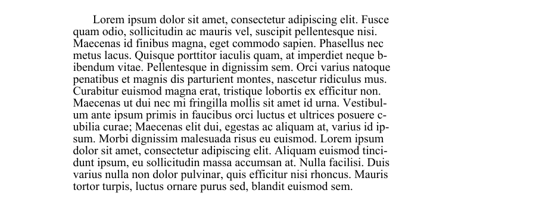
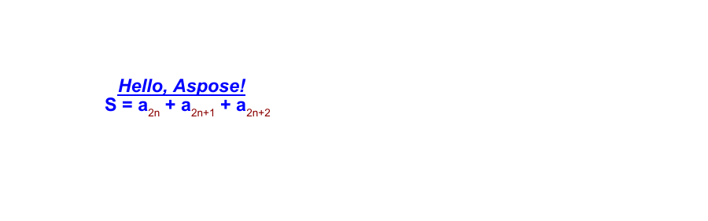
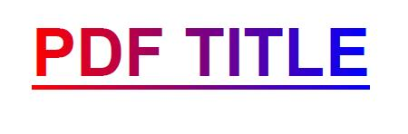
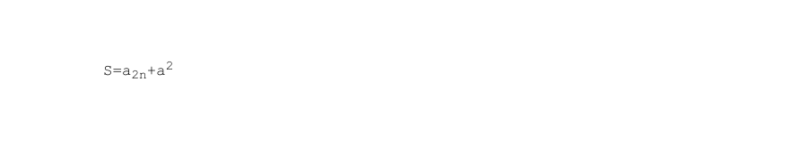
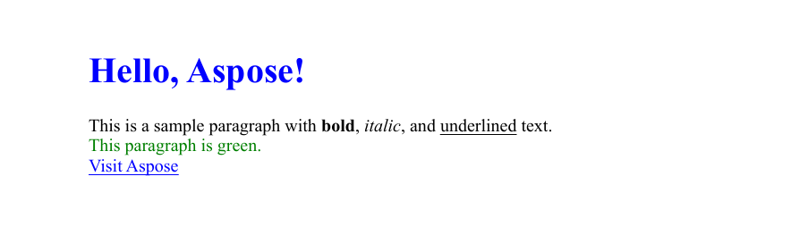
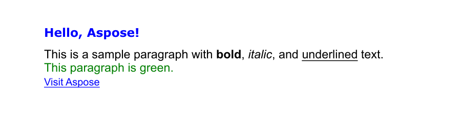

This guide explains how to add text content to PDF documents using Aspose.PDF for Python via .NET. You’ll learn core text-insertion techniques—from placing a simple text fragment at a specific position, to styling it (font, size, color, style), handling right-to-left (RTL) languages, embedding hyperlinks, and working with paragraph layouts, lists, and transparency effects. The article also covers advanced scenarios such as using HTML or LaTeX fragments, custom fonts, and text formatting options like line spacing and character spacing.

Whether you're building simple annotations or rich typographic layouts, this resource equips you with the fundamental building blocks for working with text in PDFs using Aspose.PDF.

## Basic text insertion

Aspose.PDF for Python via .NET provides a powerful and flexible API for handling text inside PDF files.
Whether you need simple static labels, richly formatted content, multilingual text, or interactive hyperlinks, the toolkit lets you do it all with concise Python code.

### Add Text Simple Case

Aspose.PDF for Python via .NET shows how to add a simple text fragment to a specific position on a page. You will learn how to create a new PDF document, add a page, insert text at given coordinates, and save the resulting file.

1. Create a new Document object.
1. Use 'document.pages.add()' to create a new blank page.
1. Create a 'TextFragment' with the text content.
1. Set the text position using the Position class. If you specify Position, the text will be located in your document from left to right and shifted downwards.
1. Customize text appearance. You can set font size, color, font style, and more via text_fragment.text_state.
1. Append the TextFragment to the page’s paragraph collection with `page.paragraphs.add(text_fragment)`.
1. Save the document.

The following code snippet shows you how to add text in an existing PDF file:

```python

import os
import aspose.pdf as ap

# Global configuration
DATA_DIR = "your path here"

def add_text_simple_case(outfile):
    """
    Add simple text to a PDF document.
    Creates a new PDF document with a single page and adds a text fragment
    "Hello, Aspose!" at position (100, 600) on the page.
    Args:
        outfile (str): The file path where the generated PDF document will be saved.
    Returns:
        None: The function saves the document to the specified output file.
    Example:
        >>> add_text_simple_case("output.pdf")
        # Creates a PDF file named "output.pdf" with "Hello, Aspose!" text
    """

    # Create a new document
    document = ap.Document()
    page = document.pages.add()

    # Add a text fragment at a specific position
    text_fragment = ap.text.TextFragment("Hello, Aspose!")
    text_fragment.position = ap.text.Position(100, 600)

    page.paragraphs.add(text_fragment)
    document.save(outfile)
```

This code example uses a TextFragment. But you can also add text to a PDF page using a TextParagraph. Let's explore the difference.
The **[TextFragment](https://reference.aspose.com/pdf/python-net/aspose.pdf.text/textfragment/)** is a single piece of Text. TextFragment represents a single unit of text — essentially, one text string that can be placed, styled, and positioned independently. It’s ideal when you need to add simple, small amounts of text.

The **[TextParagraph](https://reference.aspose.com/pdf/python-net/aspose.pdf.text/textparagraph/)** is a group of TextFragments. It can add multiple text lines. TextParagraph is a container or collection of one or more TextFragment objects. It’s ideal when you need to group multiple fragments — for example, to create a block of text with several lines, words, or formatted elements.
A TextParagraph also manages text alignment, line spacing, and automatic layout on the page. The use of the red line is only possible with TextParagraph.

For more information on Working with Text, please check the [Text Formatting inside PDF](/pdf/python-net/text-formatting-inside-pdf/) and [Extract Text from PDF using Python](/pdf/python-net/extract-text-from-pdf/) documentation sections.

### Add Text using TextParagraph

Aspose.PDF for Python via .NET can add a paragraph of text using TextBuilder and [TextParagraph](https://reference.aspose.com/pdf/python-net/aspose.pdf.text/textparagraph/) with wrapping options.

1. Create a new document and page using 'Document()', and 'document.pages.add()' to add a blank page.
1. Read text from a file or use default text.
Create a TextBuilder. It allows adding paragraph-level content with layout and wrapping control.
Create a TextParagraph. You can set wrap mode. In this example, we use the 'DISCRETIONARY HYPHENATION'(soft hyphen). Text wraps automatically, using discretionary hyphenation to split long words. Other options include 'BY WORDS' for standard wrapping.
1. Create a TextFragment. Apply styles.
1. Append the fragment to the paragraph.
1. Append the paragraph to the page using 'TextBuilder'.
1. Save the document.

```python

import os
import aspose.pdf as ap

# Global configuration
DATA_DIR = "your path here"

def add_text_paragraph(outfile):
    """
    Add formatted text paragraph with indentation and wrapping to a PDF document.

    Creates a PDF document with a text paragraph that demonstrates advanced text
    formatting including first line indentation, text wrapping with discretionary
    hyphenation, and loading text content from an external file.

    Args:
        outfile (str): The file path where the generated PDF document will be saved.

    Returns:
        None: The function saves the document to the specified output file.

    Note:
        - Attempts to load text from "lorem.txt" file in DATA_DIR
        - Falls back to default message if file doesn't exist
        - Uses Times New Roman font at 12pt size
        - First line indent: 20 points
        - Rectangle bounds: (80, 800, 400, 200)
        - Text wrapping: DISCRETIONARY_HYPHENATION mode for better line breaks

    Example:
        >>> add_text_paragraph("paragraph_text.pdf")
        # Creates a PDF with formatted paragraph text
    """
    document = ap.Document()
    page = document.pages.add()

    lorem_path = os.path.join(DATA_DIR, "lorem.txt")
    if os.path.exists(lorem_path):
        with open(lorem_path, "r", encoding="utf-8") as file:
            text = file.read()
    else:
        text = "Lorem ipsum sample text not found."

    builder = ap.text.TextBuilder(page)
    paragraph = ap.text.TextParagraph()
    paragraph.first_line_indent = 20
    paragraph.rectangle = ap.Rectangle(80, 800, 400, 200, True)
    # paragraph.formatting_options.wrap_mode = TextFormattingOptions.WordWrapMode.BY_WORDS
    paragraph.formatting_options.wrap_mode = (
        ap.text.TextFormattingOptions.WordWrapMode.DISCRETIONARY_HYPHENATION
    )

    fragment = ap.text.TextFragment(text)
    fragment.text_state.font = ap.text.FontRepository.find_font("Times New Roman")
    fragment.text_state.font_size = 12

    paragraph.append_line(fragment)
    builder.append_paragraph(paragraph)

    document.save(outfile)
```



### Add Paragraphs with Indents in PDF

The following code snippet shows how to create a new PDF document and add two paragraphs of text with different indentation styles:

 - The first paragraph demonstrates a first-line indent (only the first line is indented).

 - The second paragraph demonstrates a subsequent-lines indent (all lines after the first are indented).

It uses the 'TextParagraph', 'TextBuilder', and 'TextFragment' classes from Aspose.PDF to precisely control layout and formatting.

```python

import os
import aspose.pdf as ap

# Global configuration
DATA_DIR = "your path here"

def add_paragraphs_indents(output_file_name):
    """Add text with indents to a PDF document.
    Creates a PDF document with two text paragraphs demonstrating different
    indent styles. The first paragraph uses first line indent, while the
    second paragraph uses subsequent lines indent. Text content is loaded
    from a lorem.txt file if available, otherwise uses a fallback message.
    Args:
        output_file_name (str): The file path where the PDF document will be saved.
    Returns:
        None: The function saves the PDF document to the specified output file.
    Note:
        - Uses Times New Roman font at 12pt size
        - Text wrapping is set to wrap by words
        - First paragraph: 20pt first line indent, positioned at (80, 800, 300, 50)
        - Second paragraph: 20pt subsequent lines indent, positioned at (320, 800, 500, 50)
    """

    document = ap.Document()
    page = document.pages.add()

    lorem_path = os.path.join(DATA_DIR, "lorem.txt")
    if os.path.exists(lorem_path):
        with open(lorem_path, "r", encoding="utf-8") as file:
            text = file.read()
    else:
        text = "Lorem ipsum sample text not found."

    fragment = ap.text.TextFragment(text)
    fragment.text_state.font = ap.text.FontRepository.find_font("Times New Roman")
    fragment.text_state.font_size = 12

    builder = ap.text.TextBuilder(page)
    paragraph1 = ap.text.TextParagraph()
    paragraph1.first_line_indent = 20
    paragraph1.rectangle = ap.Rectangle(80, 800, 300, 50, True)
    paragraph1.formatting_options.wrap_mode = (
        ap.text.TextFormattingOptions.WordWrapMode.BY_WORDS
    )

    paragraph1.append_line(fragment)
    builder.append_paragraph(paragraph1)

    paragraph2 = ap.text.TextParagraph()
    paragraph2.subsequent_lines_indent = 20
    paragraph2.rectangle = ap.Rectangle(320, 800, 500, 50, True)
    paragraph2.formatting_options.wrap_mode = (
        ap.text.TextFormattingOptions.WordWrapMode.BY_WORDS
    )

    paragraph2.append_line(fragment)
    builder.append_paragraph(paragraph2)
    document.save(output_file_name)
```

### Add a New Line of Text in PDF

Aspose.PDF for Python via .NET allows you to insert multi-line text into a PDF document using the TextFragment, TextParagraph, and TextBuilder classes.

1. Create a new document.
1. Define a TextFragment containing a newline character.
1. Set text style.
1. Add the fragment to a paragraph.
1. Position the paragraph.
1. Render paragraph on the page.
1. Save the document.

```python

import os
import aspose.pdf as ap

# Global configuration
DATA_DIR = "your path here"

def add_new_line(output_file):
    """Add a new line of text to a PDF document."""
    # Create PDF document
    document = ap.Document()
    page = document.pages.add()

    # Initialize new TextFragment with text containing required newline markers
    text_fragment = ap.text.TextFragment("Applicant Name: " + os.linesep + " Joe Smoe")

    # Set text fragment properties if necessary
    text_fragment.text_state.font_size = 12
    text_fragment.text_state.font = ap.text.FontRepository.find_font("TimesNewRoman")
    text_fragment.text_state.background_color = ap.Color.light_gray
    text_fragment.text_state.foreground_color = ap.Color.red

    # Create TextParagraph object
    par = ap.text.TextParagraph()

    # Add new TextFragment to paragraph
    par.append_line(text_fragment)

    # Set paragraph position
    par.position = ap.text.Position(100, 600)

    # Create TextBuilder object
    text_builder = ap.text.TextBuilder(page)

    # Add the TextParagraph using TextBuilder
    text_builder.append_paragraph(par)

    # Save PDF document
    document.save(output_file)
```

### Determine Line Breaks and Log Notifications in a PDF

It shows how to create a PDF document containing multiple text fragments and enable Aspose.PDF notification logging to monitor layout events — such as line breaks and text wrapping — during rendering.

1. Create a new PDF document.
1. Enable notification logging.
1. Use document.pages.add() to create the first page.
1. Add multiple text fragments.
1. Use page.paragraphs.add(text) to render each text fragment.
1. Save the document.

```python

import os
import aspose.pdf as ap

# Global configuration
DATA_DIR = "your path here"

def determine_line_break(output_file):
    """Create a PDF document with multiple text fragments and log notifications."""
    # Create PDF document
    document = ap.Document()

    # Enable notification logging
    document.enable_notification_logging = True

    page = document.pages.add()

    for i in range(4):
        text = ap.text.TextFragment(
            "Lorem ipsum \r\ndolor sit amet, consectetur adipiscing elit, "
            "sed do eiusmod tempor incididunt ut labore et dolore magna aliqua. "
            "Ut enim ad minim veniam, quis nostrud exercitation ullamco laboris "
            "nisi ut aliquip ex ea commodo consequat. Duis aute irure dolor in "
            "reprehenderit in voluptate velit esse cillum dolore eu fugiat nulla "
            "pariatur. Excepteur sint occaecat cupidatat non proident, sunt in "
            "culpa qui officia deserunt mollit anim id est laborum."
        )
        text.text_state.font_size = 20
        page.paragraphs.add(text)

    # Save PDF document
    document.save(output_file)

    notifications = document.pages[1].get_notifications()
    print(notifications)
```

### Measure Text Width Dynamically in PDF

Dynamically measure the width of characters and strings in a specific font using Aspose.PDF for Python via .NET. It uses the 'Font.measure_string()' and 'TextState.measure_string()' methods to verify that the measured string widths are consistent and accurate.

1. Use 'FontRepository.find_font()' to retrieve the Arial font object from the repository.
1. Create a TextState object to manage font properties.
1. Measure Individual Characters.
1. Compare the results of both methods for all characters between 'A' and 'z'.
1. Ensure both measurement approaches yield the same results.

```python

import os
import aspose.pdf as ap

# Global configuration
DATA_DIR = "your path here"

def get_text_width_dynamically(output_file):

    font = ap.text.FontRepository.find_font("Arial")
    ts = ap.text.TextState()
    ts.font = font
    ts.font_size = 14

    if math.fabs(font.measure_string("A", 14) - 9.337) > 0.001:
        print("Unexpected font string measure!")

    if math.fabs(ts.measure_string("z") - 7.0) > 0.001:
        print("Unexpected font string measure!")

    c_code = ord("A")
    while c_code <= ord("z"):
        c = chr(c_code)

        fn_measure = font.measure_string(str(c), 14)
        ts_measure = ts.measure_string(str(c))

        if math.fabs(fn_measure - ts_measure) > 0.001:
            print("Font and state string measuring doesn't match!")

        c_code += 1
```

### Add Text with Hyperlinks

Add clickable hyperlinks to text in a PDF using Aspose.PDF for Python via .NET. Our library demonstrates how to add multiple text segments within a single TextFragment and apply a hyperlink to a specific segment, and style text segments individually (e.g., color, italic font).

1. Create a new document and page using 'Document()', and 'document.pages.add()' to add a blank page.
1. Create a TextFragment.
1. Add multiple TextSegment objects. Each segment can have its own content and styling. For example plain text or hyperlink text.
1. Apply a hyperlink to a segment. Create a WebHyperlink object with the desired URL.
1. Style the segment. Customize color, font style, size, etc., using text_state.
1. Add the fragment to the page using the 'page.paragraphs.add()'.
1. Save the PDF.

```python

import os
import aspose.pdf as ap

# Global configuration
DATA_DIR = "your path here"

def add_text_with_hyperlink(outfile):
    """
    Add text with embedded hyperlinks to a PDF document.

    Creates a PDF document with a text fragment containing multiple segments,
    including one with a hyperlink to Aspose. Demonstrates how to create
    clickable links within PDF text content with different formatting.

    Args:
        outfile (str): The file path where the generated PDF document will be saved.

    Returns:
        None: The function saves the document to the specified output file.

    Note:
        - Creates 4 text segments within a single text fragment
        - One segment contains a hyperlink to "https://products.aspose.com/pdf"
        - Hyperlinked text is styled in blue italic font
        - Other segments are regular text without links

    Example:
        >>> add_text_with_hyperlink("hyperlink_text.pdf")
        # Creates a PDF with clickable Aspose link in the text
    """

    document = ap.Document()
    page = document.pages.add()

    fragment = ap.text.TextFragment(
        "Sample Text Fragment"
    )

    segment = ap.text.TextSegment(" ... Text Segment 1...")
    fragment.segments.append(segment)

    segment = ap.text.TextSegment("Link to Aspose")
    fragment.segments.append(segment)
    segment.hyperlink = ap.WebHyperlink("https://products.aspose.com/pdf")
    segment.text_state.foreground_color = ap.Color.blue
    segment.text_state.font_style = ap.text.FontStyles.ITALIC

    segment = ap.text.TextSegment("TextSegment without hyperlink")
    fragment.segments.append(segment)

    page.paragraphs.add(fragment)
    document.save(outfile)
```


### Add Right-to-Left (RTL) Text to PDF Document

RTL (from Right To Left) is a property that indicates the direction of text writing, where text is written from right to left.
Aspose.PDF for Python via .NET. demonstrates how to add Right-to-Left (RTL) text, such as Arabic or Hebrew, to a PDF document.

1. Create a new document and page using 'Document()', and 'document.pages.add()' to add a blank page.
1. Create a TextFragment with RTL content. Insert your Arabic, Hebrew, or other RTL language text as the fragment content.
Set font and styling. Choose a font that supports the RTL script (e.g., Tahoma, Arial Unicode MS). Set font_size and foreground_color as needed.
1. Set horizontal alignment to right using 'text_fragment.horizontal_alignment'.
1. Add the text fragment to the page.
1. Save the PDF document.

```python

import os
import aspose.pdf as ap

# Global configuration
DATA_DIR = "your path here"

def add_text_with_rtl_text(outfile):
    """
    Add right-to-left (RTL) text to a PDF document.

    Creates a PDF document with Arabic text that demonstrates right-to-left text
    rendering and alignment. The text uses the Tahoma font which supports Arabic
    characters and is aligned to the right side of the page.

    Args:
        outfile (str): The file path where the generated PDF document will be saved.

    Returns:
        None: The function saves the document to the specified output file.

    Note:
        - Uses Tahoma font at 14pt size for proper Arabic character support
        - Text color is set to blue
        - Horizontal alignment is set to RIGHT for proper RTL display
        - The Arabic text describes Nasreddin Hodja, a folklore character

    Example:
        >>> add_text_with_rtl_text("arabic_text.pdf")
        # Creates a PDF with right-to-left Arabic text
    """

    document = ap.Document()
    page = document.pages.add()
    # Styled text fragment
    text_fragment = ap.text.TextFragment(
        "يعتبر خوجا نصر الدين شخصية فولكلورية من الشرق الإسلامي وبعض شعوب البحر الأبيض المتوسط ​​والبلقان، وهو بطل القصص والحكايات القصيرة الفكاهية والساخرة، وأحيانًا الحكايات اليومية."
    )
    text_fragment.text_state.font = ap.text.FontRepository.find_font("Tahoma")
    text_fragment.text_state.font_size = 14
    text_fragment.text_state.foreground_color = ap.Color.blue
    text_fragment.horizontal_alignment = ap.HorizontalAlignment.RIGHT

    page.paragraphs.add(text_fragment)
    document.save(outfile)
```


## Text styling

### Add Text with Font Styling

This is a more advanced example that demonstrates text styling, font customization, and mixed-format text (using subscript text segments). Aspose.PDF explains how to apply font properties such as font family, size, color, bold, italic, and underline to a text fragment.
Additionally, this code snippet shows how to use multiple text segments within a single fragment to create complex text expressions — for instance, including subscript or superscript characters, often required in formulas or scientific notations.

1. Create a new document and page using 'Document()', and 'document.pages.add()' to add a blank page.
1. Create a TextFragment for simple styled text.
1. Define text content.
1. Set position using Position(x, y) coordinates.
1. Apply styling via the 'text_state property' - font, font_size, foreground_color, font_style, underline.
1. Create a complex expression with multiple TextSegment objects. Each TextSegment represents a portion of text that can have its own style. This allows you to build expressions, such as mathematical or chemical formulas.
1. Define multiple TextState objects. One for the main text (text_state_letters). Another for subscript or superscript text (text_state_index).
1. Combine text segments. Append each segment to a 'TextFragment' using 'segments.append()'.
1. Add both text objects to the page. Use 'page.paragraphs.add()' to place them in the document.
1. Save the final document.

```python

import os
import aspose.pdf as ap

# Global configuration
DATA_DIR = "your path here"

def add_text_with_font_styling(outfile):
    """
    Add styled text fragments to a PDF document.
    Creates a new PDF document with a single page and adds a styled text fragment
    "Hello, Aspose!" at position (100, 600) and a formula with styled segments at position (100, 500).
    Args:
        outfile (str): The file path where the generated PDF document will be saved.
    Returns:
        None: The function saves the document to the specified output file.
    Example:
        >>> add_text_with_font_styling("styled_text.pdf")
        # Creates a PDF file named "styled_text.pdf" with styled text and a formula
    """

    document = ap.Document()
    page = document.pages.add()

    # Initialize an empty TextFragment to build a formula using segments
    formula = ap.text.TextFragment()
    text_fragment = ap.text.TextFragment("Hello, Aspose!")
    text_fragment.position = ap.text.Position(100, 600)
    text_fragment.text_state.font = ap.text.FontRepository.find_font("Arial")
    text_fragment.text_state.font_size = 14
    text_fragment.text_state.foreground_color = ap.Color.blue
    text_fragment.text_state.font_style = (
        ap.text.FontStyles.BOLD | ap.text.FontStyles.ITALIC
    )
    text_fragment.text_state.underline = True
    text_fragment.horizontal_alignment = ap.HorizontalAlignment.LEFT

    text_state_letters = ap.text.TextState()
    text_state_letters.font = ap.text.FontRepository.find_font("Arial")
    text_state_letters.font_size = 14
    text_state_letters.foreground_color = ap.Color.blue
    text_state_letters.font_style = ap.text.FontStyles.BOLD

    text_state_index = ap.text.TextState()
    text_state_index.font = ap.text.FontRepository.find_font("Arial")
    text_state_index.font_size = 14
    text_state_index.foreground_color = ap.Color.dark_red
    # text_state_index.superscript = True
    text_state_index.subscript = True

    position = ap.text.Position(100, 500)

    # Helper function to add segments
    def add_segment(text, state):
        seg = ap.text.TextSegment(text)
        seg.text_state = state
        seg.position = position
        formula.segments.append(seg)

    add_segment("S = a", text_state_letters)
    add_segment("2n", text_state_index)
    add_segment(" + a", text_state_letters)
    add_segment("2n+1", text_state_index)
    add_segment(" + a", text_state_letters)
    add_segment("2n+2", text_state_index)
    formula.horizontal_alignment = ap.HorizontalAlignment.LEFT

    page.paragraphs.add(text_fragment)
    page.paragraphs.add(formula)
    document.save(outfile)
```



## Add Text transparent

Add semi-transparent shapes and text to a PDF document using Aspose.PDF for Python.
It creates a colored rectangle with partial opacity and overlays a TextFragment with a transparent foreground color.

1. Initialize a Document object and add a blank page for drawing content.
1. Use 'ap.drawing.Graph' to create a canvas that allows you to draw shapes.
1. Add a rectangle with semi-transparent fill.
1. Prevent canvas position shift.
1. Add the canvas to the page. Insert the graphical shapes into the page paragraphs collection.
1. Create a transparent text fragment.
1. Insert the text fragment into the page paragraphs collection.
1. Save the PDF document.

```python

import os
import aspose.pdf as ap

# Global configuration
DATA_DIR = "your path here"

def add_text_transparent(outfile):
    """
    Add transparent text over a semi-transparent background to a PDF document.

    Creates a PDF document with a semi-transparent filled rectangle as background
    and transparent green text overlaid on top. This demonstrates how to create
    transparency effects in PDF documents using ARGB color values.

    Args:
        outfile (str): The file path where the generated PDF document will be saved.

    Returns:
        None: The function saves the document to the specified output file.

    Note:
        - Background rectangle: 128 alpha, light purple color (0xC5, 0xB5, 0xFF)
        - Text transparency: 30 alpha, green color (0, 255, 0)
        - The canvas is set to not change position to prevent layout shifts

    Example:
        >>> add_text_transparent("transparent_output.pdf")
        # Creates a PDF with transparent text effects
    """

    # Create PDF document
    document = ap.Document()
    page = document.pages.add()

    # Create Graph object
    canvas = ap.drawing.Graph(100.0, 400.0)

    # Create rectangle with semi-transparent fill
    rect = ap.drawing.Rectangle(100, 100, 400, 400)
    rect.graph_info.fill_color = ap.Color.from_argb(128, 0xC5, 0xB5, 0xFF)
    canvas.shapes.add(rect)

    # Prevent position shift
    canvas.is_change_position = False
    page.paragraphs.add(canvas)

    # Create transparent text
    text = ap.text.TextFragment(
        "This is the transparent text. "
        "This is the transparent text. "
        "This is the transparent text."
    )
    text.text_state.foreground_color = ap.Color.from_argb(30, 0, 255, 0)
    page.paragraphs.add(text)

    document.save(outfile)
```

### Add Invisible Text to PDF

This example demonstrates how to create a PDF document containing both visible and invisible text. Invisible text remains part of the document structure but is hidden from view, making it useful for embedding metadata, accessibility tags, or searchable content without affecting layout.

1. Create PDF Document and Page.
1. Create a text fragment with repeated visible content.
1. Add a second text fragment and mark it as invisible.
1. Save the Document.

```python

import os
import aspose.pdf as ap

# Global configuration
DATA_DIR = "your path here"

def add_text_invisible(outfile):
    """
    Creates a PDF document with both visible and invisible text.
    This function generates a PDF file containing two text fragments:
    one visible text that will be displayed normally, and one invisible
    text that will be hidden from view but still present in the document.
    Args:
        outfile (str): The file path where the PDF document will be saved.
    Returns:
        None: The function saves the PDF to the specified file path.
    Example:
        add_text_invisible("output.pdf")
    """

    # Create PDF document
    document = ap.Document()
    page = document.pages.add()

    # Add visible text
    text1 = ap.text.TextFragment(
        "This is the visible text. "
        "This is the visible text. "
        "This is the visible text."
    )
    page.paragraphs.add(text1)

    # Create transparent text
    text2 = ap.text.TextFragment(
        "This is the invisible text. "
        "This is the invisible text. "
        "This is the invisible text."
    )
    text2.text_state.invisible = True
    page.paragraphs.add(text2)

    document.save(outfile)
```

### Add Text with Border Styling in PDF

Aspose.PDF library shows how to create a PDF document containing a styled text fragment with a visible border. The method applies background and foreground colors, font settings, and a stroke (border) around the text rectangle to enhance visual emphasis.

1. Create a PDF Document and a Page.
1. Create and Position Text Fragment. Add a text fragment with the message and set its position.
1. Apply Text Styling. Set font to Times New Roman, size 12. Apply a light gray background and red foreground (text) color.
1. Configure Border Styling.
1. Add Text to Page. Use TextBuilder to append the styled text to the page.
1. Save the Document.

```python

import os
import aspose.pdf as ap

# Global configuration
DATA_DIR = "your path here"

def add_text_border(output_file_name):
    """
    Add text with border styling to a PDF document.

    Creates a PDF document with a text fragment that has border styling applied.
    The text includes background color, foreground color, and a configurable
    border (stroke) around the text rectangle.

    Args:
        output_file_name (str): The file path where the generated PDF document will be saved.

    Returns:
        None: The function saves the document to the specified output file.

    Note:
        - Text: "This is sample text with border."
        - Font: Times New Roman, 12pt
        - Background: Light gray
        - Foreground: Red text
        - Border: Dark red stroke around text rectangle
        - Position: (10, 700)
        - Border is only visible when draw_text_rectangle_border is True

    Example:
        >>> add_text_border("bordered_text.pdf")
        # Creates a PDF with bordered text styling
    """
    # Create PDF document
    document = ap.Document()
    # Get particular page
    page = document.pages.add()
    # Create text fragment
    text_fragment = ap.text.TextFragment("This is sample text with border.")
    text_fragment.position = ap.text.Position(10, 700)

    # Set text properties
    text_fragment.text_state.font = ap.text.FontRepository.find_font("Times New Roman")
    text_fragment.text_state.font_size = 12
    text_fragment.text_state.background_color = ap.Color.light_gray
    text_fragment.text_state.foreground_color = ap.Color.red
    # Set StrokingColor property for drawing border (stroking) around text rectangle.
    # Note: This only affects the border if draw_text_rectangle_border is set to True.
    text_fragment.text_state.stroking_color = ap.Color.dark_red
    # Enable drawing of the text rectangle border
    text_fragment.text_state.draw_text_rectangle_border = True

    text_builder = ap.text.TextBuilder(page)
    text_builder.append_text(text_fragment)

    # Save PDF document
    document.save(output_file_name)
```

### Add Strikeout Text to a PDF

Add strikeout (strikethrough) formatting to a text fragment in a PDF document. Strikeout text is useful for indicating deletions, revisions, or emphasis in annotated documents.

1. Create a new document and page using 'Document()', and 'document.pages.add()' to add a blank page.
1. Create and Style Text Fragment.
1. Apply Color and Strikeout Formatting. Set the background to light gray, the text color to red, and enable strikeout.
1. Position the Text.
1. Use 'TextBuilder' to append the styled text to the page.
1. Save the Document.

```python

import os
import aspose.pdf as ap

# Global configuration
DATA_DIR = "your path here"

def add_strikeout_text(output_file_name):
    """
    Add text with strikeout (strikethrough) formatting to a PDF document.

    Creates a PDF document with a text fragment that has strikeout formatting applied.
    The text appears with a line through it, along with additional styling including
    background color, foreground color, and bold font style.

    Args:
        output_file_name (str): The file path where the generated PDF document will be saved.

    Returns:
        None: The function saves the document to the specified output file.

    Note:
        - Text: "This is sample strikeout text."
        - Font: Times New Roman, 12pt, Bold
        - Background: Light gray
        - Foreground: Red text
        - Strikeout: Enabled (line through text)
        - Position: (100, 600)

    Example:
        >>> add_strikeout_text("strikeout_text.pdf")
        # Creates a PDF with strikethrough text formatting
    """
    # Create PDF document
    document = ap.Document()
    page = document.pages.add()

    # Create text fragment
    text_fragment = ap.text.TextFragment("This is sample strikeout text.")
    # Set text properties
    text_fragment.text_state.font_size = 12
    text_fragment.text_state.font = ap.text.FontRepository.find_font("TimesNewRoman")
    text_fragment.text_state.background_color = ap.Color.light_gray
    text_fragment.text_state.foreground_color = ap.Color.red
    text_fragment.text_state.strike_out = True
    text_fragment.text_state.font_style = ap.text.FontStyles.BOLD
    text_fragment.position = ap.text.Position(100, 600)

    # Create TextBuilder object
    text_builder = ap.text.TextBuilder(page)
    text_builder.append_text(text_fragment)

    # Save PDF document
    document.save(output_file_name)
```

## Advanced color effects

### Applying an Axial Gradient to Text in a PDF

Aspose.PDF for Python via .NET demonstrates how to apply a linear gradient effect to text in a PDF document. The axial gradient smoothly transitions from red to blue throughout the text, creating a visually striking heading. This technique is ideal for stylized titles, branding, or decorative elements in PDF document layouts.

1. Initialize a new document and add a blank page.
1. Create and Style Text Fragment. Add title, set position, font, and size.
1. Apply Axial Gradient Shading with 'GradientAxialShading'. Set the foreground color using GradientAxialShading from red to blue.
1. Add Underline Styling.
1. Insert the styled text fragment into the page.
1. Save the Document.

```python

import os
import aspose.pdf as ap

# Global configuration
DATA_DIR = "your path here"

def apply_gradient_axial_shading_to_text(output_file_name):
    """
    Apply axial gradient shading to text in a PDF document.

    Creates a PDF document with large title text that has an axial (linear) gradient
    effect applied. The gradient transitions from red to blue in a linear fashion
    across the text. This demonstrates advanced text styling with gradient effects.

    Args:
        output_file_name (str): The file path where the generated PDF document will be saved.

    Returns:
        None: The function saves the document to the specified output file.

    Note:
        - Text: "PDF TITLE"
        - Font: Arial Bold, 36pt
        - Position: (100, 600)
        - Gradient: Linear gradient from red to blue
        - Additional styling: Underlined text
        - Uses GradientAxialShading for linear gradient effect

    Example:
        >>> apply_gradient_axial_shading_to_text("gradient_axial.pdf")
        # Creates a PDF with linear gradient text effect
    """
    # Create PDF document
    document = ap.Document()
    page = document.pages.add()

    text_fragment = ap.text.TextFragment("PDF TITLE")
    text_fragment.position = ap.text.Position(100, 600)
    text_fragment.text_state.font_size = 36
    text_fragment.text_state.font = ap.text.FontRepository.find_font("Arial Bold")

    text_fragment.text_state.foreground_color = ap.Color()
    text_fragment.text_state.foreground_color.pattern_color_space = (
        ap.drawing.GradientAxialShading(ap.Color.red, ap.Color.blue)
    )
    text_fragment.text_state.underline = True

    page.paragraphs.add(text_fragment)
    document.save(output_file_name)
```

### Applying a Radial Gradient to Text in a PDF

A radial gradient creates a circular color transition that radiates outward from the center of the text, offering a visually dynamic styling option for titles, headers, or decorative elements.

1. Initialize a new document and add a blank page.
1. Create and Style Text Fragment. Add title, set position, font, and size.
1. Apply Radial Gradient with 'GradientRadialShading'. Set the foreground color using GradientRadialShading from red to blue.
1. Add Underline Styling.
1. Insert the styled text fragment into the page.
1. Save the Document.

```python

import os
import aspose.pdf as ap

# Global configuration
DATA_DIR = "your path here"

def apply_gradient_radial_shading_to_text(output_file_name):
    """
    Apply radial gradient shading to text in a PDF document.

    Creates a PDF document with large title text that has a radial (circular) gradient
    effect applied. The gradient radiates from the center outward, transitioning from
    red to blue. This demonstrates advanced text styling with radial gradient effects.

    Args:
        output_file_name (str): The file path where the generated PDF document will be saved.

    Returns:
        None: The function saves the document to the specified output file.

    Note:
        - Text: "PDF TITLE"
        - Font: Arial Bold, 36pt
        - Position: (100, 600)
        - Gradient: Radial gradient from red to blue
        - Additional styling: Underlined text
        - Uses GradientRadialShading for circular gradient effect

    Example:
        >>> apply_gradient_radial_shading_to_text("gradient_radial.pdf")
        # Creates a PDF with radial gradient text effect
    """
    # Create PDF document
    document = ap.Document()
    page = document.pages.add()

    text_fragment = ap.text.TextFragment("PDF TITLE")
    text_fragment.position = ap.text.Position(100, 600)
    text_fragment.text_state.font_size = 36
    text_fragment.text_state.font = ap.text.FontRepository.find_font("Arial Bold")

    # Apply radial gradient shading (red to blue)
    text_fragment.text_state.foreground_color = ap.Color()
    text_fragment.text_state.foreground_color.pattern_color_space = (
        ap.drawing.GradientRadialShading(ap.Color.red, ap.Color.blue)
    )
    text_fragment.text_state.underline = True

    page.paragraphs.add(text_fragment)
    document.save(output_file_name)
```



## HTML and LaTeX fragments

### Add HTML Text to PDF Document

Aspose.PDF for Python via .NET library allows you to insert HTML-formatted content into a PDF document using the HtmlFragment class. By using HTML tags you can render styled, structured, or formula-like text directly in a PDF.

1. Create a new document and page using 'Document()', and 'document.pages.add()' to add a blank page.
1. Create an instance of the HtmlFragment class and pass your HTML string as a parameter.
1. Add the fragment to the page using 'page.paragraphs.add()' to insert the HTML content.
1. Save the PDF.

```python

import os
import aspose.pdf as ap

# Global configuration
DATA_DIR = "your path here"

def add_text_html_fragment(outfile):
    """
    Add HTML fragment with mathematical notation to a PDF document.

    Creates a PDF document containing an HTML fragment that displays mathematical
    notation using HTML tags including subscript and superscript elements.
    This demonstrates how to embed formatted HTML content directly into PDF.

    Args:
        outfile (str): The file path where the generated PDF document will be saved.

    Returns:
        None: The function saves the document to the specified output file.

    Note:
        - Uses HTML <pre> tags to preserve formatting
        - Includes <sub> for subscript (2n) and <sup> for superscript (2)
        - Formula displayed: S=a₂ₙ+a²
        - HTML is rendered as formatted content within the PDF

    Example:
        >>> add_text_html_fragment("html_math.pdf")
        # Creates a PDF with HTML mathematical notation
    """

    # Create a new document
    document = ap.Document()
    page = document.pages.add()

    # Add a text fragment at a specific position
    text_fragment = ap.HtmlFragment("<pre>S=a<sub>2n</sub>+a<sup>2</sup><pre>")

    page.paragraphs.add(text_fragment)
    document.save(outfile)
```



### Add styled HTML fragment with various formatting to a PDF document

We can define an HTML fragment and set the text style directly using HTML tags. Embed styled HTML content into a PDF document. This code snippet creates a new PDF file, adds a page, inserts an HTML fragment with various formatting elements (headings, paragraphs, links, and inline styles), and saves the result to the specified path.

1. Initializes a new Document object to represent the PDF.
1. Appends a blank page to the document where the HTML content will be placed.
1. Prepare HTML Content. The HTML string contains an h1 heading, a green-colored paragraph with bold, italic, and underlined text, and a hyperlink to a website with increased font size.
1. Create HTML Fragment. Wrap the HTML string in an HtmlFragment object.
1. Insert HTML into Page. Adds the HTML fragment to the page's paragraph collection, rendering the HTML as native PDF content.
1. Save the Document.

```python

import os
import aspose.pdf as ap

# Global configuration
DATA_DIR = "your path here"

def add_html_fragment(outfile):
    """
    Add styled HTML fragment with various formatting to a PDF document.

    Creates a PDF document containing rich HTML content including headings,
    paragraphs with inline formatting, colored text, and hyperlinks.
    Demonstrates comprehensive HTML rendering capabilities in PDF.

    Args:
        outfile (str): The file path where the generated PDF document will be saved.

    Returns:
        None: The function saves the document to the specified output file.

    Note:
        - Includes HTML heading (h1) with blue color styling
        - Contains paragraph with bold, italic, and underlined text
        - Features green-colored paragraph text
        - Includes styled hyperlink to Aspose website
        - All HTML styling is preserved in the PDF output

    Example:
        >>> add_html_fragment("rich_html.pdf")
        # Creates a PDF with various HTML formatting elements
    """

    document = ap.Document()
    page = document.pages.add()
    html_content = """
        <h1 style='color:blue;'>Hello, Aspose!</h1>
        <p>This is a sample paragraph with <b>bold</b>, <i>italic</i>, and <u>underlined</u> text.</p>
        <p style='color:green;'>This paragraph is green.</p>
        <a href='https://www.aspose.com' style='font-size:16px;'>Visit Aspose</a>
    """
    html_fragment = ap.HtmlFragment(html_content)
    page.paragraphs.add(html_fragment)
    document.save(outfile)
```



### Add HTML Fragment with overridden text state

As we saw in the previous example, it's possible to set styles directly in the HTML code. This has its advantages, but also some drawbacks. Suppose we're working with a customer's HTML and want to unify the appearance of our output.
In this case, we can override the customer's styling by using our own TextState, as shown in the following example.

1. Create a new document and page using 'Document()', and 'document.pages.add()' to add a blank page.
1. Prepare HTML Content. The HTML string contains an h1 heading with Verdana font, a green-colored paragraph with bold, italic, and underlined text, and a hyperlink to a website with a larger font size.
1. Create HTML Fragment. Wrap the HTML string in an HtmlFragment object.
1. Override text formatting. Create a TextState object and set the Font, Font Size, and Text Color.
1. Add the HTML fragment to the page's paragraph collection.
1. Save the Document.

```python

import os
import aspose.pdf as ap

# Global configuration
DATA_DIR = "your path here"

def add_html_fragment_override_text_state(outfile):
    """
    Add HTML fragment with overridden text styling to a PDF document.

    Creates a PDF document with HTML content where the default text styling
    is overridden using TextState properties. This demonstrates how to apply
    global text formatting that supersedes HTML styling for consistent appearance.

    Args:
        outfile (str): The file path where the generated PDF document will be saved.

    Returns:
        None: The function saves the document to the specified output file.

    Note:
        - HTML includes heading, paragraphs, and links with original styling
        - TextState override applies: Arial font, 14pt size, red color
        - Override styling takes precedence over HTML inline styles
        - Useful for enforcing consistent document-wide text appearance
        - Original HTML styling is replaced by the TextState properties

    Example:
        >>> add_html_fragment_override_text_state("html_override.pdf")
        # Creates a PDF where HTML styling is overridden with red Arial text
    """

    document = ap.Document()
    page = document.pages.add()
    html_content = """
        <h1 style='color:blue;font-family:Verdana'>Hello, Aspose!</h1>
        <p>This is a sample paragraph with <b>bold</b>, <i>italic</i>, and <u>underlined</u> text.</p>
        <p style='color:green;'>This paragraph is green.</p>
        <a href='https://www.aspose.com' style='font-size:16px;'>Visit Aspose</a>
    """
    html_fragment = ap.HtmlFragment(html_content)
    html_fragment.text_state = ap.text.TextState()
    html_fragment.text_state.font = ap.text.FontRepository.find_font("Arial")
    html_fragment.text_state.font_size = 14
    html_fragment.text_state.foreground_color = ap.Color.red

    page.paragraphs.add(html_fragment)
    document.save(outfile)
```



### Add LaTeX Text to PDF Document

Add LaTeX-formatted mathematical expressions to a PDF document using the TeXFragment class in Aspose.PDF for Python via .NET.
LaTeX is a powerful typesetting system widely used for creating scientific and mathematical documents. By using TeXFragment, you can directly render LaTeX math notation and symbols inside a PDF page.

1. Create a new document and page using 'Document()', and 'document.pages.add()' to add a blank page.
1. Use the TeXFragment class to render LaTeX syntax directly.
1. Add the LaTeX content to the PDF layout with 'page.paragraphs.add()'.
1. Save the PDF.

```python

import os
import aspose.pdf as ap

# Global configuration
DATA_DIR = "your path here"

def add_text_latex_fragment(outfile):
    """
    Add LaTeX mathematical expression to a PDF document.

    Creates a PDF document containing a complex mathematical expression rendered
    from LaTeX markup. This demonstrates advanced mathematical typesetting
    capabilities using LaTeX syntax within PDF documents.

    Args:
        outfile (str): The file path where the generated PDF document will be saved.

    Returns:
        None: The function saves the document to the specified output file.

    Note:
        - Uses LaTeX TeXFragment for mathematical expression rendering
        - Expression includes overbrace and underbrace notation
        - Formula: (a+b)⁶ · (c+d)⁷ with braces and labels = 42
        - LaTeX commands: \\overbrace, \\underbrace, \\text, \\cdot
        - Provides professional mathematical typography

    Example:
        >>> add_text_latex_fragment("latex_math.pdf")
        # Creates a PDF with complex LaTeX mathematical expression
    """

    # Create a new document
    document = ap.Document()
    page = document.pages.add()

    # Add a text fragment at a specific position
    text_fragment = ap.TeXFragment(
        "\\underbrace{\\overbrace{a+b}^6 \\cdot \\overbrace{c+d}^7}_\\text{example of text} = 42"
    )

    page.paragraphs.add(text_fragment)
    document.save(outfile)
```


## Custom fonts

### Use a custom Font from a file

This example allows you to add text to a PDF file using a custom OpenType font in Aspose.PDF for Python via .NET. It shows how to create a new PDF document, position text precisely on the page, and apply custom formatting such as font type, size, color, and italic style.

1. Create a new PDF document and add a page.
1. Define the text content you want to add to the PDF.
1. Set the position of the text.
1. Add the TextFragment to the page.
1. Save the PDF document.

This function works not only with OTF but also with TTF fonts.

```python

import os
import aspose.pdf as ap

# Global configuration
DATA_DIR = "your path here"

def use_custom_font_from_file(outfile):
    """
    Creates a PDF document with text using a custom font loaded from a file.
    This function demonstrates how to load a custom OpenType font (.otf) from the file system
    and apply it to text in a PDF document. The text is styled with blue color, italic style,
    and positioned at specific coordinates on the page.
    Args:
        outfile (str): The output file path where the generated PDF document will be saved.
    Returns:
        None: The function saves the document to the specified output file path.
    Note:
        - Requires the "BriosoPro Italic.otf" font file to be present in the DATA_DIR directory
        - Uses Aspose.PDF library for PDF generation and text manipulation
        - The text fragment is positioned at coordinates (100, 600) on the page
        - Font size is set to 24 points with blue foreground color and italic style
    """

    font_path = os.path.join(DATA_DIR, "BriosoPro Italic.otf")
    document = ap.Document()
    page = document.pages.add()

    fragment = ap.text.TextFragment("Hello, Aspose!")
    fragment.position = ap.text.Position(100, 600)
    fragment.text_state.font = ap.text.FontRepository.open_font(font_path)
    fragment.text_state.font_size = 24
    fragment.text_state.foreground_color = ap.Color.blue
    fragment.text_state.font_style = ap.text.FontStyles.ITALIC

    page.paragraphs.add(fragment)
    document.save(outfile)
```


### Use a custom Font from a stream

This code snippet demonstrates how to add text to a PDF document using a custom embedded OpenType (OTF) font with Aspose.PDF for Python via .NET. It shows how to open a font file as a stream, embed it into the PDF to ensure font availability across different systems, and apply text formatting such as font size, color, and italic style. This approach is ideal for creating visually consistent PDFs that preserve typography even when shared or viewed on devices without the installed font.

1. Load font file as a binary stream.
1. Open and embed the font using 'FontRepository.open_font'.
1. Create a new PDF document and add a page.
1. Add a styled text fragment with:
    - Embedded custom font.
    - Italic style and blue color.
    - Specific font size and position.
1. Save the final document to a specified output path.

```python

import os
import aspose.pdf as ap

# Global configuration
DATA_DIR = "your path here"

def use_custom_font_from_stream(outfile):
    """Use custom font from stream."""

    font_path = os.path.join(DATA_DIR, "BriosoPro Italic.otf")
    with open(font_path, "rb") as font_stream:
        font = ap.text.FontRepository.open_font(font_stream, ap.text.FontTypes.OTF)
        font.is_embedded = True

        document = ap.Document()
        page = document.pages.add()

        fragment = ap.text.TextFragment("Hello, Aspose!")
        fragment.position = ap.text.Position(100, 600)
        fragment.text_state.font = font
        fragment.text_state.font_size = 14
        fragment.text_state.foreground_color = ap.Color.blue
        fragment.text_state.font_style = ap.text.FontStyles.ITALIC

        page.paragraphs.add(fragment)
        document.save(outfile)
```

Embedding fonts ensures consistent rendering across platforms, making this approach ideal for branding, design fidelity, and multilingual support.
