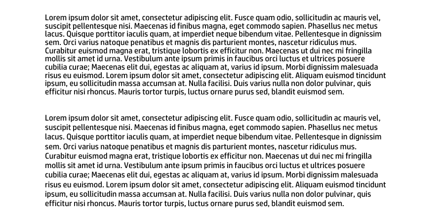
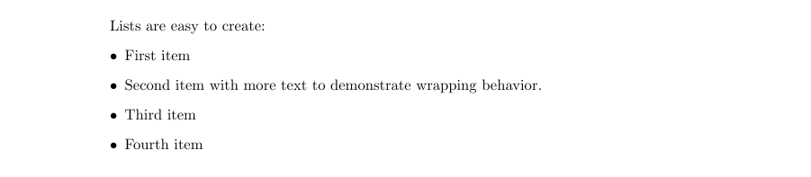
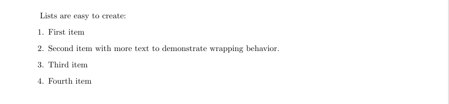

This guide explains how to add text content to PDF documents using Aspose.PDF for Python via .NET. You’ll learn core text-insertion techniques—from placing a simple text fragment at a specific position, to styling it (font, size, color, style), handling right-to-left (RTL) languages, embedding hyperlinks, and working with paragraph layouts, lists, and transparency effects. The article also covers advanced scenarios such as using HTML or LaTeX fragments, custom fonts, and text formatting options like line spacing and character spacing.

Whether you're building simple annotations or rich typographic layouts, this resource equips you with the fundamental building blocks for working with text in PDFs using Aspose.PDF.

## Basic Text Operations

Aspose.PDF for Python via .NET provides a powerful and flexible API for handling text inside PDF files.
Whether you need simple static labels, richly formatted content, multilingual text, or interactive hyperlinks, the toolkit lets you do it all with concise Python code.

### Adding Text

Aspose.PDF for Python via .NET shows how to add a simple text fragment to a specific position on a page. You will learn how to create a new PDF document, add a page, insert text at given coordinates, and save the resulting file.

1. Create a new Document object.
1. Use 'document.pages.add()' to create a new blank page.
1. Create a 'TextFragment' with the text content.
1. Set the text position using the Position class. If you specify Position, the text will be located in your document from left to right and shifted downwards.
1. Customize text appearance. You can set font size, color, font style, and more via text_fragment.text_state.
1. Append the TextFragment to the page’s paragraph collection with `page.paragraphs.add(text_fragment)`.
1. Save the document.

The following code snippet shows you how to add text in an existing PDF file:

```python

import os
import aspose.pdf as ap

# Global configuration
DATA_DIR = "your path here"

def add_text_simple_case(outfile):
    """
    Add simple text to a PDF document.
    Creates a new PDF document with a single page and adds a text fragment
    "Hello, Aspose!" at position (100, 600) on the page.
    Args:
        outfile (str): The file path where the generated PDF document will be saved.
    Returns:
        None: The function saves the document to the specified output file.
    Example:
        >>> add_text_simple_case("output.pdf")
        # Creates a PDF file named "output.pdf" with "Hello, Aspose!" text
    """

    # Create a new document
    document = ap.Document()
    page = document.pages.add()

    # Add a text fragment at a specific position
    text_fragment = ap.text.TextFragment("Hello, Aspose!")
    text_fragment.position = ap.text.Position(100, 600)

    page.paragraphs.add(text_fragment)
    document.save(outfile)
```

This code example uses a TextFragment. But you can also add text to a PDF page using a TextParagraph. Let's explore the difference.
The **[TextFragment](https://reference.aspose.com/pdf/python-net/aspose.pdf.text/textfragment/)** is a single piece of Text. TextFragment represents a single unit of text — essentially, one text string that can be placed, styled, and positioned independently. It’s ideal when you need to add simple, small amounts of text.

The **[TextParagraph](https://reference.aspose.com/pdf/python-net/aspose.pdf.text/textparagraph/)** is a group of TextFragments. It can add multiple text lines. TextParagraph is a container or collection of one or more TextFragment objects. It’s ideal when you need to group multiple fragments — for example, to create a block of text with several lines, words, or formatted elements.
A TextParagraph also manages text alignment, line spacing, and automatic layout on the page. The use of the red line is only possible with TextParagraph.

For more information on Working with Text, please check the [Text Formatting inside PDF](/pdf/python-net/text-formatting-inside-pdf/) and [Extract Text from PDF using Python](/pdf/python-net/extract-text-from-pdf/) documentation sections.

### Add Text with Font Styling

This is a more advanced example that demonstrates text styling, font customization, and mixed-format text (using subscript text segments). Aspose.PDF explains how to apply font properties such as font family, size, color, bold, italic, and underline to a text fragment.
Additionally, this code snippet shows how to use multiple text segments within a single fragment to create complex text expressions — for instance, including subscript or superscript characters, often required in formulas or scientific notations.

1. Create a new document and page using 'Document()', and 'document.pages.add()' to add a blank page.
1. Create a TextFragment for simple styled text.
1. Define text content.
1. Set position using Position(x, y) coordinates.
1. Apply styling via the text_state property - font, font_size, foreground_color, font_style, underline.
1. Create a complex expression with multiple TextSegment objects. Each TextSegment represents a portion of text that can have its own style. This allows you to build expressions, such as mathematical or chemical formulas.
1. Define multiple TextState objects. One for the main text (text_state_letters). Another for subscript or superscript text (text_state_index).
1. Combine text segments. Append each segment to a TextFragment using segments.append().
1. Add both text objects to the page. Use page.paragraphs.add() to place them in the document.
1. Save the final document.

```python

import os
import aspose.pdf as ap

# Global configuration
DATA_DIR = "your path here"

def add_text_with_font_styling(outfile):
    """
    Add styled text fragments to a PDF document.
    Creates a new PDF document with a single page and adds a styled text fragment
    "Hello, Aspose!" at position (100, 600) and a formula with styled segments at position (100, 500).
    Args:
        outfile (str): The file path where the generated PDF document will be saved.
    Returns:
        None: The function saves the document to the specified output file.
    Example:
        >>> add_text_with_font_styling("styled_text.pdf")
        # Creates a PDF file named "styled_text.pdf" with styled text and a formula
    """

    document = ap.Document()
    page = document.pages.add()

    # Initialize an empty TextFragment to build a formula using segments
    formula = ap.text.TextFragment()
    text_fragment = ap.text.TextFragment("Hello, Aspose!")
    text_fragment.position = ap.text.Position(100, 600)
    text_fragment.text_state.font = ap.text.FontRepository.find_font("Arial")
    text_fragment.text_state.font_size = 14
    text_fragment.text_state.foreground_color = ap.Color.blue
    text_fragment.text_state.font_style = (
        ap.text.FontStyles.BOLD | ap.text.FontStyles.ITALIC
    )
    text_fragment.text_state.underline = True
    text_fragment.horizontal_alignment = ap.HorizontalAlignment.LEFT

    text_state_letters = ap.text.TextState()
    text_state_letters.font = ap.text.FontRepository.find_font("Arial")
    text_state_letters.font_size = 14
    text_state_letters.foreground_color = ap.Color.blue
    text_state_letters.font_style = ap.text.FontStyles.BOLD

    text_state_index = ap.text.TextState()
    text_state_index.font = ap.text.FontRepository.find_font("Arial")
    text_state_index.font_size = 14
    text_state_index.foreground_color = ap.Color.dark_red
    # text_state_index.superscript = True
    text_state_index.subscript = True

    position = ap.text.Position(100, 500)

    # Helper function to add segments
    def add_segment(text, state):
        seg = ap.text.TextSegment(text)
        seg.text_state = state
        seg.position = position
        formula.segments.append(seg)

    add_segment("S = a", text_state_letters)
    add_segment("2n", text_state_index)
    add_segment(" + a", text_state_letters)
    add_segment("2n+1", text_state_index)
    add_segment(" + a", text_state_letters)
    add_segment("2n+2", text_state_index)
    formula.horizontal_alignment = ap.HorizontalAlignment.LEFT

    page.paragraphs.add(text_fragment)
    page.paragraphs.add(formula)
    document.save(outfile)
```


### Add Right-to-Left (RTL) Text to PDF Document

RTL (from Right To Left) is a property that indicates the direction of text writing, where text is written from right to left.
Aspose.PDF for Python via .NET. demonstrates how to add Right-to-Left (RTL) text, such as Arabic or Hebrew, to a PDF document.

1. Create a new document and page using 'Document()', and 'document.pages.add()' to add a blank page.
1. Create a TextFragment with RTL content. Insert your Arabic, Hebrew, or other RTL language text as the fragment content.
Set font and styling. Choose a font that supports the RTL script (e.g., Tahoma, Arial Unicode MS). Set font_size and foreground_color as needed.
1. Set horizontal alignment to right using 'text_fragment.horizontal_alignment'.
1. Add the text fragment to the page.
1. Save the PDF document.

```python

import os
import aspose.pdf as ap

# Global configuration
DATA_DIR = "your path here"

def add_text_with_rtl_text(outfile):
    """
    Add right-to-left (RTL) text to a PDF document.

    Creates a PDF document with Arabic text that demonstrates right-to-left text
    rendering and alignment. The text uses the Tahoma font which supports Arabic
    characters and is aligned to the right side of the page.

    Args:
        outfile (str): The file path where the generated PDF document will be saved.

    Returns:
        None: The function saves the document to the specified output file.

    Note:
        - Uses Tahoma font at 14pt size for proper Arabic character support
        - Text color is set to blue
        - Horizontal alignment is set to RIGHT for proper RTL display
        - The Arabic text describes Nasreddin Hodja, a folklore character

    Example:
        >>> add_text_with_rtl_text("arabic_text.pdf")
        # Creates a PDF with right-to-left Arabic text
    """

    document = ap.Document()
    page = document.pages.add()
    # Styled text fragment
    text_fragment = ap.text.TextFragment(
        "يعتبر خوجا نصر الدين شخصية فولكلورية من الشرق الإسلامي وبعض شعوب البحر الأبيض المتوسط ​​والبلقان، وهو بطل القصص والحكايات القصيرة الفكاهية والساخرة، وأحيانًا الحكايات اليومية."
    )
    text_fragment.text_state.font = ap.text.FontRepository.find_font("Tahoma")
    text_fragment.text_state.font_size = 14
    text_fragment.text_state.foreground_color = ap.Color.blue
    text_fragment.horizontal_alignment = ap.HorizontalAlignment.RIGHT

    page.paragraphs.add(text_fragment)
    document.save(outfile)
```


### Add Text with Hyperlinks

Add clickable hyperlinks to text in a PDF using Aspose.PDF for Python via .NET. Our library demonstrates how to add multiple text segments within a single TextFragment and apply a hyperlink to a specific segment, and style text segments individually (e.g., color, italic font).

1. Create a new document and page using 'Document()', and 'document.pages.add()' to add a blank page.
1. Create a TextFragment.
1. Add multiple TextSegment objects. Each segment can have its own content and styling. For example plain text or hyperlink text.
1. Apply a hyperlink to a segment. Create a WebHyperlink object with the desired URL.
1. Style the segment. Customize color, font style, size, etc., using text_state.
1. Add the fragment to the page using the 'page.paragraphs.add()'.
1. Save the PDF.

```python

import os
import aspose.pdf as ap

# Global configuration
DATA_DIR = "your path here"

def add_text_with_hyperlink(outfile):
    """
    Add text with embedded hyperlinks to a PDF document.

    Creates a PDF document with a text fragment containing multiple segments,
    including one with a hyperlink to Aspose. Demonstrates how to create
    clickable links within PDF text content with different formatting.

    Args:
        outfile (str): The file path where the generated PDF document will be saved.

    Returns:
        None: The function saves the document to the specified output file.

    Note:
        - Creates 4 text segments within a single text fragment
        - One segment contains a hyperlink to "https://products.aspose.com/pdf"
        - Hyperlinked text is styled in blue italic font
        - Other segments are regular text without links

    Example:
        >>> add_text_with_hyperlink("hyperlink_text.pdf")
        # Creates a PDF with clickable Aspose link in the text
    """

    document = ap.Document()
    page = document.pages.add()

    fragment = ap.text.TextFragment(
        "Sample Text Fragment"
    )

    segment = ap.text.TextSegment(" ... Text Segment 1...")
    fragment.segments.append(segment)

    segment = ap.text.TextSegment("Link to Aspose")
    fragment.segments.append(segment)
    segment.hyperlink = ap.WebHyperlink("https://products.aspose.com/pdf")
    segment.text_state.foreground_color = ap.Color.blue
    segment.text_state.font_style = ap.text.FontStyles.ITALIC

    segment = ap.text.TextSegment("TextSegment without hyperlink")
    fragment.segments.append(segment)

    page.paragraphs.add(fragment)
    document.save(outfile)
```


## Add Text transparent

Add semi-transparent shapes and text to a PDF document using Aspose.PDF for Python.
It creates a colored rectangle with partial opacity and overlays a TextFragment with a transparent foreground color.

1. Initialize a Document object and add a blank page for drawing content.
1. Use 'ap.drawing.Graph' to create a canvas that allows you to draw shapes.
1. Add a rectangle with semi-transparent fill.
1. Prevent canvas position shift.
1. Add the canvas to the page. Insert the graphical shapes into the page paragraphs collection.
1. Create a transparent text fragment.
1. Insert the text fragment into the page paragraphs collection.
1. Save the PDF document.

```python

import os
import aspose.pdf as ap

# Global configuration
DATA_DIR = "your path here"

def add_text_transparent(outfile):
    """
    Add transparent text over a semi-transparent background to a PDF document.

    Creates a PDF document with a semi-transparent filled rectangle as background
    and transparent green text overlaid on top. This demonstrates how to create
    transparency effects in PDF documents using ARGB color values.

    Args:
        outfile (str): The file path where the generated PDF document will be saved.

    Returns:
        None: The function saves the document to the specified output file.

    Note:
        - Background rectangle: 128 alpha, light purple color (0xC5, 0xB5, 0xFF)
        - Text transparency: 30 alpha, green color (0, 255, 0)
        - The canvas is set to not change position to prevent layout shifts

    Example:
        >>> add_text_transparent("transparent_output.pdf")
        # Creates a PDF with transparent text effects
    """

    # Create PDF document
    document = ap.Document()
    page = document.pages.add()

    # Create Graph object
    canvas = ap.drawing.Graph(100.0, 400.0)

    # Create rectangle with semi-transparent fill
    rect = ap.drawing.Rectangle(100, 100, 400, 400)
    rect.graph_info.fill_color = ap.Color.from_argb(128, 0xC5, 0xB5, 0xFF)
    canvas.shapes.add(rect)

    # Prevent position shift
    canvas.is_change_position = False
    page.paragraphs.add(canvas)

    # Create transparent text
    text = ap.text.TextFragment(
        "This is the transparent text. "
        "This is the transparent text. "
        "This is the transparent text."
    )
    text.text_state.foreground_color = ap.Color.from_argb(30, 0, 255, 0)
    page.paragraphs.add(text)

    document.save(outfile)
```

## Text Paragraphs and Formatting

### Add Text using TextParagraph

Aspose.PDF for Python via .NET can add a paragraph of text using TextBuilder and [TextParagraph](https://reference.aspose.com/pdf/python-net/aspose.pdf.text/textparagraph/) with wrapping options.

1. Create a new document and page using 'Document()', and 'document.pages.add()' to add a blank page.
1. Read text from a file or use default text.
Create a TextBuilder. It allows adding paragraph-level content with layout and wrapping control.
Create a TextParagraph. You can set wrap mode. In this example, we use the 'DISCRETIONARY HYPHENATION'(soft hyphen). Text wraps automatically, using discretionary hyphenation to split long words. Other options include 'BY WORDS' for standard wrapping.
1. Create a TextFragment. Apply styles.
1. Append the fragment to the paragraph.
1. Append the paragraph to the page using 'TextBuilder'.
1. Save the document.

```python

import os
import aspose.pdf as ap

# Global configuration
DATA_DIR = "your path here"

def add_text_paragraph(outfile):
    """
    Add formatted text paragraph with indentation and wrapping to a PDF document.

    Creates a PDF document with a text paragraph that demonstrates advanced text
    formatting including first line indentation, text wrapping with discretionary
    hyphenation, and loading text content from an external file.

    Args:
        outfile (str): The file path where the generated PDF document will be saved.

    Returns:
        None: The function saves the document to the specified output file.

    Note:
        - Attempts to load text from "lorem.txt" file in DATA_DIR
        - Falls back to default message if file doesn't exist
        - Uses Times New Roman font at 12pt size
        - First line indent: 20 points
        - Rectangle bounds: (80, 800, 400, 200)
        - Text wrapping: DISCRETIONARY_HYPHENATION mode for better line breaks

    Example:
        >>> add_text_paragraph("paragraph_text.pdf")
        # Creates a PDF with formatted paragraph text
    """
    document = ap.Document()
    page = document.pages.add()

    lorem_path = os.path.join(DATA_DIR, "lorem.txt")
    if os.path.exists(lorem_path):
        with open(lorem_path, "r", encoding="utf-8") as file:
            text = file.read()
    else:
        text = "Lorem ipsum sample text not found."

    builder = ap.text.TextBuilder(page)
    paragraph = ap.text.TextParagraph()
    paragraph.first_line_indent = 20
    paragraph.rectangle = ap.Rectangle(80, 800, 400, 200, True)
    # paragraph.formatting_options.wrap_mode = TextFormattingOptions.WordWrapMode.BY_WORDS
    paragraph.formatting_options.wrap_mode = (
        ap.text.TextFormattingOptions.WordWrapMode.DISCRETIONARY_HYPHENATION
    )

    fragment = ap.text.TextFragment(text)
    fragment.text_state.font = ap.text.FontRepository.find_font("Times New Roman")
    fragment.text_state.font_size = 12

    paragraph.append_line(fragment)
    builder.append_paragraph(paragraph)

    document.save(outfile)
```


### Add Text with Indents in PDF

This section shows how to add text to a PDF document with custom paragraph indents using Aspose.PDF for Python via .NET.
It shows how to control both the first line indent and the subsequent line indent, which affect how text is aligned and formatted within a defined rectangle area on the page.

1. Create a new document and page using 'Document()', and 'document.pages.add()' to add a blank page.
1. Read text from file or use a fallback string if the file is missing.
1. Create and style a text fragment. Use TextFragment(text) to hold the content. Apply basic styling (font and size) via the text_state property.
1. Initialize a TextBuilder. It used to place TextParagraph objects on a page.
1. Add the first paragraph with 'first_line_indent'. It offsets only the first line of the paragraph. The rectangle defines the area where text will appear. Use 'wrap_mode = BY_WORDS' to ensure natural word wrapping.
1. Add a second paragraph with `subsequent_lines_indent`. It offsets all lines after the first.
1. Save the document.

You can also modify:

- `fragment.text_state.foreground_color` - for text color.
- `fragment.text_state.font_style` - for bold/italic/underline.
- `fragment.text_state.line_spacing` - for spacing between lines.

```python

import os
import aspose.pdf as ap

# Global configuration
DATA_DIR = "your path here"

def add_text_indents(outfile):
    """Add text with indents to a PDF document.
    Creates a PDF document with two text paragraphs demonstrating different
    indent styles. The first paragraph uses first line indent, while the
    second paragraph uses subsequent lines indent. Text content is loaded
    from a lorem.txt file if available, otherwise uses a fallback message.
    Args:
        outfile (str): The file path where the PDF document will be saved.
    Returns:
        None: The function saves the PDF document to the specified output file.
    Note:
        - Uses Times New Roman font at 12pt size
        - Text wrapping is set to wrap by words
        - First paragraph: 20pt first line indent, positioned at (80, 800, 300, 50)
        - Second paragraph: 20pt subsequent lines indent, positioned at (320, 800, 500, 50)
    """

    document = ap.Document()
    page = document.pages.add()

    lorem_path = os.path.join(DATA_DIR, "lorem.txt")
    if os.path.exists(lorem_path):
        with open(lorem_path, "r", encoding="utf-8") as file:
            text = file.read()
    else:
        text = "Lorem ipsum sample text not found."

    fragment = ap.text.TextFragment(text)
    fragment.text_state.font = ap.text.FontRepository.find_font("Times New Roman")
    fragment.text_state.font_size = 12

    builder = ap.text.TextBuilder(page)
    paragraph1 = ap.text.TextParagraph()
    paragraph1.first_line_indent = 20
    paragraph1.rectangle = ap.Rectangle(80, 800, 300, 50, True)
    paragraph1.formatting_options.wrap_mode = (
        ap.text.TextFormattingOptions.WordWrapMode.BY_WORDS
    )

    paragraph1.append_line(fragment)
    builder.append_paragraph(paragraph1)

    paragraph2 = ap.text.TextParagraph()
    paragraph2.subsequent_lines_indent = 20
    paragraph2.rectangle = ap.Rectangle(320, 800, 500, 50, True)
    paragraph2.formatting_options.wrap_mode = (
        ap.text.TextFormattingOptions.WordWrapMode.BY_WORDS
    )

    paragraph2.append_line(fragment)
    builder.append_paragraph(paragraph2)
    document.save(outfile)
```

## HTML and LaTeX fragments

### Add HTML Text to PDF Document

Aspose.PDF for Python via .NET library allows you to insert HTML-formatted content into a PDF document using the HtmlFragment class. By using HTML tags you can render styled, structured, or formula-like text directly in a PDF.

1. Create a new document and page using 'Document()', and 'document.pages.add()' to add a blank page.
1. Create an instance of the HtmlFragment class and pass your HTML string as a parameter.
1. Add the fragment to the page using 'page.paragraphs.add()' to insert the HTML content.
1. Save the PDF.

```python

import os
import aspose.pdf as ap

# Global configuration
DATA_DIR = "your path here"

def add_text_html_fragment(outfile):
    """
    Add HTML fragment with mathematical notation to a PDF document.

    Creates a PDF document containing an HTML fragment that displays mathematical
    notation using HTML tags including subscript and superscript elements.
    This demonstrates how to embed formatted HTML content directly into PDF.

    Args:
        outfile (str): The file path where the generated PDF document will be saved.

    Returns:
        None: The function saves the document to the specified output file.

    Note:
        - Uses HTML <pre> tags to preserve formatting
        - Includes <sub> for subscript (2n) and <sup> for superscript (2)
        - Formula displayed: S=a₂ₙ+a²
        - HTML is rendered as formatted content within the PDF

    Example:
        >>> add_text_html_fragment("html_math.pdf")
        # Creates a PDF with HTML mathematical notation
    """

    # Create a new document
    document = ap.Document()
    page = document.pages.add()

    # Add a text fragment at a specific position
    text_fragment = ap.HtmlFragment("<pre>S=a<sub>2n</sub>+a<sup>2</sup><pre>")

    page.paragraphs.add(text_fragment)
    document.save(outfile)
```


### Add LaTeX Text to PDF Document

Add LaTeX-formatted mathematical expressions to a PDF document using the TeXFragment class in Aspose.PDF for Python via .NET.
LaTeX is a powerful typesetting system widely used for creating scientific and mathematical documents. By using TeXFragment, you can directly render LaTeX math notation and symbols inside a PDF page.

1. Create a new document and page using 'Document()', and 'document.pages.add()' to add a blank page.
1. Use the TeXFragment class to render LaTeX syntax directly.
1. Add the LaTeX content to the PDF layout with 'page.paragraphs.add()'.
1. Save the PDF.

```python

import os
import aspose.pdf as ap

# Global configuration
DATA_DIR = "your path here"

def add_text_latex_fragment(outfile):
    """
    Add LaTeX mathematical expression to a PDF document.

    Creates a PDF document containing a complex mathematical expression rendered
    from LaTeX markup. This demonstrates advanced mathematical typesetting
    capabilities using LaTeX syntax within PDF documents.

    Args:
        outfile (str): The file path where the generated PDF document will be saved.

    Returns:
        None: The function saves the document to the specified output file.

    Note:
        - Uses LaTeX TeXFragment for mathematical expression rendering
        - Expression includes overbrace and underbrace notation
        - Formula: (a+b)⁶ · (c+d)⁷ with braces and labels = 42
        - LaTeX commands: \\overbrace, \\underbrace, \\text, \\cdot
        - Provides professional mathematical typography

    Example:
        >>> add_text_latex_fragment("latex_math.pdf")
        # Creates a PDF with complex LaTeX mathematical expression
    """

    # Create a new document
    document = ap.Document()
    page = document.pages.add()

    # Add a text fragment at a specific position
    text_fragment = ap.TeXFragment(
        "\\underbrace{\\overbrace{a+b}^6 \\cdot \\overbrace{c+d}^7}_\\text{example of text} = 42"
    )

    page.paragraphs.add(text_fragment)
    document.save(outfile)
```


### Add HTML Fragment to PDF Document

We can define an HTML fragment and set the text style directly using HTML tags. Embed styled HTML content into a PDF document. This code snippet creates a new PDF file, adds a page, inserts an HTML fragment with various formatting elements (headings, paragraphs, links, and inline styles), and saves the result to the specified path.

1. Initializes a new Document object to represent the PDF.
1. Appends a blank page to the document where the HTML content will be placed.
1. Prepare HTML Content. The HTML string contains an h1 heading, a green-colored paragraph with bold, italic, and underlined text, and a hyperlink to a website with increased font size.
1. Create HTML Fragment. Wrap the HTML string in an HtmlFragment object.
1. Insert HTML into Page. Adds the HTML fragment to the page's paragraph collection, rendering the HTML as native PDF content.
1. Save the Document.

```python

import os
import aspose.pdf as ap

# Global configuration
DATA_DIR = "your path here"

def add_html_fragment(outfile):
    """
    Add styled HTML fragment with various formatting to a PDF document.

    Creates a PDF document containing rich HTML content including headings,
    paragraphs with inline formatting, colored text, and hyperlinks.
    Demonstrates comprehensive HTML rendering capabilities in PDF.

    Args:
        outfile (str): The file path where the generated PDF document will be saved.

    Returns:
        None: The function saves the document to the specified output file.

    Note:
        - Includes HTML heading (h1) with blue color styling
        - Contains paragraph with bold, italic, and underlined text
        - Features green-colored paragraph text
        - Includes styled hyperlink to Aspose website
        - All HTML styling is preserved in the PDF output

    Example:
        >>> add_html_fragment("rich_html.pdf")
        # Creates a PDF with various HTML formatting elements
    """

    document = ap.Document()
    page = document.pages.add()
    html_content = """
        <h1 style='color:blue;'>Hello, Aspose!</h1>
        <p>This is a sample paragraph with <b>bold</b>, <i>italic</i>, and <u>underlined</u> text.</p>
        <p style='color:green;'>This paragraph is green.</p>
        <a href='https://www.aspose.com' style='font-size:16px;'>Visit Aspose</a>
    """
    html_fragment = ap.HtmlFragment(html_content)
    page.paragraphs.add(html_fragment)
    document.save(outfile)
```


### Add HTML Fragment override text state

Insert styled HTML content into a PDF document, while overriding the default text formatting with a custom TextState. It explains how to apply global font, size, and color settings to an entire HTML fragment, regardless of inline HTML styles.

1. Create a new document and page using 'Document()', and 'document.pages.add()' to add a blank page.
1. Prepare HTML Content. The HTML string contains an h1 heading with Verdana font, a green-colored paragraph with bold, italic, and underlined text, and a hyperlink to a website with a larger font size.
1. Create HTML Fragment. Wrap the HTML string in an HtmlFragment object.
1. Override text formatting. Create a TextState object and set the Font, Font Size, and Text Color.
1. Add the HTML fragment to the page's paragraph collection.
1. Save the Document.

```python

import os
import aspose.pdf as ap

# Global configuration
DATA_DIR = "your path here"

def add_html_fragment_override_text_state(outfile):
    """
    Add HTML fragment with overridden text styling to a PDF document.

    Creates a PDF document with HTML content where the default text styling
    is overridden using TextState properties. This demonstrates how to apply
    global text formatting that supersedes HTML styling for consistent appearance.

    Args:
        outfile (str): The file path where the generated PDF document will be saved.

    Returns:
        None: The function saves the document to the specified output file.

    Note:
        - HTML includes heading, paragraphs, and links with original styling
        - TextState override applies: Arial font, 14pt size, red color
        - Override styling takes precedence over HTML inline styles
        - Useful for enforcing consistent document-wide text appearance
        - Original HTML styling is replaced by the TextState properties

    Example:
        >>> add_html_fragment_override_text_state("html_override.pdf")
        # Creates a PDF where HTML styling is overridden with red Arial text
    """

    document = ap.Document()
    page = document.pages.add()
    html_content = """
        <h1 style='color:blue;font-family:Verdana'>Hello, Aspose!</h1>
        <p>This is a sample paragraph with <b>bold</b>, <i>italic</i>, and <u>underlined</u> text.</p>
        <p style='color:green;'>This paragraph is green.</p>
        <a href='https://www.aspose.com' style='font-size:16px;'>Visit Aspose</a>
    """
    html_fragment = ap.HtmlFragment(html_content)
    html_fragment.text_state = ap.text.TextState()
    html_fragment.text_state.font = ap.text.FontRepository.find_font("Arial")
    html_fragment.text_state.font_size = 14
    html_fragment.text_state.foreground_color = ap.Color.red

    page.paragraphs.add(html_fragment)
    document.save(outfile)
```


## Using Line Spacing

### How to Format Text with Custom Line Spacing in Python - Simple case

Aspose.PDF for Python illustrates a straightforward approach to controlling text layout and readability through line spacing adjustments.

Our code snippet shows how to control line spacing in a PDF document. It reads text from a file (or uses a fallback message), applies custom font size and line spacing, and adds the formatted text to a new page in a PDF.

1. Create a new PDF document.
1. Load the source text.
1. Initialize a TextFragment object and assign the loaded text to it.
1. Set font and spacing properties for the text. These values determine how tightly or loosely the lines of text appear:
    - Font size: 12 points
    - Line spacing: 16 points
1. Insert the formatted text fragment into the page’s paragraphs collection.
1. Save the document.

```python

import os
import aspose.pdf as ap

# Global configuration
DATA_DIR = "your path here"

def specify_line_spacing_simple_case(outfile):
    """
    Specify custom line spacing for text in a PDF document.

    Creates a PDF document with text that has custom line spacing applied.
    Loads text content from an external file and applies 16-point line spacing
    to improve readability and text layout.

    Args:
        outfile (str): The file path where the generated PDF document will be saved.

    Returns:
        None: The function saves the document to the specified output file.

    Note:
        - Attempts to load text from "lorem.txt" file in DATA_DIR
        - Falls back to default message if file doesn't exist
        - Font size: 12 points
        - Line spacing: 16 points (increased from default for better readability)
        - Demonstrates basic line spacing control in PDF text formatting

    Example:
        >>> specify_line_spacing_simple_case("line_spacing.pdf")
        # Creates a PDF with custom 16-point line spacing
    """

    document = ap.Document()
    page = document.pages.add()

    lorem_path = os.path.join(DATA_DIR, "lorem.txt")
    text = (
        open(lorem_path, "r", encoding="utf-8").read()
        if os.path.exists(lorem_path)
        else "Lorem ipsum text not found."
    )

    text_fragment = ap.text.TextFragment(text)
    text_fragment.text_state.font_size = 12
    text_fragment.text_state.line_spacing = 16
    page.paragraphs.add(text_fragment)

    document.save(outfile)
```

### How to Format Text with Custom Line Spacing in Python - Specific case

Let's check how to apply different line spacing modes in a PDF document using a custom TrueType font (TTF).
It loads text from a file, embeds a specific font, and renders the same text twice on a PDF page—each time using a different line spacing mode:

- FONT_SIZE mode: The line spacing equals the font size.

- FULL_SIZE mode: The line spacing accounts for the full height of the font, including ascenders and descenders.

The example shows how line spacing behavior can vary depending on the selected mode.

1. Create a new PDF document.
1. Specify the paths for both the custom font file and the text source file.
1. Load text content.
1. Open the custom font.
1. Create and configure the first TextFragment (FONT_SIZE mode). Set line_spacing to 'TextFormattingOptions.LineSpacingMode.FONT_SIZE', meaning line spacing equals the font size.
1. Create and configure the second TextFragment (FULL_SIZE mode). Set line_spacing to 'TextFormattingOptions.LineSpacingMode.FULL_SIZE', which uses the font’s full height.
1. Append both text fragments to the same PDF page.
1. Save the finished document to the specified output location.

```python

import os
import aspose.pdf as ap

# Global configuration
DATA_DIR = "your path here"

def specify_line_spacing_specific_case(outfile):
    """
    Create a PDF document demonstrating different line spacing modes with custom font.
    This function creates a PDF with two text fragments using the same custom TTF font
    but different line spacing modes to demonstrate the visual differences between
    FONT_SIZE and FULL_SIZE line spacing options.
    Args:
        outfile (str): Path where the output PDF file will be saved.
    Notes:
        - Requires 'HPSimplified.ttf' font file in DATA_DIR
        - Requires 'lorem.txt' text file in DATA_DIR for content
        - Falls back to default text if lorem.txt is not found
        - First fragment uses FONT_SIZE line spacing mode
        - Second fragment uses FULL_SIZE line spacing mode
    Dependencies:
        - aspose.pdf (ap) library
        - os module for file path operations
        - DATA_DIR constant must be defined
    """

    document = ap.Document()
    page = document.pages.add()

    font_file = os.path.join(DATA_DIR, "HPSimplified.ttf")
    lorem_path = os.path.join(DATA_DIR, "lorem.txt")
    text = (
        open(lorem_path, "r", encoding="utf-8").read()
        if os.path.exists(lorem_path)
        else "Lorem ipsum text not found."
    )

    with open(font_file, "rb") as font_stream:
        font = ap.text.FontRepository.open_font(font_stream, ap.text.FontTypes.TTF)

        fragment1 = ap.text.TextFragment(text)
        fragment1.text_state.font = font
        fragment1.text_state.formatting_options = ap.text.TextFormattingOptions()
        fragment1.text_state.formatting_options.line_spacing = (
            ap.text.TextFormattingOptions.LineSpacingMode.FONT_SIZE
        )
        page.paragraphs.add(fragment1)

        fragment2 = ap.text.TextFragment(text)
        fragment2.text_state.font = font
        fragment2.text_state.formatting_options = ap.text.TextFormattingOptions()
        fragment2.text_state.formatting_options.line_spacing = (
            ap.text.TextFormattingOptions.LineSpacingMode.FULL_SIZE
        )
        page.paragraphs.add(fragment2)

    document.save(outfile)
```



## Using Character Spacing

### How to control character spacing in PDF text using the TextFragment class

Character spacing determines the distance between individual characters in a line of text—useful for fine-tuning text appearance or achieving specific typographic effects.

1. Initializes a new Document object and adds a blank page for placing text.
1. Define Fragment Generator. Implements a helper function make_fragment(spacing):
    - create a TextFragment with the sample text.
    - set the font.
1. Add text fragments with different spacing values.
1. Save the Document.

```python

import os
import aspose.pdf as ap

# Global configuration
DATA_DIR = "your path here"

def character_spacing_using_text_fragment(outfile):
    """
    Demonstrate character spacing control using TextFragment objects.

    Creates a PDF document showing different character spacing values applied
    to text fragments. Each line demonstrates progressively increased character
    spacing to illustrate the visual effect on text appearance.

    Args:
        outfile (str): The file path where the generated PDF document will be saved.

    Returns:
        None: The function saves the document to the specified output file.

    Note:
        - Creates multiple TextFragment objects with varying character spacing
        - Character spacing values: 0, 1, 2, 3, and 4 points
        - Font: Times Roman, 12 points
        - Each fragment is positioned on a new line for comparison
        - Character spacing affects only horizontal letter spacing
        - Higher values create more space between individual characters

    Example:
        >>> character_spacing_using_text_fragment("char_spacing_fragment.pdf")
        # Creates a PDF showing progressive character spacing effects
    """
    document = ap.Document()
    page = document.pages.add()

    def make_fragment(spacing):
        fragment = ap.text.TextFragment("Sample Text with character spacing")
        fragment.text_state.font = ap.text.FontRepository.find_font("Arial")
        fragment.text_state.font_size = 14
        fragment.text_state.character_spacing = spacing
        return fragment

    page.paragraphs.add(make_fragment(2.0))
    page.paragraphs.add(make_fragment(1.0))
    page.paragraphs.add(make_fragment(0.75))

    document.save(outfile)
```


### How to control character spacing in PDF text using the TextParagraph and TextBuilder

Aspose.PDF allows applying custom character spacing when adding text to a PDF document using a TextParagraph and TextBuilder.
It defines a specific area on the page, configures text wrapping, and renders a text fragment with adjusted spacing between characters.

Using TextParagraph is ideal when you need precise control over text placement and layout, such as when building structured or multi-column text blocks.

1. Create a new PDF document.
1. Initialize a TextBuilder instance for the page.
1. Create and configure a TextParagraph.
    - Set the word wrap mode to 'TextFormattingOptions.WordWrapMode.BY_WORDS'.
1. Create a TextFragment with custom character spacing.
    - Create a new TextFragment and set its text (e.g., "Sample Text with character spacing").
    - Specify font attributes such as Arial and font size 14 pt.
    - Apply character spacing = 2.0, which increases the space between characters.
1. Add the TextFragment to the TextParagraph.
1. Add the TextParagraph to the page.
1. Save the PDF document.

```python

import os
import aspose.pdf as ap

# Global configuration
DATA_DIR = "your path here"

def character_spacing_using_text_paragraph(outfile):
    """
    Demonstrate character spacing control using TextParagraph objects.

    Creates a PDF document with text paragraph that has custom character spacing
    applied. Shows how to set character spacing at the paragraph level and
    demonstrates the visual effect on text layout.

    Args:
        outfile (str): The file path where the generated PDF document will be saved.

    Returns:
        None: The function saves the document to the specified output file.

    Note:
        - Uses TextParagraph for paragraph-level formatting
        - Character spacing: 2.0 points
        - Font: Times Roman, 12 points
        - Demonstrates paragraph-based character spacing control
        - Character spacing applies to all text within the paragraph
        - Alternative approach to fragment-based character spacing

    Example:
        >>> character_spacing_using_text_paragraph("char_spacing_paragraph.pdf")
        # Creates a PDF with paragraph-level character spacing
    """
    document = ap.Document()
    page = document.pages.add()

    builder = ap.text.TextBuilder(page)
    paragraph = ap.text.TextParagraph()
    paragraph.rectangle = ap.Rectangle(100, 700, 500, 750, True)
    paragraph.formatting_options.wrap_mode = (
        ap.text.TextFormattingOptions.WordWrapMode.BY_WORDS
    )

    fragment = ap.text.TextFragment("Sample Text with character spacing")
    fragment.text_state.font = ap.text.FontRepository.find_font("Arial")
    fragment.text_state.font_size = 14
    fragment.text_state.character_spacing = 2.0

    paragraph.append_line(fragment)
    builder.append_paragraph(paragraph)
    document.save(outfile)
```

## Creating Lists

When working with PDF files, you may need to display structured information such as lists — whether they’re bulleted, numbered, or formatted with HTML or LaTeX.
Aspose.PDF for Python via .NET provides several flexible ways to create and format lists directly within your PDF documents, giving you full control over layout, font, and style.

This article demonstrates multiple approaches to creating lists in PDFs, from plain-text formatting to advanced HTML and LaTeX rendering. Each method serves a specific use case — whether you prefer precise programmatic control or convenient markup-based styling.

By the end of this article, you’ll know how to:

- Create custom bullet and numbered lists using TextParagraph and TextBuilder.

- Use HTML fragments (HtmlFragment) to easily render '<ul>' and '<ol>' lists in PDFs.

- Leverage LaTeX fragments (TeXFragment) for mathematical or scientific list formatting.

- Control text wrapping, font styles, and layout positioning within a page.

- Understand the difference between manual list construction and markup-driven approaches.

### Create a bullet list

Create a custom bulleted list in a PDF using TextParagraph and TextBuilder, without relying on HTML or LaTeX formatting.
Each list item is prefixed with a bullet character (•) and added as a separate TextFragment.

1. Initialize a Document object and add a blank page.
1. Define a Python list of strings that will be converted into bullet points.
1. Create a TextBuilder and a TextParagraph.
1. Use the 'TextBuilder' to add the configured paragraph to the page.
1. Save the PDF document.

```python

import os
import aspose.pdf as ap

# Global configuration
DATA_DIR = "your path here"

def create_bullet_list(outfile):
    """
    Create a PDF document with a bullet list using plain text formatting.
    This function generates a PDF document containing a bullet list with predefined items.
    The list is formatted with bullet points, uses Times New Roman font, and includes
    text wrapping behavior for longer items.
    Args:
        outfile (str): The file path where the PDF document will be saved.
    Returns:
        None: The function saves the document to the specified file path.
    Note:
        The bullet list is positioned within a rectangle at coordinates (80, 200, 400, 800)
        and uses word wrapping mode for text formatting.
    """

    document = ap.Document()
    page = document.pages.add()
    items = [
        "First item in the list",
        "Second item with more text to demonstrate wrapping behavior.",
        "Third item",
        "Fourth item",
    ]

    builder = ap.text.TextBuilder(page)
    paragraph = ap.text.TextParagraph()
    paragraph.rectangle = ap.Rectangle(80, 200, 400, 800, True)
    paragraph.formatting_options.wrap_mode = (
        ap.text.TextFormattingOptions.WordWrapMode.BY_WORDS
    )

    for item in items:
        fragment = ap.text.TextFragment("• " + item)
        fragment.text_state.font = ap.text.FontRepository.find_font("Times New Roman")
        fragment.text_state.font_size = 12
        paragraph.append_line(fragment)

    builder.append_paragraph(paragraph)
    document.save(outfile)
```

### Create a numbered list

Create a custom numbered (ordered) list in a PDF using TextParagraph and TextBuilder, without relying on HTML or LaTeX formatting.
Each list item is prefixed with its number (e.g., 1., 2.) and added as a separate TextFragment.

1. Initialize a Document object and add a blank page.
1. Define a Python list of strings that will be converted into numbered list items.
1. Create a TextBuilder and a TextParagraph.
1. Add each item as a TextFragment with a number.
1. Use the TextBuilder to add the configured paragraph to the page.
1. Save the PDF document.

```python

import os
import aspose.pdf as ap

# Global configuration
DATA_DIR = "your path here"

def create_numbered_list(outfile):
    """
    Create a numbered list in a PDF document using plain text formatting.
    This function generates a PDF document containing a numbered list with predefined
    items. The list is formatted with Times New Roman font and includes text wrapping
    by words within a specified rectangular area on the page.
    Args:
        outfile (str): The file path where the generated PDF document will be saved.
    Returns:
        None: The function saves the document to the specified file path but does
              not return any value.
    Note:
        - Uses Aspose.PDF library (imported as 'ap')
        - List items are hardcoded within the function
        - Font: Times New Roman, size 12
        - Text wrapping: BY_WORDS mode
        - Rectangle bounds: (80, 200, 400, 800)
    """

    document = ap.Document()
    page = document.pages.add()
    items = [
        "First item in the list",
        "Second item with more text to demonstrate wrapping behavior.",
        "Third item",
        "Fourth item",
    ]

    builder = ap.text.TextBuilder(page)
    paragraph = ap.text.TextParagraph()
    paragraph.rectangle = ap.Rectangle(80, 200, 400, 800, True)
    paragraph.formatting_options.wrap_mode = (
        ap.text.TextFormattingOptions.WordWrapMode.BY_WORDS
    )

    for i, item in enumerate(items):
        fragment = ap.text.TextFragment(f"{i + 1}. {item}")
        fragment.text_state.font = ap.text.FontRepository.find_font("Times New Roman")
        fragment.text_state.font_size = 12
        paragraph.append_line(fragment)

    builder.append_paragraph(paragraph)
    document.save(outfile)
```

### Create a bullet list HTML version

Our library shows how to create a bulleted (unordered) list in a PDF document using HTML fragments. It converts a Python list of strings into an HTML `<ul>` element and inserts it into a PDF page as an HtmlFragment. Using HTML fragments allows you to leverage HTML formatting features (like lists, bold, italics) directly in the PDF.

1. Create a new PDF document and add a page.
1. Prepare the list items.
1. Convert the list to an HTML unordered list.
    - Use the `<ul>` tag for an unordered (bulleted) list.
    - Wrap each item with 'li' tags using a list comprehension.
1. Create an HtmlFragment. Convert the HTML string into an HtmlFragment object that can be added to the PDF page.
1. Insert the HtmlFragment into the page’s paragraphs collection.
1. Save the PDF document.

```python

import os
import aspose.pdf as ap

# Global configuration
DATA_DIR = "your path here"

def create_bullet_list_html_version(outfile):
    """
    Create a bulleted list using HTML formatting in a PDF document.

    Generates a PDF with an unordered (bulleted) list created using HTML markup.
    Demonstrates how to use HtmlFragment to embed HTML list structures directly
    into PDF documents with proper formatting and styling.

    Args:
        outfile (str): The file path where the generated PDF document will be saved.

    Returns:
        None: The function saves the document to the specified output file.

    Note:
        - Uses HTML <ul> and <li> tags for list structure
        - Items are predefined with sample content
        - HtmlFragment automatically handles HTML rendering
        - Lists maintain proper bullet formatting and indentation
        - Simpler alternative to manual list creation with TextFragments
        - Supports nested lists and HTML styling if needed

    Example:
        >>> create_bullet_list_html_version("bullet_list_html.pdf")
        # Creates a PDF with HTML-formatted bulleted list
    """

    document = ap.Document()
    page = document.pages.add()
    items = [
        "First item in the list",
        "Second item with more text to demonstrate wrapping behavior.",
        "Third item",
        "Fourth item",
    ]
    html_list = "<ul>" + "".join([f"<li>{item}</li>" for item in items]) + "</ul>"
    html_fragment = ap.HtmlFragment(html_list)
    page.paragraphs.add(html_fragment)
    document.save(outfile)
```


### Create numbered list HTML version

Create a numbered (ordered) list in a PDF document using HTML fragments. It converts a Python list of strings into an HTML `<ol>` element and inserts it into a PDF page as an HtmlFragment.

Using HTML fragments enables you to incorporate HTML-based formatting features, such as numbered lists, bold, italics, and more, directly in your PDF.

1. Create a new PDF document and add a page.
1. Prepare the list items.
1. Convert the list to an HTML ordered list.
    - Use the `<ol>` tag for a numbered list.
    - Wrap each item with 'li' tags using a list comprehension.
1. Convert the HTML string into an HtmlFragment object that can be added to the PDF page.
1. Insert the HtmlFragment into the page’s paragraphs collection.
1. Save the PDF document.

```python

import os
import aspose.pdf as ap

# Global configuration
DATA_DIR = "your path here"

def create_numbered_list_html_version(outfile):
    """
    Create a numbered list using HTML formatting in a PDF document.

    Generates a PDF with an ordered (numbered) list created using HTML markup.
    Demonstrates how to use HtmlFragment to embed HTML ordered list structures
    directly into PDF documents with automatic numbering and formatting.

    Args:
        outfile (str): The file path where the generated PDF document will be saved.

    Returns:
        None: The function saves the document to the specified output file.

    Note:
        - Uses HTML <ol> and <li> tags for ordered list structure
        - Items are predefined with sample content
        - HtmlFragment automatically handles HTML rendering and numbering
        - Lists maintain proper numeric formatting and indentation
        - Numbers are automatically generated (1, 2, 3, etc.)
        - Supports nested lists and custom numbering styles if needed

    Example:
        >>> create_numbered_list_html_version("numbered_list_html.pdf")
        # Creates a PDF with HTML-formatted numbered list
    """

    document = ap.Document()
    page = document.pages.add()
    items = [
        "First item in the list",
        "Second item with more text to demonstrate wrapping behavior.",
        "Third item",
        "Fourth item",
    ]
    html_list = "<ol>" + "".join([f"<li>{item}</li>" for item in items]) + "</ol>"
    html_fragment = ap.HtmlFragment(html_list)
    page.paragraphs.add(html_fragment)
    document.save(outfile)
```


### Create a bullet list LaTeX version

Create a bulleted (unordered) list in a PDF using LaTeX fragments (TeXFragment). It converts a Python list of strings into a LaTeX itemize environment and inserts it into a PDF page. Using LaTeX fragments is ideal when you want to render mathematical formulas, symbols, or structured lists with precise formatting.

1. Create a new PDF document and add a page.
1. Define a Python list of strings that will become bullet points in the LaTeX itemize environment.
1. Convert the list into a LaTeX itemize environment:
    - Wrap the items with \begin{itemize} and \end{itemize}.
    - Each item is prefixed with \item using a list comprehension.
1. Convert the LaTeX string into a TeXFragment object that can be rendered in the PDF.
1. Add the LaTeX fragment to the page.
1. Save the PDF document.

```python

import os
import aspose.pdf as ap

# Global configuration
DATA_DIR = "your path here"

def create_bullet_list_latex_version(outfile):
    """
    Create a bulleted list using LaTeX formatting in a PDF document.

    Generates a PDF with an unordered list created using LaTeX markup.
    Demonstrates how to use TeXFragment to embed LaTeX itemize environments
    directly into PDF documents with proper mathematical and scientific formatting.

    Args:
        outfile (str): The file path where the generated PDF document will be saved.

    Returns:
        None: The function saves the document to the specified output file.

    Note:
        - Uses LaTeX \\begin{itemize} and \\item commands
        - TeXFragment handles LaTeX compilation and rendering
        - Supports mathematical expressions and scientific notation
        - Lists maintain proper bullet formatting and indentation
        - More powerful than HTML for mathematical content
        - Can include LaTeX math modes and special symbols

    Example:
        >>> create_bullet_list_latex_version("bullet_list_latex.pdf")
        # Creates a PDF with LaTeX-formatted bulleted list
    """

    document = ap.Document()
    page = document.pages.add()
    items = [
        "First item",
        "Second item with more text to demonstrate wrapping behavior.",
        "Third item",
        "Fourth item",
    ]
    tex_list = (
        "Lists are easy to create: \\begin{itemize}"
        + "".join([f"\\item {i}" for i in items])
        + "\\end{itemize}"
    )
    tex_fragment = ap.TeXFragment(tex_list)
    page.paragraphs.add(tex_fragment)
    document.save(outfile)
```



### Create numbered list LaTeX version

Create a numbered (ordered) list in a PDF using LaTeX fragments (TeXFragment). It converts a Python list of strings into a LaTeX enumerate environment and inserts it into a PDF page. Using LaTeX fragments is ideal when you want precise formatting, structured lists, or mathematical notation in PDFs.

1. Create a new PDF document and add a page.
1. Define a Python list of strings that will become numbered items in the LaTeX enumerate environment.
1. Convert the list into a LaTeX enumerate environment.
1. Convert the LaTeX string into a TeXFragment object that can be rendered in the PDF.
1. Add the LaTeX fragment to the page.
1. Save the PDF document.

```python

import os
import aspose.pdf as ap

# Global configuration
DATA_DIR = "your path here"

def create_numbered_list_latex_version(outfile):
    """Create a numbered list using LaTeX."""

    document = ap.Document()
    page = document.pages.add()
    items = [
        "First item",
        "Second item with more text to demonstrate wrapping behavior.",
        "Third item",
        "Fourth item",
    ]
    tex_list = (
        "Lists are easy to create: \\begin{enumerate}"
        + "".join([f"\\item {i}" for i in items])
        + "\\end{enumerate}"
    )
    tex_fragment = ap.TeXFragment(tex_list)
    page.paragraphs.add(tex_fragment)
    document.save(outfile)
```



## Using Custom Fonts

### Use a custom Font from a file

This example allows you to add text to a PDF file using a custom OpenType font in Aspose.PDF for Python via .NET. It shows how to create a new PDF document, position text precisely on the page, and apply custom formatting such as font type, size, color, and italic style.

1. Create a new PDF document and add a page.
1. Define the text content you want to add to the PDF.
1. Set the position of the text.
1. Add the TextFragment to the page.
1. Save the PDF document.

```python

import os
import aspose.pdf as ap

# Global configuration
DATA_DIR = "your path here"

def use_custom_font_from_file(outfile):
    """
    Creates a PDF document with text using a custom font loaded from a file.
    This function demonstrates how to load a custom OpenType font (.otf) from the file system
    and apply it to text in a PDF document. The text is styled with blue color, italic style,
    and positioned at specific coordinates on the page.
    Args:
        outfile (str): The output file path where the generated PDF document will be saved.
    Returns:
        None: The function saves the document to the specified output file path.
    Note:
        - Requires the "BriosoPro Italic.otf" font file to be present in the DATA_DIR directory
        - Uses Aspose.PDF library for PDF generation and text manipulation
        - The text fragment is positioned at coordinates (100, 600) on the page
        - Font size is set to 24 points with blue foreground color and italic style
    """

    font_path = os.path.join(DATA_DIR, "BriosoPro Italic.otf")
    document = ap.Document()
    page = document.pages.add()

    fragment = ap.text.TextFragment("Hello, Aspose!")
    fragment.position = ap.text.Position(100, 600)
    fragment.text_state.font = ap.text.FontRepository.open_font(font_path)
    fragment.text_state.font_size = 24
    fragment.text_state.foreground_color = ap.Color.blue
    fragment.text_state.font_style = ap.text.FontStyles.ITALIC

    page.paragraphs.add(fragment)
    document.save(outfile)
```

[]

### Use a custom Font from a stream

This code snippet demonstrates how to add text to a PDF document using a custom embedded OpenType (OTF) font with Aspose.PDF for Python via .NET. It shows how to open a font file as a stream, embed it into the PDF to ensure font availability across different systems, and apply text formatting such as font size, color, and italic style. This approach is ideal for creating visually consistent PDFs that preserve typography even when shared or viewed on devices without the installed font.

1. Load font file as a binary stream.
1. Open and embed the font using 'FontRepository.open_font'.
1. Create a new PDF document and add a page.
1. Add a styled text fragment with:
    - Embedded custom font.
    - Italic style and blue color.
    - Specific font size and position.
1. Save the final document to a specified output path.

```python

import os
import aspose.pdf as ap

# Global configuration
DATA_DIR = "your path here"

def use_custom_font_from_stream(outfile):
    """Use custom font from stream."""

    font_path = os.path.join(DATA_DIR, "BriosoPro Italic.otf")
    with open(font_path, "rb") as font_stream:
        font = ap.text.FontRepository.open_font(font_stream, ap.text.FontTypes.OTF)
        font.is_embedded = True

        document = ap.Document()
        page = document.pages.add()

        fragment = ap.text.TextFragment("Hello, Aspose!")
        fragment.position = ap.text.Position(100, 600)
        fragment.text_state.font = font
        fragment.text_state.font_size = 14
        fragment.text_state.foreground_color = ap.Color.blue
        fragment.text_state.font_style = ap.text.FontStyles.ITALIC

        page.paragraphs.add(fragment)
        document.save(outfile)
```

Embedding fonts ensures consistent rendering across platforms, making this approach ideal for branding, design fidelity, and multilingual support.

## Using Footnotes and Endnotes

### Add Footnotes

Footnotes are used to reference notes within the body of a document by placing consecutive superscript numbers next to the relevant text. These numbers correspond to detailed notes that are typically indented and positioned at the bottom of the same page, providing additional context, citations, or commentary.

Add a footnote to a text fragment in a PDF document using Aspose.PDF for Python via .NET. Footnotes are useful for providing supplementary information, citations, or clarifications without cluttering the main content. This method ensures that footnotes are visually and structurally integrated into the PDF layout.

1. Create a New Document.
1. Create a TextFragment with the main content.
1. Add Inline Text. Create another TextFragment that continues in the same paragraph.
1. Save the Document.

```python

import os
import aspose.pdf as ap

# Global configuration
DATA_DIR = "your path here"

def add_footnote(outfile):
    """Add footnote to a PDF document."""

    document = ap.Document()
    page = document.pages.add()

    text_fragment = ap.text.TextFragment("This is a sample text with a footnote.")
    text_fragment.text_state.font = ap.text.FontRepository.find_font("Arial")
    text_fragment.text_state.font_size = 14
    text_fragment.foot_note = ap.Note("This is the footnote content.")
    page.paragraphs.add(text_fragment)

    inline_text = ap.text.TextFragment(
        " This is another text after footnote in the same paragraph."
    )
    inline_text.is_in_line_paragraph = True
    inline_text.text_state.font = ap.text.FontRepository.find_font("Arial")
    inline_text.text_state.font_size = 14
    page.paragraphs.add(inline_text)

    document.save(outfile)
```

### Add Footnote with Custom Styling in PDF

1. Initialize a new PDF document and add a blank page.
1. Create Main Text Fragment.
1. Create and Style the Footnote (Font, Size, Color, Style).
1. Insert the styled text fragment with footnote into the page.
1. Add another text fragment without a footnote.
1. Save the Document.

```python

import os
import aspose.pdf as ap

# Global configuration
DATA_DIR = "your path here"

def add_footnote_custom_text_style(outfile):
    """Add footnote with custom text style."""

    document = ap.Document()
    page = document.pages.add()

    text_fragment = ap.text.TextFragment("This is a sample text with a footnote.")
    text_fragment.text_state.font = ap.text.FontRepository.find_font("Arial")
    text_fragment.text_state.font_size = 14

    note = ap.Note("This is the footnote content with custom text style.")
    note.text_state = ap.text.TextState()
    note.text_state.font = ap.text.FontRepository.find_font("Times New Roman")
    note.text_state.font_size = 10
    note.text_state.foreground_color = ap.Color.red
    note.text_state.font_style = ap.text.FontStyles.ITALIC
    text_fragment.foot_note = note

    page.paragraphs.add(text_fragment)

    another_text = ap.text.TextFragment(" This is another text without footnote.")
    another_text.text_state.font = ap.text.FontRepository.find_font("Arial")
    another_text.text_state.font_size = 14
    page.paragraphs.add(another_text)

    document.save(outfile)
```

### Add Footnotes with Custom Symbols in PDF

Add footnotes to text fragments in a PDF document using Aspose.PDF for Python via .NET, with the ability to customize the footnote marker symbol.

1. Create PDF Document and Page.
1. Add first Text Fragment with Custom Footnote Symbol.
1. Add another Text Fragment that continues the paragraph without a footnote.
1. Add second Text Fragment with Default Footnote.
1. Save the Document.

```python

import os
import aspose.pdf as ap

# Global configuration
DATA_DIR = "your path here"

def add_footnote_custom_text(outfile):
    """
    Add footnote with custom text marker to a PDF document.
    Creates a PDF document with text fragments that include footnotes with custom
    styling. The function demonstrates how to add footnotes with custom text markers
    and standard footnotes to different text fragments within the same document.
    Args:
        outfile (str): The output file path where the PDF document will be saved.
    Returns:
        None: The function saves the document to the specified output file.
    Example:
        add_footnote_custom_text("output_with_footnotes.pdf")
    Note:
        The document will contain:
        - Text with a custom footnote marker ("*")
        - Text without footnotes
        - Text with a standard footnote
    """

    document = ap.Document()
    page = document.pages.add()

    text_fragment = ap.text.TextFragment("This is a sample text with a footnote.")
    text_fragment.text_state.font = ap.text.FontRepository.find_font("Arial")
    text_fragment.text_state.font_size = 14

    note = ap.Note("This is the footnote content with custom text style.")
    note.text = "*"
    text_fragment.foot_note = note
    page.paragraphs.add(text_fragment)

    another_text = ap.text.TextFragment(" This is another text without footnote.")
    another_text.text_state.font = ap.text.FontRepository.find_font("Arial")
    another_text.text_state.font_size = 14
    page.paragraphs.add(another_text)

    text_fragment = ap.text.TextFragment("This is a sample text with a footnote.")
    text_fragment.text_state.font = ap.text.FontRepository.find_font("Arial")
    text_fragment.text_state.font_size = 14
    text_fragment.foot_note = ap.Note("This is the footnote content.")
    page.paragraphs.add(text_fragment)

    document.save(outfile)
```

### Add Footnotes with Custom Line Style in PDF

Customize the visual appearance of footnote lines in a PDF document with Python library. Customizing footnote lines enhances visual clarity and allows for stylistic consistency in documents such as reports, academic papers, and annotated publications.

1. Create a new PDF document and add a page.
1. Define a custom line style for footnote connectors (color, width, and dash pattern).
1. Add multiple text fragments with footnotes.
1. Save the final document.

```python

import os
import aspose.pdf as ap

# Global configuration
DATA_DIR = "your path here"

def add_footnote_with_custom_line_style(outfile):
    """
    Add footnotes with custom line style to a PDF document.
    Creates a PDF document with text fragments that have footnotes and applies
    a custom line style for the footnote separator line. The custom style includes
    red color, increased line width, and dashed pattern.
    Args:
        outfile (str): Path where the generated PDF document will be saved.
    Returns:
        None: The function saves the document to the specified output file.
    Example:
        >>> add_footnote_with_custom_line_style("output.pdf")
        # Creates a PDF with footnoted text and custom separator line styling
    """

    document = ap.Document()
    page = document.pages.add()

    # Define custom line style
    graph_info = ap.GraphInfo()
    graph_info.line_width = 2
    graph_info.color = ap.Color.red
    graph_info.dash_array = [3]
    graph_info.dash_phase = 1
    page.note_line_style = graph_info

    # First text fragment with footnote
    text1 = ap.text.TextFragment("This is a sample text with a footnote.")
    text1.foot_note = ap.Note("foot note for text 1")
    page.paragraphs.add(text1)

    # Second text fragment with footnote
    text2 = ap.text.TextFragment("This is yet another sample text with a footnote.")
    text2.foot_note = ap.Note("foot note for text 2")
    page.paragraphs.add(text2)

    document.save(outfile)
```

### Add Footnotes with Image and Table in PDF

How to enrich footnotes in a PDF document by embedding images, styled text, and tables using Aspose.PDF for Python via .NET?

1. Create a new PDF document and add a page.
1. Add a text fragment with an attached footnote.
1. Embed an image, styled text, and a table inside the footnote.
1. Save the Document.

```python

import os
import aspose.pdf as ap

# Global configuration
DATA_DIR = "your path here"

def add_footnote_with_image_and_table(outfile):
    """
    Add a footnote containing an image and table to a PDF document.
    Creates a new PDF document with sample text that includes a footnote. The footnote
    contains three elements: an image (logo.jpg), descriptive text, and a simple table
    with two cells. The image is resized to 20x20 pixels and the footnote text uses
    a 20pt font size.
    Args:
        outfile (str): The file path where the generated PDF document will be saved.
    Returns:
        None: The function saves the document to the specified output file.
    Note:
        - Requires the logo.jpg file to be present in the DATA_DIR directory
        - Uses the Aspose.PDF library (imported as 'ap')
        - The footnote is attached to the main text fragment on the page
    """

    document = ap.Document()
    page = document.pages.add()

    text = ap.text.TextFragment("This is a sample text with a footnote.")
    page.paragraphs.add(text)

    note = ap.Note()

    # Add image
    image_note = ap.Image()
    image_note.file = os.path.join(DATA_DIR, "logo.jpg")
    image_note.fix_height = 20
    image_note.fix_width = 20
    note.paragraphs.add(image_note)

    # Add text
    text_note = ap.text.TextFragment("This is the footnote content.")
    text_note.text_state.font_size = 20
    text_note.is_in_line_paragraph = True
    note.paragraphs.add(text_note)

    # Add table
    table = ap.Table()
    table.rows.add().cells.add("Cell 1,1")
    table.rows.add().cells.add("Cell 1,2")
    note.paragraphs.add(table)

    text.foot_note = note

    document.save(outfile)
```

### Adding Endnotes to PDF Documents

An Endnote is a type of citation that directs readers to a designated section at the end of a document, where they can find the full reference for a quote, paraphrased idea, or summarized content. When using endnotes, a superscript number is placed immediately after the referenced material, guiding the reader to the corresponding note at the end of the paper.

This code snippet demonstrates how to add an endnote to a text fragment in a PDF document. Unlike footnotes, which appear near the referenced text, endnotes are typically placed at the end of a document or section. This method also simulates a longer document to illustrate how endnotes behave in extended content.

1. Create PDF Document and Page.
1. Add Text Fragment with Endnote.
1. Load External Text Content.
1. Simulate Long Document. Add the loaded text multiple times to simulate a longer document.
1. Save the Document.

```python

import os
import aspose.pdf as ap

# Global configuration
DATA_DIR = "your path here"

def add_endnote(outfile):
    """Add endnote to a PDF document.
    Creates a new PDF document with a text fragment containing an endnote,
    followed by additional lorem ipsum content to simulate a longer document.
    The endnote is attached to the first text fragment and will be displayed
    according to the PDF viewer's endnote handling.
    Args:
        outfile (str): The file path where the generated PDF document will be saved.
    Returns:
        None: The function saves the document to the specified output file path.
    Note:
        This function requires the aspose-pdf library and assumes the existence
        of a DATA_DIR variable pointing to a directory containing 'lorem.txt'.
        If the lorem.txt file is not found, fallback text will be used.
    """

    document = ap.Document()
    page = document.pages.add()

    text_fragment = ap.text.TextFragment("This is a sample text with an endnote.")
    text_fragment.text_state.font = ap.text.FontRepository.find_font("Arial")
    text_fragment.text_state.font_size = 14
    text_fragment.end_note = ap.Note("This is the EndNote content.")
    page.paragraphs.add(text_fragment)

    lorem_path = os.path.join(DATA_DIR, "lorem.txt")
    text_content = (
        open(lorem_path, encoding="utf-8").read()
        if os.path.exists(lorem_path)
        else "Lorem ipsum sample text not found."
    )

    # Simulate long text
    for _ in range(5):
        tf = ap.text.TextFragment(text_content)
        tf.text_state.font = ap.text.FontRepository.find_font("Arial")
        tf.text_state.font_size = 14
        page.paragraphs.add(tf)

    document.save(outfile)
```

### Add Endnotes with Custom Marker Text in PDF

Add an endnote to a text fragment in a PDF document, with a custom marker symbol (e.g., "***"). Endnotes are typically placed at the end of a document or section and are useful for providing additional context, citations, or commentary.

1. Create PDF Document and Page.
1. Add a styled text fragment with an endnote.
1. Customize the endnote marker text.
1. Load external content from a .txt file.
1. Simulate long-form content to illustrate endnote placement.
1. Save the PDF document.

```python

import os
import aspose.pdf as ap

# Global configuration
DATA_DIR = "your path here"

def add_endnote_custom_text(outfile):
    """
    Add endnote with custom text marker to a PDF document.
    Creates a PDF document with a text fragment that contains an endnote with
    a custom marker ("***"). The document is populated with sample text content
    from a lorem.txt file, repeated multiple times to simulate a longer document.
    Args:
        outfile (str): Path where the generated PDF document will be saved.
    Returns:
        None: The function saves the document to the specified output file path.
    Note:
        - Requires lorem.txt file in DATA_DIR for sample content
        - Falls back to default text if lorem.txt is not found
        - Uses Arial font with 14pt size for all text elements
        - The endnote marker is set to "***" instead of default numbering
    """

    document = ap.Document()
    page = document.pages.add()

    text_fragment = ap.text.TextFragment("This is a sample text with an endnote.")
    text_fragment.text_state.font = ap.text.FontRepository.find_font("Arial")
    text_fragment.text_state.font_size = 14
    text_fragment.end_note = ap.Note("This is the EndNote content.")
    text_fragment.end_note.text = "***"
    page.paragraphs.add(text_fragment)

    lorem_path = os.path.join(DATA_DIR, "lorem.txt")
    text_content = (
        open(lorem_path, encoding="utf-8").read()
        if os.path.exists(lorem_path)
        else "Lorem ipsum sample text not found."
    )

    # Simulate long text
    for _ in range(5):
        tf = ap.text.TextFragment(text_content)
        tf.text_state.font = ap.text.FontRepository.find_font("Arial")
        tf.text_state.font_size = 14
        page.paragraphs.add(tf)

    document.save(outfile)
```
